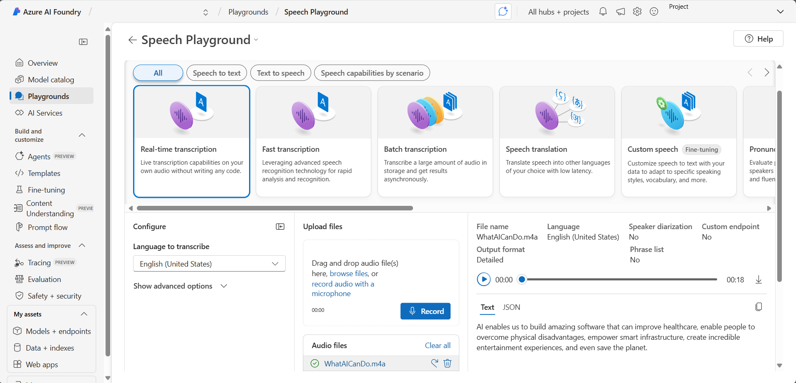

# Explore Speech in Azure AI Foundry portal

The **Azure AI Speech** service transcribes speech into text, and text into audible speech. You might use AI Speech to create an application that can transcribe meeting notes or generate text from the recording of interviews.

In this exercise, you will use Azure AI Speech in Azure AI Foundry portal, Microsoft's platform for creating intelligent applications, to transcribe audio using the built-in try-it-out experiences. 

## Create a project in Azure AI Foundry portal

1. In a browser tab, navigate to [Azure AI Foundry](https://ai.azure.com?azure-portal=true).

1. Sign in with your account. 

1. On the Azure AI Foundry portal home page, select **Create a project**. In Azure AI Foundry, projects are containers that help organize your work.  

    

1. On the *Create a project* pane, you will see a generated project name, which you can keep as-is. Depending on whether you have created a hub in the past, you will either see a list of *new* Azure resources to be created or a drop-down list of existing hubs. If you see the drop-down list of existing hubs, select *Create new hub*, create a unique name for your hub, and select *Next*.  
 
    

> **Important**: You will need an Azure AI services resouce provisioned in a specific location to complete the rest of the lab.

1. In the same *Create a project* pane, select **Customize** and select one of the following **Locations**: East US, France Central, Korea Central, West Europe, or West US to complete the rest of the lab. Then select **create**. 

1. Take note of the resources that are created: 
- Azure AI services
- Azure AI hub
- Azure AI project
- Storage account
- Key vault
- Resource group  
 
1. After the resources are created, you will be brought to your project's *Overview* page. On the left-hand menu on the screen, select **AI Services**.
 
      

1. On the *AI Services* page, select the *Speech* tile to try out Azure AI Speech capabilities.

    

## Explore speech to text in Azure AI Foundry's Speech Playground

Let's try out *speech to text* in Azure AI Foundry's Speech Playground. 

1. On the *Speech* page, scroll down and select **Real-time transcription** under *Try out Speech capabilities*. You will be taken to the *Speech Playground*. 

1. Select [**https://aka.ms/mslearn-speech-files**](https://aka.ms/mslearn-speech-files) to download **speech.zip**. Open the folder. 

1. Under *Upload files*, select **Browse files** and navigate to the folder where you saved the file. Select **WhatAICanDo.m4a** and then **Open**.

    

1. The Speech service transcribes and displays the text in real time. If you have audio on your computer, you can listen to the recording as the text is being transcribed.

1. Review the output, which should have successfully recognized and transcribed the audio into text.

In this exercise you tried out Azure AI Speech services in Azure AI Foundry's Speech Playground. You then used Real-time transcription to transcribe an audio recording. You were able to see the text transcription being generated as the audio file was played.

## Clean up

If you don't intend to do more exercises, delete any resources that you no longer need. This avoids accruing any unnecessary costs.

1. Open the [Azure portal]( https://portal.azure.com) and select the resource group that contains the resource you created.
1. Select the resource and select **Delete** and then **Yes** to confirm. The resource is then deleted.

## Learn more

This exercise demonstrated one of the many capabilities of the Speech service. To learn more about what you can do with this service, see the [Speech page](https://azure.microsoft.com/services/cognitive-services/speech-services).
