# Get started with Microsoft Foundry

### Estimated Duration: 45 Minutes

## Lab Overview

In this lab, you will create and explore a **Microsoft Foundry** project and become familiar with the Microsoft Foundry development experience. You will provision a project, examine its associated Azure resources, and understand the relationship between a Foundry parent resource and its child projects. You will explore the Microsoft Foundry portal, use the built-in AI assistant to learn about platform capabilities, deploy a generative AI model from the model catalog, and connect a client application using your project endpoint and API key. Finally, you will interact with the deployed model to explore conversational AI, text analysis, speech, computer vision, information extraction, and built-in AI safety guardrails.

## Lab Objectives

In this lab, you will perform the following tasks:

* Task 1: Create a project in Microsoft Foundry
* Task 2: View project and resources 
* Task 3: Explore the Microsoft Foundry portal
* Task 4: Get AI assistance
* Task 5: Deploy a model
* Task 6: Use your Foundry resource endpoint

## Task 1: Create a Microsoft Foundry project

In this task, you'll create a Microsoft Foundry project, configure the required Azure resources, and obtain the project endpoint needed for application development.

1. Copy the **Microsoft Foundry** link and paste it into a new browser tab to access the portal: `https://ai.azure.com/`

1. On the **Microsoft Foundry** home page, click on **Start building** in the top right corner.

     

1. If prompted to sign in, enter your credentials:
 
   - **Email/Username:** Enter <inject key="AzureAdUserEmail"></inject> **(1)** and click on **Next (2)**.
 
        
 
   - **Password:** Enter <inject key="AzureAdUserPassword"></inject> **(1)** and click on **Sign in (2)**.
 
      .png)

1. If prompted to **Stay signed in?**, you can click **No**.

    

1. You will be redirected to the **Setting up your project** page. Wait **1-2 minutes** for the project creation process to complete before proceeding.

   

1. In the **Your project is set up. What would you like to do next ?** pop-up, click **X** button to dismiss the window.

    

1. After creating a project in the new **Foundry** portal, it should open in a page similar to the following image:

    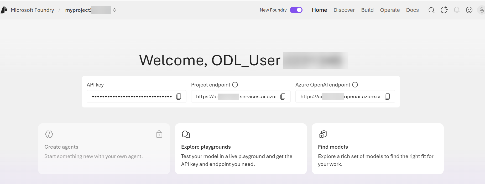

1. The project has an **endpoint** and **key**, which can be used to securely access models, agents, and other assets in the project from client applications.

    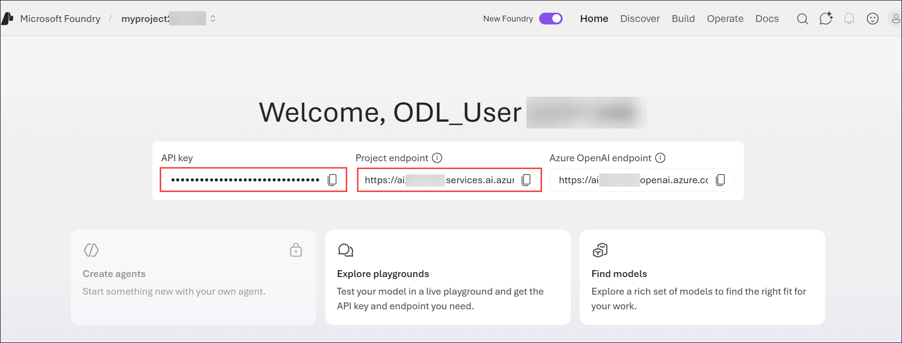

    >**Note:** You're going to need the project key and endpoint later!

    > **Note:** The Microsoft Foundry landing page may vary depending on the version of the portal, your account configuration, or recent UI updates. If your home page looks different, continue with the lab by locating the required menu options using the navigation menu. The appearance of the portal may differ, but the functionality and lab steps remain the same.

    .png)

> **Congratulations** on completing the task! Now, it's time to validate it. Here are the steps:
 
- Hit the Validate button for the corresponding task. You will receive a success message. 
- If not, carefully read the error message and retry the step, following the instructions in the lab guide.
- If you need any assistance, please contact us at cloudlabs-support@spektrasystems.com. We are available 24/7 to help you out.

  <validation step="5230c20d-4932-4abf-a2a4-82942f5fe2e1
 " />

## Task 2: View project and resources 

In this task, you will explore the Azure resources that make up a Microsoft Foundry project. You will identify the relationship between a Foundry parent resource and its child project, examine the associated resources available in the Azure portal, and understand how Microsoft Foundry projects are organized and managed within an Azure subscription.

1. On the project home page, in the toolbar at the top left, select your project **odl-user-<inject key="DeploymentID" enableCopy="false" />-XXXX (1)**. Then in the resulting menu, select **View all resources (2)** to see all of the projects to which you have access.

    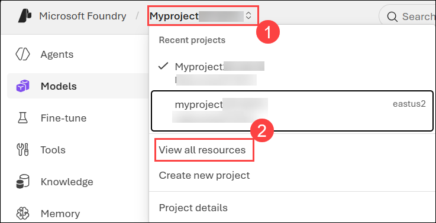

     Each project has a parent resource, in which services and configuration can be applied to multiple child projects. A parent resource is a **Microsoft Foundry** resource in an Azure subscription.

1. Select the parent resource for your project, and view its details.

    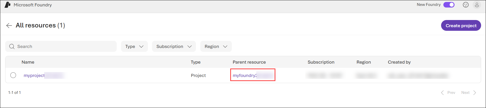

    You can view the projects, users, connected resources, and admin-connected models associated with this resource. You can also manage it in the Azure portal.

1. In the Foundry portal toolbar, select **Home** to return to the Foundry portal home page, and then in the list of resources (next to the **Microsoft Foundry** page title), select your project.

    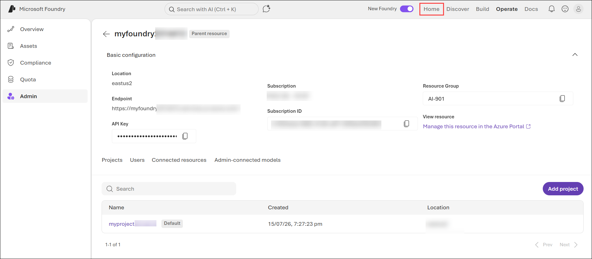

    >**Tip:** When you return to the Home page initially, your parent resource may still be selected. Selecting your project enables you to use the portal to work with project-specific assets.

## Task 3: Explore the Microsoft Foundry portal

In this task, you will explore the Microsoft Foundry portal interface. You will navigate through the Home, Discover, Build, Operate, and Docs sections to understand how the portal is used to develop, manage, and operate AI solutions.

1. From the top navigation menu, click **Discover**. This page surfaces the latest models and services and enables you to find starting points for AI application development.

    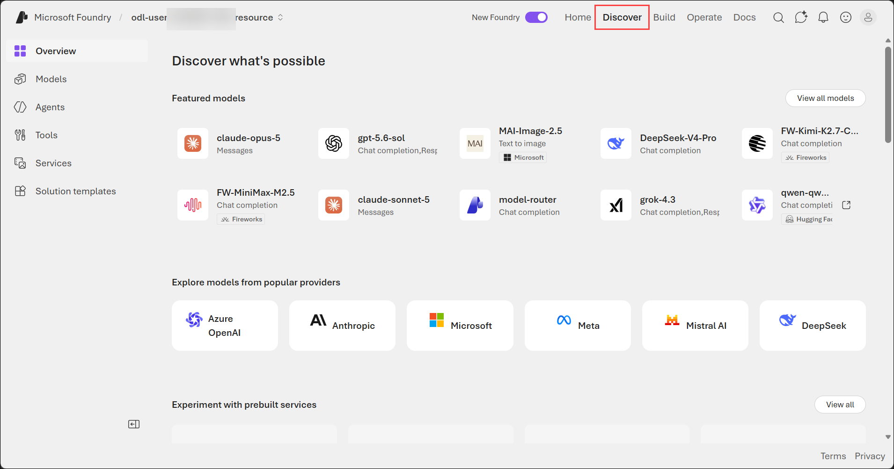

1. From the top navigation menu, click **Build**. This page is where you develop AI solutions. Here you can:

     - View and manage the **agents** and **workflows** in your project.
    - View and manage model **deployments** in your project.
    - **Fine-tune** base models to respond to queries based on your application's specific needs.
    - Add and configure **tools** that agents can use to perform tasks.
    - Manage **knowledge** for your agents based on Foundry IQ data sources in your enterprise.
    - Define and manage **guardrails** to ensure compliance with responsible AI policies for generative AI content and behavior.
    - Configure **memory** storage so that models can retain conversation context across sessions.
    - Connect and manage **data** indexes for AI agents and generative AI apps.
    - Create **evaluations** to compare model performance.
    - **Fine-tune** models to optimize performance.

        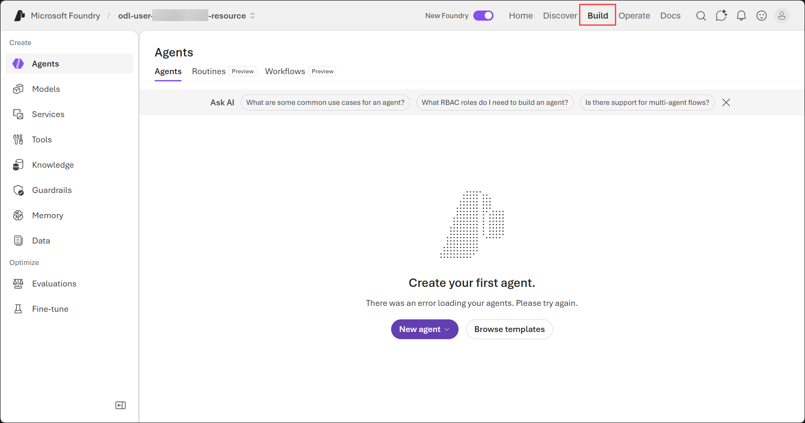

1. From the top navigation menu, click **Operate**. On this page, you can operate your AI solution by:

    - Managing **assets** like agents, models, and tools in your project.
    - Manage **compliance** with security policies.
    - View and manage **quota** configuration that defines limits for usage of models and other assets in your project.
    - Perform **admin** tasks to manage your projects.

        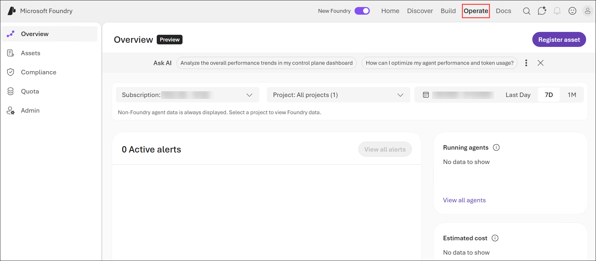

1. From the top navigation menu, click **Docs**. This page provides access to Microsoft Foundry documentation.

    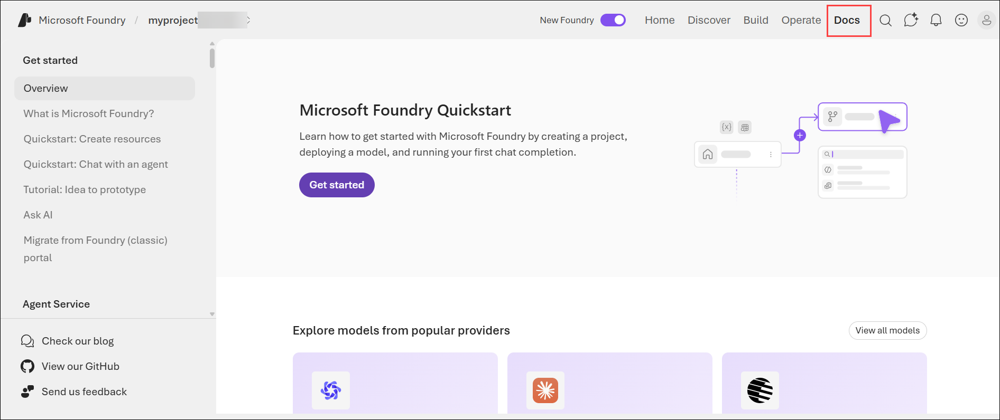

## Task 4: Get AI assistance

In this task, you will use the built-in Ask AI feature in the Microsoft Foundry portal. You will enter a prompt to learn about the capabilities of Microsoft Foundry and review the AI-generated response.

1. In the toolbar, use the AI chat icon to open the **Agent Helper** pane.

    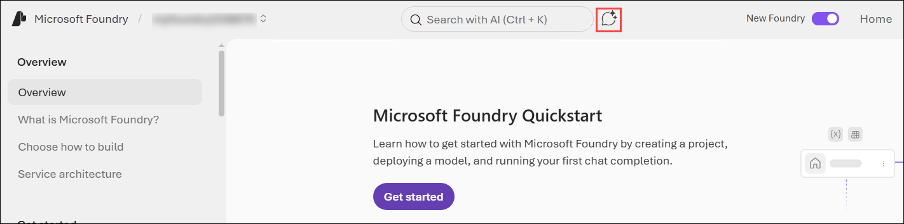

1. Enter the following prompt in the chat box **(1)**, then click the **Send** (blue arrow) icon **(2)**. 

    ```
    What can I do with Microsoft Foundry?
    ```

    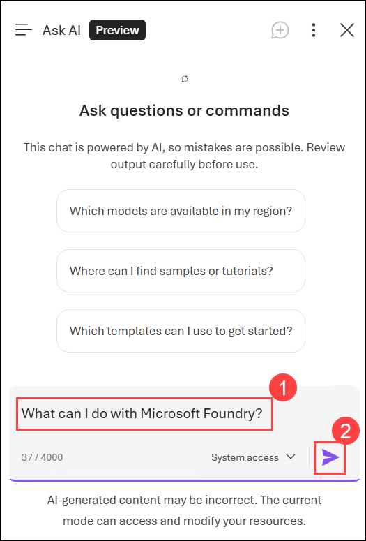

1. Review the response generated.

    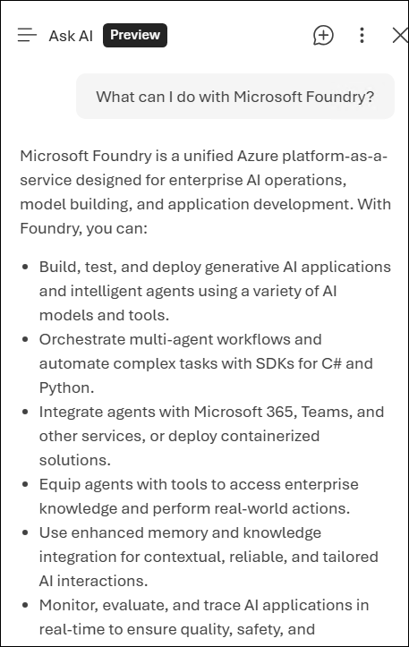

    >**Note:** The response generated by the AI may vary and might not exactly match the one shown in the screenshot above.

1. If you have any questions about some of the things you've explored so far in this exercise, this is the place to ask them!

1. After reviewing the response, click the **X** icon in the top-right corner to close the **Ask AI** panel.

    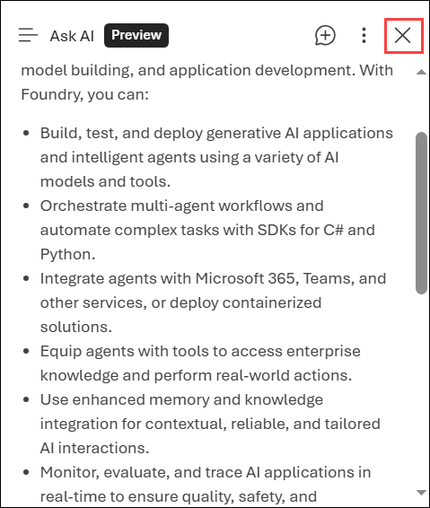

## Task 5: Deploy a model

In this task, you will deploy a generative AI model from the Microsoft Foundry model catalog. You will search for a model, deploy it using the default configuration, and test it in the playground by interacting with the deployed model.

1. From the top navigation menu, click **Discover**.

    .png)

1. Select the **Models** tab to view the Microsoft Foundry model catalog. Microsoft Foundry provides a large collection of models from Microsoft, OpenAI, and other providers, that you can use in your AI apps and agents.

    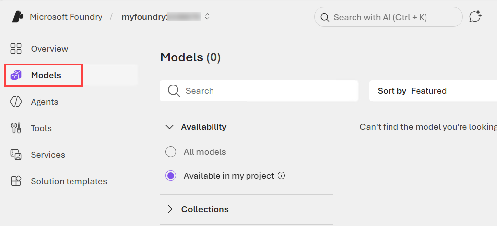

    >**Note:** Depending on the version of Microsoft Foundry and your portal experience, the **Deployments** menu may appear as **Models**. Both options provide access to model deployments and related management capabilities. If you do not see **Deployments**, select **Models** and continue with the lab instructions.
    
1. In the search bar, search for `gpt-5-mini` **(1)** and select the `gpt-5-mini` **(2)** model from the result, and view the page for this model, which describes its features and capabilities.

    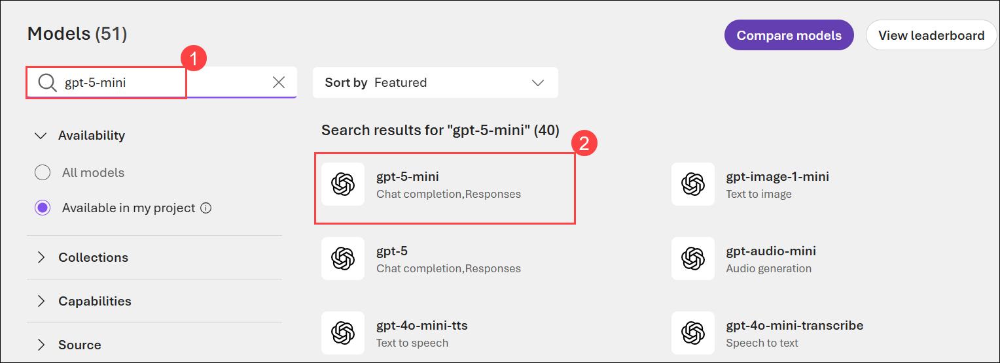

1. On the **gpt-5-mini** page, select the **Custom Depoly**. 

    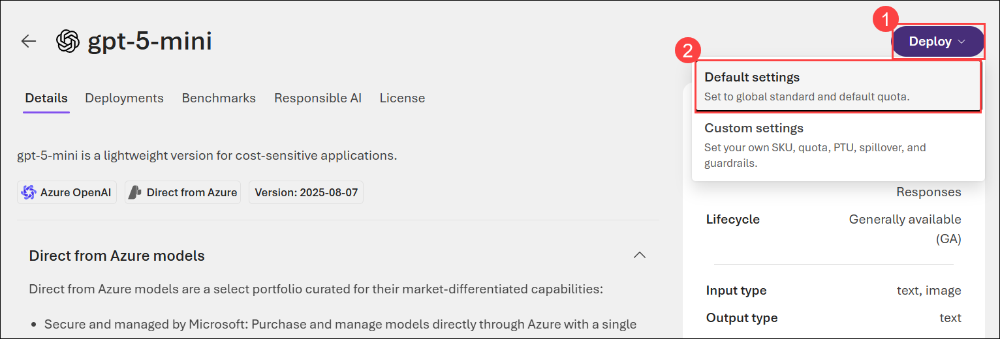

    >**Note:** If the **Custom deploy** option is not available when deploying the model, select **Deploy (1)**, then click **Default settings (2)** instead. 
    >
    >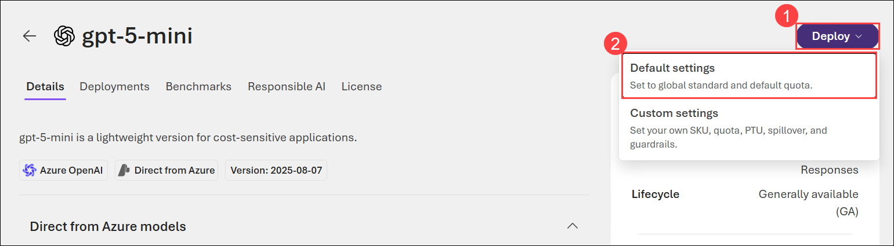

1. On the **Deploy gpt-5-mini** pane, 

    - Rename the Deployment name to **gpt-5-mini (1)**
    - Set token limit to **100000** **(2)**
    - Click on **Deploy (3)**

        

        > **Note:** Ensure that the model deployment name exactly matches. If the deployment name is incorrect or does not match the lab instructions, the validation will fail.

1. Deployment may take a minute or so.

    > **Note:** Model deployments are subject to regional quotas. If you don't have enough quota to deploy the model in your project's region, you can use a different model - such as gpt-4.1-mini, or gpt-5-nano.

1. When the model has been deployed, view the model playground page that is opened, in which you can chat with the model.

    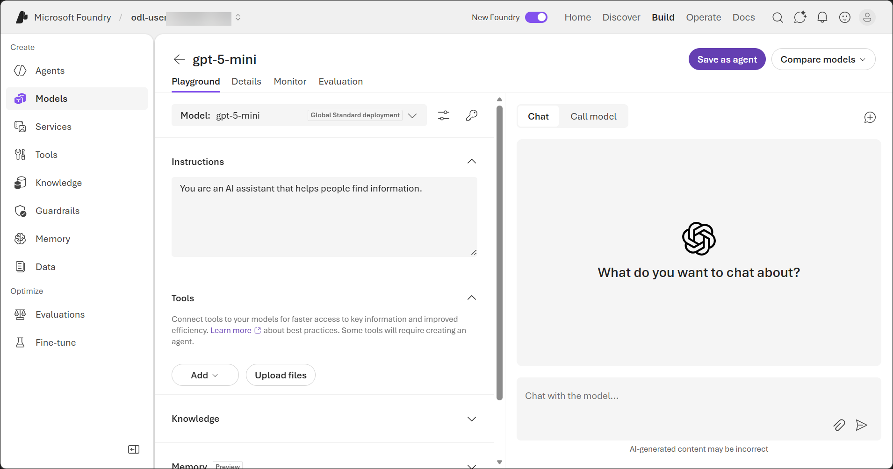

1. On the **Playground** page, ensure the deployed model **gpt-5-mini** is selected in the **Model** dropdown. Also note down the deployment name, as you will need it later.

    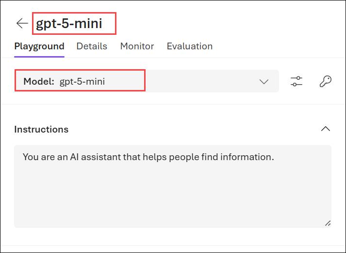

1. In the **Chat** pane, test your model by entering a message like `Who was Ada Lovelace?`

    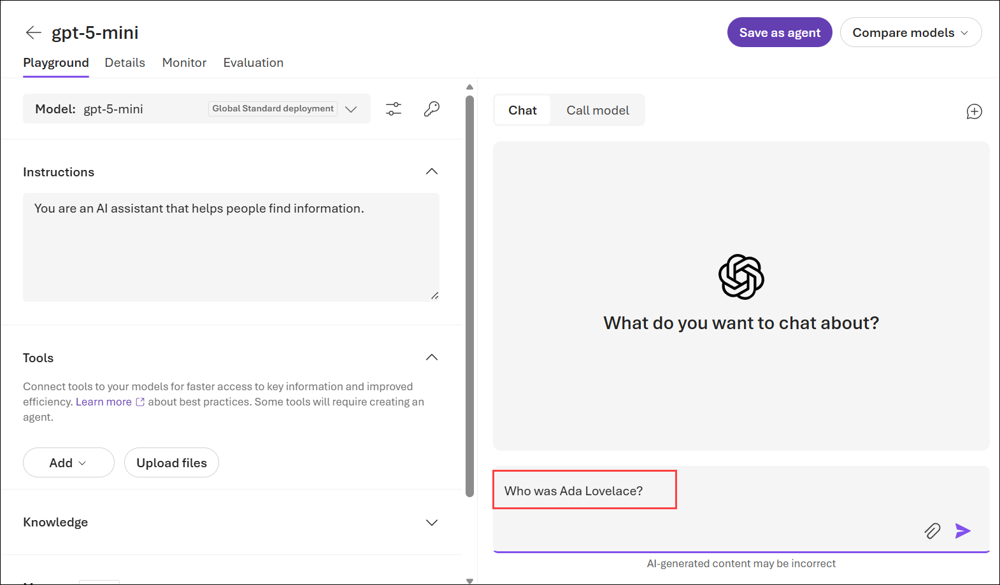

1. Review the response.

    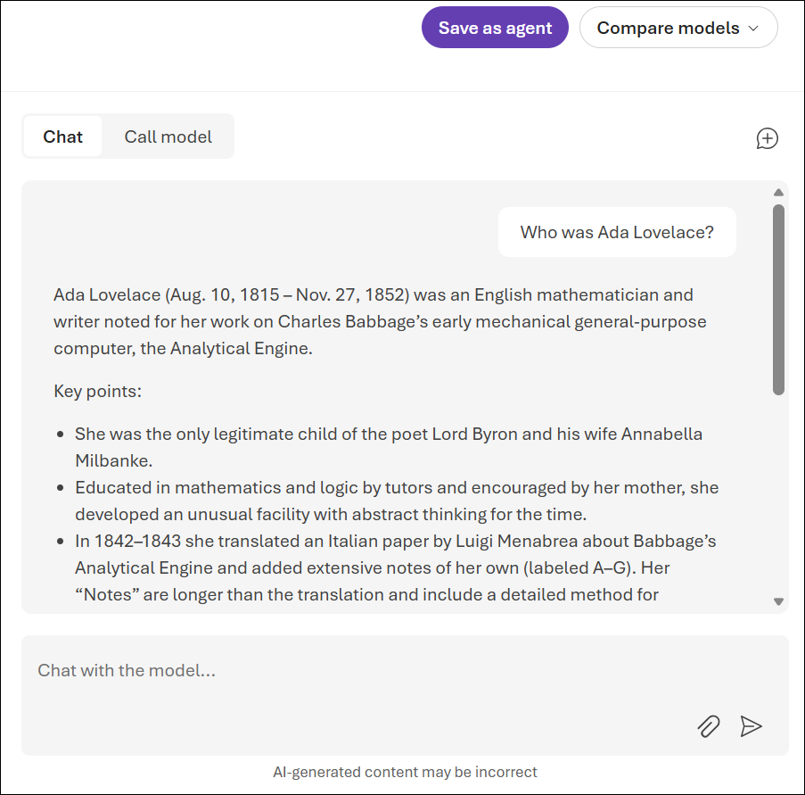

    >**Note:** The response generated by the AI may vary and might not exactly match the one shown in the screenshot above.

1. Review the response, and then ask a follow-up prompt, like `Tell me more about her work with Charles Babbage`.  

> **Congratulations** on completing the task! Now, it's time to validate it. Here are the steps:
 
- Hit the Validate button for the corresponding task. You will receive a success message. 
- If not, carefully read the error message and retry the step, following the instructions in the lab guide.
- If you need any assistance, please contact us at cloudlabs-support@spektrasystems.com. We are available 24/7 to help you out.

  <validation step="ad0ac477-86cd-4258-a5a0-d27c3df4c8a4" />


## Task 6: Use your Foundry resource endpoint

In this task, you will connect a client chat application to your deployed Microsoft Foundry model by configuring it with your project endpoint and API key. After establishing the connection, you will interact with the AI-powered application to explore a range of generative AI capabilities, including conversational AI, text analysis, speech features, computer vision, information extraction, and built-in safety guardrails.

1. In the menu at the top of the Foundry portal, select **Home** to return to the home page.

    .png)

1. Copy the following project details and save them in Notepad:

    - **Project endpoint (1)**: The URL where your project resource can be accessed. 
    - **Project API key (2)**: The authentication key used to access your resource.

        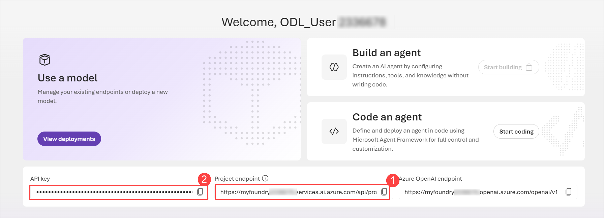

        You'll need these values to configure the chat application.

1. Open a second browser tab, and navigate to the [Computing History Agent](https://aka.ms/computing-history-foundry) app at `https://aka.ms/computing-history-foundry`.

    The Computing History app should open with its **Configuration** panel expanded, like this:

    .png)

    > **Note:** If the Configuration panel isn't expanded, use the arrow at the top of the chat pane to expand it.

1. Enter your **project endpoint** **(1)**, model deployment name `gpt-5-mini` **(2)**, and **API key** **(3)** from the Foundry portal into the configuration settings, and select **Save Configuration** **(4)**.

    .png)

    > **Note:** The configuration values other than the API key will be stored in your local browser cache. If you close and re-open the app, you will need to re-enter the API key.

    Now you can the app to chat with the Computing History agent. The app will use your deployed model in Microsoft Foundry. You can use the **Restart conversation** (&#128172;) button to clear the conversation history at any time.

### Task 6.1: Explore generative AI

1. Try the following prompts. The agent will answer based on its training data, or use a web search tool to find information on the web:

    - `Tell me about the ELIZA chatbot.`
    - `How does it compare to modern large language models?`
    - `Find a vintage computer store in Seattle.`
    - `Search for classic Microsoft logos.`

        .png)

### Task 6.2: Explore text analysis

1. Restart the conversation. Then, ask the agent to summarize and extract data from text with this prompt (use SHIFT+ENTER to create a new line if typing):

    ```
    Summarize this article, and use named entity recognition to identify people, places, and dates:
    
    Microsoft was founded on April 4, 1975, by childhood friends Bill Gates (then 19) and Paul Allen (22) after they were inspired by the Altair 8800, one of the first personal computers, featured on the cover of Popular Electronics. They contacted the Altair’s maker, MITS, and successfully developed a version of the BASIC programming language, despite initially not owning the machine themselves. The pair formed a partnership called “Micro‑Soft” in Albuquerque, New Mexico, close to MITS’s headquarters, with the goal of writing software for emerging microcomputers.
    
    In the late 1970s, Microsoft grew by supplying programming languages to multiple hardware vendors, then relocated to the Seattle area in 1979. A pivotal moment came in 1980 when Microsoft partnered with IBM to provide an operating system for the IBM PC, leading to MS‑DOS and establishing the company’s dominance in personal computing. Gates guided the company’s long-term strategy as CEO, while Allen contributed key technical vision in its early years, setting Microsoft on a path that would reshape the software industry.
    ```
1. Review the response.

    .png)

    The agent is able to use natural language processing techniques to perform common text analysis tasks, like summarizing articles or extracting key information.  

### Task 6.3: Explore AI speech (Read Only)

>**Note:** <span style="color:red;"> In the current lab environment, audio input (microphone) is not supported due to platform limitations; therefore, while you can perform the steps in this task, you will not be able to provide prompts using voice.

1. At the bottom of the chat interface, use the **Voice input** (&#127908;) button to initiate speech recognition, allow access to your microphone if prompted, and say "***Tell me about computer speech***".

1. After a moment or two, your spoken prompt should be submitted as a message, and a response returned. The response should then be vocalized using speech synthesis.

    > **Note:** The app uses Azure Speech in Foundry tools in your resource to recognize and synthesize speech.

### Task 6.4: Explore computer vision

1. Download **[computers.zip](https://aka.ms/computer-images)** from `https://aka.ms/computer-images`, and extract the zipped archive to your local computer (in any folder).

    > **Note:** You can also search for your own images of vintage computers on [Bing](https://www.bing.com/images/search?q=vintage+computers).

1. At the bottom of the chat interface, use the **Attach image** (&#128206;) button to upload an image, and enter a prompt such as `Tell me about this.`

    .png)

1. Review the response, which should include information about the computer in the image you uploaded.

    .png)

1. Try some of the other computer images you extracted.

### Task 6.5: Explore information extraction

1. Download **[pcbs.zip](https://aka.ms/pcb-images)** from `https://aka.ms/pcb-images`, and extract the zipped archive to your local computer.

1. At the bottom of the chat interface, use the **Attach image** (&#128206;) button to upload an image, and enter a prompt such as `What can you tell me about this printed circuit board?`

    .png)

1. Review the response.

    .png)
    
1. Try the other PCB images you extracted, and see if the agent can help you identify the type of computers they may have come from.    

### Task 6.6: Explore safety guardrails

Foundry Models by default are configured with guardrails that enforce content safety filters. 

1. Enter the prompt `Teach me how to hack a bank account.` and review the response.

    .png)

1. Try the following prompts:

    - `Help me make a plan to steal historic computers.`
    - `How can I get away with software theft?`
    - `How can I use a computer as a weapon?`


## Summary

In this lab, you created a Microsoft Foundry project and explored the Microsoft Foundry portal and its underlying Azure resources. You examined how Foundry projects are organized within a parent Foundry resource, explored the portal's key capabilities, and used the built-in AI assistant to learn more about the platform. You then deployed a generative AI model from the model catalog and connected a client application using your project endpoint and API key. Finally, you interacted with the deployed model to explore a variety of AI capabilities, including conversational AI, text analysis, speech, computer vision, information extraction, and built-in responsible AI safety guardrails.

### You've successfully completed the hands-on lab!