# Get started with Microsoft Foundry

### Estimated Duration: 30 Minutes

## Lab Overview

In this exercise, you'll create and explore a **Microsoft Foundry** project. You will learn how to navigate the Microsoft Foundry portal, view the underlying Azure resources associated with your project, and use built-in AI assistance to understand platform capabilities. You will also deploy a generative AI model from the model catalog and connect a client application to your Foundry resource using the project endpoint and API key.

## Lab Objectives

In this lab, you will perform:

* Task 1: Create a Microsoft Foundry project
* Task 2: View Azure resources for Microsoft Foundry
* Task 3: Explore the Microsoft Foundry portal
* Task 4: Get AI assistance
* Task 5: Deploy a model
* Task 6: Use your Foundry resource endpoint

## Task 1: Create a Microsoft Foundry project

In this task, you will create a Microsoft Foundry project. You will sign in to the Microsoft Foundry portal, configure the project settings such as the subscription, resource group, Foundry resource, and region, and create the project that will be used to manage models, agents, and other AI assets.

1. In a web browser, open [Microsoft Foundry](https://ai.azure.com) at `https://ai.azure.com`.

1. Click the **Sign in** button in the top-right corner. 

    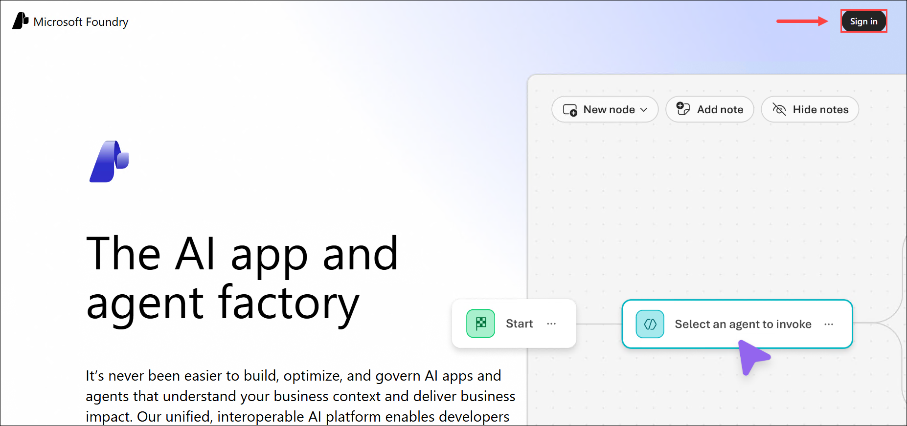

1. When prompted, sign in using the Azure credentials listed below.

    - **Email/Username:** <inject key="AzureAdUserEmail"></inject>

    - **Password:** <inject key="AzureAdUserPassword"></inject>

1. Close any tips or quick start panes that are opened the first time you sign in, and if necessary use the **Foundry** logo at the top left to navigate to the home page.

    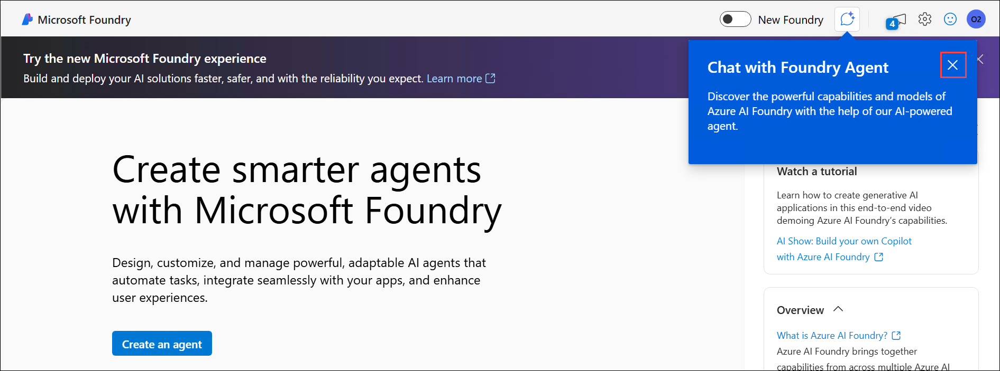

1. If it is not already enabled, in the tool bar the top of the page, enable the **New Foundry** option.

    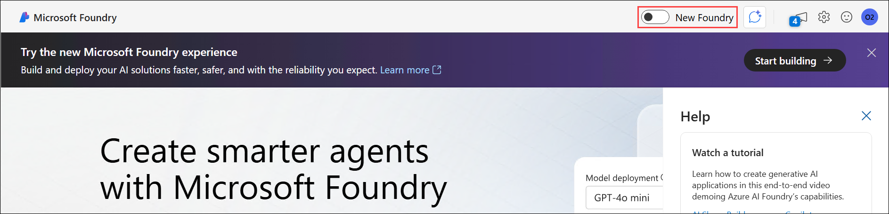

1. In the **Select a project to continue** window, open the **Select or search for a project** dropdown and click **Create a new project**.

    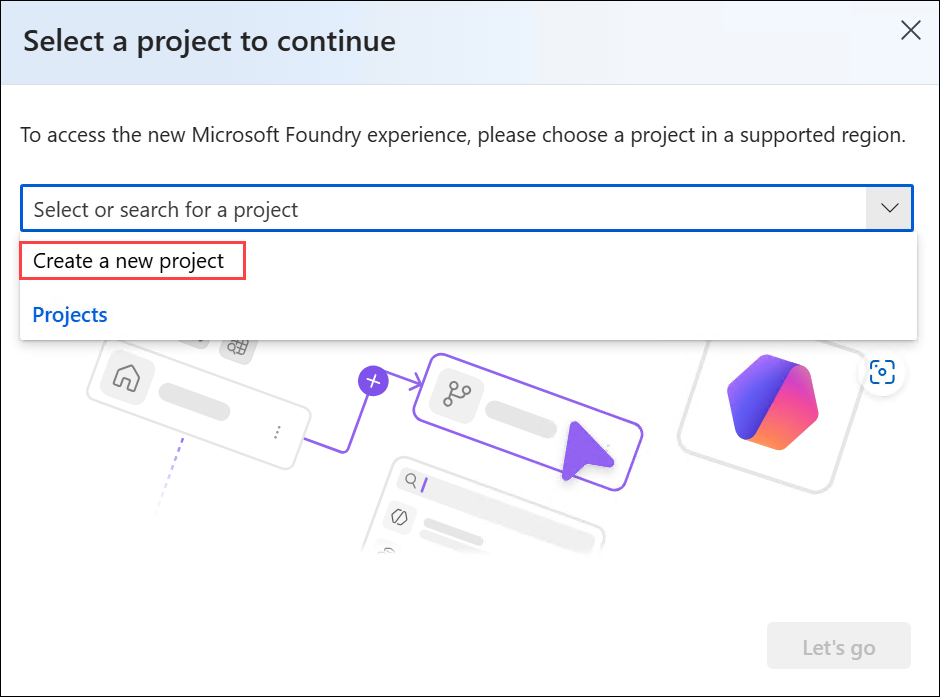

1. In the **Create a project** wizard, enter project name **Myproject<inject key="DeploymentID" enableCopy="false" /> (1)**, and **Expand Advanced options (2)** to specify the following settings for your project: 

    - Subscription : **Leave default subscription (3)** 
    - Resource Group : Select **AI-900-Module-01 (4)** 
    - Microsoft Foundry resource: **AI<inject key="DeploymentID" enableCopy="false" /> (5)**
    - Region : Select **<inject key="location" enableCopy="false"/> (6)**
    - Click on **Create** **(7)**

      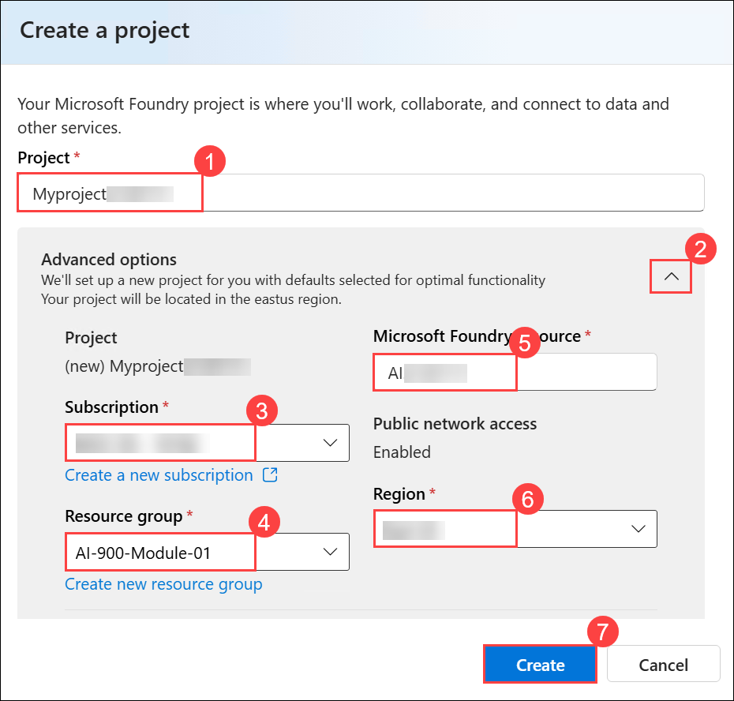

        >**Note:** Make a note of the region you selected. You'll need it later!

1. Wait for your project to be created. It may take a few minutes. 

1. In the **Welcome to new Microsoft Foundry** window, click the **X** icon in the top-right corner to close the welcome screen.

    

1. After creating a project in the new Foundry portal, it should open in a page similar to the following image:

    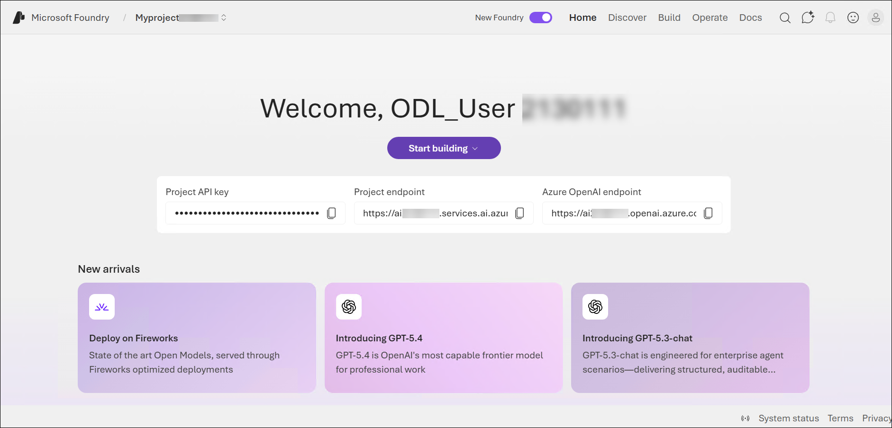

1. The project has an **endpoint** and **key**, which can be used to securely access models, agents, and other assets in the project from client applications.

    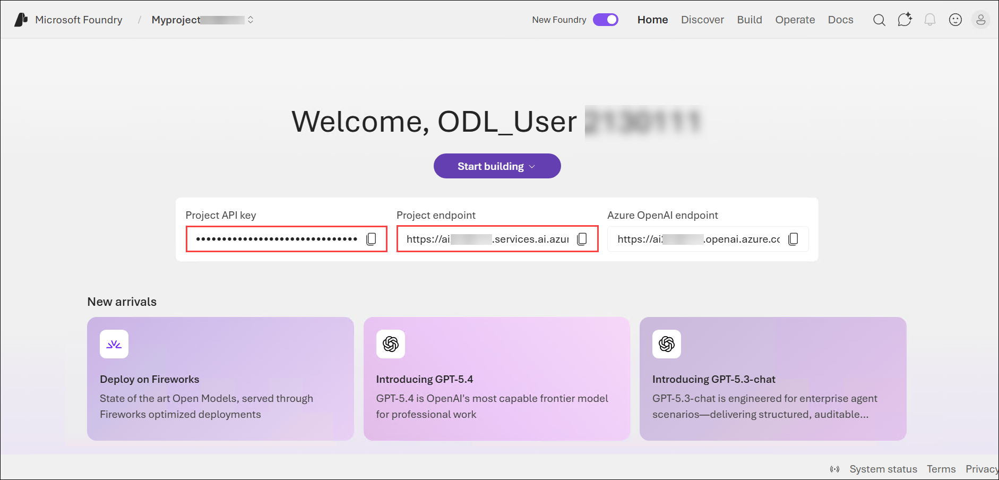

    >**Note:** You're going to need the project key and endpoint later!

> **Congratulations** on completing the task! Now, it's time to validate it. Here are the steps:
> - Hit the Validate button for the corresponding task. If you receive a success message, you can proceed to the next task.
> - If not, carefully read the error message and retry the step, following the instructions in the lab guide. 
> - If you need any assistance, please contact us at cloudlabs-support@spektrasystems.com. We are available 24/7 to help you out.

   <validation step="10cf8d2c-7678-441a-8ad5-7752773b3f33" />

## Task 2: View Azure resources for Microsoft Foundry

In this task, you will explore the Azure resources associated with your Microsoft Foundry project. You will locate the parent Foundry resource in the Azure portal, view the relationship between the resource and its child project using the Resource Visualizer, and understand how Foundry projects are implemented as Azure resources.

1. On the project home page, in the toolbar at the top left, select your project **Myproject<inject key="DeploymentID" enableCopy="false" /> (1)**. Then in the resulting menu, select **View all projects (2)** to see all of the projects to which you have access.

    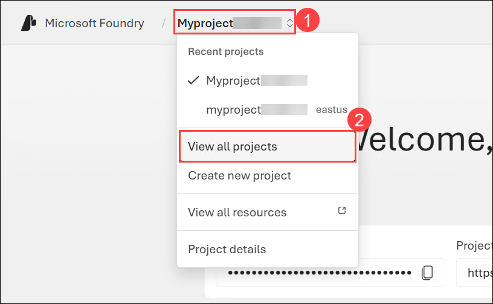

     Each project has a *parent* resource, in which services and configuration can be applied to multiple child projects.

1. Note the name of the parent resource for your project. 

    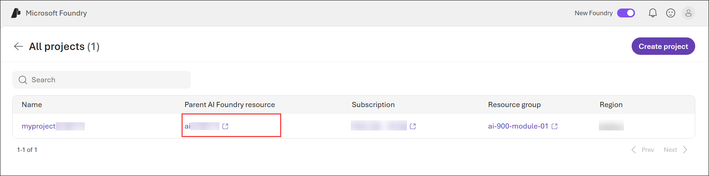

1. Then, open a new browser tab and navigate to the [Azure portal](https://portal.azure.com) at `https://portal.azure.com` and if prompted, sign in using your Azure credentials.

    - **Email/Username:** <inject key="AzureAdUserEmail"></inject>

    - **Password:** <inject key="AzureAdUserPassword"></inject>

1. In the Azure portal home page, in the search box at the top of the page, search for your Microsoft Foundry parent resource **(1)** and then select **(2)** the **Foundry** resource that matches your parent resource name to open it.

    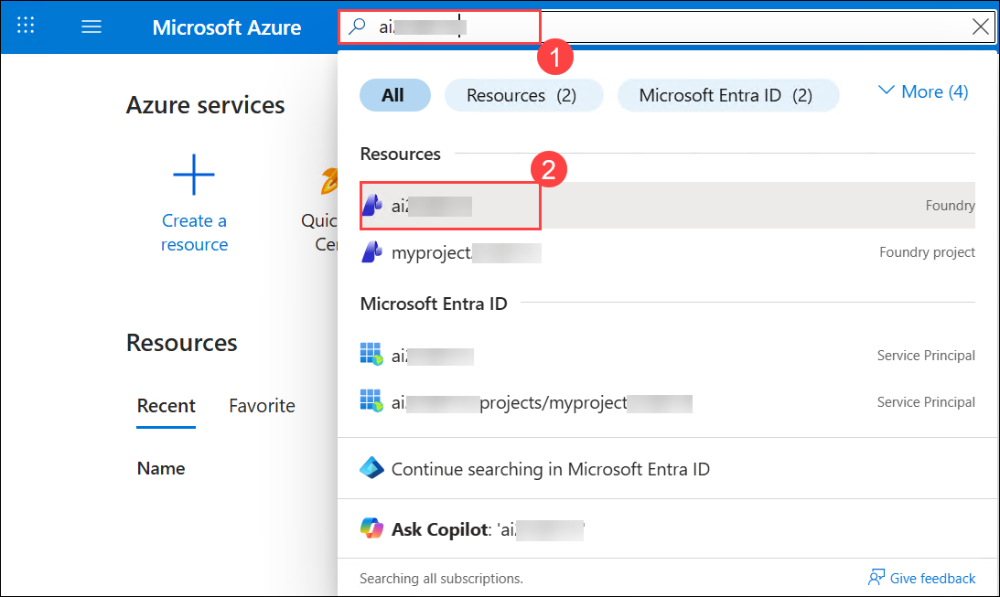

1. In the page for your Foundry resource, from the left navigation pane, select the **Resource Visualizer** to view the relationship between the resource and its child project(s).

    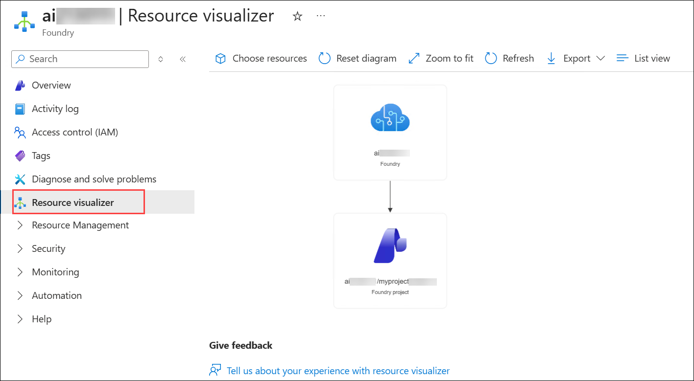

1. Select the child project you created in this resource to open its page in the Azure portal.

    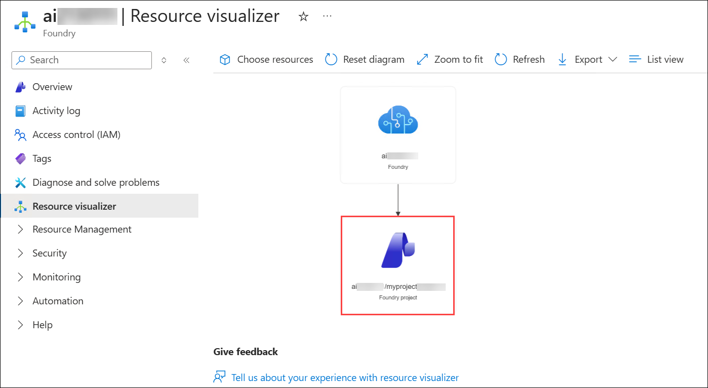

1. While most tasks to develop and manage AI projects can be performed in the **Microsoft Foundry** portal, it's important to understand that projects and the services they use are implemented as resources in Microsoft Azure; where they may be subject to enterprise governance and security policies.

    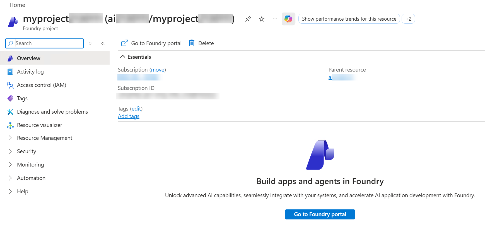

1. Close the browser tab containing the Azure portal and return to the Microsoft Foundry portal. 

1. Then use the **back arrow** icon next to the **All projects** page header to return to the home page for your project.

    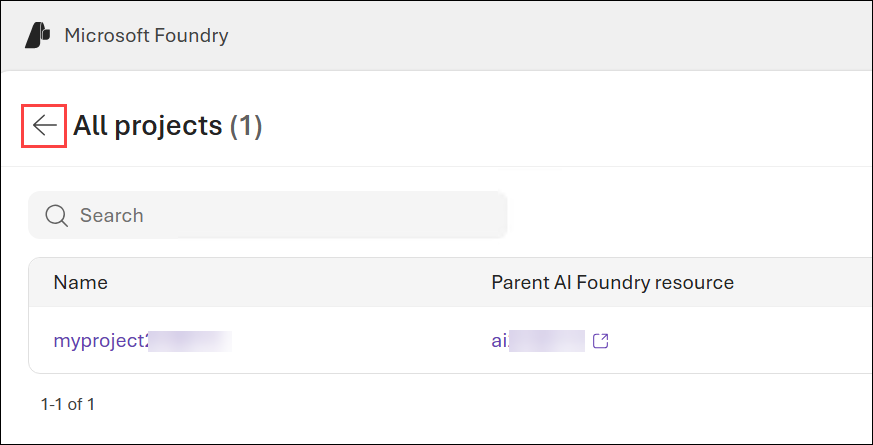

## Task 3: Explore the Microsoft Foundry portal

In this task, you will explore the Microsoft Foundry portal interface. You will navigate through the Home, Discover, Build, Operate, and Docs sections to understand how the portal is used to develop, manage, and operate AI solutions.

> **Note:** The Microsoft Foundry portal is subject to continual improvement and expansion. The interface shown in this exercise may not match the interface of your portal exactly.

1. On the **Home** page for your project, select the **Start building** menu.

    You can use this menu to:

    - Create **agents** that use a generative AI model, instructions, and tools to intelligently automate tasks and information gathering.
    - Create **workflows** that combine multiple agents in an orchestrated process.
    - Browse **models** in the Foundry model catalog.

        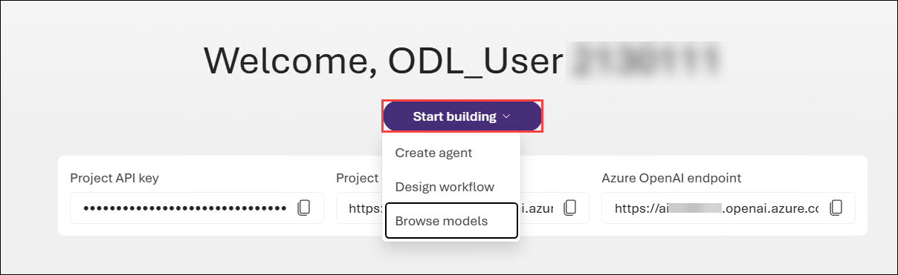

1. From the top navigation menu, click **Discover**. This page surfaces the latest models and services and enables you to find starting points for AI application development.

    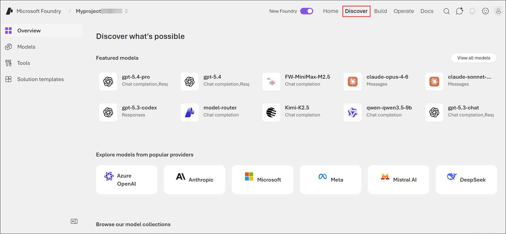

1. From the top navigation menu, click **Build**. This page is where you develop AI solutions. Here you can:

    - View and manage the **agents** in your project.
    - View and manage the **workflows** in your project.
    - View and manage the **models** in your project.
    - **Fine-tune** base models to respond to queries based on your application's specific needs.
    - Add and configure **tools** that agents can use to perform tasks.
    - Manage **knowledge** for your agents based on Foundry IQ data sources in your enterprise.
    - Connect and manage **data** indexes for AI agents and generative AI apps.
    - Create **evaluations** to compare model performance.
    - Define and manage **guardrails** to ensure compliance with responsible AI policies for generative AI content and behavior.

        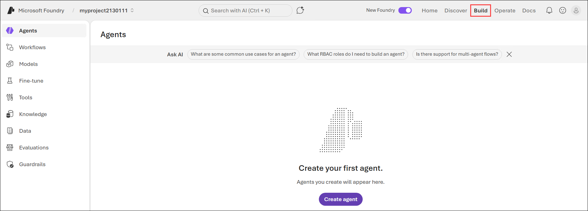

1. From the top navigation menu, click **Operate**. On this page, you can operate your AI solution by:

    - Managing **assets** like agents, models, and tools in your project.
    - Manage **compliance** with security policies.
    - View and manage **quota** configuration that defines limits for usage of models and other assets in your project.
    - Perform **admin** tasks to manage your projects.

        

1. From the top navigation menu, click **Docs**. This page provides access to Microsoft Foundry documentation.

    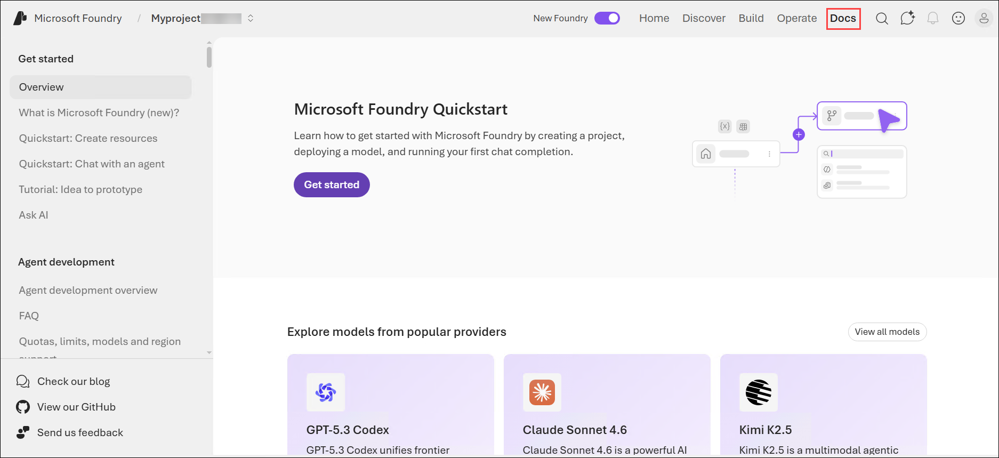

## Task 4: Get AI assistance

In this task, you will use the built-in Ask AI feature in the Microsoft Foundry portal. You will enter a prompt to learn about the capabilities of Microsoft Foundry and review the AI-generated response.

1. In the toolbar, use the AI chat icon to open the **Ask AI** pane.

    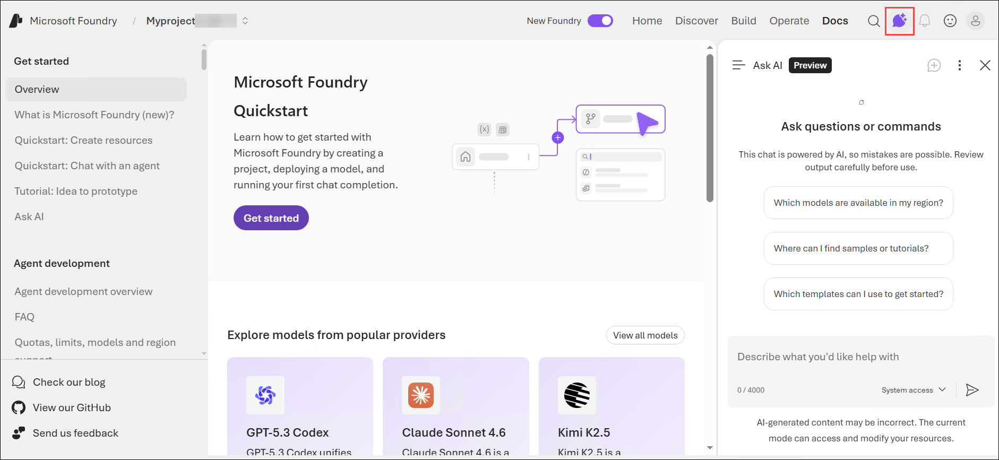

1. Enter the following prompt in the chat box **(1)**, then click the **Send** (blue arrow) icon **(2)**. 

    ```
    What can I do with Microsoft Foundry?
    ```

    

1. Review the response generated.

    

    >**Note:** The response generated by the AI may vary and might not exactly match the one shown in the screenshot above.

1. If you have any questions about some of the things you've explored so far in this exercise, this is the place to ask them!

1. After reviewing the response, click the **X** icon in the top-right corner to close the **Ask AI** panel.

    

## Task 5: Deploy a model

In this task, you will deploy a generative AI model from the Microsoft Foundry model catalog. You will search for a model, deploy it using the default configuration, and test it in the playground by interacting with the deployed model.

1. From the top navigation menu, click **Home**.

    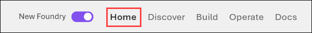

1. Click on **Start building (1)** menu, and select **Browse models (2)** to view the Microsoft Foundry model catalog.

    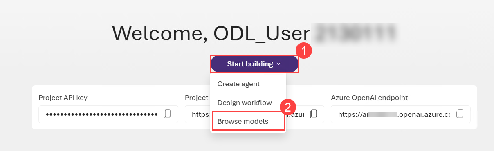

1. Microsoft Foundry provides a large collection of models from Microsoft, OpenAI, and other providers, that you can use in your AI apps and agents.

    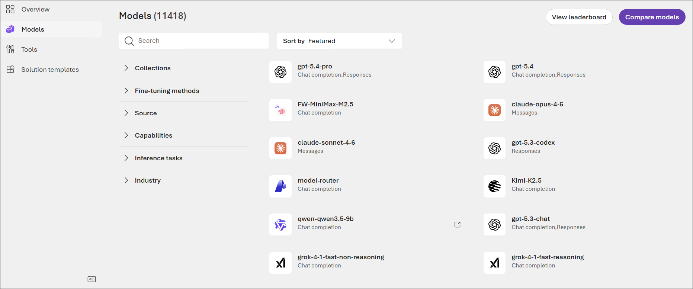
    
1. In the search bar, search for `gpt-4.1-mini` **(1)** and select the `gpt-4.1-mini` **(2)** model from the result, and view the page for this model, which describes its features and capabilities.

    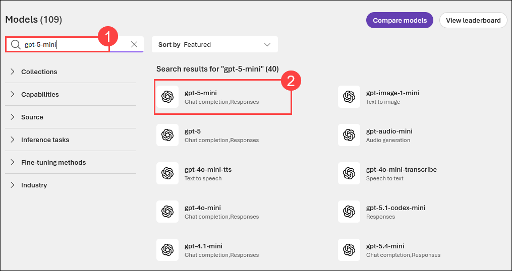

    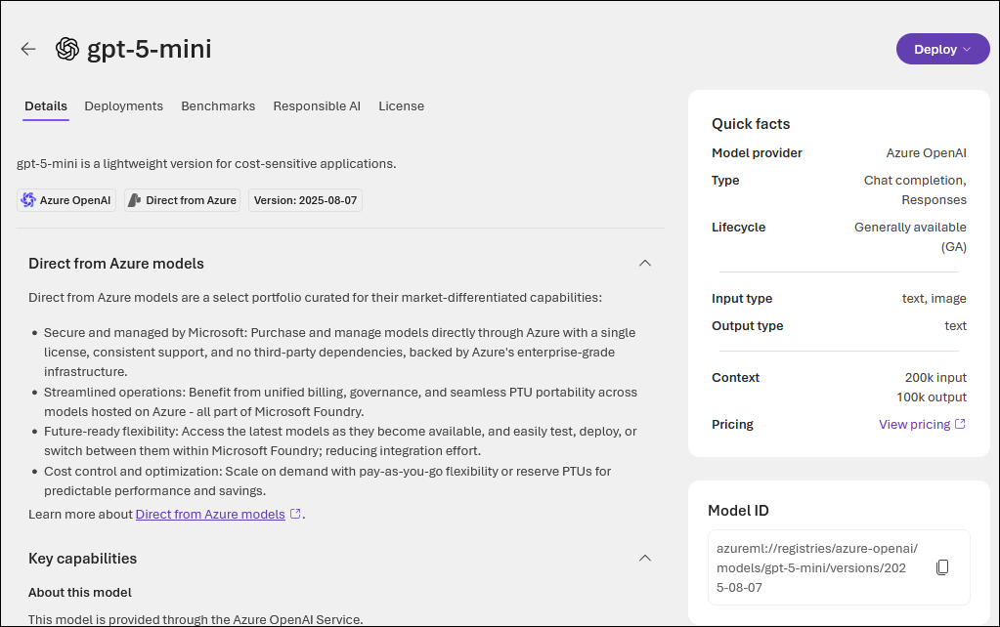

1. Click the **Deploy (1)** button to deploy the model and then select the **Default settings (2)**. 

    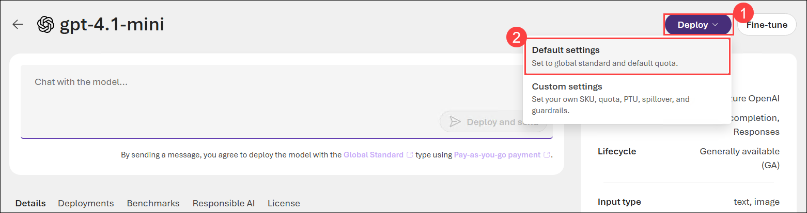

1. Deployment may take a minute or so.

    > **Note:** Model deployments are subject to regional quotas. If you don't have enough quota to deploy the model in your project's region, you can use a different model - such as gpt-4.1-nano, or gpt-4o-mini.

1. When the model has been deployed, view the model playground page that is opened, in which you can chat with the model.

    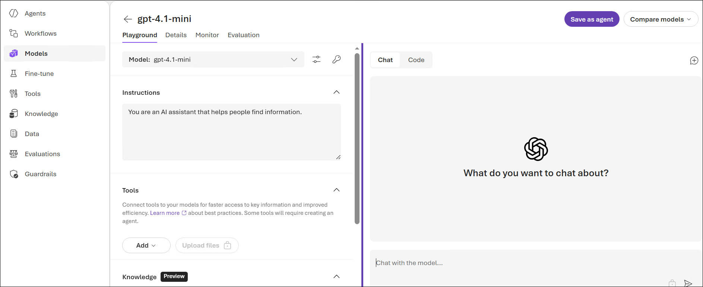

1. On the **Playground** page, ensure the deployed model **gpt-4.1-mini** is selected in the **Model** dropdown. Also note down the deployment name, as you will need it later.

    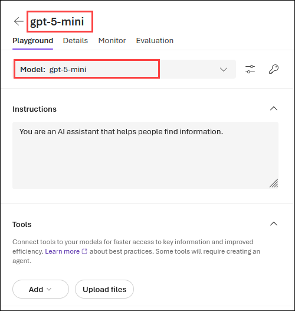

1. In the **Chat** pane, test your model by entering a message like `What is AI?`

    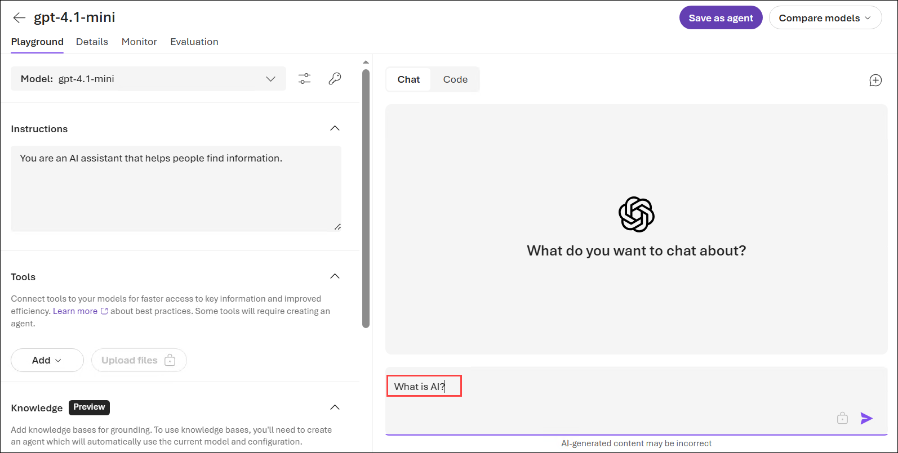

    

> **Congratulations** on completing the task! Now, it's time to validate it. Here are the steps:
> - Hit the Validate button for the corresponding task. If you receive a success message, you can proceed to the next task.
> - If not, carefully read the error message and retry the step, following the instructions in the lab guide. 
> - If you need any assistance, please contact us at cloudlabs-support@spektrasystems.com. We are available 24/7 to help you out.

   <validation step="10cf8d2c-7678-441a-8ad5-7752773b3f33" />

## Task 6: Use your Foundry resource endpoint

In this task, you will use the endpoint and API key of your Microsoft Foundry project to connect a client application to your deployed model. You will configure the application with the required project details and test the integration by interacting with the AI-powered chat application.

1. In the toolbar at the top of the Foundry portal, select your project **myproject<inject key="DeploymentID" enableCopy="false" />** to return to the home page.

    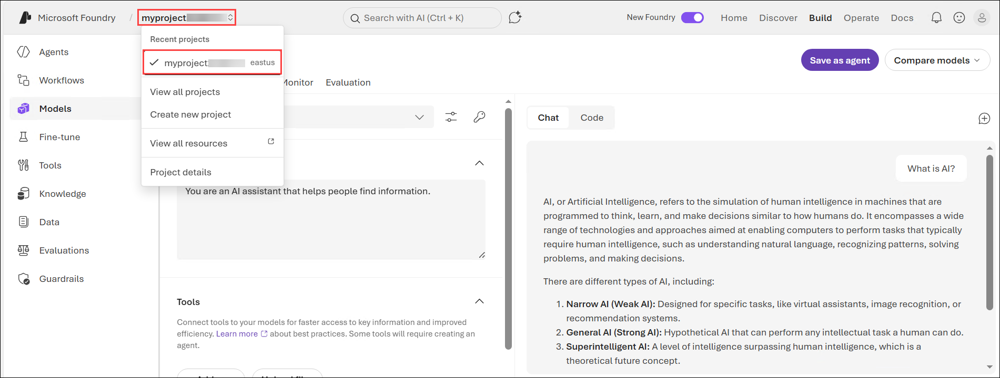

1. Copy the following project details and save them in Notepad:

    - **Project endpoint (1)**: The URL where your project resource can be accessed. 
    - **Project API key (2)**: The authentication key used to access your resource.

        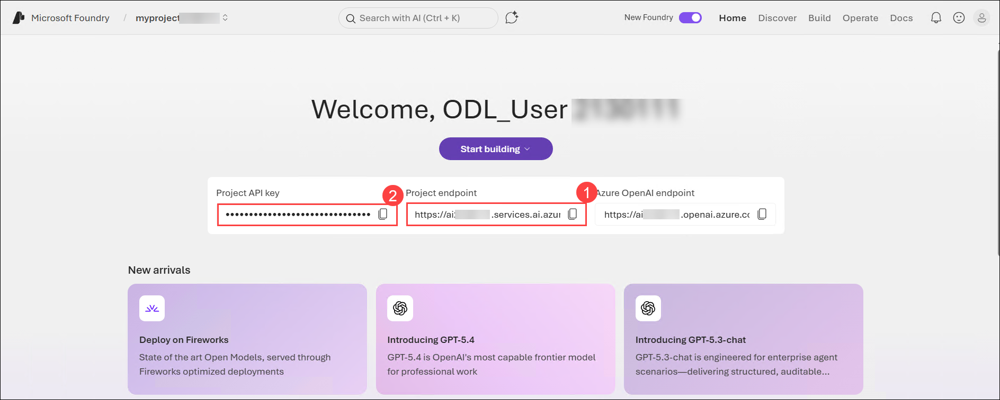

1. You can also select your project name in the toolabr (next to the Microsoft Foundry logo) to remind yourself which region you deployed it in.

    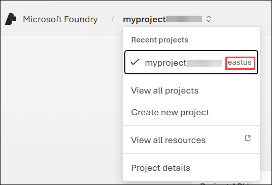

1. You'll need these values to configure the Computing History application.

1. Open a second browser tab, and navigate to the [Ask Andrew (Azure)](https://aka.ms/ask-andrew-azure) app at `https://aka.ms/ask-andrew-azure`.

1. The Ask Andrew app should look like this:

    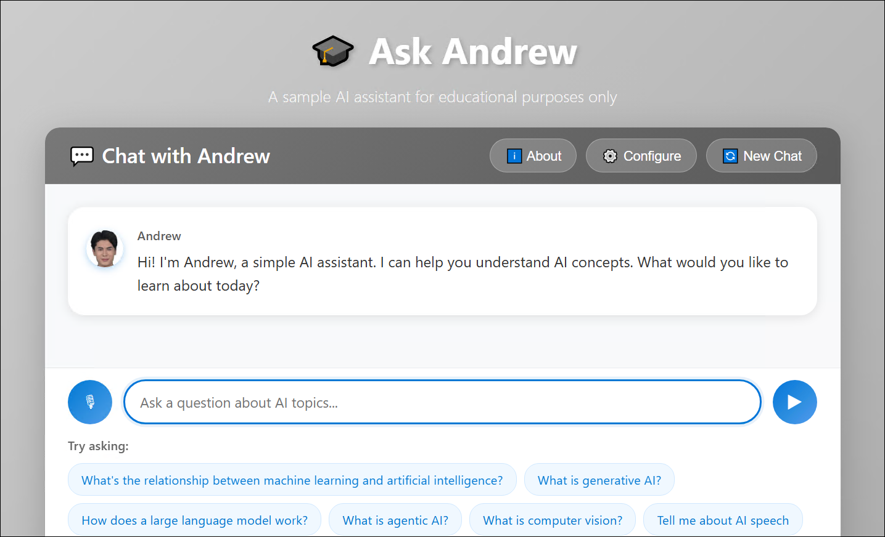

1. In the chat pane header, select **Configure**.

    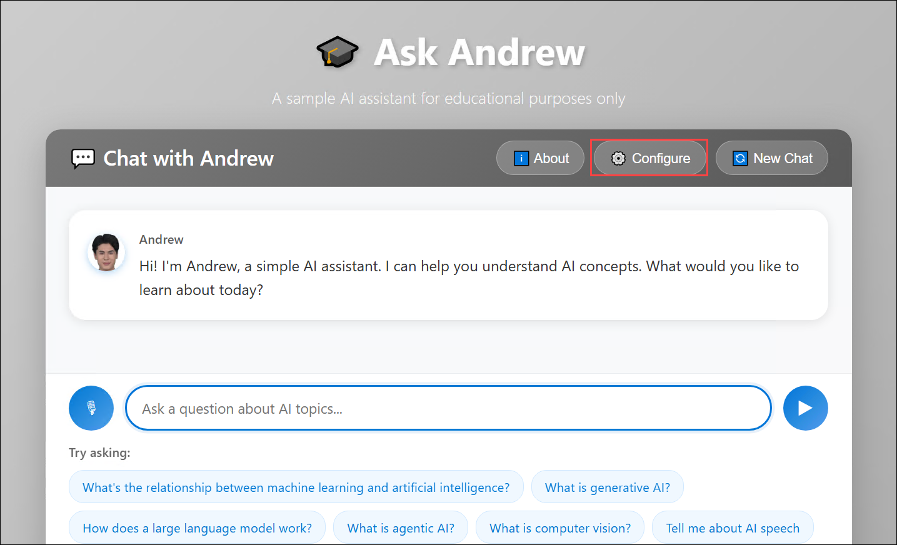

1. Enter the project details copied from the **Foundry portal home page**, along with your **model deployment name**, into the **Foundry Configuration** settings page, and then click **Save Configuration**.

    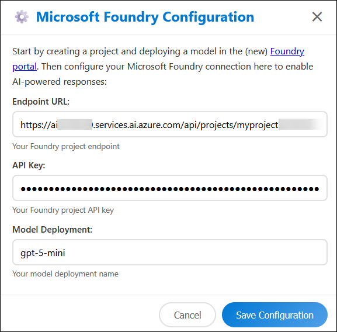

    > **Note:** The configuration values other than the API key will be stored in your local browser. If you close and re-open the app, you will need to re-enter the API key.

1. Use the app to chat with Andrew and ask questions about AI concepts. The app will use your deployed model in Microsoft Foundry. If you use the speech functionality, the app will use Azure Speech in Foundry tools in your resource to recognize and synthesize speech.

    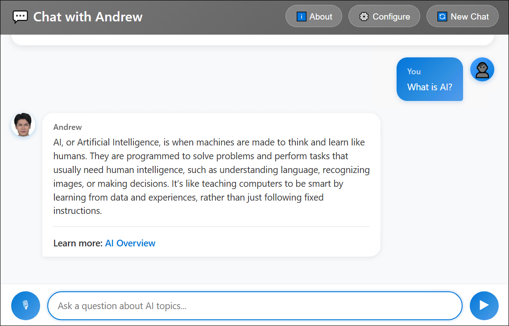

## Summary

In this lab, you created a Microsoft Foundry project and explored the Microsoft Foundry portal. You examined the Azure resources associated with the project, used the built-in AI assistant to learn about platform capabilities, and navigated key sections of the portal used for developing AI solutions. You then deployed a generative AI model from the model catalog and connected a client application to your Foundry resource using the project endpoint and API key, demonstrating how models in Microsoft Foundry can be integrated into applications.

### You've successfully completed the hand's-on lab!
