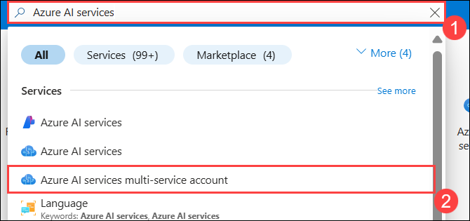

# Module 02: Explore Azure AI Services

## Lab overview

In this lab, you will create an Azure AI multi-service resource, retrieve its keys and endpoint, and explore its capabilities using the Azure AI Foundry portal. You'll get hands-on experience with services like Face detection, without needing any coding skills.

## Lab Objectives

In this lab, you will perform:

- Task 1: Create an Azure AI services resource in the Azure portal
- Task 2: Check out the keys and endpoint
- Task 3: See Azure AI services in action

## Exercise 1: Create an Azure AI services resource in the Azure portal

### Task 1: Create an Azure AI services resource in the Azure portal

In this task, you will learn how to create an Azure AI services resource in the Azure portal

1. In the Azure portal, search for **Azure AI services (1)**. Select an **Azure AI services multi-service account(2)**.

    

1. You will be taken to a page to create an Azure AI services resource. Please click on **Create**, configure it with the following settings:
   
    - **Subscription (1)**: Use the existing Azure subscription.
    - **Resource group (2)**: **AI-900-Module-11-<inject key="DeploymentID" enableCopy="false" />**
    - **Region (3)**: Select **<inject key="location" enableCopy="false"/>**
    - **Name (4)**: Enter **aiservice<inject key="DeploymentID" enableCopy="false"/>**
    - **Pricing tier (5)**:Select **Standard S0**.
    - **By checking this box, I acknowledge that I have read and understood all the terms below**: *Selected*.

      

1. Select **Review + create (7)** then **Create** and wait for deployment to complete.

   >***Congrats! You've just created or provisioned an Azure AI services resource. The one you provisioned in particular is a multi-service resource.***

1. Once the deployment is complete, select *Go to resource*. 

### Task 2: Check out the keys and endpoint

In order to incorporate Azure AI services into applications, developers need a service key and endpoint. The keys and endpoint used for application development can be found in the Azure Portal. 

1. In the Azure Portal, select your resource. On the left-hand menu, look under *Resource Management* for *Keys and Endpoints*. Select **Keys and Endpoints** to view the endpoint and keys for your resource. 

   
  
### Task 3: See Azure AI services in action

In this task, you will explore and interact with Azure AI services through demos in the Azure AI Foundry portal.

1. In a browser tab, navigate to [Azure AI Foundry](https://ai.azure.com?azure-portal=true).

1. Sign in with your account.

1. Close any tips or quick start panes that are opened the first time you sign in, and if necessary, use the Azure AI Foundry logo at the top left to navigate to the home page, which looks similar to the following image (close the Help pane if it's open).

1. In a new browser window, open the [Azure AI services exploration page](https://ai.azure.com/explore/aiservices).

1. Under *AI Services*, select the **View AI Services** tile.
 
      

1. On the *AI Services* page, select the *Vision + Document* tile to try out Azure AI Vision and Document capabilities.

    

1. Under *View all Vision capabilities* select the **Face** tab. 

1. Select the *Detect faces in an image* demo tile. 

   

1. Try out the Face service, which is one of many Azure AI services. Click on an image and check out the detected attributes. 

    

1. Scroll down to the **Run the code** section. Select **View Code**. 

     

1. Scroll down to the section that starts with *import os*. In the sample code provided, you'll see placeholders where you could put a key and endpoint.

   

1. If you were to build an application that used Azure AI services, you could start with the provided code. By replacing the placeholders with your own service's key and endpoint, your application would be able to send requests and receive responses that utilize Azure AI services. In the case of the Face service, the *request* is for the Face service to analyze the image. The *response* is the detected attributes. 

    >**Note**
    >You do not need to know programming to complete any of the exercises in this course. We will continue to take a look at Azure AI services in action through the Azure AI Foundry portal.  

## Validation

> **Congratulations** on completing the task! Now, it's time to validate it. Here are the steps:
 
- Hit the Validate button for the corresponding task. You will receive a success message. 
- If not, carefully read the error message and retry the step, following the instructions in the lab guide.
- If you need any assistance, please contact us at cloudlabs-support@spektrasystems.com. We are available 24/7 to help you out.

  <validation step="5371378e-8511-44ed-9037-3a000338132f" />

## Learn more

This simple search index only some of the capabilities of the Content Safety Studio. To learn more about what you can do with this service, see the [ Explore the Content Safety Studio ](https://learn.microsoft.com/en-us/azure/ai-services/content-safety/overview).

### Review
In this lab, you have completed the following tasks:
- Explored Content Safety Studio
- Associated a resource with the safety studio
- Tried out text moderation in the Content Safety Studio
- Checked out the keys and endpoint

## You have successfully completed this lab.
