# Lab 2a: Explore Content Safety in Azure AI Foundry

Azure AI services empower users to build intelligent applications using pre-built and customizable APIs and models. In this exercise, you'll explore Azure AI Content Safety, a service that enables moderation of text and image content. Using the Azure AI Foundry portal, Microsoft's platform for creating intelligent applications, you'll utilize Azure AI Content Safety to categorize text and assign severity scores.

> **Note**
> This exercise aims to provide a general understanding of how Azure AI services are provisioned and utilized. Content Safety is used as an example; comprehensive knowledge of content safety is not required for this exercise.

## Lab Overview

In this lab, you will create an Azure AI Foundry project, configure resources, and explore how to moderate text content using Azure AI Content Safety.

## Lab Objectives

By the end of this lab, you will be able to:

- Task 1: Create and configure a project in Azure AI Foundry.
- Task 2: Use Azure AI Content Safety to moderate text content.

## Exercise 1: Explore Content Safety in Azure AI Foundry

### Task 1: Create a project in the Azure AI Foundry portal

In this task, we are creating an Azure AI Foundry project and configuring necessary resources to explore AI language capabilities in the Language Playground.

1. Right-click the [Azure AI Foundry](https://ai.azure.com?azure-portal=true) **(1)** link, choose **Copy link (2)** from the context menu, then paste it into a new tab to open the Azure AI Foundry portal.

   

1. On the **Welcome to Azure AI Foundry** page, look at the top right corner and click the **Sign in** button to log in.

   

1. If prompted to sign in, enter your credentials.
 
   - **Email/Username:** <inject key="AzureAdUserEmail"></inject>
 
      
 
   - **Password:** <inject key="AzureAdUserPassword"></inject>
 
     
 
1. If prompted to stay signed in, you can click **No**.

   

1. If prompted with *Streamlined from the start*, click on **Got it** to proceed.

   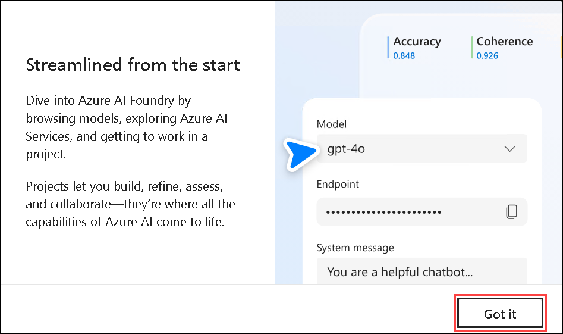

1. On the Azure AI Foundry portal home page, select **Create a project**. In Azure AI Foundry, projects are containers that help organize your work.  

    

1. On the **Create a project** pane, enter project name **Myproject<inject key="DeploymentID" enableCopy="false" /> (1)** and then select **Customize (2)**.

    

1. On the **Create a project** pane, Configure it with the following settings:

    - **Hub name**: Enter **myhub<inject key="DeploymentID" enableCopy="false" /> (1)**
    - **Subscription**: **Use existing Azure subscription (2)**
    - **Resource group**: Select **AI-900-Module-2a (3)**
    - **Location**: Select **<inject key="location" enableCopy="false"/> (4)**
    - **Connect Azure AI Services or Azure OpenAI Service**:
    Click on **Create new AI Services** and provide name **AI<inject key="DeploymentID" enableCopy="false" /> (5)** and click on **Next**
    - **Connect Azure AI Search**: Leave as default **(6)**
    - Click on **Next (7)**.

        

    > **Important**: You will need an Azure AI services resource provisioned in a specific location to complete the rest of the lab.

1. On the **Review and Finish** page, click on **Create**.

    

1. Keep track of the following created resources: 
    
    - **Azure AI Project**
    - **Azure AI Hub**  
    - **Azure AI Services**    
    - **Storage Account**  
    - **Key Vault**

      

      >**Note:** Once the deployment will succeed, close the *Project help* pane that will appear on right side.

6. After the resources are created, you will be brought to your project's *Overview* page. 

7. In order to use Content Safety, you need to make a permissions update to your *Azure AI hub* resource. To do this, open the [Azure portal](https://portal.azure.com?portal-azure=true) and log in with the same subscription you used to create your AI Foundry resources.  

8. In the Azure portal, search for **Azure AI Foundry (1)**. From the results, select the **Azure AI Foundry (2)** resource.

   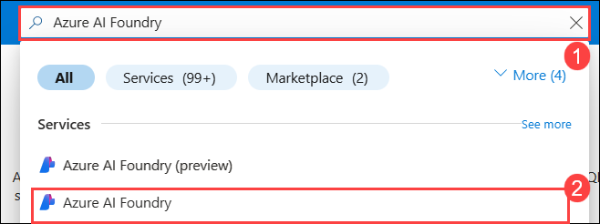  
   
1. In the  resource page, select the resource you just created that is *type* **Azure AI hub**.  

   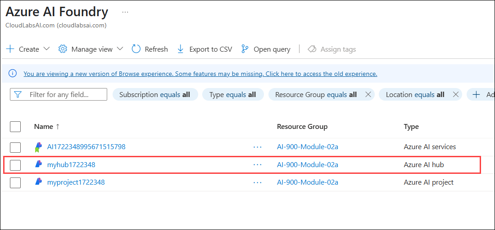  
   
1. In the Azure portal, on the left-hand pane, select **Access Control (IAM) (1)**. Then on the open pane, select **+ Add (2)** next to the plus sign, and select **Add role assignment (3)**. 

   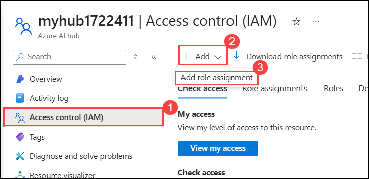

1. Search for **Azure AI Safety Evaluator (1)** in the list of roles, and select it **(2)**. Then select **Next (3)**. 

   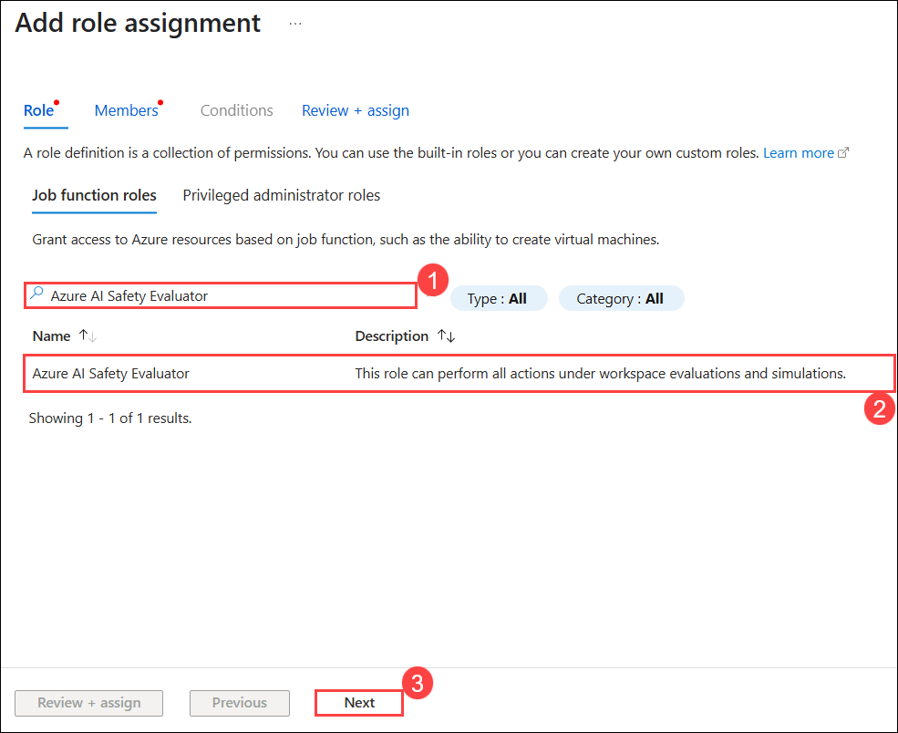  

1. Use the following settings to assign yourself to the role: 
    - **Assign access to**: Select **user, group, or service principal (1)**
    - **Members**: click on **+ select members (2)**
        - On the open *Select members* pane, find **<inject key="AzureAdUserEmail"></inject> (3)**. Click on the plus icon next to **<inject key="AzureAdUserEmail"></inject> (4)**. Then click **Select (5)**.
    - Select **Next (6)**. 

     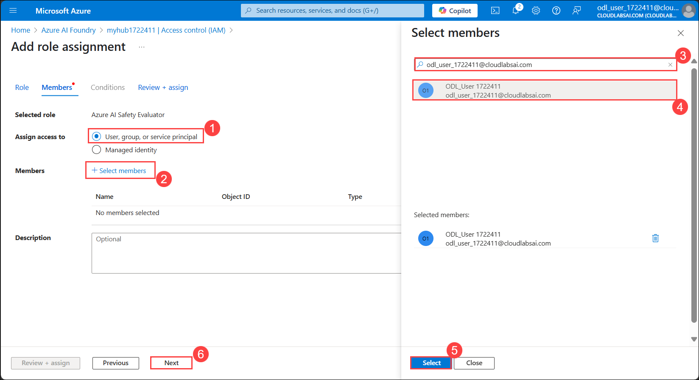

1. Select **Review and Assign**, then select **Review and Assign** again to add the role assignment.    

1. In your browser, return to the [Azure AI Foundry portal](https://ai.azure.com?azure-portal=true). Select your project. 

1. On the left-hand menu on the screen, select **AI Services**.
 
    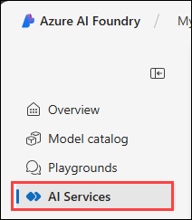  

1. On the *AI Services* page, select the **Content Safety** tile to try out Azure AI Vision and Document capabilities.
    
    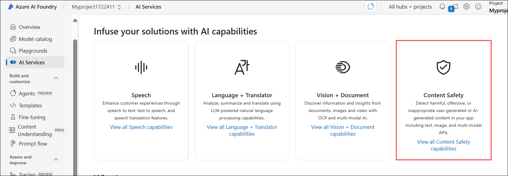

> **Congratulations** on completing the task! Now, it's time to validate it. Here are the steps:

* Hit the Validate button for the corresponding task. If you receive a success message, you can proceed to the next task.
* If not, carefully read the error message and retry the step, following the instructions in the lab guide.
* If you need any assistance, please contact us at [cloudlabs-support@spektrasystems.com](mailto:cloudlabs-support@spektrasystems.com). We are available 24/7 to help you out.

<validation step="">

### Task 2: Try Out Text Moderation with Content Safety in Azure AI Foundry Portal

In this task, you will test text moderation using Azure AI Content Safety to categorize and assess the severity of different text samples.

1. On the *Content Safety* page, under *Filter text content*, select **Moderate text content**.

   

1. On the Moderate text content page, under the Try it out section, select the **Azure AI Services (1)** resource you just created from the drop-down menu. Then, under *Run a simple test*, click the **Safe Content (2)** tile. You’ll see the text appear in the box below.

   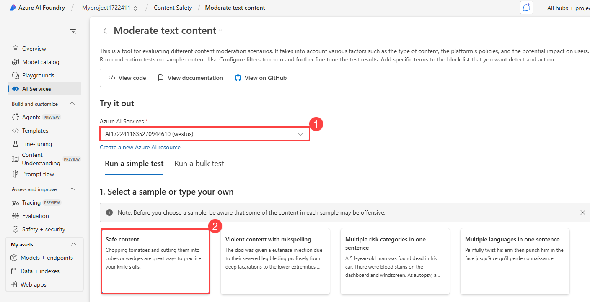

1. Click **Run test**. Running a test calls the Content Safety Service's deep learning model, which has been trained to recognize unsafe content.

   

.1 In the *Results* panel, inspect the results. There are four severity levels from safe to high, and four types of harmful content. Determine whether the Content Safety AI service considers this sample acceptable. Note that the results are within a confidence interval, indicating the probability that the content matches what a human would label. Each time you run a test, you call the model again.

   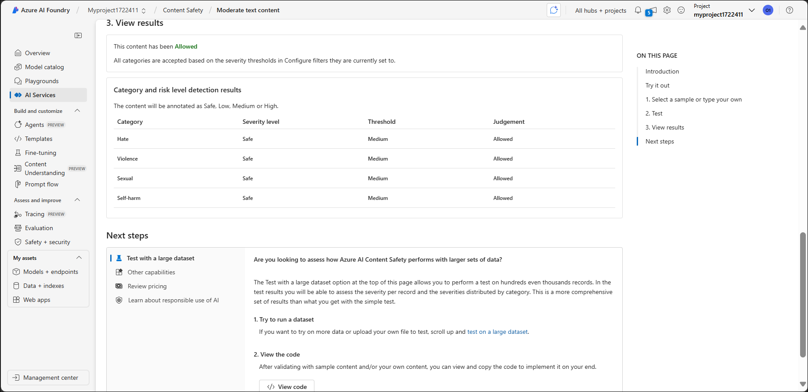

1. Now, select the text under **Violent content with misspelling**. Make sure the selected content appears in the box below, then click **Run test**.

   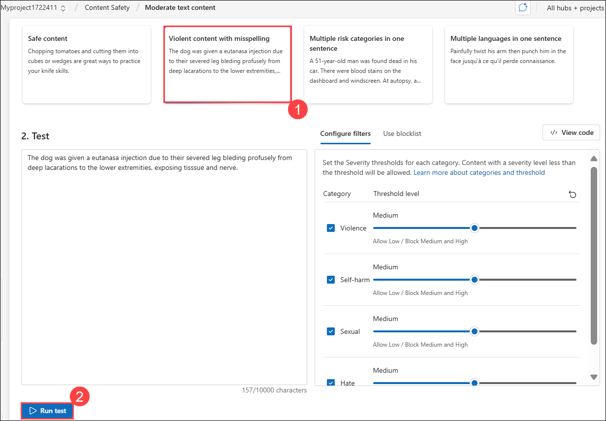

1. Inspect the results in the *Results* panel again.

   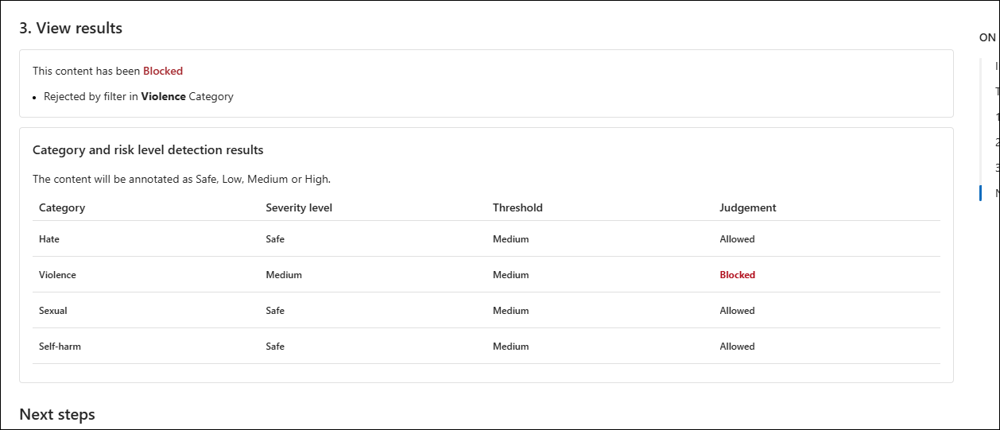

You can run tests on all the samples provided and inspect the results to understand how the Content Safety service evaluates different types of content.

### Review

In this lab, you have completed the following tasks:

- Created a project in the Azure AI Foundry portal and configured necessary resources.
- Assigned the **Azure AI Safety Evaluator** role to your Azure AI hub resource.
- Explored the Content Safety service within the Azure AI Foundry portal.
- Performed text moderation tests on sample content using Azure AI Content Safety.

## Learn More

This exercise demonstrated only some of the capabilities of the Content Safety service. To learn more about what you can do with this service, see the [Azure AI Content Safety documentation](https://learn.microsoft.com/en-us/azure/ai-services/content-safety/overview).
