# Get started with generative AI and agents in Microsoft Foundry

### Estimated Duration: 60 Minutes

## Lab overview

In this lab, you will use Microsoft Foundry to deploy and interact with a generative AI model. You will explore the model through the chat playground, experiment with system prompts to guide responses, and review client code for integration. You will then convert the model into an agent, enhance it with a knowledge tool, and publish it for use in applications. Through these hands-on tasks, you will gain practical experience in building and deploying agent-based AI solutions using Microsoft Foundry.

## Lab objectives

In this exercise, you will perform:

- Task 1: Create a Microsoft Foundry project
- Task 2: Deploy a model
- Task 3: Chat with the model
- Task 4: Specify instructions in a system prompt
- Task 5: Save the model configuration as an agent
- Task 6: Add a knowledge tool to the agent

## Task 1: Create a Microsoft Foundry project

In this task, you'll create a Microsoft Foundry project, configure the required Azure resources, and obtain the project endpoint needed for application development.

1. Copy the **Microsoft Foundry** link and paste it into a new browser tab to access the portal: `https://ai.azure.com/`

1. On the **Microsoft Foundry** home page, click on **Start building** in the top right corner.

     

1. If prompted to sign in, enter your credentials:
 
   - **Email/Username:** Enter <inject key="AzureAdUserEmail"></inject> **(1)** and click on **Next (2)**.
 
        
 
   - **Password:** Enter <inject key="AzureAdUserPassword"></inject> **(1)** and click on **Sign in (2)**.
 
      .png)

1. If prompted to **Stay signed in?**, you can click **No**.

    

1. On the **Get started with Microsoft Foundry** page, click on **Create project**.

   

1. In the **Create a project** wizard, enter project name **Myproject<inject key="DeploymentID" enableCopy="false" /> (1)**, and **Expand Advanced options (2)** to specify the following settings for your project: 

    - Foundry resource: **MyFoundry<inject key="DeploymentID" enableCopy="false" /> (3)**
    - Subscription : **Leave default subscription (4)** 
    - Region : Select **<inject key="location" enableCopy="false"/> (5)**
    - Resource group : Select **AI-901 (6)** 
    - Click on **Create** **(7)**

      .png)

1. Wait for your project to be created. It may take a few minutes. 

1. In the **All set, Let's build your agents** window, click **Let's go**.

    

1. Once the setup is complete, you are automatically redirected to the **Microsoft Foundry home page** for the newly created project.

   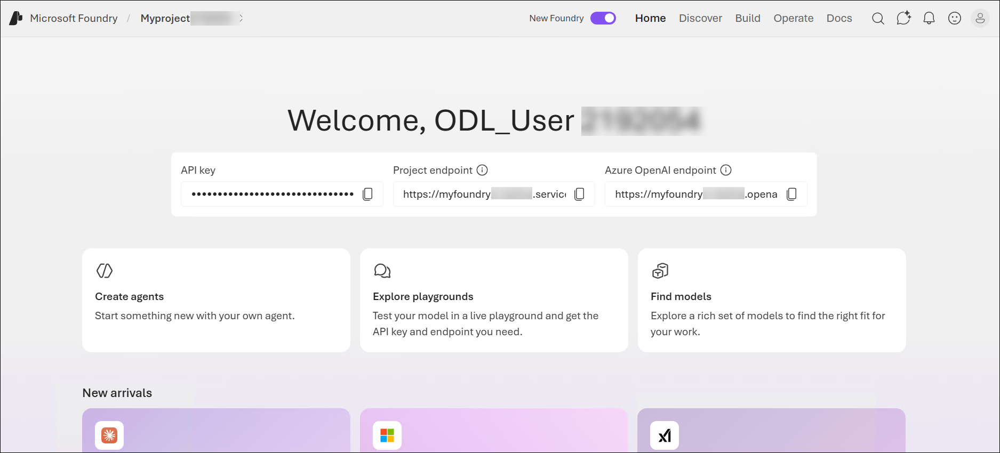


> **Congratulations** on completing the task! Now, it's time to validate it. Here are the steps:
 
- Hit the Validate button for the corresponding task. You will receive a success message. 
- If not, carefully read the error message and retry the step, following the instructions in the lab guide.
- If you need any assistance, please contact us at cloudlabs-support@spektrasystems.com. We are available 24/7 to help you out.

  <validation step="f179f7a3-eee2-4776-b013-696a6be31f59" />

## Task 2: Deploy a model

In this task, you will explore the model catalog in Microsoft Foundry and deploy a generative AI model. The deployed model will be used for interactive testing and experimentation in the playground.

1. On the **Microsoft Foundry** home page, then select **Find models** to view the Microsoft Foundry model catalog.

     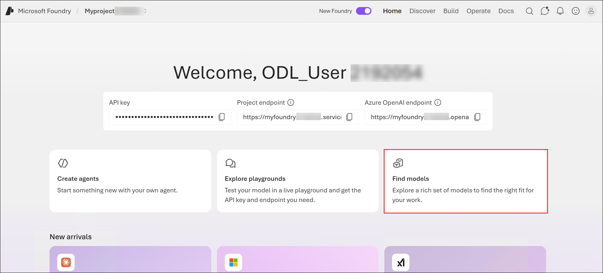

1. Microsoft Foundry provides a large collection of models from Microsoft, OpenAI, and other providers, that you can use in your AI apps and agents.

    

1. On the **Models** page, search for **gpt-5-mini (1)** in the search bar, and then select the **gpt-5-mini (2)** model from the search results.

     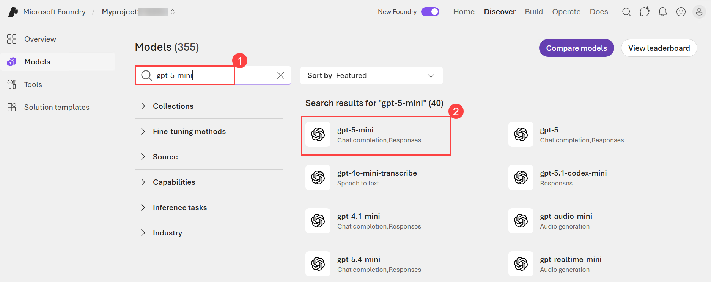

1. On the **gpt-5-mini** model details page, click **Deploy (1)**, and then select **Default settings (2)** to deploy the model using the standard configuration.

    

1. When the model has been deployed, view the model playground page that is opened, in which you can chat with the model.

    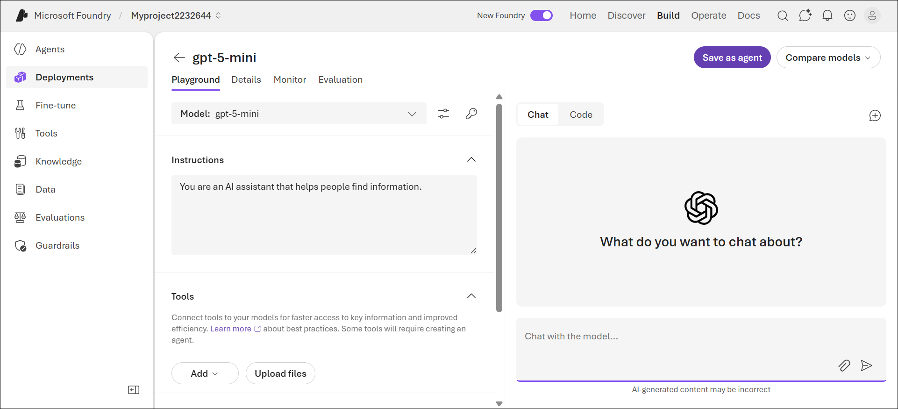


> **Congratulations** on completing the task! Now, it's time to validate it. Here are the steps:
 
- Hit the Validate button for the corresponding task. You will receive a success message. 
- If not, carefully read the error message and retry the step, following the instructions in the lab guide.
- If you need any assistance, please contact us at cloudlabs-support@spektrasystems.com. We are available 24/7 to help you out.

  <validation step="6d51d370-fbe8-4b78-ac65-6daae4aea306" />

## Task 3: Chat with the model

In this task, you will interact with the deployed model using the chat playground.
You will ask questions, observe responses, and understand how conversation context is maintained during interactions.

1. Use the button at the bottom of the left navigation pane to hide it and give yourself more room to work with.

1. In the **Chat** pane, enter a prompt such as `Who was Ada Lovelace?`, and review the response.

    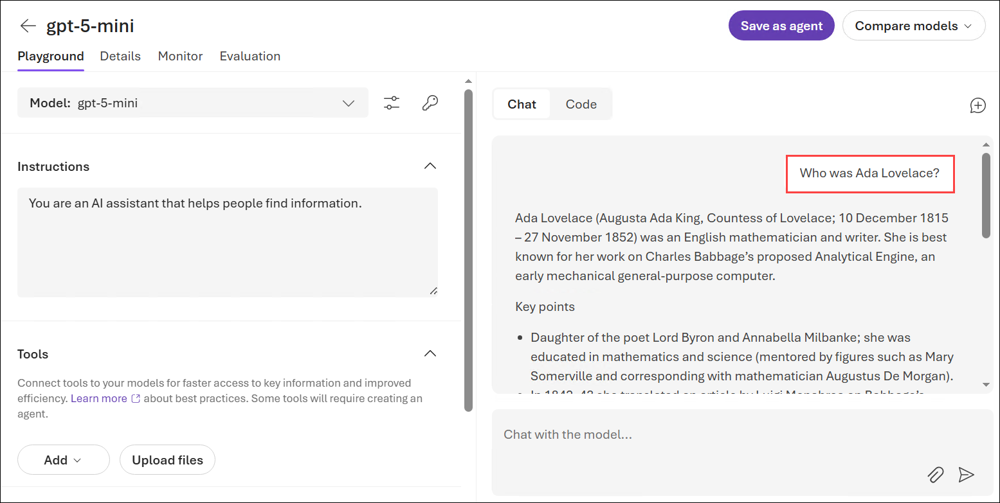

1. Enter a follow-up prompt, such as `Tell me more about her work with Charles Babbage.` and review the response.

    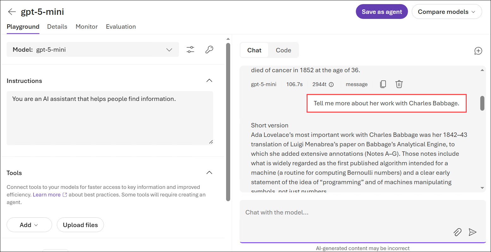

    > **Note:** Generative AI chat applications often include the conversation history in the prompt; so the context of the conversation is retained between messages. In this case, "her" is interpreted as referring to Ada Lovelace.

1. At the top-right of the chat pane, use the **New chat** button to restart the conversation. This removes all conversation history.

     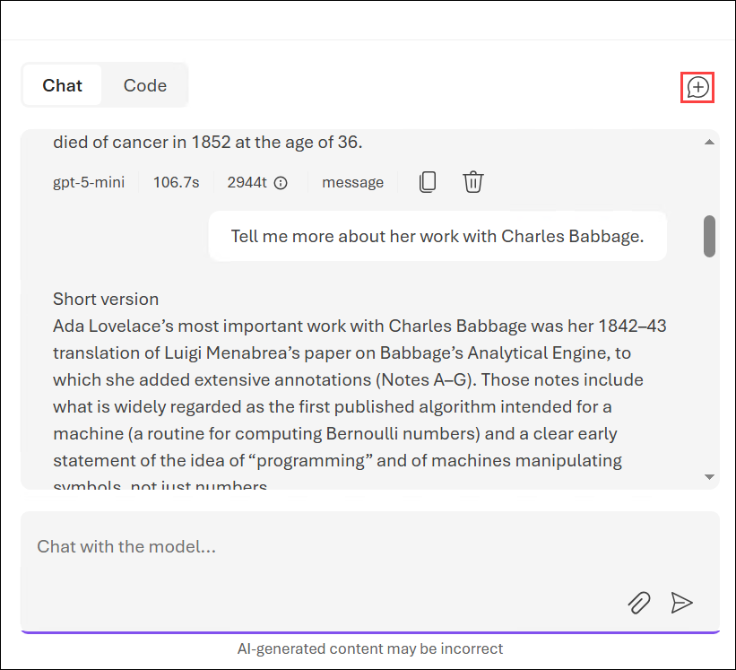

1. Enter a new prompt, such as `Tell me about the ELIZA chatbot.` and view the response.

     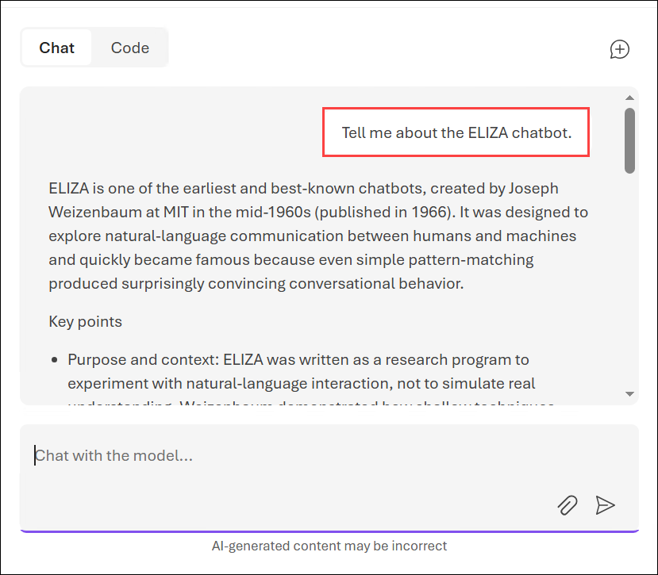

1. Continue the conversation with prompts such as `How does it compare with modern LLMs?`
 
### Task 3.1: View client code to chat with a model

When you're satisfied with the responses a model returns in the playground, you can develop client applications that consume it. Microsoft Foundry provides a REST API and multiple language-specific SDKs that you can use to connect to the deployed model and chat with it.

1. In the **Chat** pane, select the **Code** tab.

    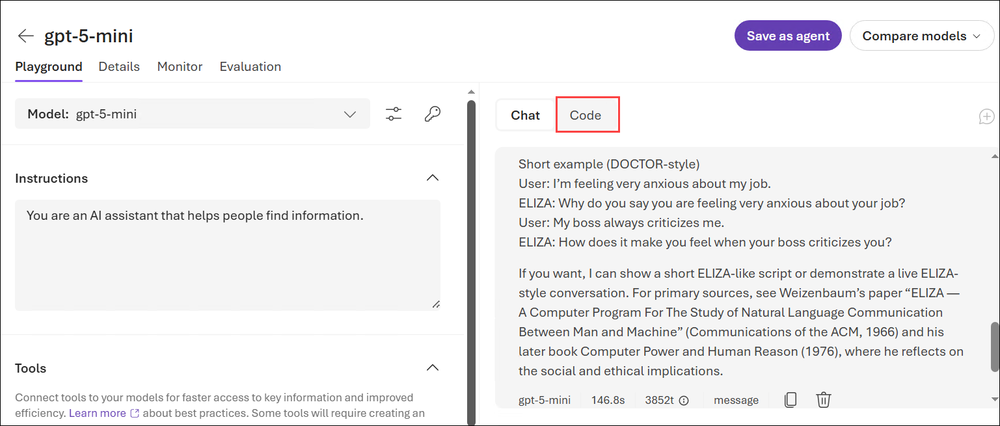

1. This tab shows sample code that a client application can use to chat with the model. Above the sample code, you can choose preferences for:

    - **API**: The OpenAI API is a common standard for implementing conversations with generative AI models. There are two variants of the OpenAI API that you can use:
        - **Completions**: A broadly used programmatic syntax for submitting prompts to a model.
        - **Responses**: A newer syntax that offers greater flexibility for building apps that converse with both standalone models and with *agents*.
    - **Language**: You can write code to consume a model in a wide range of programming languages, including Python. Microsoft C#, JavaScript, and others.
    - **SDK**: You can use a language-specific SDK, which encapsulates the low-level communication details between the client and model; or you can work directly with the REST API, enabling you to have full control over the HTTP request messages that your client sends to the model.
    - **Authentication**: To use a model deployed in Microsoft Foundry, the client application must be authenticated. You can implement authentication using:
        - **Key-based authentication**: The client app must present a security key (which you can find by selecting the key icon above the code sample)
        - **Microsoft Entra ID authentication**: The client app presents an authentication token based on an identify that is assigned to it (or to the current user).

1. Select the following code options:
    - **API**: Responses API **(1)**
    - **Language**: Python **(2)**
    - **SDK**: OpenAI SDK **(3)**
    - **Authentication**: Key authentication **(4)**

        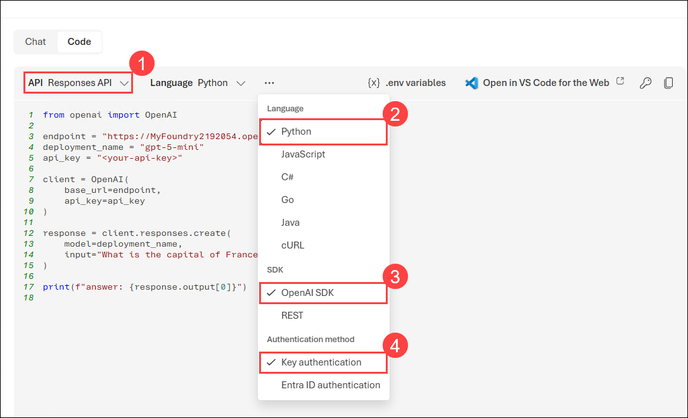

        The resulting sample should be similar to the following code:

        ```python
        from openai import OpenAI
        
        endpoint = "https://{your-foundry-resource}.openai.azure.com/openai/v1/"
        deployment_name = "gpt-5-mini"
        api_key = "<your-api-key>"
        
        client = OpenAI(
            base_url=endpoint,
            api_key=api_key
        )
        
        response = client.responses.create(
            model=deployment_name,
            input="What is the capital of France?",
        )
        
        print(f"answer: {response.output[0]}")
        ```

        The code connects to the **OpenAI** endpoint for your Microsoft Foundry resource, using its secret authentication key (which you would need to copy into the code to set the **api_key** variable). It then uses the **responses.create** method to generate a response from your deployed model from an input prompt (in this case, the hard-coded question "What is the capital of France?") and prints the response to the output console.

## Task 4: Specify instructions in a system prompt

In this task, you’ll define and apply system instructions to guide the model’s behavior, tone, and response scope for a specific use case.

1. In the model playground, switch back to the **Chat (1)** tab. Then, at the top-right of the chat pane, use the **New chat (2)** button to restart the conversation and removes the conversation history.

    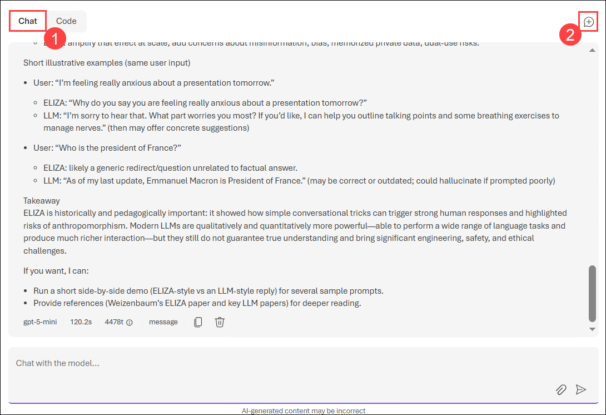

1. In the pane on the left, in the **Instructions** text area, change the system prompt to:

    ```
    You are a helpful AI assistant who supports employees with expense claims. Provide concise, accurate information only on topics related to expenses. Do not provide any information about topics that are not directly related to expenses.
    ```

    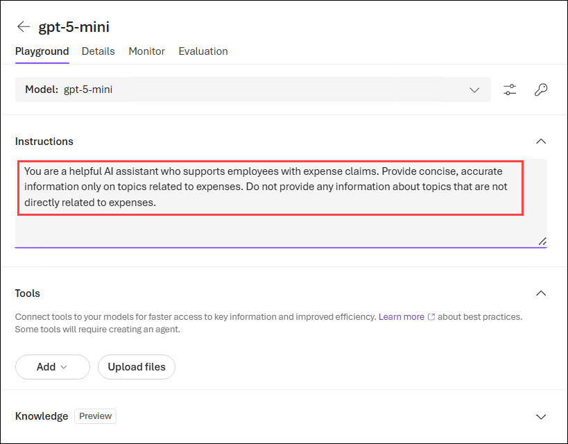

1. Now enter a new user prompt related to expense claims, such as `What kinds of business expense are typically reimbursed by employers?`

    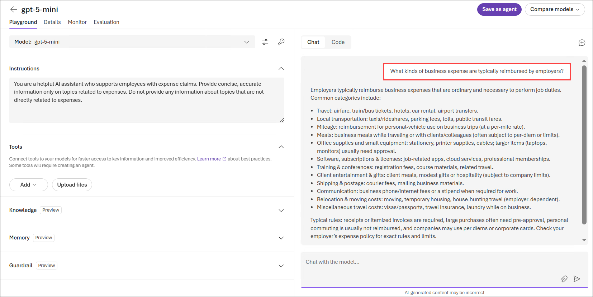

1. Review the response, which should provide some general guidance about expense claims.

1. Try re-asking a previously-asked question that is unrelated to expenses, such as `Tell me about the ELIZA chatbot`; and compare the response now that the system prompt has changed.

    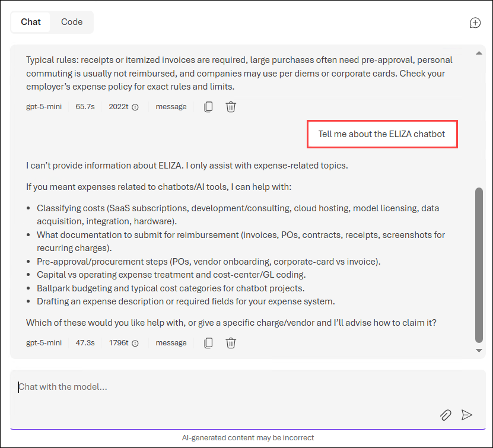

    So far, we've specified instructions in the *playground*; but they're not saved outside of that environment. In a client application, you would need to include the system prompt as an **instructions** parameter in the **responses.create** method, like this:

    ```python
    response = client.responses.create(
            model=deployment_name,
            instructions="""
                You are a helpful AI assistant who supports employees with expense claims.
                Provide concise, accurate information only on topics related to expenses.
                Do not provide any information about topics that are not directly related to expenses.
            """
            input="What kinds of business expense are typically reimbursed by employers?",
        )
    ```

    To encapsulate the instructions and model in a single AI entity, we need to save the configuration as an *agent*.

## Task 5: Save the model configuration as an agent

In this task, you’ll convert the configured model into an agent by saving its instructions and settings as a reusable AI assistant.

1. In the model playground, at the top right select **Save as agent (1)**. Then, when prompted, name your new agent `expenses-agent` **(2)** and then click on **Create (3)**.

    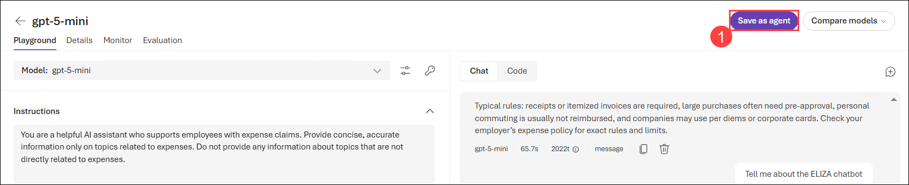

    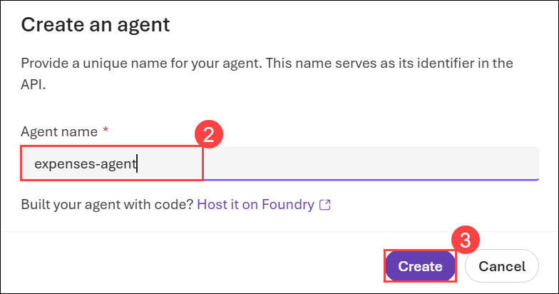

1. When the agent is created, it opens in a new playground specifically for working with agents.

    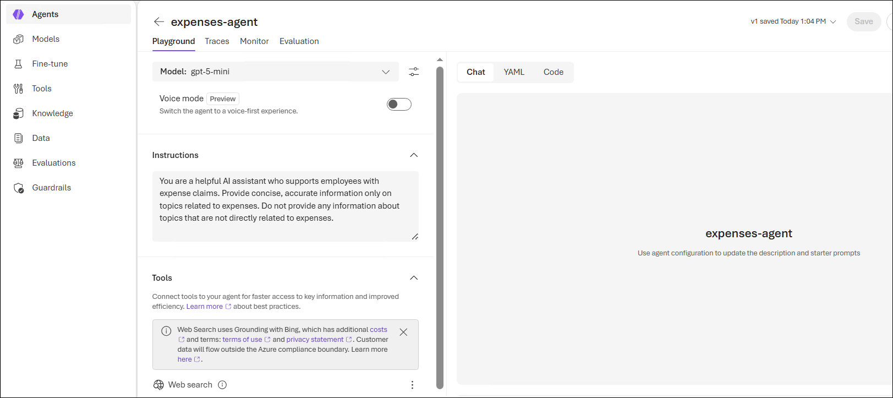

1. In the pane on the right, view the **YAML** tab, which contains the definition for your agent. Note that its definition includes the model, its parameter settings, and the instructions you specified - similar to this:

    ```yml
    metadata:
      logo: Avatar_Default.svg
      microsoft.voice-live.enabled: "false"
    object: agent.version
    id: expenses-agent:1
    name: expenses-agent
    version: "1"
    description: ""
    created_at: 1776115196
    definition:
      kind: prompt
      model: gpt-5-mini
      instructions: You are a helpful AI assistant who supports employees with expense claims. Provide concise, accurate information only on topics related to expenses. Do not provide any information about topics that are not directly related to expenses.
      temperature: 1
      top_p: 1
      tools: []
    status: active
    ```

    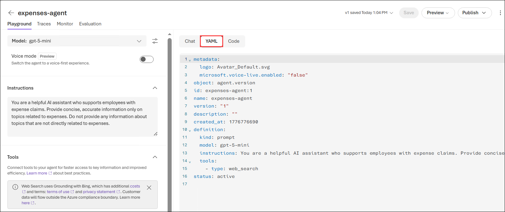

1. Switch back to the **Chat** tab, and enter the prompt `Who are you?`

    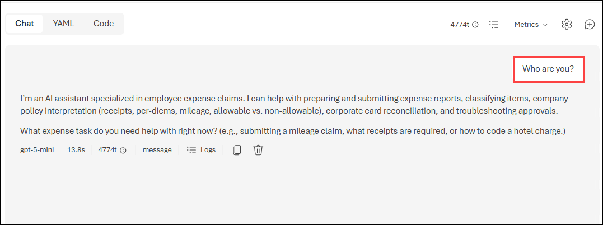

1. The response should indicate that the agent is "aware" of its role as an expense claims advisor.

1. Enter an expenses-related prompt, such as `How much can I claim for a taxi?`

    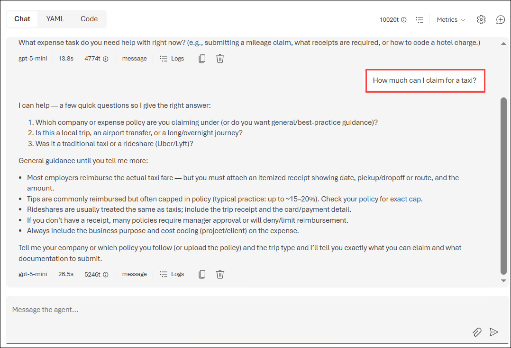

    The response is likely to be generic. Accurate; but not particularly helpful to the employee. We need to give the agent some knowledge about the company's expense policies and procedures.

> **Congratulations** on completing the task! Now, it's time to validate it. Here are the steps:
 
- Hit the Validate button for the corresponding task. You will receive a success message. 
- If not, carefully read the error message and retry the step, following the instructions in the lab guide.
- If you need any assistance, please contact us at cloudlabs-support@spektrasystems.com. We are available 24/7 to help you out.

  <validation step="6c0bebb0-789f-4b1a-b8e2-07f5ac7982b2" />

## Task 6: Add a knowledge tool to the agent

In this task, you’ll enhance the agent by adding a knowledge source, enabling it to provide more accurate and context-aware responses.

1. Open a new browser tab, and view the **[expenses_policy.docx](https://microsoftlearning.github.io/mslearn-ai-fundamentals/data/expenses_policy.docx)** at `https://microsoftlearning.github.io/mslearn-ai-fundamentals/data/expenses_policy.docx`. We'll use this to provide a knowledge source that the agent can use to answer questions about expense claims.

1. Download **`expenses_policy.docx`**.

    >**Note:** `If the link does not open or the file cannot be downloaded, try accessing it in an InPrivate/Incognito browser window.`

1. Return to the tab containing the agent playground, and in the pane on the left, expand the **Tools** section if it's not already expanded.

    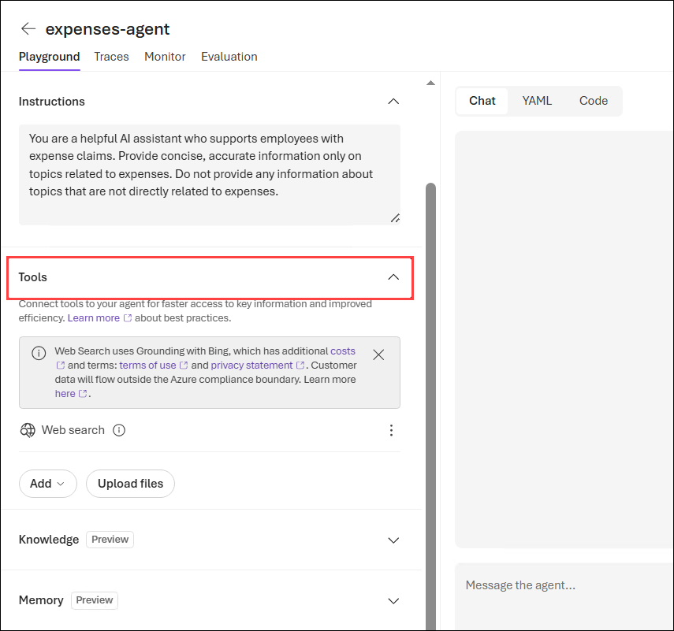

1. Click on **Upload file (1)** and then select **browse for files (2)**. 

    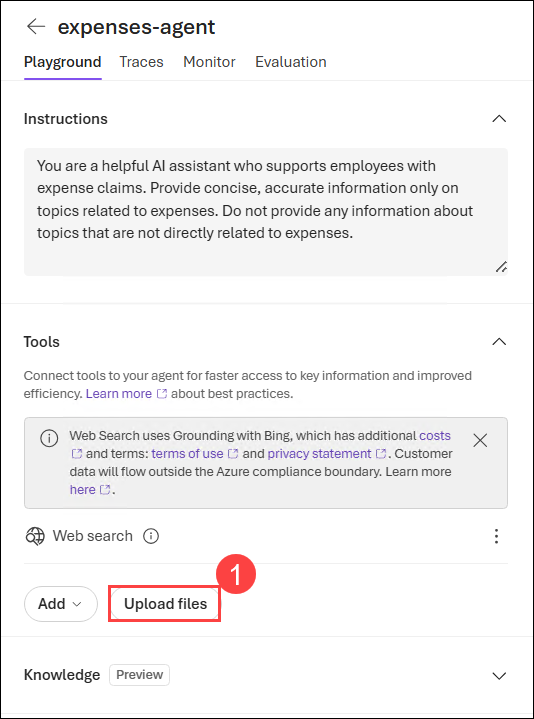

    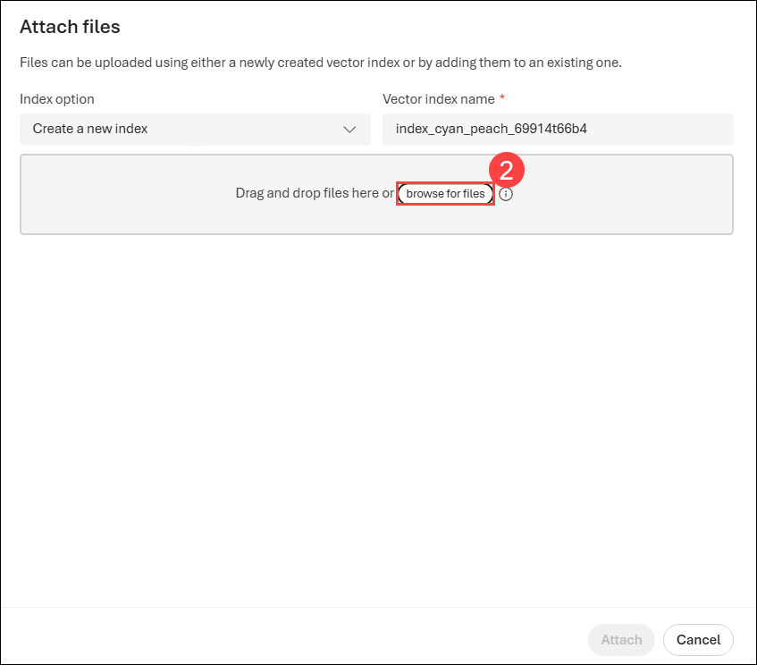

1. From the **Open** window, select **Downloads (3)** from the left and then select the `expenses_policy.docx` **(4)** and click on **Open (5)**.

    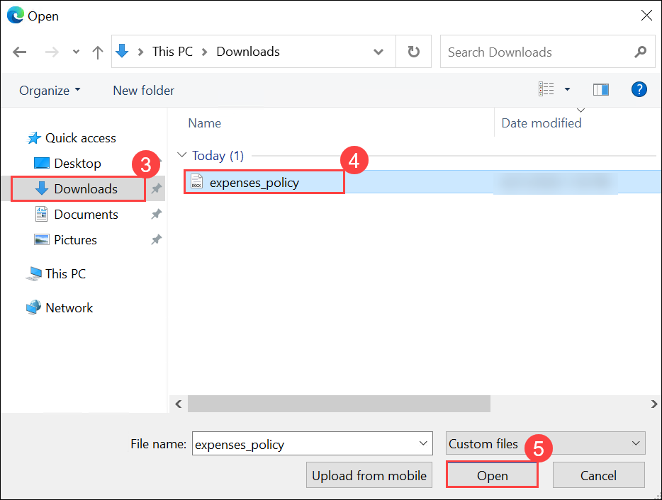

1. When the index has been created, attach it to the agent by selecting **Attach**.

    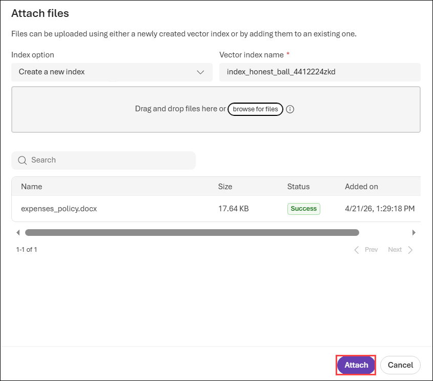

1. At the top of the agent playground, use the **Save** button to update the agent definition.

    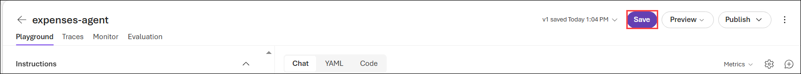

1. In the pane on the right, view the **YAML** tab, which contains the definition for your agent. Note that its definition now includes the file search tool you added (in the **tools** section):

    ```yml
    metadata:
      logo: Avatar_Default.svg
      description: ""
      modified_at: "1776115781"
      microsoft.voice-live.enabled: "false"
    object: agent.version
    id: expenses-agent:2
    name: expenses-agent
    version: "2"
    description: ""
    created_at: 1776115782
    definition:
      kind: prompt
      model: gpt-5-mini
      instructions: You are a helpful AI assistant who supports employees with expense claims. Provide concise, accurate information only on topics related to expenses. Do not provide any information about topics that are not directly related to expenses.
      temperature: 1
      top_p: 1
      tools:
        - type: file_search
          vector_store_ids:
            - vs_tmwFZKmfVB3rZJoeaJAcgdy9
    status: active
    ```

    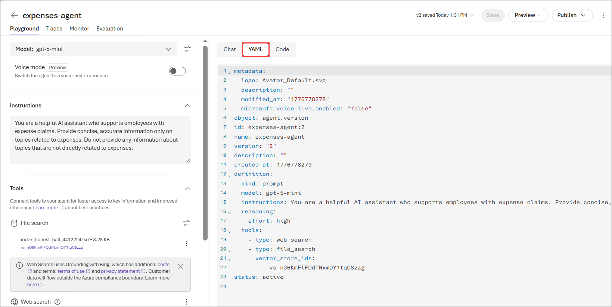

1. Switch back to the **Chat** tab, and enter the same expenses-related prompt as before (for example, `How much can I claim for a taxi?`) and view the response.

    This time the response should be informed by the information in the expenses data source.

    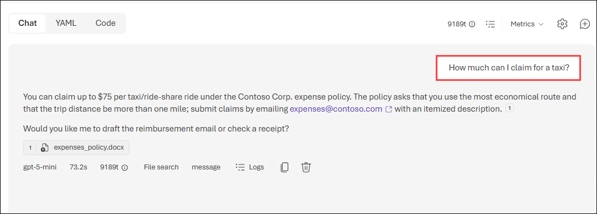

1. Try a few more expenses-related prompts, like `What about a hotel?` or `Can I claim the cost of my dinner?`

    Congratulations! We have a working agent with access to the knowledge it needs. Now we're ready to develop apps that use it.

### Task 6.1: Preview the agent

In this task, you’ll preview your working agent in a basic web chat application.

1. In the Agent Playground in the Foundry Portal, at the top of the chat pane, in the **Preview (1)** drop-down list, select **Preview agent (2)**.

    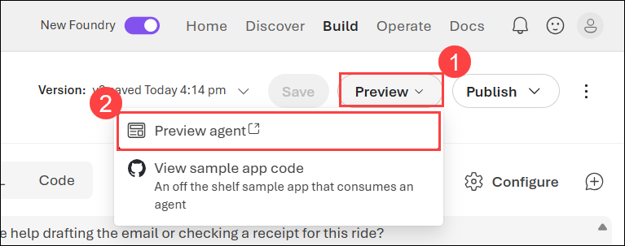

1. A preview chat interface is opened in a new browser tab.

    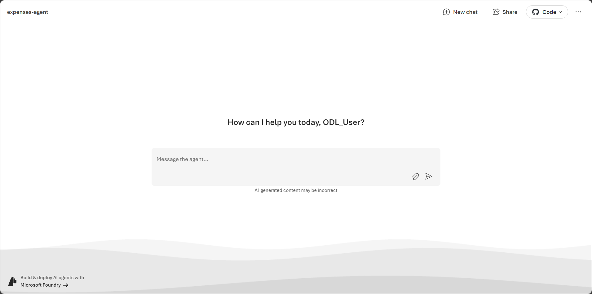

1. Enter a prompt, such as `How do I submit an expense claim?` and view the response from your agent.

    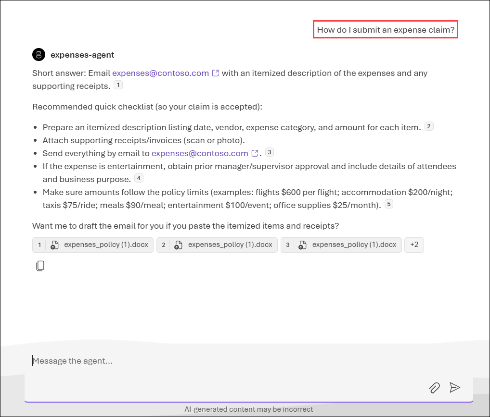

### Task 6.2: View client code to access the agent in your project

The agent is defined within your Foundry project, and there's a convenient way to develop apps that connect to it there; allowing you to iteratively refine both the agent and the client app to create the solution you need.

1. In the agent playground, switch from the **Chat** tab to the **Code** tab, and view the sample code for consuming the agent; which should be similar to this:

    ```python
    # Before running the sample:
    # pip install azure-ai-projects>=2.0.0
    
    from azure.identity import DefaultAzureCredential
    from azure.ai.projects import AIProjectClient
    
    my_endpoint = "https://{your-foundry-resource}}.services.ai.azure.com/api/projects/{your-project}"
    
    project_client = AIProjectClient(
        endpoint=my_endpoint,
        credential=DefaultAzureCredential(),
    )
    
    my_agent = "expenses-agent"
    my_version = "2"
    
    openai_client = project_client.get_openai_client()
    
    # Reference the agent to get a response
    
    response = openai_client.responses.create(
        input=[{"role": "user", "content": "Tell me what you can help with."}],
        extra_body={"agent_reference": {"name": my_agent, "version": my_version, "type": "agent_reference"}},
    )
    
    print(f"Response output: {response.output_text}")
    ```

    The code to connect to your agent uses the **Azure.AI.Projects** library to create an **AIProjectClient** object connected to your Foundry project. Since this involves connecting to a project, which may contain priveleged resources, key-based authentication is <u>not</u> supported, and the application must use an Entra ID identity to be authenticated.

    After connecting to the project, the code uses the project client's **get_openai_client** method to retrieve an OpenAI client object; with which it can submit prompts to the agent using the same **Responses** API we previously saw being used to chat with a model. Since a project can contain multiple agents and models, the specific agent details are specified as **extra_body** in the **responses.create** method.

1. In the **Code** tab, use the **Open in VS Code for the web** button to open Visual Studio Code for the Web in a new browser tab.

    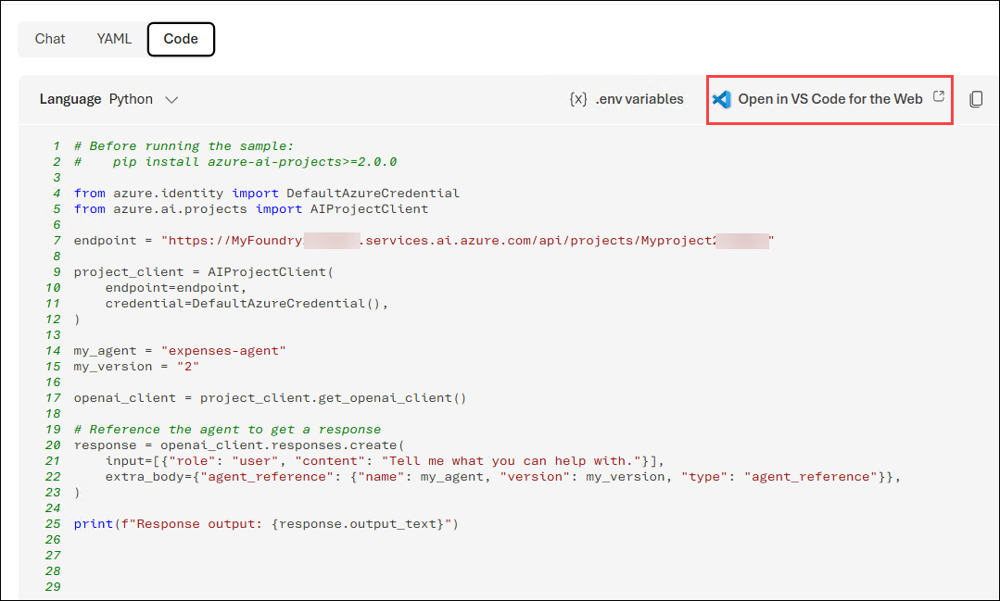

    Wait for the environment to be set up.

    > **Note:** It can take a few minutes to set the environment up!

1. On the **Welcome to VS Code** pop-up, select **Skip**.

    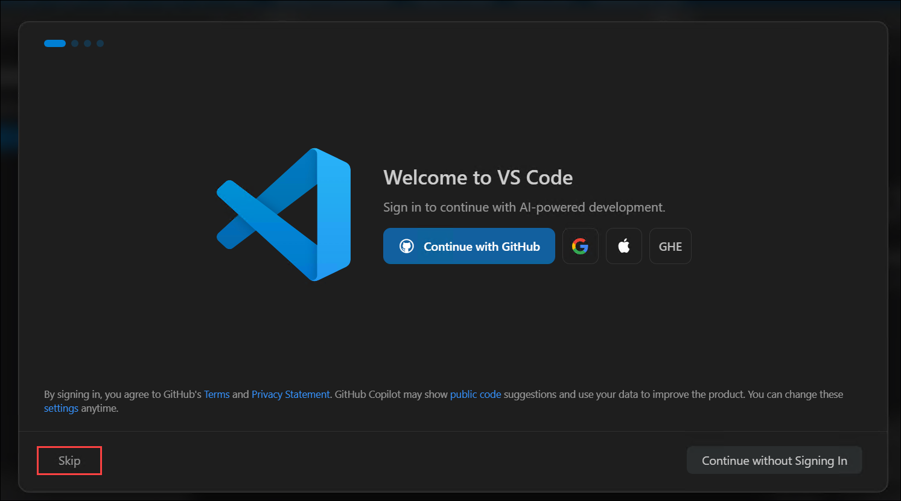

1. Enter a name for the workspace folder, such as **azuredev-8dde**, then press **Enter** to create the folder in Azure Cloud Shell. You can keep the default name or provide any random folder name of your choice.

    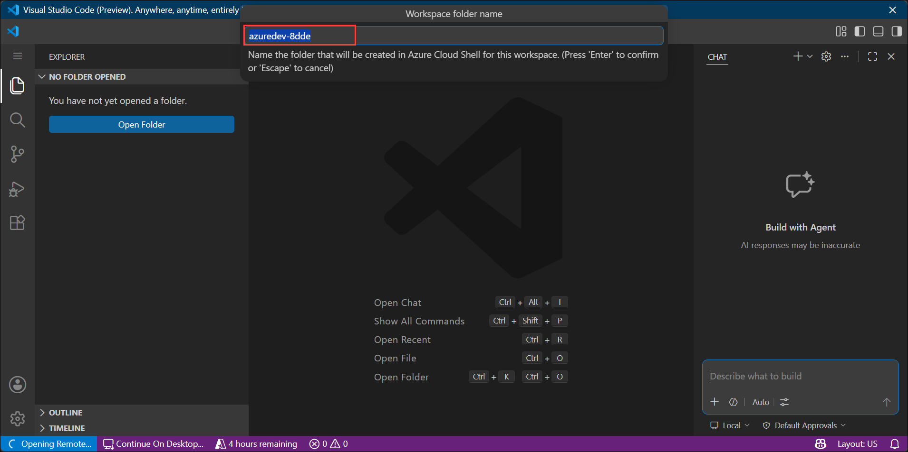

1. After VS Code for the web has opened and the environment has been set up, close the GitHub Copilot **Chat** pane on the right side to give you more room, and note that the **Instructions.md** file contains the instructions you need to run the sample code (which is in the **run_agent.py** file in the VS Code Explorer pane on the left.)

    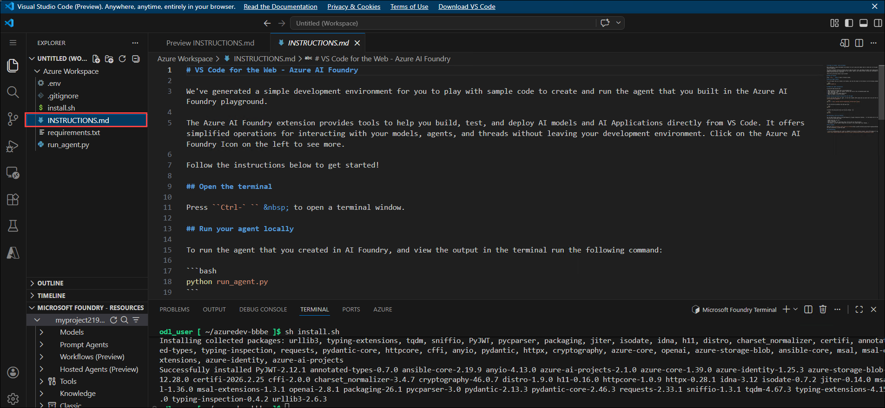

1. In the terminal pane at the bottom, enter the following command to run the code:

    ```python
   python run_agent.py
    ```

1. The output should include a response to the prompt `Tell me what you can help with.`

    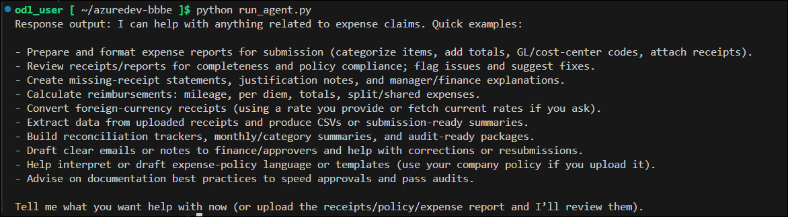

    > **Note:** If an authentication issue occurs, you may need to sign into Azure in the VS Code terminal by using the Azure CLI `az login` command. See the [Azure CLI documentation](https://learn.microsoft.com/cli/azure/authenticate-azure-cli-interactively) for details.
    >
    >- **Email/Username:** <inject key="AzureAdUserEmail"></inject>
    >
    >- **Password:** <inject key="AzureAdUserPassword"></inject>


<!---
## Task 7: Publish the agent and use it in a client app

In this task, you’ll publish the agent to a dedicated endpoint and use sample code to integrate and interact with it from a client application.

1. Keep the VS Code for the Web tab open, but switch back to the Foundry portal tab.

1. In the agent playground, in the **Publish (1)** drop-down list, select **Publish agent (2)**.

    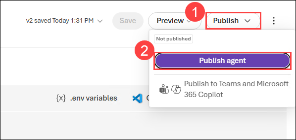

1. When prompted, confirm you want to publish the agent to production. and 

    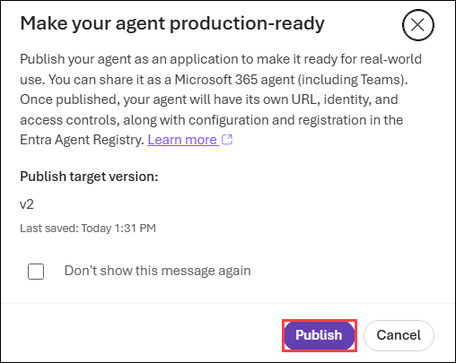

1. After a few seconds, view the published agent details. In particular, copy the Responses API endpoint **(1)** that clients apps can use to connect to your agent.

1. Note that you can perform additional steps to publish your agent for integration with Teams and Microsoft 365 Copilot. However, in this exercise, select **Close (2)**.

    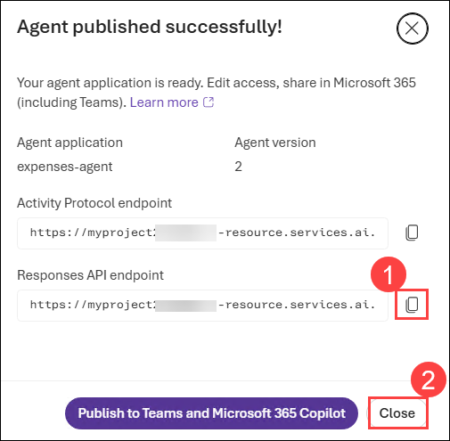

    > **Note:** You can use the **View details** option in the **Publish** drop-down list to re-open the agent details.

1. Switch back to the VS Code for the Web tab, and in the Explorer pane, select **New File... (1)** and name the new file as `expenses-client.py`.

    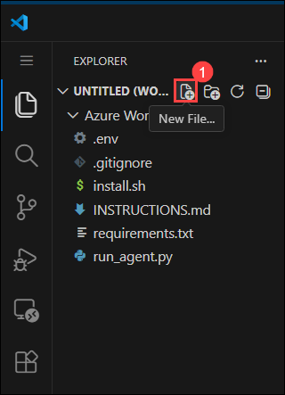

1. Add the following code to the new **expenses-client.py** file.

    ```python
    from openai import OpenAI
    from azure.identity import DefaultAzureCredential, get_bearer_token_provider
        
    # Replace with your agent endpoint
    AGENT_ENDPOINT = "YOUR_AGENT_ENDPOINT"
        
    # Create OpenAI client authenticated with Azure credentials
    openai = OpenAI(
            api_key=get_bearer_token_provider(DefaultAzureCredential(), "https://ai.azure.com/.default"),
            base_url=AGENT_ENDPOINT,
            default_query={"api-version": "2025-11-15-preview"}
    )
        
    # Send a request to the published agent
    response = openai.responses.create(
            input=input("Prompt:\n"),
    )
    print(f"Response output:\n{response.output_text}")
    ```

    This code uses the **Open AI Responses** API with Entra ID authentication. Since the agent is published in its own production endpoint, there's no need to connect to the Foundry project using the **Azure.AI.Projects** library or to specify agent details in the **responses.create** method call.

1. Replace the **YOUR_AGENT_ENDPOINT** placeholder with the Responses API endpoint for your agent (copied from the published agent details in the Foundry portal).

    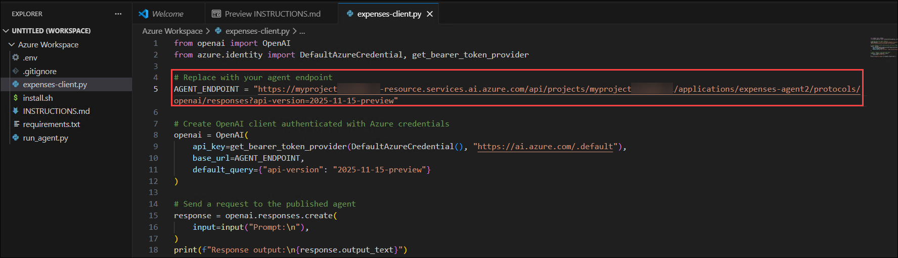

1. Save the changes to the **expenses-client.py** code file **(CTRL+S)**.

1. In the VS Code terminal pane, enter the following command to run the code.

    ```
    python expenses-client.py
    ```

1. When prompted, enter the following prompt:

    ```
    How do I submit an expense claim?
    ```

    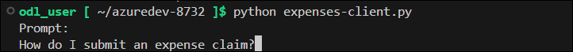

    The code uses our published agent to get a response, and displays it.

    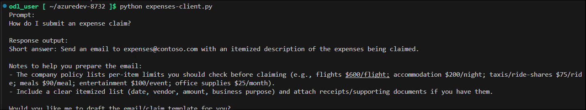

    >**Note:** It might take a few minutes to generate the response.
--->

## Summary

In this exercise, you explored how to deploy and interact with a generative AI model in Microsoft Foundry. You used the chat playground to test prompts, applied system instructions to shape model behavior, and reviewed sample code for integrating the model into applications. You then created an agent from the model, enhanced it with a knowledge tool, and published it to a dedicated endpoint.

### Congratulations, you’ve successfully completed the hands-on lab!
