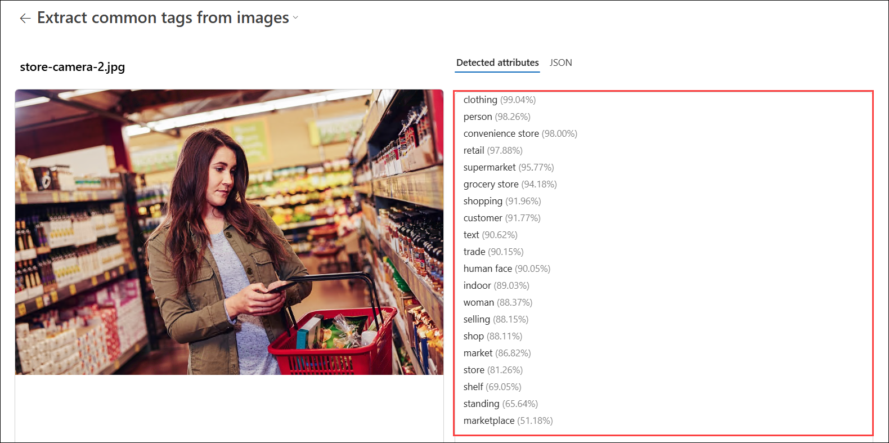
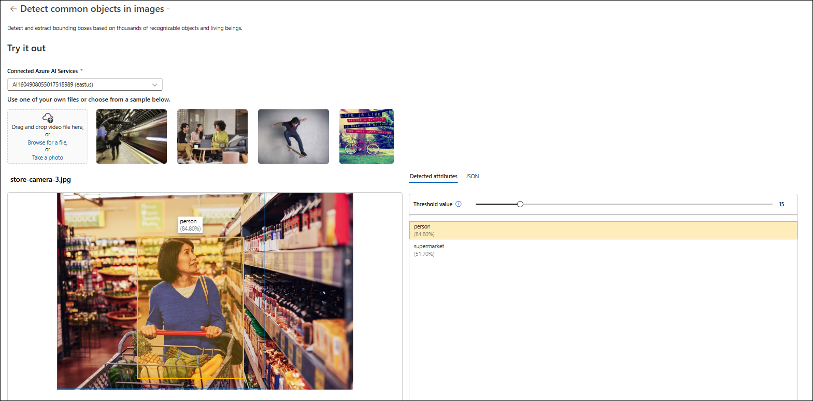

# Module 4a: Analyze images in the Azure AI Foundry portal

## Lab overview

**Azure AI Vision** includes numerous capabilities for understanding image content and context and extracting information from images. In this exercise, you will use Azure AI Vision in Azure AI Foundry portal, Microsoft's platform for creating intelligent applications, to analyze images using the built-in try-it-out experiences. 

Suppose the fictitious retailer *Northwind Traders* has decided to implement a "smart store", in which AI services monitor the store to identify customers requiring assistance, and direct employees to help them. By using Azure AI Vision, images taken by cameras throughout the store can be analyzed to provide meaningful descriptions of what they depict.

## Lab Objectives

In this lab, you will perform:
- Task 1: Create a project in the Azure AI Foundry portal
- Task 2: Generate captions for an image
- Task 3: Tagging images 
- Task 4: Object detection

## Task 1: Create a project in the Azure AI Foundry portal

In this task, we are setting up a project in Azure AI Foundry by creating and configuring an AI services environment for further experimentation.

1. In the browser, navigate to https://ai.azure.com/managementCenter/allResources. Then choose the option **Create new** to create a new AI hub resource.

     

1. Select **AI hub resource (1)** and the **Next (2)**.

    

1. In the Create a project wizard, 

   - Project name: Enter project name **Myproject<inject key="Deployment ID" enableCopy="false"></inject>**
   - Hub: Choose **Rename hub (2)**

        

1. Rename the hub as **Myhub-<inject key="Deployment ID" enableCopy="false"></inject> (1)** then **Next (2)** and then **Create (3)**.
   
    

1. Expand **Advanced options**.

    

1. Specify the following settings for your project:

   - Subscription: Your Azure subscription
   - Resource group: Select **AI-900-Module-03 (1)** Resource group
   - Region: **<inject key="location" enableCopy="false"/> (2)**
   - Click on **Create (3)**

        

1. Wait for your project and hub to be created.

1. When the project is created, you will be taken to an Overview page of the project details. Select **AI services (1)** on the left-hand menu (you may need to expand the menu by clicking on the top icon to read its contents).

1. On the AI Services page, select the **Vision + Document (2)** tile to try out Azure AI Vision and Document capabilities.

    

> **Congratulations** on completing the task! Now, it's time to validate it. Here are the steps:
 
- Hit the Validate button for the corresponding task. If you receive a success message, you can proceed to the next task. 
- If not, carefully read the error message and retry the step, following the instructions in the lab guide.
- If you need any assistance, please contact us at cloudlabs-support@spektrasystems.com. We are available 24/7 to help you out.

  <validation step="10cf8d2c-7678-441a-8ad5-7752773b3f33" />
  
## Task 2: Generate captions for an image

In this task, we are exploring Azure AI Vision's image captioning and dense captioning capabilities by uploading an image and observing how AI generates descriptive text for the entire image and specific objects within it.

Let's use the image captioning functionality of Azure AI Vision to analyze images taken by a camera in the *Northwind Traders* store. Image captions are available through the **Caption** and **Dense Captions** features.

1. On the **Vision + Document** page, scroll down and select **Image (1)** under View all other vision capabilities. Then select the **Image captioning (2)** tile.

     

1. Make sure AI service in connected.

     

1. Copy the highlighted link by right-clicking the [**https://aka.ms/mslearn-images-for-analysis**](https://aka.ms/mslearn-images-for-analysis) and selecting "Copy" from the context menu, and paste it into a new tab to download **image-analysis.zip**. 

1. Click the **download icon (1)** to view your downloads, then click the **folder icon (2)** to open the file location.

     

1. **Right-click** the **ZIP file (1)**  and select **Extract All (2)** to **unzip** its contents. 

     

1. Select the destination folder, ensure Show extracted files when complete is checked, and click **Extract** to unzip the files. 

     

1. The image-analysis folder contains **JPG files** named **store-camera-1**, **store-camera-2**, **store-camera-3**, and **store-camera-4**. 

     

1. Locate the file named **store-camera-1.jpg**; which contains the following image:

     

1. Go back to the Azure AI Foundry portal and upload the **store-camera-1.jpg** image by clicking **Browse for a file (1)**. Then, navigate to the **C:\Users\azureuser\Downloads\image-analysis (2)** folder, select **store-camera-1 (3)**, and click **Open (4)**.

     

1. Observe the generated caption text, visible in the **Detected attributes** panel to the right of the image.

     

     >**Note:** The **Caption** feature generates a **single** human-readable English sentence that describes the image's content.

1. Next, use the same image to perform **Dense captioning**. Return to the **Vision + Document** page by selecting the **back** arrow at the top of the page.

     

1. On the **Vision + Document** page, select the **Image (1)** tab, then select the **Dense captioning (2)** tile.

     

1. Upload the **store-camera-1.jpg** image by clicking **Browse for a file (1)**. Then, select **store-camera-1 (2)**, and click **Open (3)**.

     

1. The **Dense Captions** feature differs from the **Caption** capability in that it provides multiple human-readable captions for an image, one describing the image's content and others, each covering the essential objects detected in the picture. Each detected object includes a bounding box, which defines the pixel coordinates within the image associated with the object.

1. Hover over one of the captions in the **Detected** **attributes** list and observe what happens within the image.

     

1. Move your mouse cursor over the other captions in the list, and notice how the bounding box shifts in the image to highlight the portion of the image used to generate the caption.

     

## Task 3: Tagging images 

In this task, we are using Azure AI Vision's common tag extraction feature to analyze an image and generate a list of descriptive tags, including objects and actions, along with confidence scores.

The next feature you will try is the *Extract Tags* functionality. Extract tags are based on thousands of recognizable objects, including living beings, scenery, and actions.

1. Return to the **Vision + Document** page by selecting the **back** arrow at the top of the page. 

     

1. Select the **Image (1)** tab, and select the **Common tag extraction (2)** tile.

     

1. Open the folder containing the images you downloaded and locate the file named **store-camera-2.jpg**, which looks like this:

     

1. Upload the **store-camera-2.jpg** image by clicking **Browse for a file (1)**. Then, select **store-camera-2 (2)**, and click **Open (3)**.

     

1. Review the list of tags extracted from the image and the confidence score for each in the detected attributes panel. Here the confidence score is the likelihood that the text for the detected attribute describes what is actually in the image. Notice in the list of tags that it includes not only objects, but actions, such as **shopping**, **selling**, and **standing**.

     

## Task 4: Object detection

In this task, you use the **Object detection** feature of Image Analysis. Object detection detects and extracts bounding boxes based on thousands of recognizable objects and living beings.

1. Return to the **Vision + Document** page by selecting the **back** arrow at the top of the page. 

     

1. Select the **Image (1)** tab, and select the **Common object detection (2)** tile.

     

1. Open the folder containing the images you downloaded and locate the file named **store-camera-3.jpg**, which looks like this:

     

1. Upload the **store-camera-3.jpg** image by clicking **Browse for a file (1)**. Then, select **store-camera-3 (2)**, and click **Open (3)**.

     

1. In the **Detected attributes** box, observe the list of detected objects and their confidence scores.

     

1. Hover your mouse cursor over the objects in the **Detected attributes** list to highlight the object's bounding box in the image.

     

1. Move the **Threshold value** slider until a value of 70 is displayed to the right of the slider. Observe what happens to the objects in the list. The threshold slider specifies that only objects identified with a confidence score or probability greater than the threshold should be displayed.

     

### Review
In this exercise, you have completed the following tasks:
- Created a project in the Azure AI Foundry portal
- Generated captions for an image
- Tagged images 
- Detected Object 

## Learn more

To learn more about what you can do with this service, see the [Azure AI Vision page](https://learn.microsoft.com/azure/ai-services/computer-vision/overview).

## You have successfully completed this lab.
