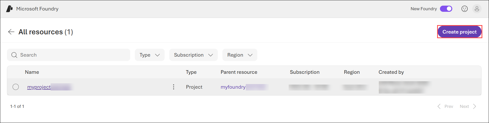
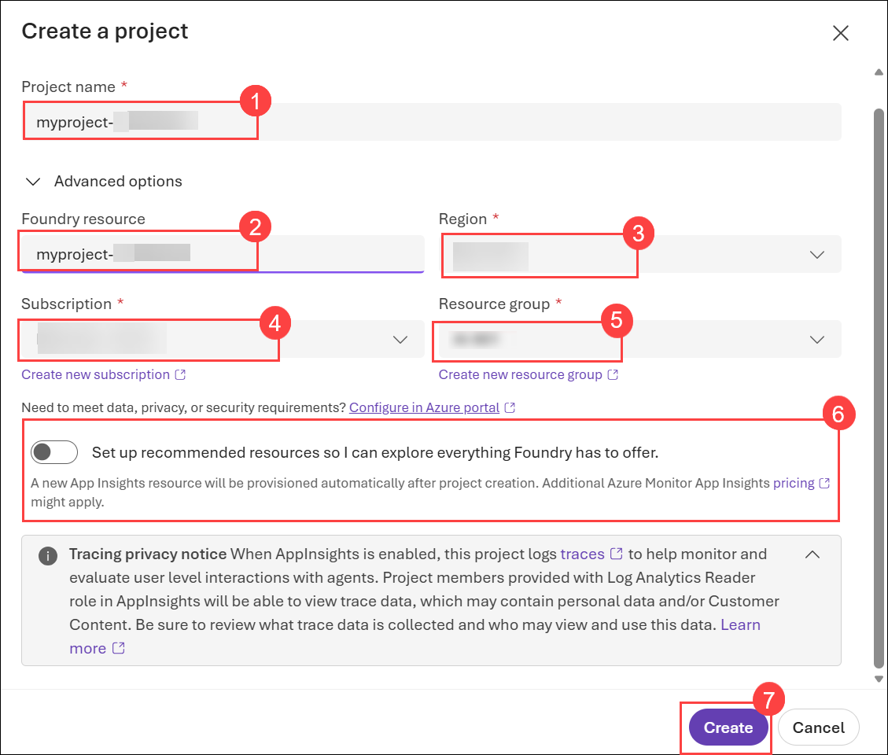
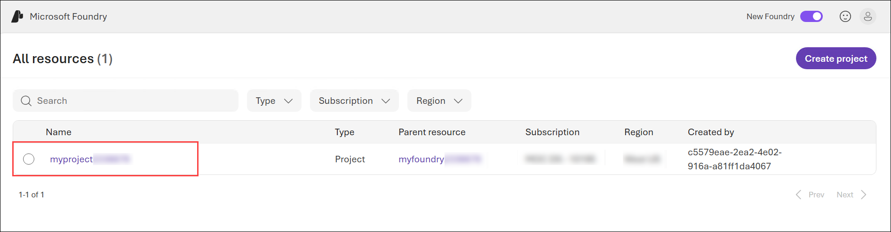
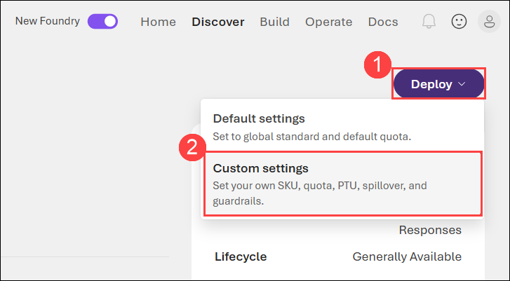
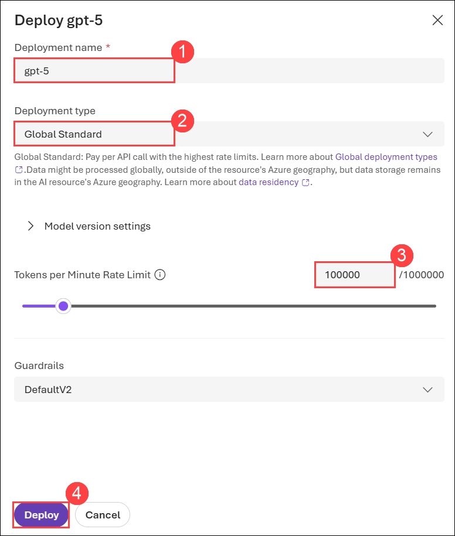

# Get started with text analysis in Microsoft Foundry

### Estimated Duration: 45 Minutes

## Lab Overview

In this lab, you will use a pre-configured Microsoft Foundry resource and project to explore text analysis using both general-purpose AI models and specialized Azure Language tools. You will deploy a generative AI model and use the chat playground to perform text summarization using natural language prompts. You will then use Azure Language analyzers in Microsoft Foundry to detect the language of text, identify personally identifiable information (PII), and review sample code for integrating these capabilities into your own applications. Through these hands-on activities, you will gain practical experience applying different approaches to natural language processing (NLP) using Microsoft Foundry.

## Lab Objectives

In this lab, you'll perform the following tasks:

- Task 1: Get started with Microsoft Foundry
- Task 2: Explore a general-purpose AI model's text analysis capabilities
- Task 3: Use a specialized language analysis tool

## Task 1: Get started with Microsoft Foundry

In this task, you'll sign in to the Microsoft Foundry portal, access a pre-configured Microsoft Foundry project, and familiarize yourself with the project workspace that will be used throughout the lab.

1. Copy the **Microsoft Foundry** link and paste it into a new browser tab to access the portal: `https://ai.azure.com/`

1. On the **Microsoft Foundry** home page, click on **Start building** in the top right corner.

   

1. If prompted to sign in, enter your credentials:
   - **Email/Username:** Enter <inject key="AzureAdUserEmail"></inject> **(1)** and click on **Next (2)**.

     

   - **Password:** Enter <inject key="AzureAdUserPassword"></inject> **(1)** and click on **Sign in (2)**.

     .png>)

1. If prompted to **Stay signed in?**, you can click **No**.

   

### Task 1.1: Create a Microsoft Foundry Project (READ ONLY)

> ### **Note:** <span style="color:maroon"> A Microsoft Foundry resource and project have already been created and configured for your lab environment. To optimize AI resource usage during the lab, additional Microsoft Foundry resources cannot be created. This is a **read-only** task provided for demonstration purposes and does not require any action. For the remainder of the lab, please use the pre-configured Microsoft Foundry resource and project that have been provisioned for your environment.
</span>

In this task, you'll learn how to create a Microsoft Foundry project by configuring the required Azure settings, including the Foundry resource, region, subscription, and resource group. This is a demonstration only and does not require any action during the lab.

1. On the **All resources** page, click on **Create Project**.

   

1. In the **Create a project** pane, enter a unique project name like **myproject-<inject key="DeploymentID" enableCopy="false" /> (1)** Verify that the **Foundry resource (2)** is automatically populated, set the **Region** to **<inject key="Location" enableCopy="false" /> (3)**, confirm that the default **Subscription (4)** is selected, and choose the appropriate **Resource group (5)**. Ensure that the **Set up recommended resources so I can explore everything Foundry has to offer** option is **disabled (6)**, and then select **Create (7)**.

   

1. In the **Your project is set up. What would you like to do next ?** pop-up, click **X** button to dismiss the window.

   

1. After creating a project in the new **Foundry** portal, it should open in a page similar to the following image:

   

### Task 1.2: Open the Pre-configured Microsoft Foundry Project

In this task, you'll access the pre-configured Microsoft Foundry project, dismiss the welcome prompt, and explore the project workspace that will be used for the remainder of the lab.

1. From the **All resources** page select the project named **myproject<inject key="DeploymentID"></inject>** that has been already been created for you to open it. You will use this project throughout the remainder of the lab.

   

1. In the **Your project is set up. What would you like to do next ?** pop-up, click **X** button to dismiss the window.

   

1. After selecting the project in the **Foundry** portal, it should open in a page similar to the following image:

   

## Task 2: Explore a general-purpose AI model's text analysis capabilities

In this task, you'll deploy a GPT model from the Microsoft Foundry model catalog and use the chat playground to summarize text using natural language prompts.

1. From the Home page of the Microsoft Foundry portal, select **Find models** to access the Microsoft Foundry model catalog.

   

   > **Note:** You can also access the models from the **Microsoft Foundry** home page by selecting **Discover (1)** and then click on **Model (2)** to view the Microsoft Foundry model catalog.

   .png>)

2. In the **Models** page, enter `gpt-5` **(1)** in the search bar, then select the **gpt-5** **(2)** model from the results to open its details page and review its features and capabilities.

   

3. Select **Deploy (1)**, then click **Custom settings (2)** instead.

   

   > **Note:** If the **Default settings** option is not available when deploying the model, click **Custom deploy (1)** instead.
   >
   > -p2t1p1.png>)

4. On the **Deploy gpt-5** pane:

   - Rename the Deployment name to **gpt-5 (1)**
   - Deployment type: **Global Standard (2)**
   - Set token limit to **100000** **(3)**
   - Click on **Deploy (4)**

      

      > **Note:** Ensure that the model deployment name exactly matches. If the deployment name is incorrect or does not match the lab instructions, the validation will fail.

5. Wait for the deployment to complete. After the deployment is complete, you are taken to a chat playground, where you can test out the model's capabilities.

    

### Task 2.1: Summarize text

A common requirement in text processing is to _summarize_ a large body of text to distill it to its most salient points.

For example, suppose you've found an old article from a computer trade magazine, that includes a review of a home computer that was launched in the 1980s. Rather than reading the whole artice, you might want to generate a summary that highlights the key positives and negatives the reviewer found; and the overall conclusion.

1. In the chat playground page, use the button at the bottom of the left navigation pane to hide it and give yourself more room to work with.

    -p2t1p3.png>)

1. In the pane on the left, change the default **Instructions** to:

    ```
    You are an AI assistant that analyzes and summarizes text.
    ```

    -p2t1p4.png>)

1. Enter the following prompt:

    ```
    Summarize this review as a single short paragraph:
    Commodore 64: A Strong Contender in the Home Computer Market
    Commodore's long-awaited Commodore 64 has finally arrived on dealers' shelves, and first impressions suggest that the company may have another substantial success on its hands. Priced aggressively and boasting a full 64K of RAM, the machine offers specifications that would have seemed remarkable in a home computer only a short time ago. Its colourful graphics and impressive sound capabilities place it among the most capable entertainment-oriented systems currently available.
    Particularly noteworthy is the SID sound generator, which produces effects and musical output far beyond what users have come to expect from machines in this price bracket. Software houses are already expressing strong interest in the platform, and the combination of advanced graphics and sound should make the Commodore 64 an attractive proposition for both game developers and serious hobbyists alike.
    The machine is not without its shortcomings, however. The keyboard, while serviceable, lacks the solid feel of some competing systems, and Commodore's documentation will do little to reassure newcomers to computing. Furthermore, prospective purchasers may wish to consider the total cost of ownership, as disk drives and other peripherals remain relatively expensive. Nevertheless, the Commodore 64 enters the market as one of the most compelling home computers currently available and is likely to be a significant force in the months ahead.
    ```

    The model should generate a summary of the review.

    -p2t1p5.png>)

    Large language models (LLMs) are built on machine learning techniques that have their origins in natural language processing and text analysis, so they're good at summarizing text, extracting named entities (such as people and place names), and classifying documents based on sentiment, topic, style, and other factors.

> **Congratulations** on completing the task! Now, it's time to validate it. Here are the steps:

- Hit the Validate button for the corresponding task. You will receive a success message.
- If not, carefully read the error message and retry the step, following the instructions in the lab guide.
- If you need any assistance, please contact us at cloudlabs-support@spektrasystems.com. We are available 24/7 to help you out.

  <validation step="2d5afc6e-926e-49a0-97ff-cf90e3d3275e" />

## Task 3: Use a specialized language analysis tool

In this task, you'll use Azure Language analyzers in Microsoft Foundry to detect the language of text, identify personally identifiable information (PII), and review sample code for integrating these capabilities into your own applications.

1. In the Foundry portal, navigate to the menu at the top of the screen and select **Build (1)**. Navigate to the menu on the left-side of the screen (you may need to expand it). In the menu, select the **Services (2)** page.

     -p2t1p6.png>)

     > **Note:** In some cases, you may see a slightly different interface in which the list of AI services can be found by selecting the Deployments page, and viewing its AI Services tab.

1. Microsoft Foundry Tools includes multiple AI Services (formerly known as Microsoft Cognitive Services) that support common speech, translation, language, and content understanding workloads.

1. Note the available services; which include Azure Language services for language detection and PII redaction.

### Task 3.1: Detect language

In this task, you’ll determine the primary language of input text using the Azure Language detection analyzer.

In scenarios where text could potentially be in one of multiple languages, the first step in an analysis workflow is often to determine the primary language so the text can be routed to the most appropriate model or agent for the subsequent processing.

1. From the list of AI services, select the **Azure Language - Language detection** analyzer.

    -p2t1p7.png>)

2. In the **Input text** list, select one of the provided sample documents **(1)**. Then use the **Detect (2)** button to detect the language in which the sample is written.

     -p2t1p8.png>)

3. After reviewing the detected language details, click on the **Edit** button icon to make the input text editable again. Now you can:

     - Select another sample.
     - Type your own text.
     - Upload a text file.

        -p2t1p9.png)

     For example, suppose you encounter a vintage computer, and you're curious about its history. You find a label that contains the following text on the computer casing. Enter the text and detect the language it is written in:

     ```
     CPC 464
     Art.-Nr.: 31020
     Serien-Nr.: 464-87-041256
     220–240 V ~ 50 Hz
     40 W
     Hergestellt in Korea
     SCHNEIDER RUNDFUNKWERKE AG
     Türkheim/Unterallgäu
     Bundesrepublik Deutschland
     ```

     -p2t1p10.png>)

     > **Note:** If you want to investigate further, Foundry Tools includes a **Text Translator** service in the AI Services page; which you could use to translate the text.

### Task 3.2: Identify PII in text

To comply with privacy policies and laws, organizations often need to detect and redact **personally identifiable information (PII)** such as names, addresses, phone numbers, email addresses, and other personal details.

1. On the language detection playground page, in the **Type (1)** drop-down list, select **Text PII Redaction (2)** (or return to the list of AI services and select **Azure Language - Text PII Redaction**).

     -p2t1p11.png>)

2. In the **Input text (1)** list, select one of the provided sample documents. Then use the **Detect (2)** button to detect PII values in the text.

     -p2t1p12.png>)

3. After reviewing the detected PII details, use the **Edit** button to make the input text editable again. Now you can:
     - Select another sample.
     - Type your own text.
     - Upload a text file.

       -p2t1p13.png>)

     For example, suppose you find the following invoice in the box of a vintage computer you have purchased:

     ```
     Tailspin Toys Ltd
     Invoice
     14 September 1984
     Customer:
         Margaret Ellis
         128 High Street, Reading, Berkshire RG1 2AB
         Telephone: 021 685 4215
     Item: ZX Spectrum 48K home computer (includes power supply, RF lead, and user manual)
     Price: £79.00
     Payment received:  £79.00
     ```

     Enter this text and determine what personally identifiable information it contains.

     -p2t1p14.png>)

4. Experiment with input of your own. Azure Language can recognize an extensive list of PII. You can see the full list [here](https://learn.microsoft.com/azure/ai-services/language-service/personally-identifiable-information/concepts/entity-categories-list). A few of those entities include:
     - People names
     - Email addresses
     - Phone numbers
     - Street addresses

### Task 3.3: Review the sample code

Foundry provides sample code for some Azure Language capabilities. You can use the sample code to begin creating your own client application.

1. Select the **Code** tab on the right to view sample code for PII identification, which should be similar to this:

      ```python
      key = "<your-api-key>"
      endpoint = "https://ai-resrce.cognitiveservices.azure.com/"

      from azure.ai.textanalytics import TextAnalyticsClient
      from azure.core.credentials import AzureKeyCredential

      # Authenticate the client using your key and endpoint
      def authenticate_client():
         ta_credential = AzureKeyCredential(key)
         text_analytics_client = TextAnalyticsClient(
               endpoint=endpoint,
               credential=ta_credential)
         return text_analytics_client

      client = authenticate_client()

      # Example method for detecting sensitive information (PII) from text
      def pii_recognition_example(client):
         documents = [
            "$documents"
         ]
         response = client.recognize_pii_entities(documents, language="en")
         result = [doc for doc in response if not doc.is_error]
         for doc in result:
            print("Redacted Text: {}".format(doc.redacted_text))
            for entity in doc.entities:
               print("Entity: {}".format(entity.text))
               print(" Category: {}".format(entity.category))
               print(" Confidence Score: {}".format(entity.confidence_score))
               print(" Offset: {}".format(entity.offset))
               print(" Length: {}".format(entity.length))
      pii_recognition_example(client)
      ```

      -p2t1p15.png>)

      > **Note:** You can copy the code and run it in your preferred Python development environment - for example Visual Studio Code. You will need to create environment variables for your Azure Language endpoint and key; which you can find in the code sample window.

## Summary

In this lab, you used a pre-configured Microsoft Foundry resource and project to explore text analysis using both generative AI models and specialized Azure Language services. You deployed a GPT model and used the chat playground to summarize text using natural language prompts. You then used Azure Language analyzers to detect the language of text and identify personally identifiable information (PII), and reviewed sample code for integrating these capabilities into your own applications. Through these exercises, you gained hands-on experience using Microsoft Foundry to combine the flexibility of generative AI with purpose-built language services for a variety of natural language processing (NLP) scenarios.

### Congratulations, you’ve successfully completed the hands-on lab!
