# Get started with text analysis in Microsoft Foundry

### Estimated Duration: 45 Minutes

## Lab Overview

In this lab, you will use Microsoft Foundry to explore text analysis using both general-purpose AI models and specialized Azure Language tools. You’ll create a project in the Foundry portal, deploy a generative AI model, and use the chat playground to perform tasks such as sentiment analysis, named entity recognition, and text summarization. You will then use Azure Language analyzers to detect language and identify personally identifiable information (PII) in text. Through these hands-on activities, you’ll gain practical experience in applying different approaches to natural language processing (NLP) in real-world AI scenarios.

## Lab Objectives

In this lab, you'll perform the following tasks:

- Task 1: Create a project in Microsoft Foundry
- Task 2: Explore a general-purpose AI model's text analysis capabilities 
- Task 3: Use a specialized language analysis tool

## Task 1: Create a project in Microsoft Foundry

In this task, you’ll create and configure a new project in the Microsoft Foundry portal, setting up the environment required to build and test AI solutions.

1. Copy the **Microsoft Foundry** link and paste it into a new browser tab to access the portal: `https://ai.azure.com?azure-portal=true`

1. On the **Microsoft Foundry** home page, click on **Sign in** in the top right corner.

   

1. If prompted to sign in, enter your credentials:
 
   - **Email/Username:** <inject key="AzureAdUserEmail"></inject> **(1)** and click on **Next (2)**.
 
      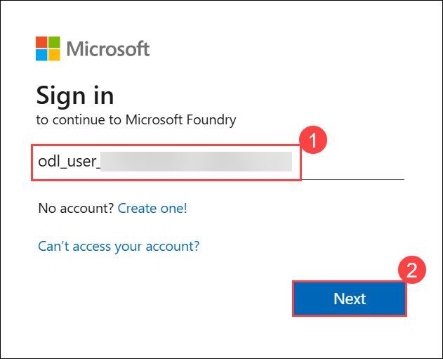
 
   - **Password:** <inject key="AzureAdUserPassword"></inject> **(1)** and click on **Sign in (2)**.
 
     .png)

1. If prompted to **Stay signed in?**, you can click **No**.

   

   > **Note:** Close any tips or quick start panes that are opened the first time you sign in, and if necessary use the **Foundry** logo at the top left to navigate to the home page.

1. At the top of the **Microsoft Foundry** portal, enable the **New Foundry** **(1)** toggle to switch to the latest Foundry user interface.

1. From the **Select a project to continue** dialog, click the drop-down under **Select or search for a project**, and then select **Create a new project (2)**.

    

1. In the **Create a project** wizard, enter project name **Myproject<inject key="DeploymentID" enableCopy="false" /> (1)**, and **Expand Advanced options (2)** to specify the following settings for your project: 

    - Subscription : **Leave default subscription (3)** 
    - Resource Group : Select **AI-901 (4)** 
    - Microsoft Foundry resource: **MyFoundry<inject key="DeploymentID" enableCopy="false" /> (5)**
    - Region : Select **<inject key="location" enableCopy="false"/> (6)**
    - Click on **Create** **(7)**

      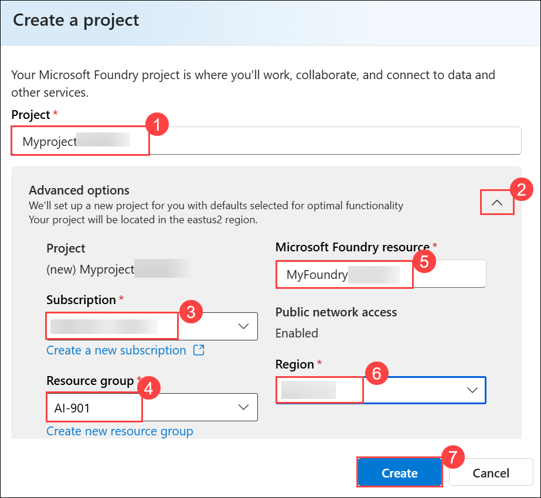
      
      >**Note:** Model deployments are restricted by regional quotas. If you select a region in which you have insufficient available quota, you may need to select an alternative region for a new resource later.

1. Wait for your project created. It may take a few minutes. 

1. In the **Welcome to new Microsoft Foundry** window, click the **X** icon in the top-right corner to close the welcome screen.

    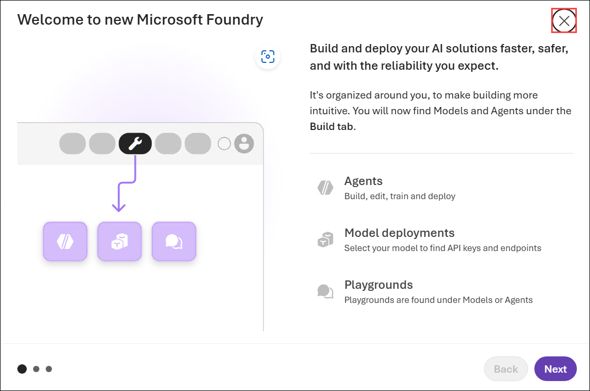

1. Once the setup is complete, you are automatically redirected to the **Microsoft Foundry home page** for the newly created project.

   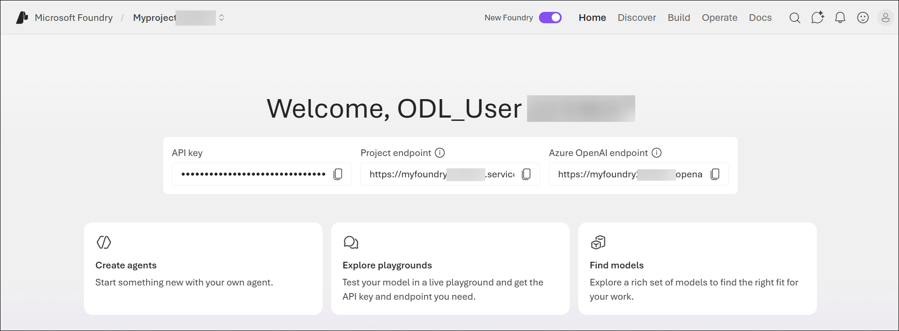

   >**Note:** Close any quick start panes in order to access your project's Foundry home page.


## Task 2: Explore a general-purpose AI model's text analysis capabilities 

In this task, you’ll deploy a general-purpose AI model and use the chat playground to perform text analysis tasks through natural language prompts.

1. From the Home page of the Microsoft Foundry portal, select **Find models** to access the Microsoft Foundry model catalog.

    

2. In the **Models** page, enter `gpt-5` **(1)** in the search bar, then select the **gpt-5** **(2)** model from the results to open its details page and review its features and capabilities.

    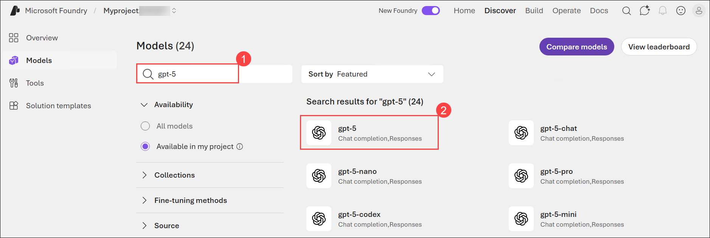

3. On the model details page, select **Deploy (1)**, then choose **Default settings (2)** to deploy the model with the standard configuration.

    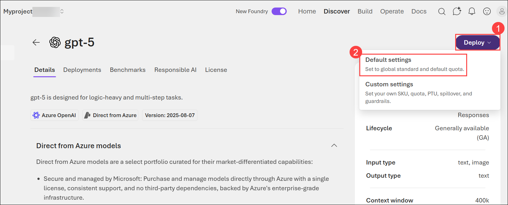

1. Wait for the deployment to complete. After the deployment is complete, you are taken to a chat playground, where you can test out the model's capabilities.

    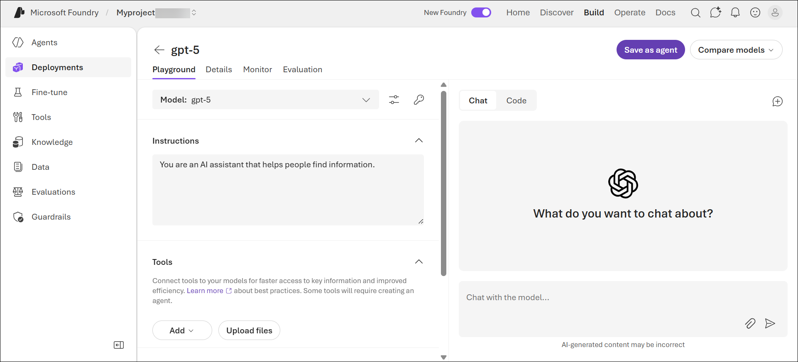

### Task 2.1: Analyze sentiment

In this task, you’ll use a generative AI model to analyze text and determine whether its sentiment is positive, neutral, or negative.

**Sentiment analysis** is a common *natural language processing* (NLP) task. It's used to determine whether text conveys a positive, neutral or negative sentiment; which makes it useful for categorizing reviews, social media posts, and other subjective documents.

1. In the chat playground, enter the following prompt **(1)** and then select **Send (2)**:

    ```
    Analyze the following review, and determine whether the sentiment is positive, neutral, or negative:
    ---
    I spent several nights at the Riverside Heights Hotel during a fall trip, and the experience was outstanding from start to finish. The welcome at arrival was warm and attentive, and the staff consistently went out of their way to be helpful. The overall atmosphere made my stay smooth and relaxing, and the location was extremely convenient for getting around the city. I left with a very positive impression and would confidently recommend this hotel to others looking for a pleasant and stress‑free stay.
    ---
    ```

    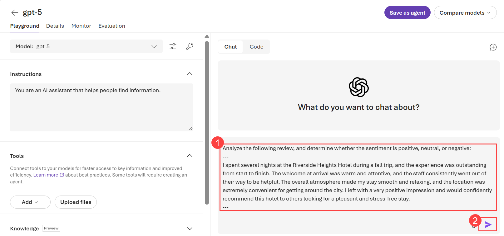

1. Review the response, which should include an analysis of the text's sentiment.

    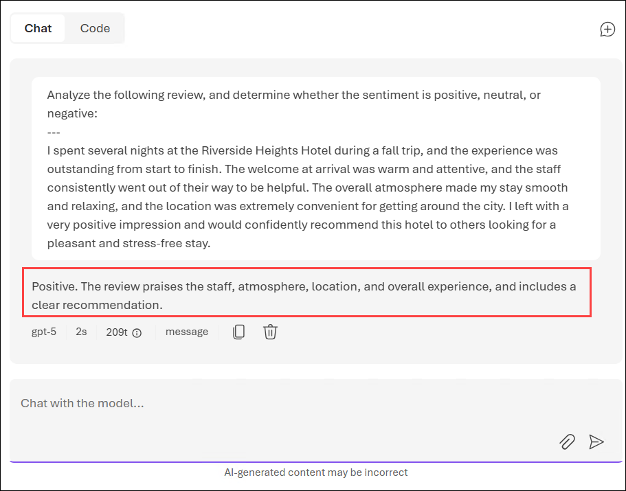

1. Enter the following prompt to analyze a different review:

    ```
    What about this one?
    ---
    I was disappointed with my visit to the Harbor View Inn earlier this year. The front desk process took much longer than expected, and staff responses to questions felt rushed and unhelpful. The room had ongoing maintenance issues, inconsistent internet access, and noticeable noise from the hallway throughout the night. Overall, the experience fell short of expectations, and I would not choose to stay there again.        
    ---
    ```

    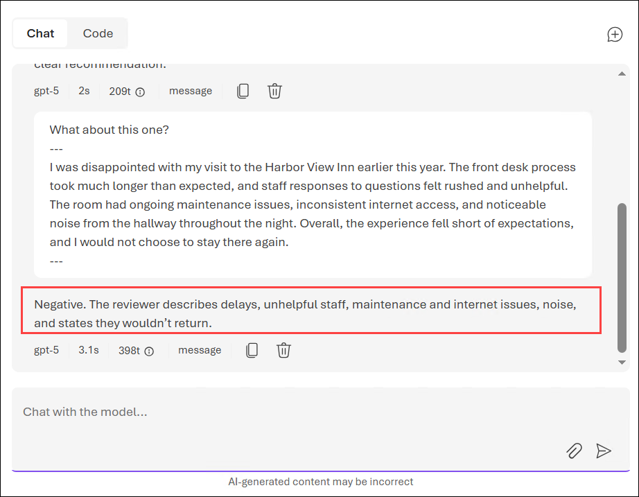

1. You can experiment further by creating your own prompts. 

### Task 2.2: Extract named entities

In this task, you’ll identify and extract named entities such as people, locations, and other key elements from text using a generative AI model.

**Named entities** are the people, places, dates, and other important items mentioned in text.

1. At the top of the chat pane, use the **New chat** (&#128172;) button to restart the conversation. This removes all conversation history.

    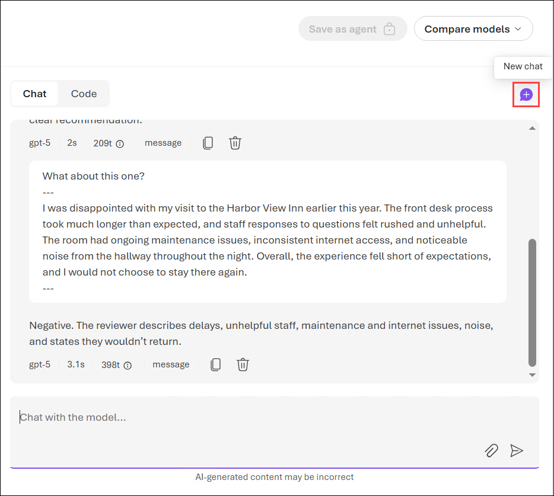

2. Enter the following prompt, and review the results:

    ```
    List the named entities mentioned in this text:
    ---
    Welcome to the Global Innovation Workshop!
    We’re excited to host sessions in London, Toronto, Chicago, and Austin this spring.
    Visit our event page for specific dates, venues, and city details.
    ---
    ```

    The model should identify the specific places mentioned in the text.

    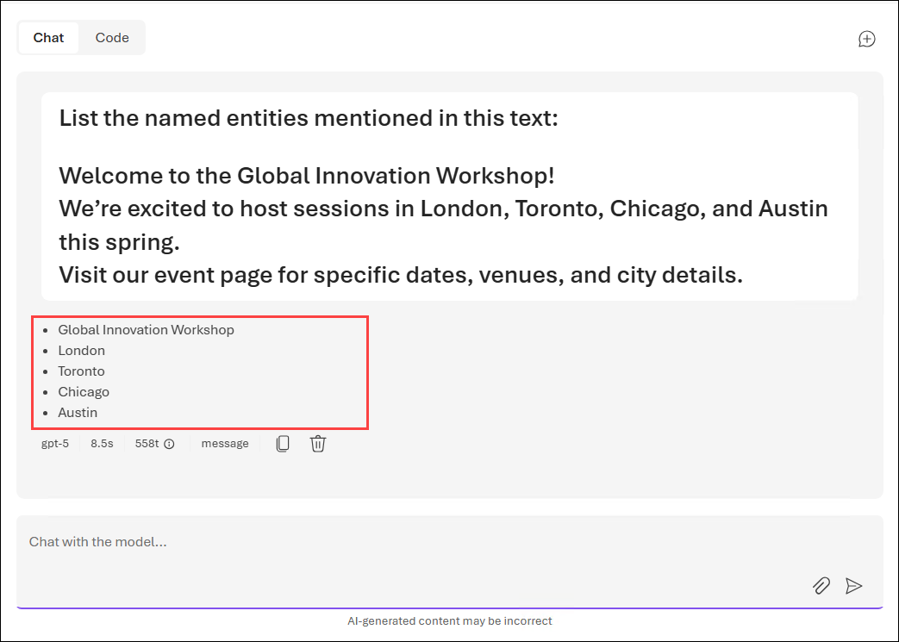

### Task 2.3: Summarize text

In this task, you’ll generate concise summaries of longer text passages using a generative AI model.

**Summarization** is a way to distill the main points in a document into a shorter amount of text.

1. At the top of the chat pane, use the **New chat** (&#128172;) button to restart the conversation. This removes all conversation history.

1. Enter the following prompt, and review the results:

    ```
    Summarize the following meeting transcript in a single paragraph
    ---
    Jordan Lee: “We should pick a retreat location that’s convenient for most people—Chicago and Nashville came to mind first.”
    Anika Sharma: “Chicago is central, but the venue costs there can add up quickly.”
    Carlos Ramirez: “I looked into a few alternatives, and Phoenix seems much easier when it comes to flights and space.”
    Jordan Lee: “That makes sense—Phoenix does offer more flexibility than Chicago or Portland.”
    Anika Sharma: “Portland would be enjoyable, but from a planning standpoint, Phoenix is simpler.”
    Carlos Ramirez: “Exactly. It scales better and avoids some of the pricing issues.”
    Jordan Lee: “So it sounds like Phoenix is our strongest option overall.”
    Anika Sharma: “Yes, I’m comfortable choosing Phoenix over the other cities.”
    Carlos Ramirez: “Agreed—let’s move forward with Phoenix for the retreat.”
    ```

    The model should generate a summary of the text.

    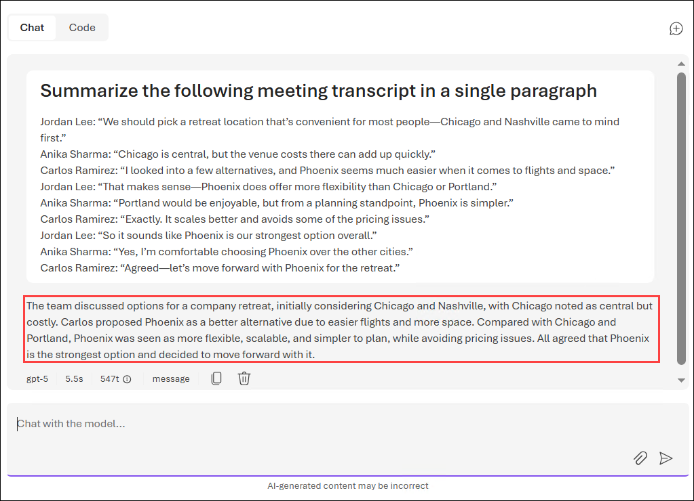


## Task 3: Use a specialized language analysis tool

In this task, you’ll explore Azure Language tools in Microsoft Foundry to perform structured and deterministic text analysis using purpose-built analyzers.

While a language model that's trained for general generative AI workloads can often do a great job of text analysis, sometimes a more specialized tool can be used by an agent to get more predictable results.

The **Azure Language in Foundry Tools** provides purpose-built analyzers that use statistical techniques to return structured, deterministic results - ideal for consistent output in automated pipelines.

1. In the Foundry portal, navigate to the menu at the top of the screen and select **Build**.

    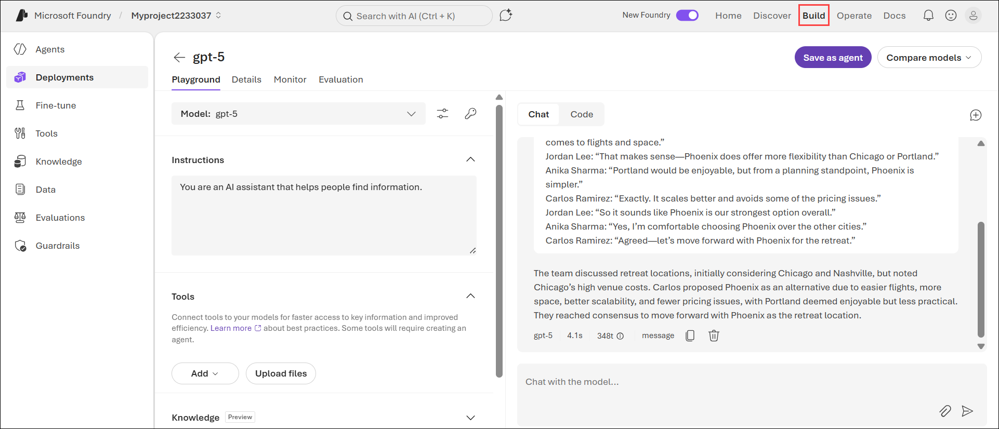

2. On the **Build** page, navigate to the menu on the left-side of the screen (you may need to expand it by clicking on the expand icon at the bottom of the menu). From the left-side menu, select **Deployments (1)**. Then, at the top of the **Models** page, select **AI Services (2)**. 

    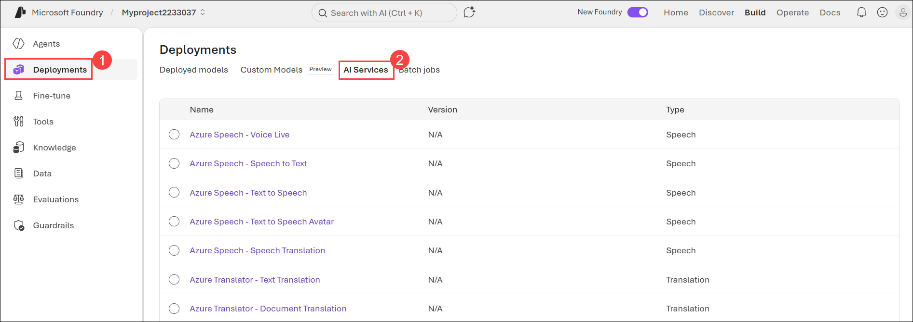

### Task 3.1: Detect language

In this task, you’ll determine the primary language of input text using the Azure Language detection analyzer.

In scenarios where text could potentially be in one of multiple languages, the first step in an analysis workflow is often to determine the primary language so the text can be routed to the most appropriate model or agent for the subsequent processing.

1. From the list of AI services, select the **Azure Language - Language detection** analyzer.

    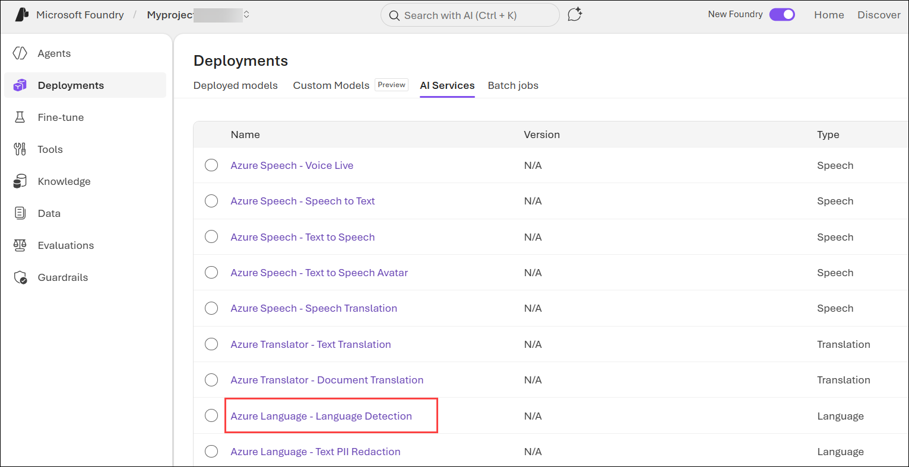

2. In the **Input text** list, select one of the provided sample documents **(1)**. Then use the **Detect (2)** button to detect the language in which the sample is written.

    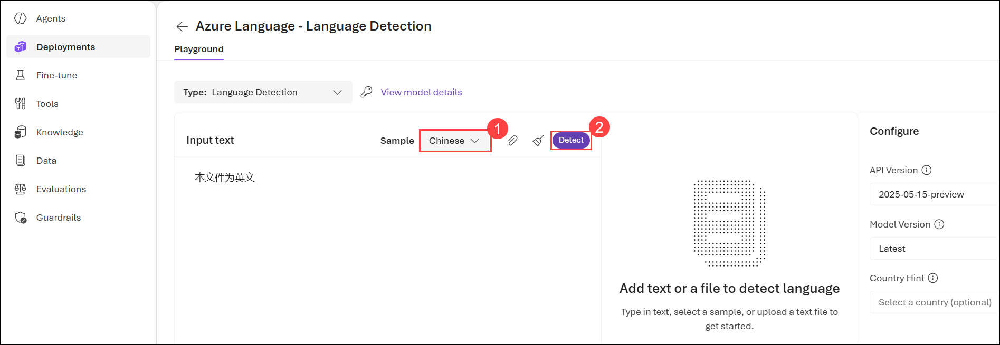

3. After reviewing the detected language details, click on the **Edit** button icon to make the input text editable again. Now you can:
    
    - Select another sample.
    - Type your own text.
    - Upload a text file.

        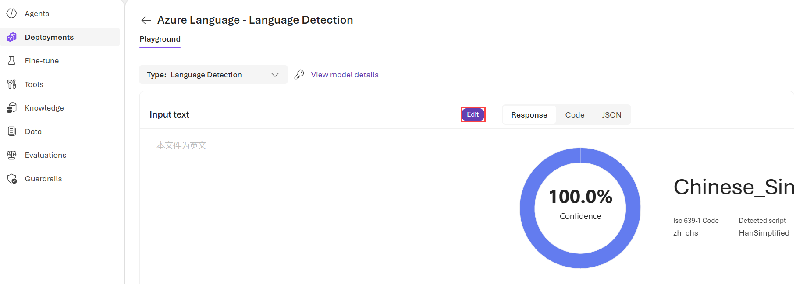

1. For example, enter the following input text and detect the language it is written in:

    ```
    ¡Hola! Me llamo Josefina y vivo en Madrid, España. Soy doctora en un hospital, ¡lo que me mantiene muy ocupada!
    ```

    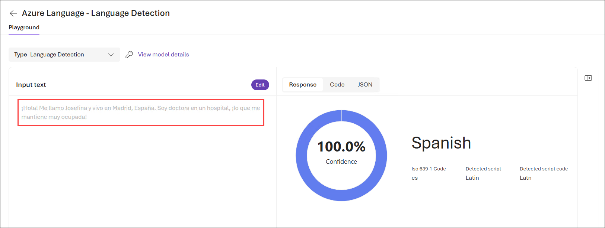

4. Experiment with input of your own. 

    > **Tip**: You can use the [Bing Translator](https://www.bing.com/translator){:target="_blank"} at `https://www.bing.com/translator` to generate text in languages you don't speak!

5. Return to the list of AI services when you are done experimenting. You can click on the back button **(1)** at the top of the playground screen.

    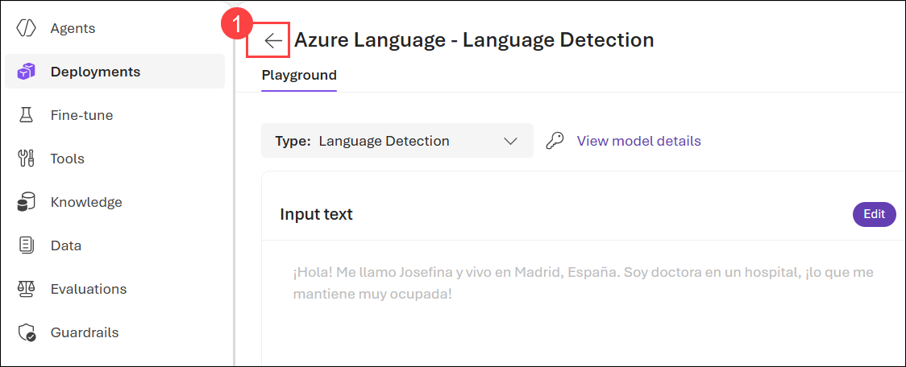

### Task 3.2: Identify PII in text

In this task, you’ll detect and extract personally identifiable information (PII) such as names, phone numbers, and addresses from text.

To comply with privacy policies and laws, organizations often need to detect and redact **personally identifiable information (PII)** such as names, addresses, phone numbers, email addresses, and other personal details.

1. In the list of AI services, select the **Azure Language - Text PII extraction** analyzer.

    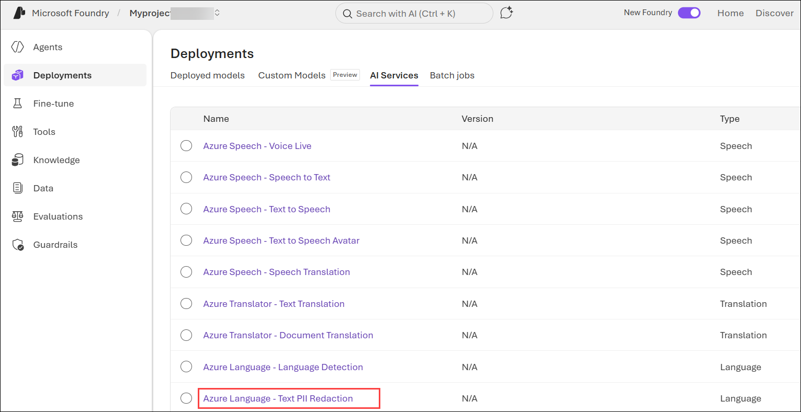

2. In the **Input text** list, select one of the provided sample documents **(1)**. Then use the **Detect (2)** button to detect PII values in the text.

    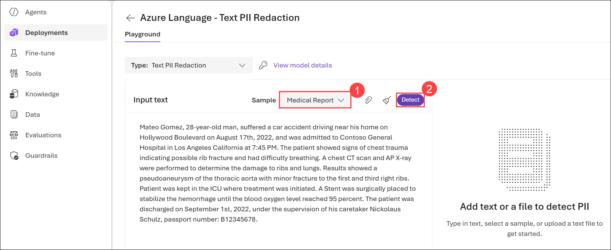

    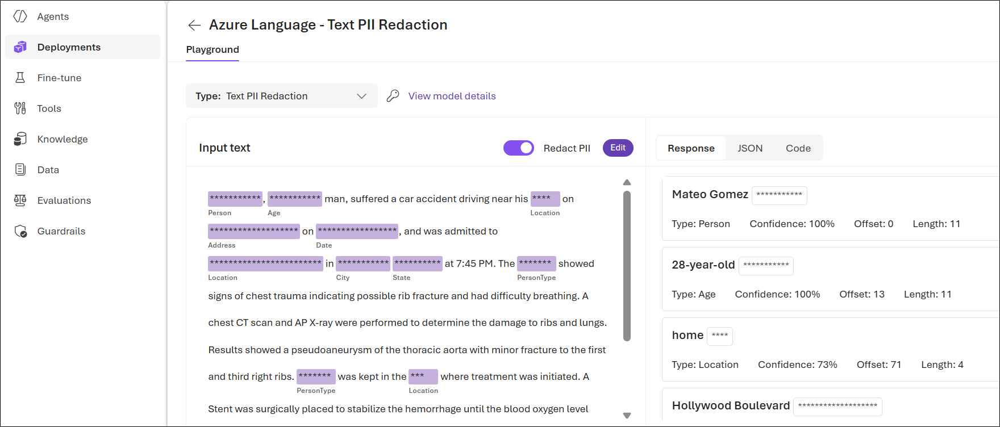

3. After reviewing the detected PII details, click on the **Edit** button to make the input text editable again. Now you can:

    - Select another sample.
    - Type your own text.
    - Upload a text file.

1. For example, enter the following input text and detect any PII it contains:

    ```
    Maria Garcia called from 020 7946 0958 and asked to send documents to 42 Market Road, London, UK, SW1A 1AA.
    ```

    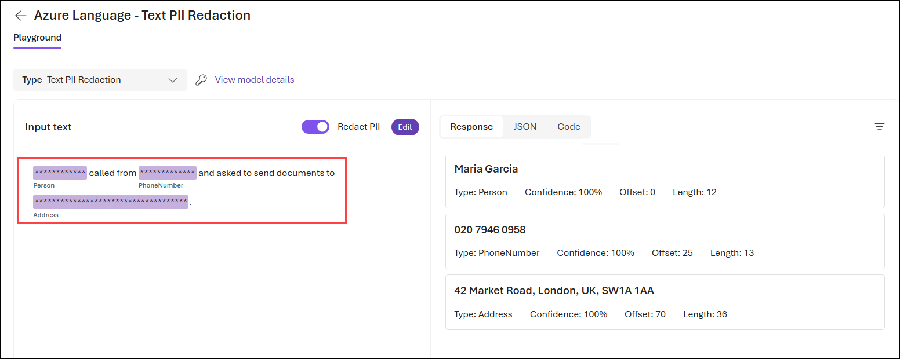

4. Experiment with input of your own. 

    >**Note:** Azure Language can recognize an extensive list of PII. You can see the full list [here](https://learn.microsoft.com/azure/ai-services/language-service/personally-identifiable-information/concepts/entity-categories-list). A few of those entities include: 
    >
    >- People names
    >- Email addresses
    >- Phone numbers
    >- Street addresses

### Task 3.3: Review the sample code

In this task, you’ll examine sample code for Azure Language capabilities to understand how to integrate text analysis features into your own applications.

Foundry provides sample code for some Azure Language capabilities. You can use the sample code to begin creating your own client application. 

1. Select the **Code** tab on the right to view sample code for PII identification. 

    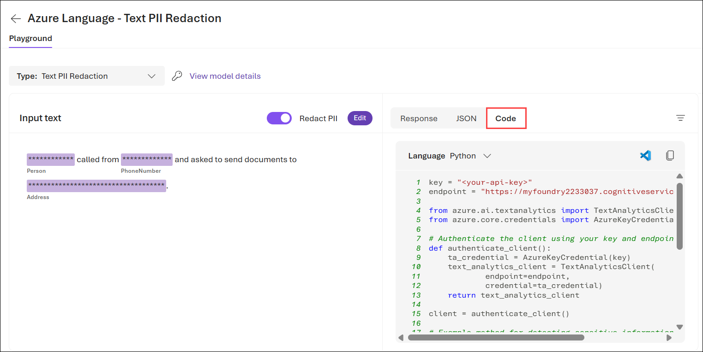

    >**Note:** Below is the same sample code in Python for your reference. You can copy the code and run it in your preferred Python development environment - for example Visual Studio Code. You will need to create environment variables for your Azure Language endpoint and key; which you can find in the code sample window.

    ```python
    key = "paste-your-key-here"
    endpoint = "paste-your-endpoint-here"

    from azure.ai.textanalytics import TextAnalyticsClient
    from azure.core.credentials import AzureKeyCredential

    # Authenticate the client using your key and endpoint 
    def authenticate_client():
        ta_credential = AzureKeyCredential(key)
        text_analytics_client = TextAnalyticsClient(
            endpoint=endpoint, 
            credential=ta_credential
        )
        return text_analytics_client

    client = authenticate_client()

    # Example method for detecting sensitive information (PII) from text 
    def pii_recognition_example(client):
        documents = [
            "$documents"
        ]
        
        response = client.recognize_pii_entities(documents, language="en")
        result = [doc for doc in response if not doc.is_error]
        
        for doc in result:
            print("Redacted Text: {}".format(doc.redacted_text))
            
            for entity in doc.entities:
                print("Entity: {}".format(entity.text))
                print("\tCategory: {}".format(entity.category))
                print("\tConfidence Score: {}".format(entity.confidence_score))
                print("\tOffset: {}".format(entity.offset))
                print("\tLength: {}".format(entity.length))

    pii_recognition_example(client)
    ```

## Summary

In this exercise, you explored how to use Microsoft Foundry to perform text analysis using both generative AI models and specialized language tools. You deployed a general-purpose model and used it in the chat playground to analyze sentiment, extract entities, and summarize text. You then used Azure Language analyzers to detect language and identify PII, gaining experience with structured and deterministic text analysis techniques.

### Congratulations, you’ve successfully completed the hands-on lab!