# Module 04: Detect faces in Vision Studio

## Lab overview

Vision solutions often require AI to be able to detect human faces. Suppose the fictitious retail company Northwind Traders wants to locate where customers are standing in a store to best assist them. One way to accomplish this is to determine if there are any faces in the images, and if so, to return the bounding box coordinates that show their location.

To test the face detection capabilities of the Azure AI Face service, you will use [Azure Vision Studio](https://portal.vision.cognitive.azure.com/). This is a UI-based platform that lets you explore Azure AI Vision features without needing to write any code.

## Lab objectives
In this lab, you will perform:
-  Task 1: Create an Azure AI services resource
-  Task 2: Connect Azure AI Service Resource to Vision Studio
-  Task 3: Detect faces in the Vision Studio

## Estimated timing: 30 minutes

## Architecture Diagram

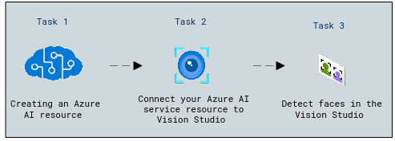

### Task 1: Create an Azure AI services resource

In this task, you will learn how to create an **Azure AI Services** resource to access various AI capabilities for your applications.

You can use Azure AI Face service with an **Azure AI services** multi-service resource. If you haven't already done so, create an **Azure AI services** resource in your Azure subscription.

1. In the Azure portal,  search for **Azure AI services (1)**. Select an **Azure AI services multi-service account(2)**.

    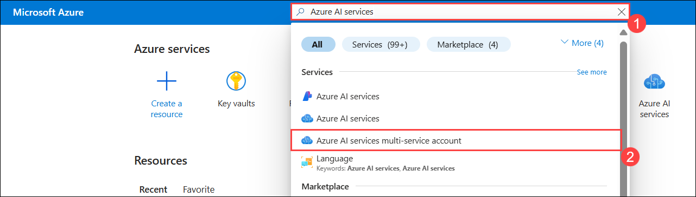

1. You will be taken to a page to create an Azure AI services resource. please click on **+ Create** Configure it with the following settings:
   
    - **Subscription (1)**: Use the existing Azure subscription.
    - **Resource group (2)**: **AI-900-Module-04-<inject key="DeploymentID" enableCopy="false" />**
    - **Region (3)**: Select **<inject key="location" enableCopy="false"/>**
    - **Name (4)**: Enter **detectvision<inject key="DeploymentID" enableCopy="false"/>**
    - **Pricing tier (5)**:Select **Standard S0**.
    - **By checking this box I acknowledge that I have read and understood all the terms below (6)**: *Selected*.
    - Click **Review + create (7)** 

      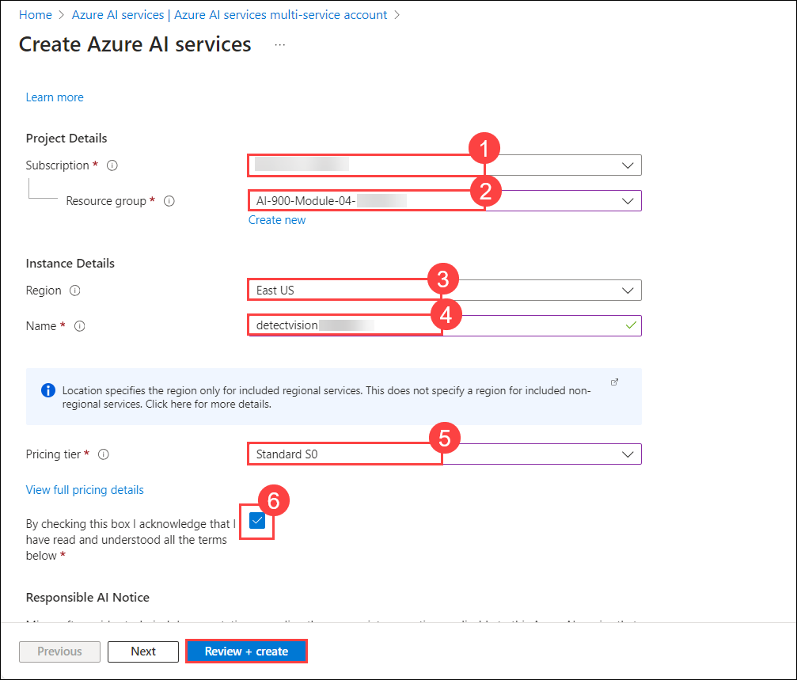

1. On the Review + create tab, select **Create** and wait for deployment to complete.
 
     
  
### Task 2: Connect your Azure AI service resource to Vision Studio

In this task, you will learn how to connect your **Azure AI Services** resource to Vision Studio to enable AI-powered image analysis.

1. Open a new browser tab and go to **Vision Studio** at [https://portal.vision.cognitive.azure.com](https://portal.vision.cognitive.azure.com?azure-portal=true).

1. Click on **Sign in** in the top right corner, then log in with your account. Make sure you're using the same directory where you created your Azure AI services resource. If a pop-up appears asking you to select a resource, click the **X** icon to close it.

   

1. On the Vision Studio home page, select **View all resources** under the **Getting started with Vision** heading.

    

1. On the **Select a resource to work with** page, make sure the resource you created above in the list.

    > **Note**: If your resource isn't listed, try **Refreshing** the page.

    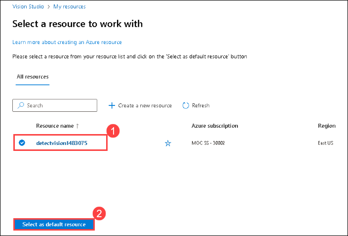
   
1. Close the settings page by selecting the **x** at the top right of the screen.

### Task 3: Detect faces in the Vision Studio 

In this task, you will learn how to detect faces in Vision Studio to analyze facial attributes and recognize individuals.

1. In a web browser, navigate to **Vision Studio** at [https://portal.vision.cognitive.azure.com](https://portal.vision.cognitive.azure.com?azure-portal=true).

1. On the **Getting started with Vision** landing page, select the **Face** tab and then select the **Detect Faces in an image** tile.

    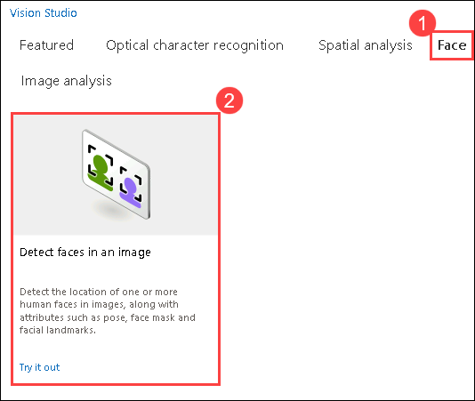

1. Under the **Try It Out** subheading, acknowledge the resource usage policy by reading and checking the box.

    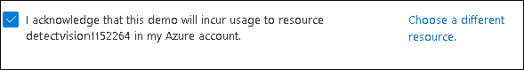

1. Select each of the sample images and observe the face detection data that is returned.

1. Copy highlighted link by right-clicking the [**https://aka.ms/mslearn-images-for-analysis**](https://aka.ms/mslearn-images-for-analysis) and selecting "Copy" from the context menu and paste it into the new tab to download **detect-faces.zip**. 

1. Click the **download icon (1)** to view your downloads, then click the **folder icon (2)** to open the file location.

   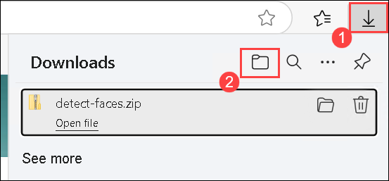

1. **Right-click** the **ZIP file (1)**  and select **Extract All (2)** to **unzip** its contents. 

   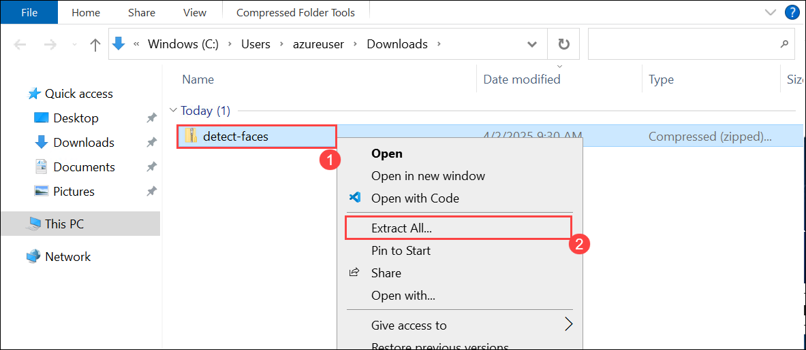

1. Select the destination folder, ensure Show extracted files when complete is checked, and click **Extract** to unzip the files. 

   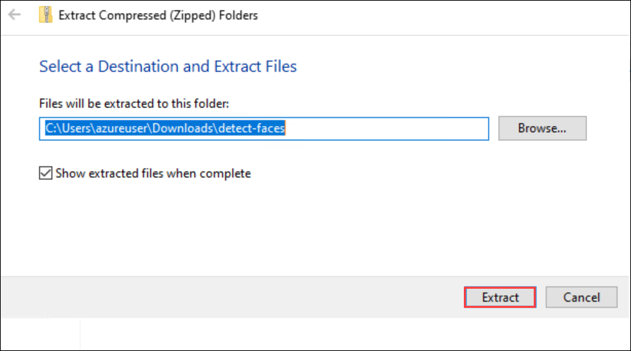

1. Go back to the Vision Studio  and upload the **WhatAICanDo.m4a** image by clicking **Browse files (1)**. Then, navigate to the **C:\Users\azureuser\Downloads\detect-faces (2)** folder, select **store-camera-1 (3)**, and click **Open (4)**.

   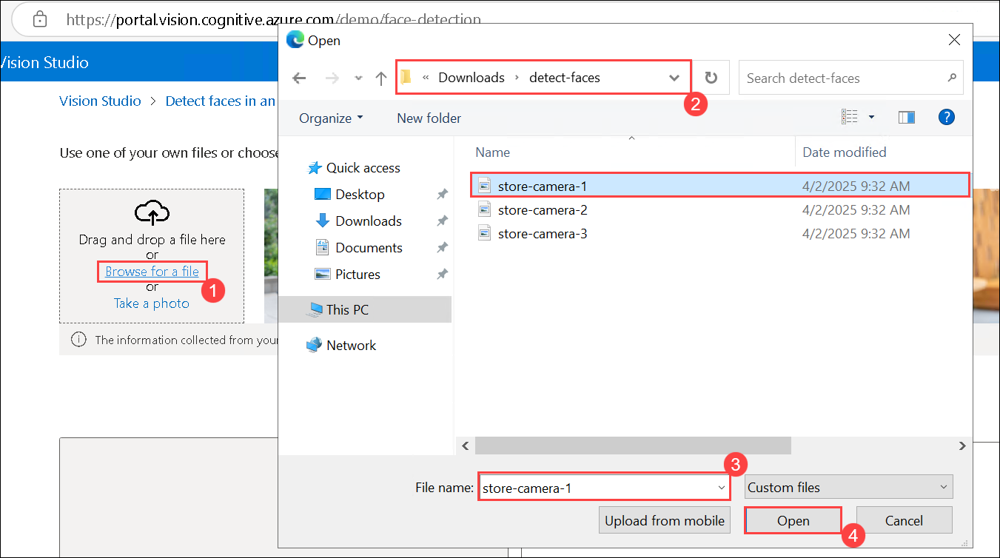

1. Review the face detection details that are returned.

    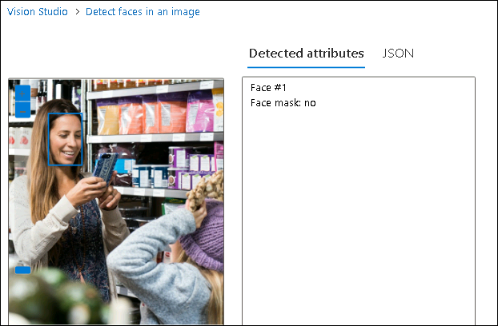

1. Locate the file named **store-camera-2.jpg**; which contains the following image:

    

1. Upload **store-camera-2.jpg** and review the face detection details that are returned.

1. Locate the file named **store-camera-3.jpg**; which contains the following image:

    

1. Upload **store-camera-2.jpg** and review the face detection details that are returned. Notice how Azure AI Face can detect faces that are partially obscured. 

## Validation

> **Congratulations** on completing the task! Now, it's time to validate it. Here are the steps:
 
- Hit the Validate button for the corresponding task. you will receive a success message. 
- If not, carefully read the error message and retry the step, following the instructions in the lab guide.
- If you need any assistance, please contact us at cloudlabs-support@spektrasystems.com. We are available 24/7 to help you out.

   <validation step="b774c119-03ee-46b1-b09e-611e0652ec06" />

## Learn more

To learn more about what you can do with this service, see the [Azure AI Face service page](https://learn.microsoft.com/azure/ai-services/computer-vision/overview-identity).

### Review
In this lab, you have completed the following tasks:

- Created an Azure AI services resource
- Connected Azure AI Service Resource to Vision Studio
- Detected faces in the Vision Studio

  
## You have successfully completed this lab.
