# Get started with speech in Microsoft Foundry

### Estimated Duration: 30 Minutes

## Lab Overview

In this lab, you will explore Microsoft Foundry to build and interact with a speech-enabled generative AI agent. You will create an agent, configure Azure Speech Voice Live to enable voice capabilities, and experiment with speech input and output in the agent playground. You will also review how system instructions influence responses and examine client code used to implement real-time voice interactions. This lab demonstrates how to integrate speech capabilities with generative AI to create interactive, voice-based experiences.

## Lab Objectives

In this exercise, you will perform the following tasks:

- Task 1: Create a Microsoft Foundry project
- Task 2: Create an agent
- Task 3: Configure Azure Speech Voice live
- Task 4: Use speech to interact with the agent (Read Only)
- Task 5: View client code

## Task 1: Create a Microsoft Foundry project

In this task, you'll create a Microsoft Foundry project, configure the required Azure resources, and obtain the project endpoint needed for application development.

1. Copy the **Microsoft Foundry** link and paste it into a new browser tab to access the portal: `https://ai.azure.com/`

1. On the **Microsoft Foundry** home page, click on **Start building** in the top right corner.

     

1. If prompted to sign in, enter your credentials:
 
   - **Email/Username:** Enter <inject key="AzureAdUserEmail"></inject> **(1)** and click on **Next (2)**.
 
        
 
   - **Password:** Enter <inject key="AzureAdUserPassword"></inject> **(1)** and click on **Sign in (2)**.
 
      .png)

1. If prompted to **Stay signed in?**, you can click **No**.

    

1. If prompted with, the **Get started with Microsoft Foundry** page, click on **Create project**.

   

1. In the **Create a project** wizard, enter project name **Myproject<inject key="DeploymentID" enableCopy="false" /> (1)**, and **Expand Advanced options (2)** to specify the following settings for your project: 

    - Foundry resource: **MyFoundry<inject key="DeploymentID" enableCopy="false" /> (3)**
    - Subscription : **Leave default subscription (4)** 
    - Region : Select **<inject key="location" enableCopy="false"/> (5)**
    - Resource group : Select **AI-901 (6)** 
    - Click on **Create** **(7)**

      .png)

      > **Note:** If project creation gives an authorization error related to Application Insights or Log Analytics resources (for example, errors containing `Microsoft.OperationalInsights/workspaces/write` or `Microsoft.Insights/components/write`), **Toggle off** the *Set up recommended resources so I can explore everything Foundry has to offer* option before creating the project.

      .png)

1. Wait for your project to be created. It may take a few minutes. 

1. In the **All set, Let's build your agents** window, click **Let's go**.

    

1. Once the setup is complete, you are automatically redirected to the **Microsoft Foundry home page** for the newly created project.

    

    > **Note:** The Microsoft Foundry landing page may vary depending on the version of the portal, your account configuration, or recent UI updates. f your home page looks different, continue with the lab by locating the required menu options using the navigation menu. The appearance of the portal may differ, but the functionality and lab steps remain the same.

    .png)

> **Congratulations** on completing the task! Now, it's time to validate it. Here are the steps:
 
- Hit the Validate button for the corresponding task. You will receive a success message. 
- If not, carefully read the error message and retry the step, following the instructions in the lab guide.
- If you need any assistance, please contact us at cloudlabs-support@spektrasystems.com. We are available 24/7 to help you out.

  <validation step="4c8b405f-1e52-4064-833b-c3b37cb5ba0b" />

## Task 2: Create an agent

In this task, you’ll create an agent, select a generative AI model, and define its behavior using system instructions.

1. From the Home page of the Microsoft Foundry portal, select **Create agents** to begin creating a new agent.

    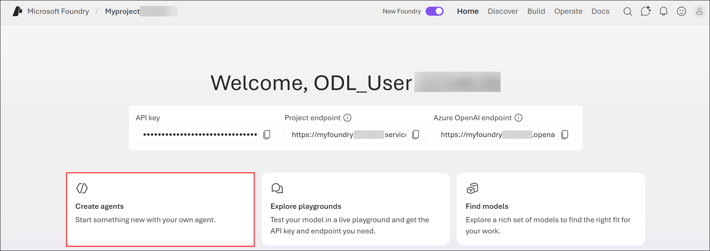

    > **Note:** Depending on the version of Microsoft Foundry available in your environment, you may see a **Start building** button instead of **Create agents** on the Home page.

    .png)

1. In the **Create an agent** dialog, enter a name for your agent `speech-agent` **(1)**, and then select **Create (2)** to proceed.

    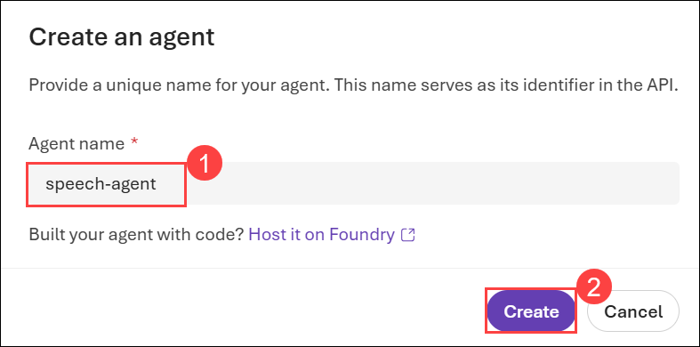

1. When ready, your agent opens in the agent playground.

    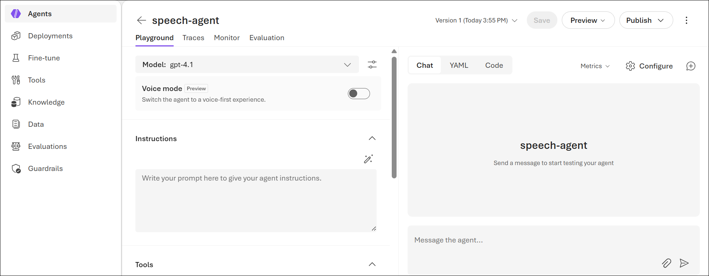

1. In the model drop-down list, ensure that a **gpt-4.1** model has been deployed and selected for your agent.

    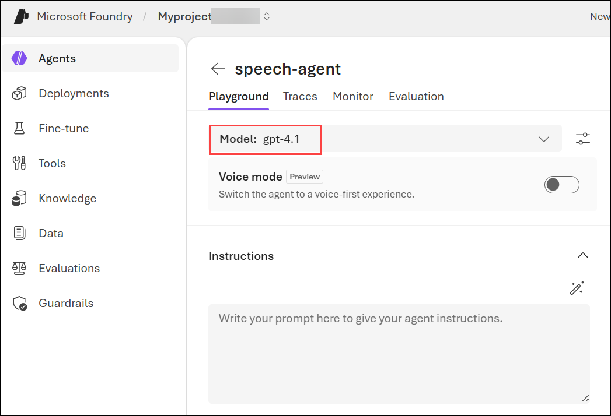

1. Assign your agent the following **Instructions**:

    ```
   You are an AI agent that provides information about AI and related topics. You answer questions concisely and precisely.
    ```

    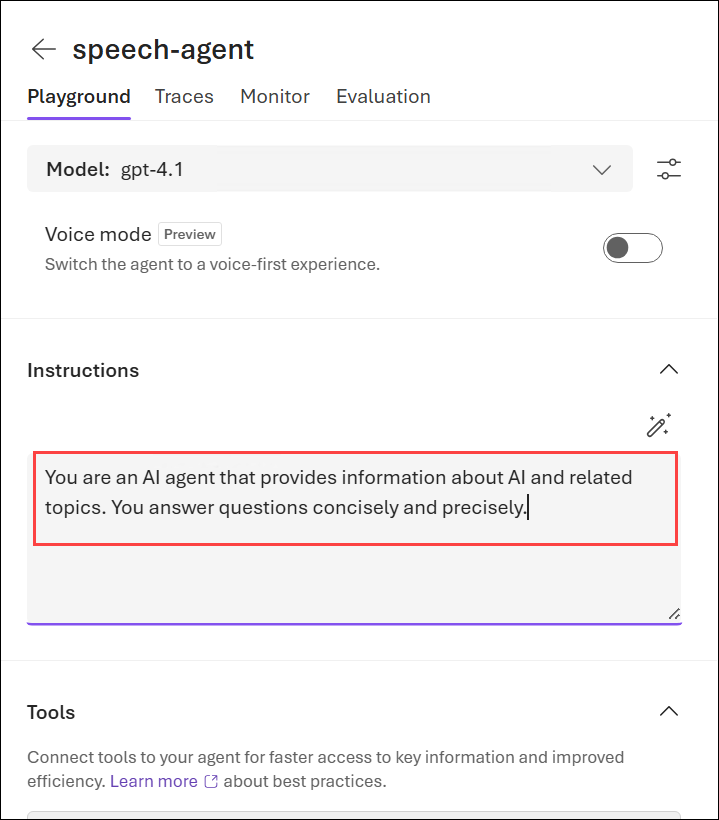

1. Use the **Save** button to save the changes.

    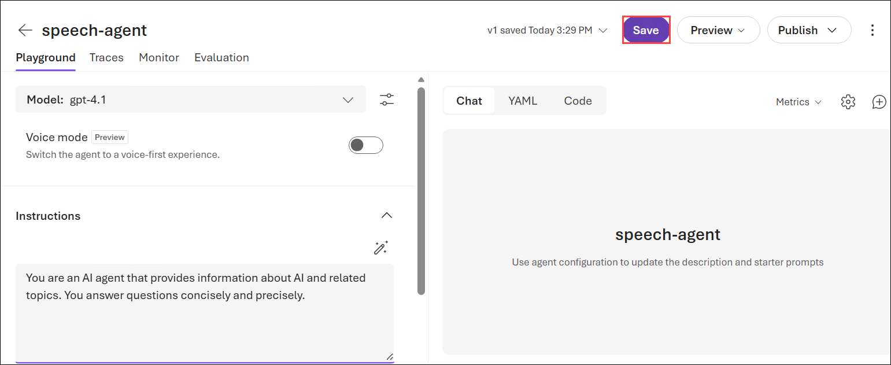

1. Test the agent by entering the following prompt in the **Chat** pane:

    ```
   What can you help me with?
    ```

    The agent should respond with an appropriate answer based on its instructions.

    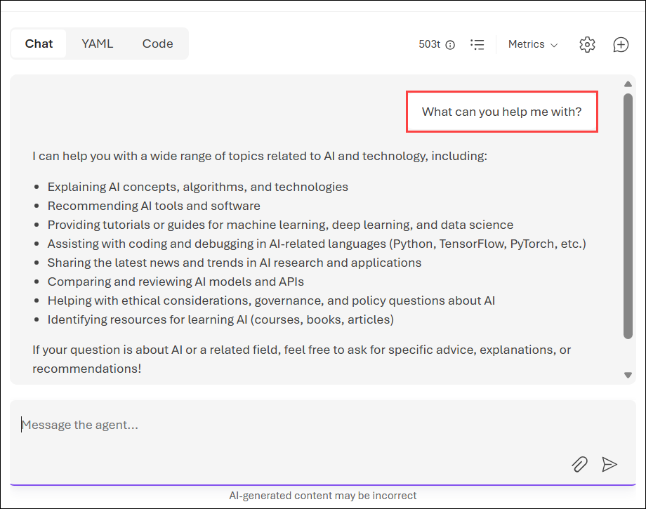

> **Congratulations** on completing the task! Now, it's time to validate it. Here are the steps:
 
- Hit the Validate button for the corresponding task. You will receive a success message. 
- If not, carefully read the error message and retry the step, following the instructions in the lab guide.
- If you need any assistance, please contact us at cloudlabs-support@spektrasystems.com. We are available 24/7 to help you out.

  <validation step="44086315-289e-4dc5-b10e-c115a9fb514b" />

## Task 3: Configure Azure Speech Voice live

In this task, you’ll enable voice capabilities for the agent by configuring Azure Speech Voice Live and selecting appropriate speech input and output settings.

1. In the pane on the left, under the model selection list, enable **Voice mode**.

    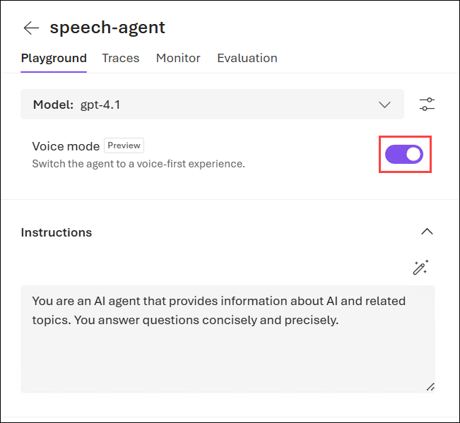

    >**Note:** If the **Configuration** pane does not open automatically, use the "cog" icon above the chat interface to open it.

1. In the configuration pane on the left, view the voices in the **Speech output (1)** drop-down list. Review the default speech input and output configuration. You can try different voices, previewing them until you decide which one to use.

    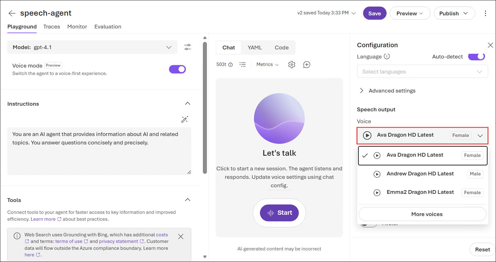

1. **Close (1)** the **Configuration** pane and use the **Save (2)** button to save the agent.

    .png)

## Task 4: Use speech to interact with the agent (Read Only)

>**Note:** <span style="color:red;"> In the current lab environment, audio input (microphone) is not supported due to platform limitations; therefore, while you can perform the steps in this task, you will not be able to provide prompts using voice.

In this task, you’ll explore how speech-based interaction works by observing how spoken input is processed and how the agent generates spoken responses.

1. In the **Chat** pane, click **Start** to begin a conversation with the model. If asked, allow microphone access. The agent will then introduce itself.

    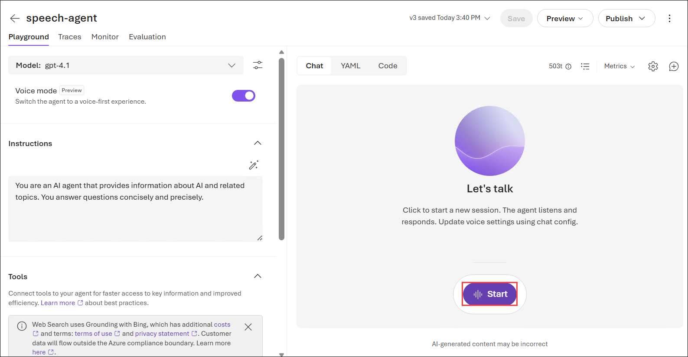

    >**Note**: If you are not prompted for microphone access, and your microphone is not detected, try the following steps to allow microphone access. In the browser window, navigate to the page url. Click on the *lock icon* next to the url. Select *Permissions*, *Microphone*, and *Allow*. Then refresh the page and try again.

1. When the app status is **Listening…**, say something like `"How does speech recognition work?"` and wait for a response.

    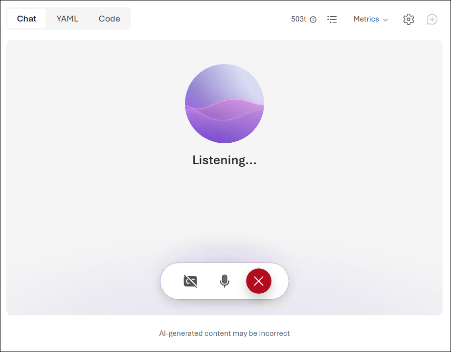

1. Verify that the app status changes to **Processing…**. The app will process the spoken input, using speech-to-text to convert your speech to text and submit it to the model as a prompt. 

    >**Note**: The processing speed may be so fast that you do not actually see the status before it changes back to *Speaking*.

1. When the status changes to **Speaking…**, the app uses text-to-speech to vocalize the response from the model. To see the original prompt and the response as text, select the **cc** button at the bottom of the chat screen.

    >**Note**: The follow-on prompt is submitted just by speaking. You can even interrupt the agent to keep the interaction focused on what you need done. 
    >**Note**: You can also use the Stop generation button in the chat pane to stop long-running responses. The button will end the conversation. You will need to start a new conversation to continue using the agent. 

1. To continue the conversation, submit a second spoken prompt, such as `"How does speech synthesis work?"`, and review the response.

1. When you have finished chatting with the agent, use the **X** icon to end the session. A transcript of the conversation will be displayed.

## Task 5: View client code

In this task, you’ll review sample code to understand how to integrate speech-enabled agents into applications using APIs and SDKs for real-time voice interactions.

1. Select **Call agent** at the top of the chat screen to view sample code for an agent client.

    .png)

1. Review the code; noting that it handles:
    - Connectivity to your project to access the agent.
    - Audio streaming for input and output.
    - Use of audio devices, such as microphones and speakers.

## Summary

In this exercise, you explored how to use Microsoft Foundry and Azure Speech Voice Live to create and configure a speech-enabled AI agent. You created an agent, defined its behavior using system instructions, enabled voice capabilities, and reviewed how speech input and output are handled in the playground. You also examined sample client code to understand how real-time voice interactions can be implemented in applications.

### Congratulations, you’ve successfully completed the hands-on lab!
