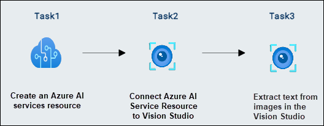

# Module 05: Read text in Vision Studio

## Lab overview

In this exercise, you'll use Azure AI service to explore the optical character recognition capabilities of Azure AI Vision. You'll use Vision Studio to experiment with extracting text from images, without having to write any code.

A common computer vision challenge is to detect and interpret text embedded within an image. This is known as optical character recognition (OCR). In this exercise, you’ll use an Azure AI services resource, which includes Azure AI Vision services. You'll then use Vision Studio to try out OCR with different types of images.

## Lab objectives

In this lab, you will perform:

- Task 1: Creating an *Azure AI Speech* resource
- Task 2: Connect your Azure AI service resource to Vision Studio
- Task 3: Extract text from images in the Vision Studio

## Estimated timing: 30 minutes

## Architecture Diagram

## Exercise 1: Read the text in Vision Studio

### Task 1: Create an *Azure AI services* resource

In this task, you will learn how to create an **Azure AI Services** resource to leverage AI capabilities for vision, language, and decision-making.

You can use Azure AI Vision's OCR capabilities with an **Azure AI services** multi-service resource. If you haven't already done so, create an **Azure AI services** resource in your Azure subscription.

1. In the Azure portal, search for **Azure AI services (1)**. Select an **Azure AI services multi-service  account (2)**.

    

1. You will be taken to a page to create an Azure AI services resource. please click on **Create** Configure it with the following settings:

    

1. You will be taken to a page to create an Azure AI services resource. please click on **Create** Configure it with the following settings:

    - **Subscription**: *Your Azure subscription* **(1)**
    - **Resource group**: **AI-900-Module-05-<inject key="DeploymentID" enableCopy="false" /> (2)**
    - **Region**: Select **<inject key="location" enableCopy="false"/> (3)**
    - **Name**: Enter **text<inject key="DeploymentID" enableCopy="false" /> (4)**
    - **Pricing tier**: *Standard S0* **(5)**
    - **By checking this box I acknowledge that I have read and understood all the terms below**: *Selected* **(6)**
   - Select **Review + create (7)** 

        
   
1. Then **Create** and wait for deployment to complete.

### Task 2: Connect your Azure AI service resource to Vision Studio

In this task, you will learn how to connect your **Azure AI Services** resource to Vision Studio to enable AI-driven image and video analysis.

Next, connect the Azure AI services resource you provisioned above to Vision Studio.

1. Right click on  [Vision Studio](https://portal.vision.cognitive.azure.com?azure-portal=true) link, select **Copy link** from the context menu, then paste it into a new tab to access the Vision Studio.

1. **Sign in** with your account and make sure you are using the same directory as the one where you have created your Azure AI services resource. if you receive a pop-up to select the resource please click on the **X** icon to close the popup.

    

1. On the Vision Studio home page, select **View all resources** under the **Getting started with Vision** heading.

    .png)

1. On the **Select a resource to work with** page, hover your mouse cursor over the resource you created above in the list and then check the box to the left of the resource name **(1)**, then select **Select as default resource (2)**.

    > **Note** : If your resource isn't listed, try **Refreshing** the page.

    

      >**Note**: If you dont see the **Select as default resource** button, please close the pop up related to AI Foundry by selecting "x" at the top right of the screen.

      

### Task 3: Extract text from images in the Vision Studio

In this task, you will learn how to extract text from images in Vision Studio using Optical Character Recognition (OCR) technology.
    
1. Right click on [Vision Studio](https://portal.vision.cognitive.azure.com?azure-portal=true) link, select **Copy link** from the context menu, then paste it into a new tab to access the Vision Studio.

1. On the **Getting started with Vision** landing page, select **Optical character recognition (1)**, and then select **Try it out (2)** the **Extract text from images** tile.

   

1. Under the **Try It Out** subheading, acknowledge the resource usage policy by reading and checking the box.

   

1. Open a new tab, copy and paste this link in the browser [**https://aka.ms/mslearn-ocr-images**](https://aka.ms/mslearn-ocr-images) to download **ocr-images.zip**. Then extract zip folder.

1. Click the **download icon (1)** to view your downloads, then click the **folder icon (2)** to open the file location.

   

1. **Right-click** the **ZIP file (1)**  and select **Extract All (2)** to **unzip** its contents. 

   

1. Select the destination folder, ensure Show extracted files when complete is checked, and click **Extract** to unzip the files. 

   

1. Navigate back to the **Vision Studio** portal, select **Browse for a file**.

   

1. Navigate to the `C:\Users\azureuser\Downloads\ocr-images` folder **(1)** on your computer where you downloaded **ocr-images.zip**. Select **advert.jpg (2)** and select **Open (3)**.

   

1. Now review what is returned:
    - In **Detected attributes**, any text found in the image is organized into a hierarchical structure of regions, lines, and words.

       

    - In the image, the location of the text is indicated by a bounding box, as shown here:

       

1. You can now try another image. Select **Browse for a file**.

   

1. Navigate to the folder where you saved the files from GitHub. Select **letter.jpg (1)** and then **Open (2)**.

   

1. Review the results of the second image.   

   

1. It should return the text and bounding boxes of the text. If you have time, try **note.jpg** and **receipt.jpg**.

> **Congratulations** on completing the task! Now, it's time to validate it. Here are the steps:
 
- Hit the Validate button for the corresponding task. If you receive a success message, you can proceed to the next task. 
- If not, carefully read the error message and retry the step, following the instructions in the lab guide.
- If you need any assistance, please contact us at cloudlabs-support@spektrasystems.com. We are available 24/7 to help you out.

  <validation step="6533434a-a8ba-4666-85d3-c3bc79b972d7" />
  
## Learn more

To learn more about what you can do with this service, see Azure AI Vision's documentation on [optical character recognition](https://learn.microsoft.com/azure/ai-services/computer-vision/overview-ocr).

### Review
In this lab, you have completed the following tasks:

- Created an *Azure AI Speech* resource
- Connected your Azure AI service resource to Vision Studio
- Extracted text from images in the Vision Studio

## You have successfully completed this lab
