# Get started with computer vision in Microsoft Foundry

### Estimated Duration: 60 Minutes

## Lab overview

In this exercise, you'll use Microsoft Foundry to deploy and explore generative AI models that work with visual data. You will analyze images, generate new images from text prompts, and create videos using vision-enabled models.

## Lab objectives

In this exercise, you will perform the following tasks:

- Task 1: Create a Microsoft Foundry project
- Task 2: Use a generative AI model to analyze images
- Task 3: Use a generative AI model to create new images
- Task 4: Use a generative AI model to create video

## Task 1: Create a Microsoft Foundry project

In this task, you'll create a Microsoft Foundry project, configure the required Azure resources, and obtain the project endpoint needed for application development.

1. Copy the **Microsoft Foundry** link and paste it into a new browser tab to access the portal: `https://ai.azure.com/`

1. On the **Microsoft Foundry** home page, click on **Start building** in the top right corner.

     

1. If prompted to sign in, enter your credentials:
 
   - **Email/Username:** Enter <inject key="AzureAdUserEmail"></inject> **(1)** and click on **Next (2)**.
 
        
 
   - **Password:** Enter <inject key="AzureAdUserPassword"></inject> **(1)** and click on **Sign in (2)**.
 
      .png)

1. If prompted to **Stay signed in?**, you can click **No**.

    

1. You will be redirected to the **Setting up your project** page. Wait **1-2 minutes** for the project creation process to complete before proceeding.

   

1. In the **Your project is set up. What would you like to do next ?** pop-up, click **X** button to dismiss the window.

    

1. Once the setup is complete, you are automatically redirected to the **Microsoft Foundry home page** for the newly created project.

    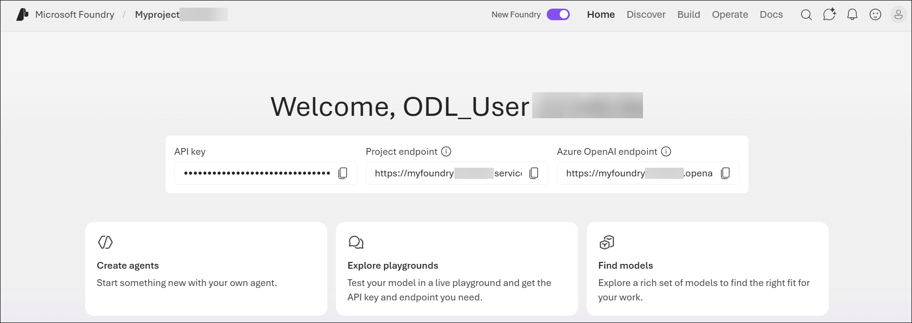

    > **Note:** The Microsoft Foundry landing page may vary depending on the version of the portal, your account configuration, or recent UI updates. If your home page looks different, continue with the lab by locating the required menu options using the navigation menu. The appearance of the portal may differ, but the functionality and lab steps remain the same.

    .png)


> **Congratulations** on completing the task! Now, it's time to validate it. Here are the steps:
 
- Hit the Validate button for the corresponding task. You will receive a success message. 
- If not, carefully read the error message and retry the step, following the instructions in the lab guide.
- If you need any assistance, please contact us at cloudlabs-support@spektrasystems.com. We are available 24/7 to help you out.

  <validation step="598e92f9-f98b-427e-8997-510732cae1e8" />

## Task 2: Use a generative AI model to analyze images

In this task, you'll deploy a vision-enabled generative AI model and use it to analyze images, allowing you to understand visual content and generate meaningful text-based responses.

1. Open a new browser tab and download the file from the following link to your local computer:

    ```
    https://microsoftlearning.github.io/mslearn-ai-fundamentals/data/images.zip
    ```
1. From the download prompt, click the **Show in folder** icon to open the file location.

    

1. Select the **images.zip (1)** file, right-click it, and choose **Extract All... (2)**.

    

1. In the **Extract Compressed (Zipped) Folders** window, keep the default settings and click **Extract**.

    

1. The folder contains three image files, and these images will be used for AI analysis.

    

1. Return to the browser tab containing your Microsoft Foundry project, from the Home page of the Microsoft Foundry portal, select **Find models** to access the Microsoft Foundry model catalog.

    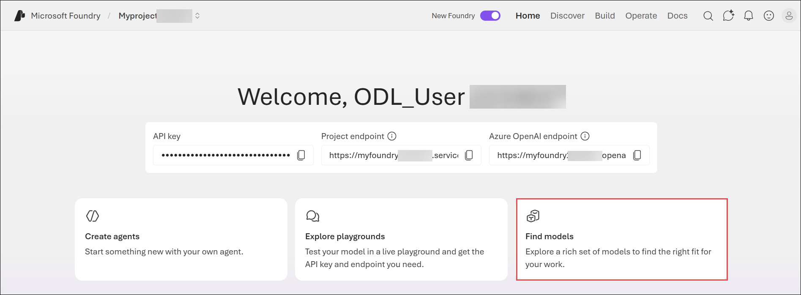

    > **Note:** Depending on the version of Microsoft Foundry available in your environment, you may see **Explore models** instead of **Find models** on the Home page. If **Find models** is not displayed, select **Explore models** to access the Microsoft Foundry model catalog. Alternatively, you can select **Discover** from the top navigation menu and then choose **Models** from the left navigation pane to access the same catalog and continue with the lab instructions.
    
    .png)

1. Search for the `gpt-5-mini` **(1)** model and select the same **(2)** from the result section. 

    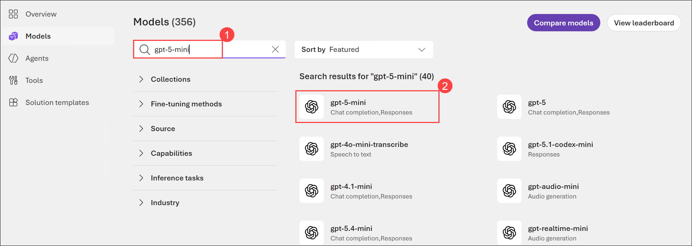

1. On the **gpt-5-mini** page, select **Custom Deploy**.

    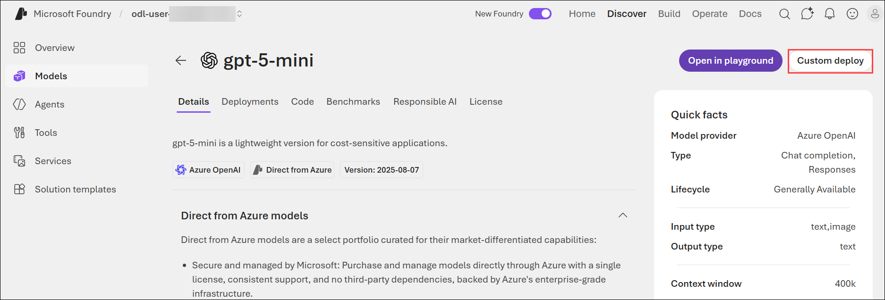

1. On the **Deploy gpt-5-mini** pane, 

    - Rename the Deployment name to **gpt-5-mini (1)**
    - Set token limit to **100000** **(2)**
    - Click on **Deploy (3)**

        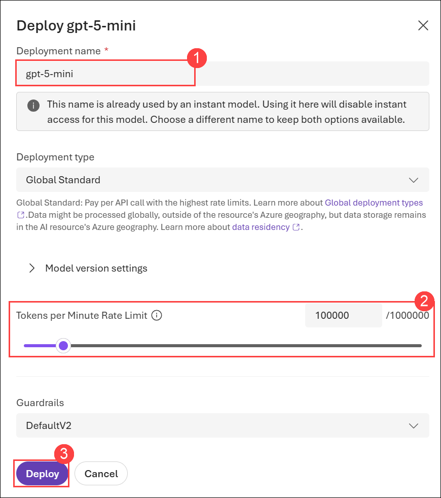

        > **Note:** Ensure that the model deployment name exactly matches. If the deployment name is incorrect or does not match the lab instructions, the validation will fail.

1. Deployment may take a minute or so.

    > **Note:** Model deployments are subject to regional quotas. If you don't have enough quota to deploy the model in your project's region, you can use a different model - such as gpt-4.1-mini, or gpt-5-nano.

1. When the model has been deployed, view the model playground page that is opened, in which you can chat with the model.

    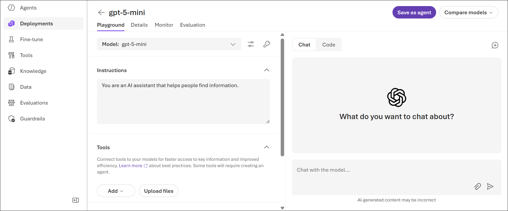

1. Use the button at the bottom of the left navigation pane to hide it and give yourself more room to work with.

    

1. In the left pane, update the **Instructions** field to: `You are an AI assistant that helps people identify vintage computer hardware.`

    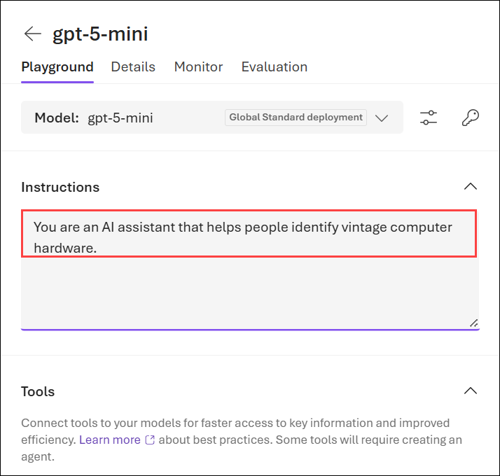

1. In the chat pane, click on the **Attach files (1)** icon and then in the Open window, select **image1 (2)** from the folder you extracted earlier and then click on **Open (3)**. The image will be added to the prompt area.

    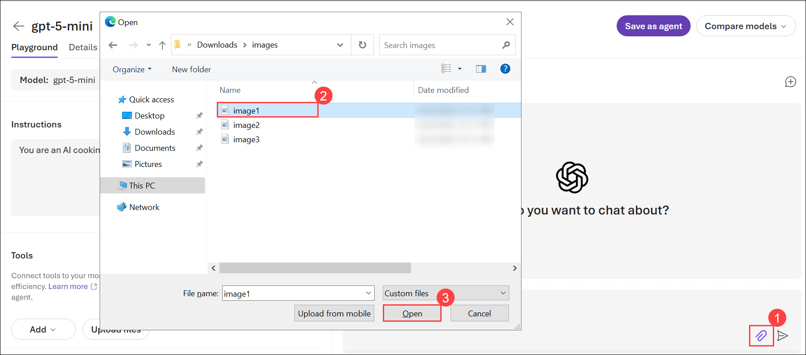

1. Enter a prompt such as `What can you tell me about this?`, then press **Enter** to submit it.

    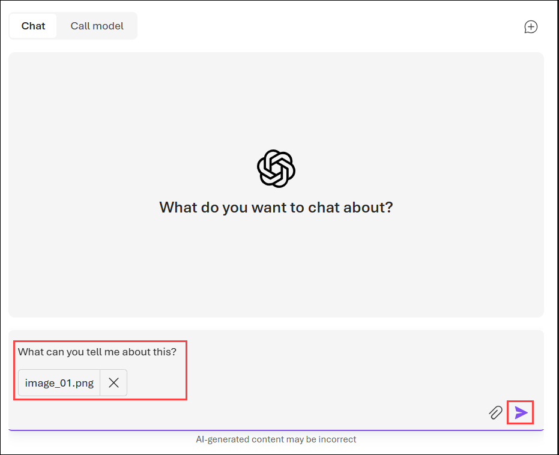

    >**Note:** If the error `ERR_BAD_REQUEST: The provided data does not match the expected schema` is returned, try switching to the Classic portal by de-selecting the New Foundry option. In the classic portal, select **Playground (1)** from the left pane and then select the **Try the Chat playground (2)**.

    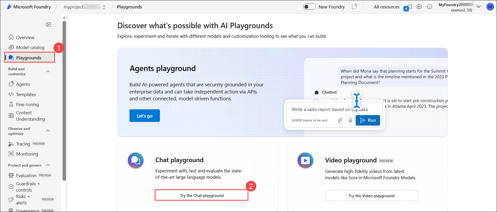

1. Review the response, which should include relevant recipe suggestions for the image you uploaded.

    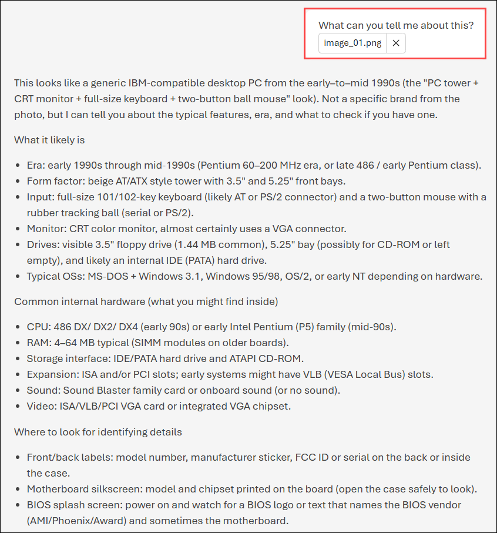

    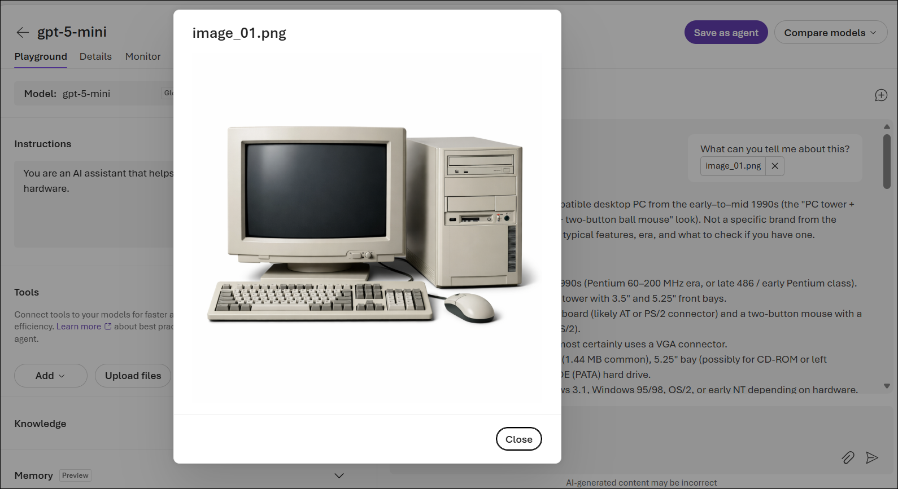

1. Submit prompts that include the other images, such as `What is this?` or `Tell me about this.`

> **Congratulations** on completing the task! Now, it's time to validate it. Here are the steps:
 
- Hit the Validate button for the corresponding task. You will receive a success message. 
- If not, carefully read the error message and retry the step, following the instructions in the lab guide.
- If you need any assistance, please contact us at cloudlabs-support@spektrasystems.com. We are available 24/7 to help you out.

  <validation step="1de40399-8240-4330-9165-4dcbd20728b7" />

### Task 2.1: View code

To develop a client app or agent that can use the model to interpret images, you can use the OpenAI **Responses** API.

1. In the **Chat** pane, select the **Call model** tab to view sample code.

    .png)

1. Select the following code options:
    - **API**: Responses API
    - **Language**: Python
    - **SDK**: OpenAI SDK
    - **Authentication**: Key authentication

    The default sample code includes only a text-based prompt. To submit a prompt that analyzes an image, you can modify the **input** parameter to include both text and image content, as shown here:

    ```python
    from openai import OpenAI
    
    endpoint = "https://your-project-resource.openai.azure.com/openai/v1/"
    deployment_name = "gpt-5-mini"
    api_key = "<your-api-key>"
    
    client = OpenAI(
        base_url=endpoint,
        api_key=api_key
    )
    
    response = client.responses.create(
        model=deployment_name,
        input=[{
            "role": "user",
            "content": [
                {"type": "input_text", "text": "what's in this image?"},
                {"type": "input_image", "image_url": "https://an-online-image.jpg"},
            ],
        }],
    )
    
    print(f"answer: {response.output[0]}")
    ```

    > **Note:** If you are using a work or school account to sign into Azure, and you have sufficient permissions in the Azure subscription, you can open the sample code in VS Code for Web to experiment with image-based input content. You can obtain the **key** for your service in the **Code** tab of the model playground (above the sample code), and you can use the image **[orange.jpg](https://microsoftlearning.github.io/mslearn-ai-fundamentals/data/orange.jpg){:target="_blank"}** at `https://microsoftlearning.github.io/mslearn-ai-fundamentals/data/orange.jpg`. To learn more about using the OpenAI API to analyze images, see the [OpenAI documentation](https://platform.openai.com/docs/guides/images-vision#analyze-images).


## Task 3: Use a generative AI model to create new images

In this task, you'll deploy an image-generation model and use text prompts to create new images that match your described scenarios.

1. Use the **back** arrow next to the **gpt-5-mini** header to view the model deployments in your project.

    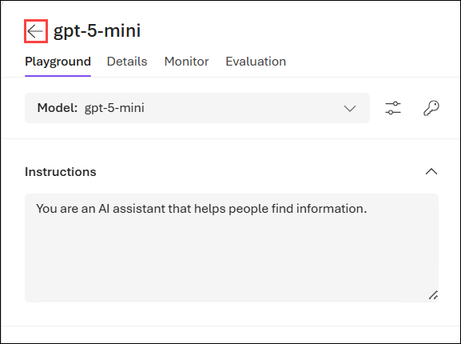

1. On the Models page, click on **Deploy a base model** to open the model catalog.

    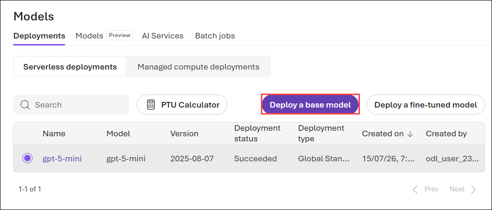

1. In the **Collections** drop-down list, select **Direct from Azure (1)**, and in the **Inference tasks** drop-down list, select **Text to image (2)**. Then view the available models for image generation.

    

    .png)

    >**Note**: The available models in your subscription may vary. Additionally, the ability to deploy models depends on regional availability and quota.

1. Select the **FLUX.2-pro** or **gpt-image-1-mini** model.

    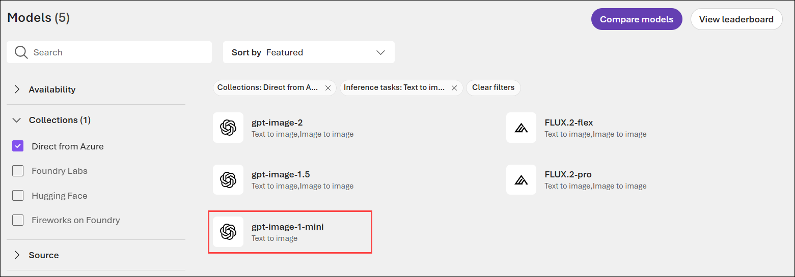

1. On the **gpt-image-1-mini** page, click on **Deploy (1)** and then select **Default settings (2)**.

    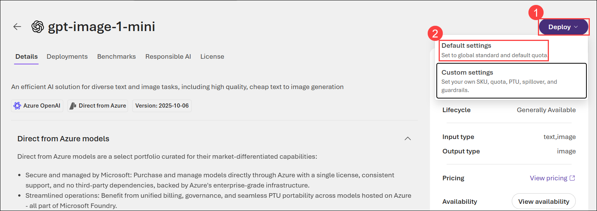

1. When the model has been deployed, it opens in the image playground.

    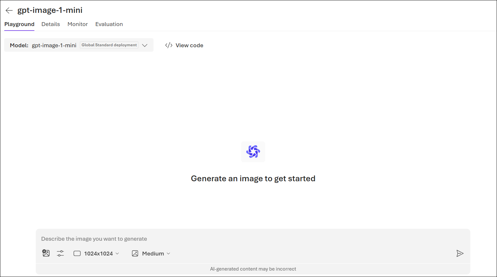

1. Enter a prompt that describes the image you want, such as `A vintage PC with a CRT monitor.`, then press **Enter** and review the generated image.

    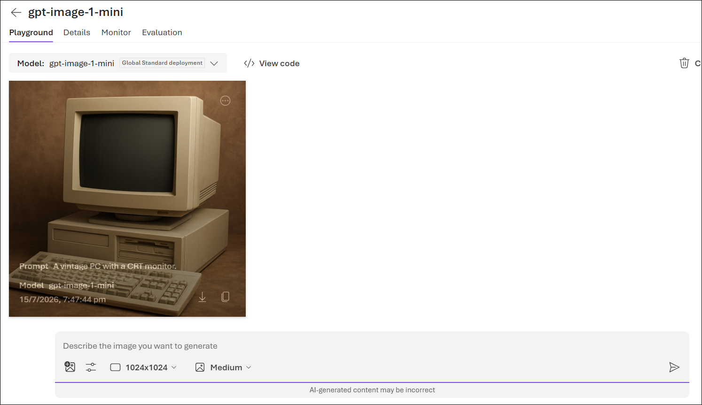


> **Congratulations** on completing the task! Now, it's time to validate it. Here are the steps:
 
- Hit the Validate button for the corresponding task. You will receive a success message. 
- If not, carefully read the error message and retry the step, following the instructions in the lab guide.
- If you need any assistance, please contact us at cloudlabs-support@spektrasystems.com. We are available 24/7 to help you out.

  <validation step="19b41870-89a0-46fc-b7be-95d15a691506" />

### Task 3.1: View code

If you want to develop a client app or agent that generates images using your model, you can use the OpenAI API.

1. In the **Chat** pane, select the **</> View code** tab to view sample code.

    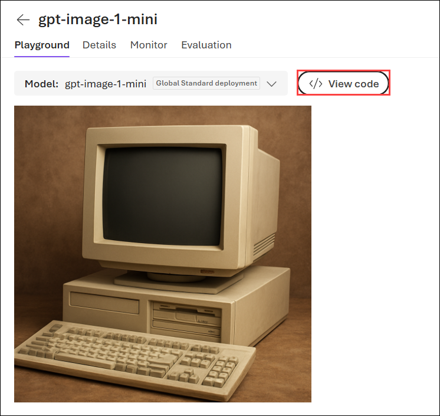

1. Select the following code options:
    - **Language**: Python
    - **SDK**: OpenAI SDK
    - **Authentication**: Key authentication

    The default sample code should look similar to this:

    ```python
    import base64
    from openai import OpenAI

    endpoint = "https://your-project-resource.openai.azure.com/openai/v1/"
    deployment_name = "your-text-to-image-model-deployment"
    api_key = "<your-api-key>"

    client = OpenAI(
        base_url=endpoint,
        api_key=api_key
    )

    img = client.images.generate(
        model=deployment_name,
        prompt="A cute baby polar bear",
        n=1,
        size="1024x1024",
    )

    image_bytes = base64.b64decode(img.data[0].b64_json)
    with open("output.png", "wb") as f:
        f.write(image_bytes)
    ```

    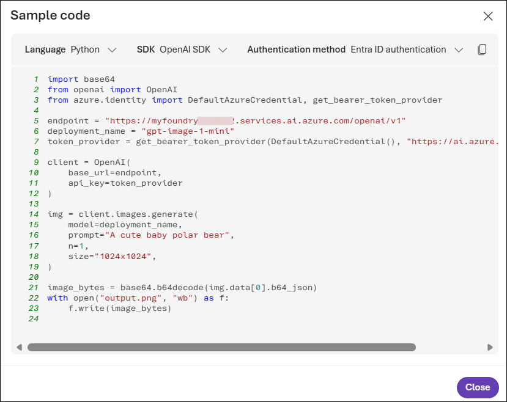

## Task 4: Use a generative AI model to create video

In this task, you'll deploy a video-generation model and use text prompts to generate short videos based on your descriptions.

1. Use the **back** arrow next to the image-generation model header to view the model deployments in your project.

    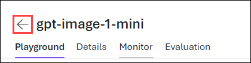

1. On the Models page, click on **Deploy a base model** to open the model catalog.

    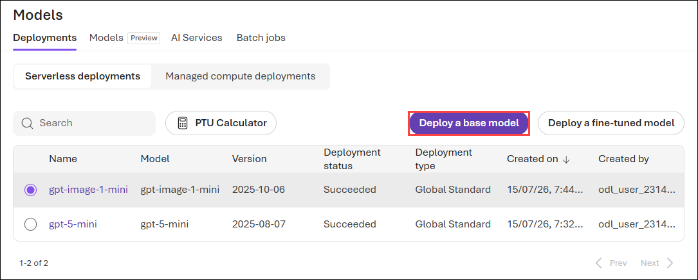

1. From the **Collections** drop-down, choose **Direct from Azure (1)**, and from the **Inference tasks** drop-down, select **Video generation (2)**. Then review the list of available video generation models.

    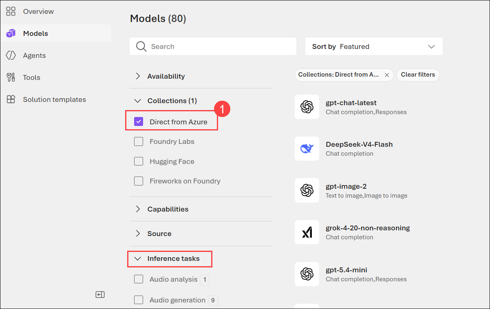

    .png)

    > **Note**: The available models in your subscription may vary. Additionally, the ability to deploy models depends on regional availability and quota.

1. Select the **Sora-2** model from the list.

    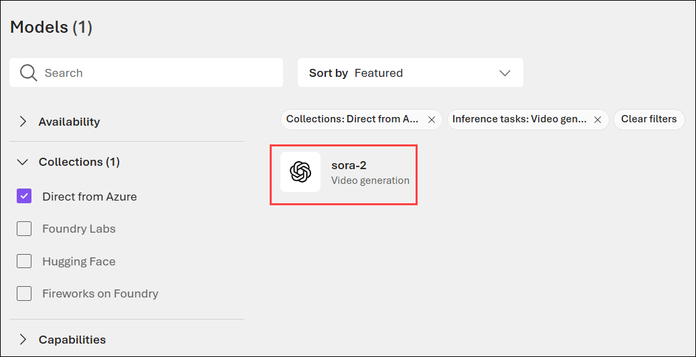

    >**Note:** If you are unable to deploy the model in your subscription, try one of the other video-generation models.

1. On the **sora-2** page, click on **Deploy (1)** and then select **Default settings (2)**.

    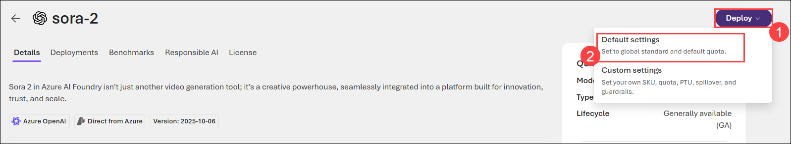

1. When the model has been deployed, it opens in the video playground.

    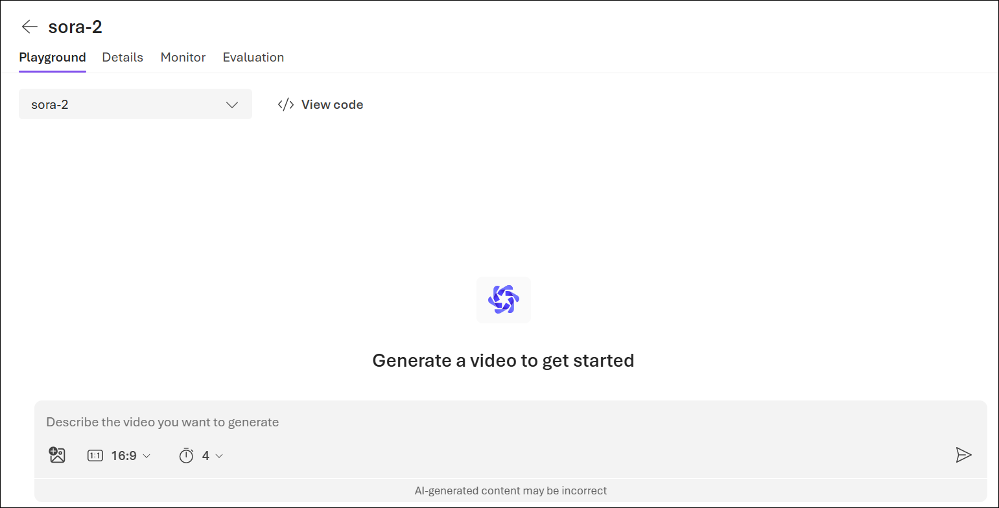

1. Enter a prompt that describes the video you want, such as `A retro computer game.`, then press **Enter** and review the generated result.

    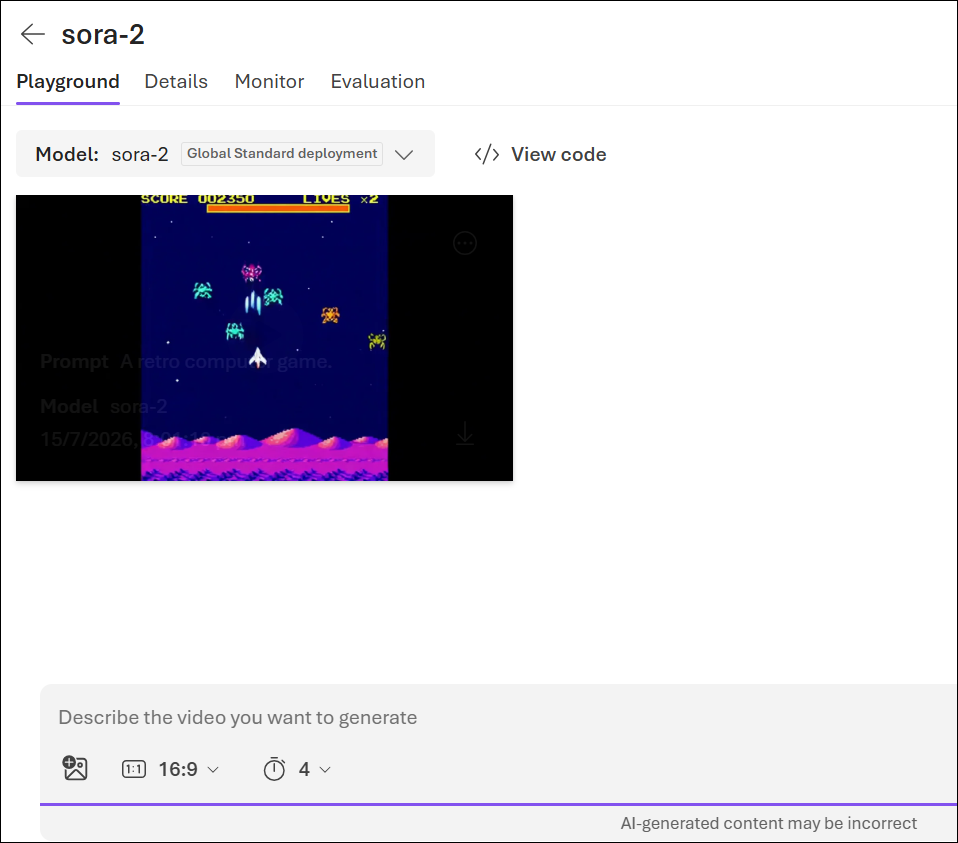

> **Congratulations** on completing the task! Now, it's time to validate it. Here are the steps:
 
- Hit the Validate button for the corresponding task. You will receive a success message. 
- If not, carefully read the error message and retry the step, following the instructions in the lab guide.
- If you need any assistance, please contact us at cloudlabs-support@spektrasystems.com. We are available 24/7 to help you out.

  <validation step="ed29d454-76b1-4aba-a741-d21733a64774" />

### Task 4.1: View code

If you want to develop a client app or agent that generates videos using your model, you can use the REST API.

1. In the **Chat** pane, select the **</> View Code** tab to view sample code.

    The default sample code uses the *curl* command to call the REST endpoint, and should look similar to this:

    ```bash
    curl -X POST "https://your-project-resource.openai.azure.com/openai/v1/video/generations/jobs" \
    -H "Content-Type: application/json" \
    -H "Authorization: Bearer $AZURE_API_KEY" \
    -d '{
        "prompt" : "A video of a cat",
        "height" : "1080",
        "width" : "1080",
        "n_seconds" : "5",
        "n_variants" : "1",
        "model": "sora"
        }'
    ```

    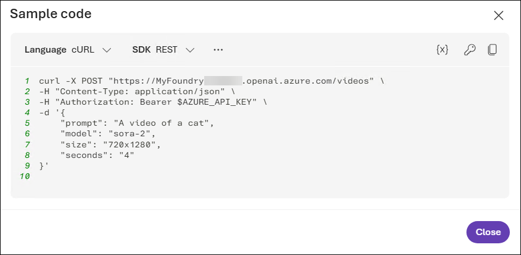

## Summary

In this exercise, you explored how to deploy and use vision-enabled generative AI models in Microsoft Foundry. You analyzed images, generated new images from text prompts, and created videos using generative AI models.

The scenarios in this exercise demonstrate how easily you can get started building applications that understand and generate visual content. From this foundation, you could build richer AI solutions that combine image analysis, image generation, and video generation to support advanced real-world use cases.


### Congratulations, you’ve successfully completed the hands-on lab!
