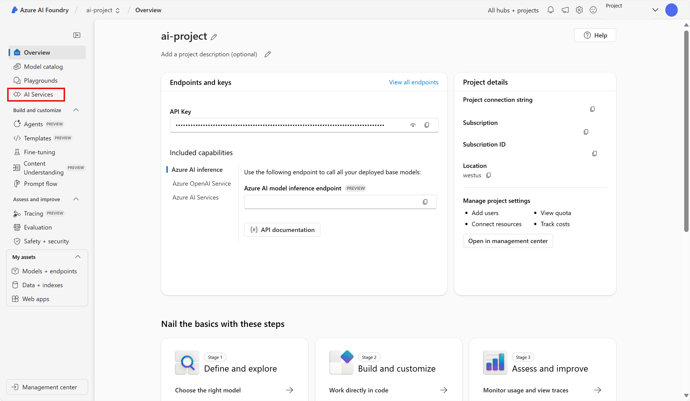
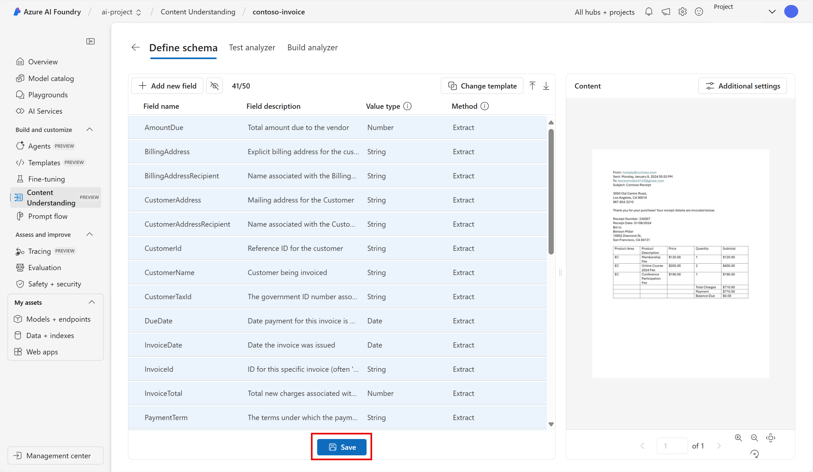
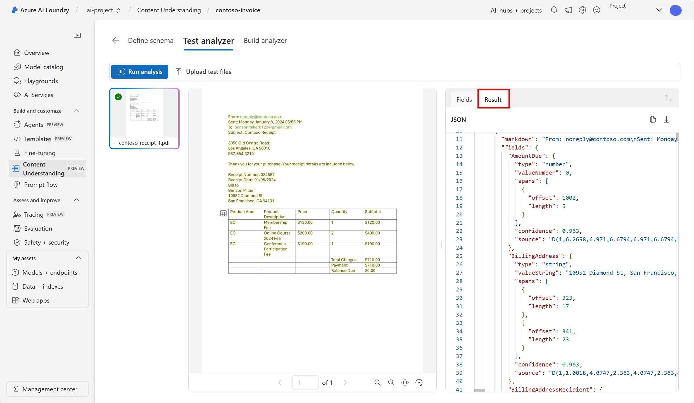

---
lab:
    title: 'Extract data with Content Understanding in Azure AI Foundry portal​'
---

# Extract data with Content Understanding in Azure AI Foundry portal

**Azure AI Content Understanding (preview)** uses generative AI to process content of many types (documents, images, videos, and audio) into a user-defined output format.

In this exercise, you will use Azure AI Content Understanding in Azure AI Foundry portal, Microsoft's platform for creating intelligent applications, to recognize data from invoices. 

This exercise takes approximately **25** minutes.

## Create an Azure AI Foundry project

Let's start by creating an Azure AI Foundry project.

1. In a web browser, open the [Azure AI Foundry portal](https://ai.azure.com) at `https://ai.azure.com` and sign in using your Azure credentials. Close any tips or quick start panes that are opened the first time you sign in, and if necessary use the **Azure AI Foundry** logo at the top left to navigate to the home page, which looks similar to the following image (close the **Help** pane if it's open):

    

1. In the home page, select **+ Create project**.

1. In the **Create a project** wizard, enter a valid name for your project and if an existing hub is suggested, choose the option to create a new one. Then review the Azure resources that will be automatically created to support your hub and project.

1. Select **Customize** and specify the following settings for your hub:
    - **Hub name**: *A valid name for your hub*
    - **Subscription**: *Your Azure subscription*
    - **Resource group**: *Create or select a resource group*
    - **Location**: West US 
    - **Connect Azure AI Services or Azure OpenAI**: *Create a new AI Services resource*
    - **Connect Azure AI Search**: Skip connecting

1. Select **Next** and review your configuration. Then select **Create** and wait for the process to complete.

1. When your project is created, close any tips that are displayed and review the project page in Azure AI Foundry portal, which should look similar to the following image:

    
 
1. Navigate to the left-hand menu on the screen. Then select **AI Services**.

1. On the *AI Services* page, select the *Content Understanding* tile to try out Azure AI Content Understanding capabilities.

## Analyze an invoice with Azure AI Content Understanding in Azure AI Foundry 

Suppose you want to extract data from many invoices and put the data into a database. You can use Azure AI Content Understanding to analyze one invoice and build your own analyzer that can analyze other similar invoices. Let's start by creating a content understanding task.

1. Select **Custom analyzer**. 

1. Select **+ Create** and use the following settings to create a content understanding task:
    - **Task name**: contoso-invoice
    - **Description**: An invoice analysis task
    - **Azure AI services connection**: *Use the default*
    - **Azure Blob Storage account**: *Use the default*

1. Select **Create**, then wait for your task to be created. 
1. Select your **contoso-invoice** task. 

#### Define your schema 

1. On the *Define Schema* page, you can add test files. Download [contoso-invoice-1.pdf](https://raw.githubusercontent.com/MicrosoftLearning/mslearn-ai-fundamentals/refs/heads/main/contoso-receipt-1.pdf) from `https://raw.githubusercontent.com/MicrosoftLearning/mslearn-ai-fundamentals/refs/heads/main/data/contoso-invoice-1.pdf`. 

1. Upload the file to the *define schema* page. Select the *Invoice analysis* template. The invoice template has pre-selected data fields that the analyzer will try to detect. 

    

1. Select **Create**. Now you have the ability to modify the schema by adding or deleting fields. When you are done reviewing the fields, select **Save**.

    

1. Wait for the analysis to run. This may take a moment.

#### Test the analyzer 

1. When the analysis is finished, you will be able to see how the analyzer has done in the *Test Analyzer* page. Review the *Fields* tab. Does this data align with what you see on the invoice? 
    

1. Notice the *confidence score* next to each field. The confidence score represents how confident the model is that its result is accurate. Results with confidence scores closer to 100% indicate greater confidence in the prediction.
1. Review the *Results* tab. The same information that you see rendered in the fields tab is in the results tab in JSON. The JSON shows how the information looks when it is sent to and from a client application. 

    

1. The Content Understanding service should have correctly identified the text that corresponds to the fields in the schema. If it had not done so, you could use the *Label data* page to upload another sample form and explicitly identify the correct text for each field. When you are satisfied with how well the analyzer is able to detect the data in the invoice, select the **Build Analyzer** tab. 

#### Build your analyzer 

Now that you have trained a model to extract fields from your sample invoice, you can build an analyzer to use with similar forms. By building an analyzer, you can deploy the model and use it to automate other invoice tasks.

1. In the *Build Analyzer* tab, select **+ Build Analyzer**. Enter the following: 
    - **Name**: invoice-analyzer
    - **Description**: An invoice analyzer

    

1. Select **Build**. Wait for the new analyzer to be ready (use the Refresh button to check). Your analyzer uses a predictive model that is based on the schema you have defined and tested in previous steps. 
1. Now let's try testing the analyzer you built. Download a different invoice from Contoso [contoso-invoice-2.pdf](https://raw.githubusercontent.com/MicrosoftLearning/mslearn-ai-fundamentals/refs/heads/main/data/contoso-receipt-2.pdf) from `https://raw.githubusercontent.com/MicrosoftLearning/mslearn-ai-fundamentals/refs/heads/main/data/contoso-invoice-2.pdf`.
1. Return to the *Build analyzer* page and select the invoice-analyzer link. The fields defined in the analyzer’s schema will be displayed.
1. In the invoice-analyzer page, select *Test*.
1. Use the **+ Upload test files** button to upload *contoso-receipt-2.pdf*. Select **Run analysis** to extract field data from the test form. Review the results of the test.

    

1. Select the *Code example* tab. Look for the *endpoint* in the code. In the *Build analyzer* phase of the process, you deployed your content understanding model to an endpoint. The endpoint can be used in code similar to what you see in the example to incorporate the model into a repeatable process in an application.  

    

## Clean up

If you’ve finished working with the Content Understanding service, you should delete the resources you have created in this exercise to avoid incurring unnecessary Azure costs.

- In the Azure AI Foundry portal, navigate to the contoso-receipt project and delete it.
- In the Azure portal, delete the resource group you created in this exercise.