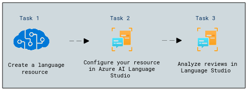
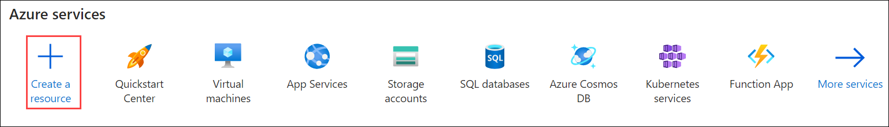
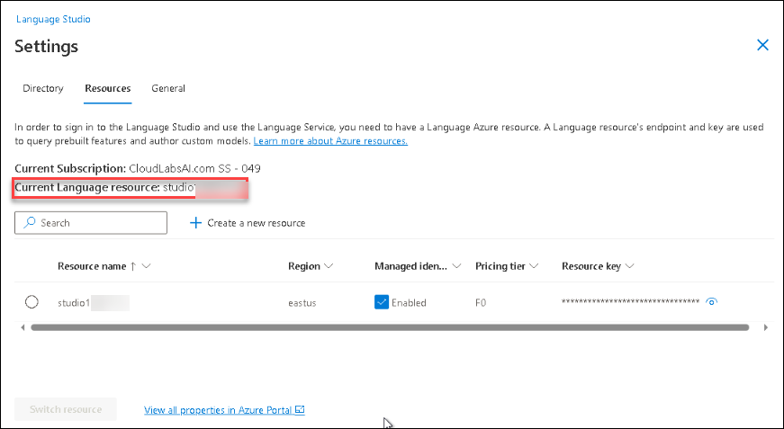
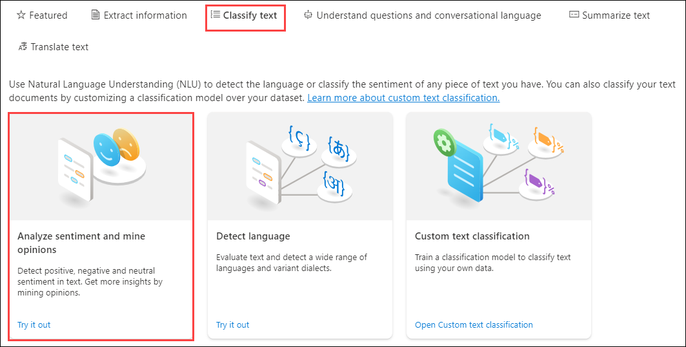

# Module 06: Analyze text with Language Studio

## Lab overview

In this exercise, you will explore the capabilities of Azure AI Language by analyzing some example hotel reviews. You'll use Language Studio to understand whether the reviews are mostly positive or negative.

Natural Language Processing (NLP) is a branch of AI that deals with written and spoken language. You can use NLP to build solutions that extract semantic meaning from text or speech, or that formulate meaningful responses in natural language.

For example, suppose the fictitious travel agent Margie's Travel encourages customers to submit reviews for hotel stays. You could use the Language service to identify key phrases, determine which reviews are positive and which are negative, or analyze the review text for mentions of known entities such as locations or people.

Azure AI Language Service includes text analysis and NLP capabilities. These include the identification of key phrases in text and the classification of text based on sentiment.

## Lab objectives

In this lab, you will perform:

- Task 1: Create a *Language* resource
- Task 2: Configure your resource in Azure AI Language Studio
- Task 3: Analyze reviews in Language Studio

## Estimated timing: 30 minutes

## Architecture Diagram


## Exercise 1: Analyze text with Language Studio

### Task 1: Create a *Language* resource

In this task, you will learn how to create a **Language** resource to enable natural language processing capabilities in your applications.

You can use many Azure AI Language features with either a **Language** or **Azure AI services** resource. There are some instances where only a Language resource can be used. For the exercise below, we will use a **Language** resource. If you haven't already done so, create a **Language** resource in your Azure subscription.

1. In the Azure Portal, select **+ Create a resource**.

    

1. In the Marketplace page search for **Language service (1)** and Select **Language service (2)**.

   .png)

1. Select **Create** a **Language service** plan. You will be taken to a page to **Select additional features**. Keep the default selection and click **Continue to create your resource**.

1. On the page **Create Language**, configure it with the following settings:
    - **Subscription**: *Your Azure subscription*.
    - **Resource group**: **AI-900-Module-06-<inject key="DeploymentID" enableCopy="false" />**
    - **Region**: Select **<inject key="location" enableCopy="false"/>**
    - **Name**: Enter **studio<inject key="DeploymentID" enableCopy="false" />**
    - **Pricing tier**: *Free F0 or S if Free F0 is not available*
    - **By checking this box I acknowledge that I have read and understood all the terms below**: *Selected*.

      n.png)

1. Select **Review + create** then **Create** and wait for deployment to complete.

### Task 2: Configure your resource in Azure AI Language Studio

In this task, you will learn how to configure your **Language** resource in Azure AI Language Studio to enable text analysis and language understanding features.

1. In a separate browser tab within the LabVM, open [Language Studio](https://language.cognitive.azure.com?azure-portal=true) and click on **Sign in** from the top right corner. after signing in you will be prompted with the Getting Started language page go to the last page by clicking on the **>** symbol.

1. When prompted with **choose resource**, make the following configurations:
    - **Azure directory**: *Default Directory, the directory you are using*
    - **Azure subscription**: *Select the subscription you are using*
    - **Resource type**: Language
    - **Resource name**: *select the Language service resource you just created*

1. Then select **Done**.

    >**Important**:As of July 2023, Azure AI services now include what was previously known as Cognitive Services and Azure Applied AI Services. Some user interfaces are still updating their references from `Cognitive Services` to `Azure AI services`, but both terms refer to the same type of resource.

1. If you are ***not*** prompted to choose a language resource, it could be because you have multiple Language resources in your subscription. In that case:

   - On the bar at the top of the page, select **Settings (&#9881;)**.
   
   - On the **Settings** page, view the **Resources** tab.
      
     .png)
      
   - Ensure Managed identity is **Enabled**.
      
     
      
     >**Note**: Ensure that the Current Language resource includes the studio<inject key="DeploymentID" enableCopy="false" />, and proceed with the next steps.
 
1. At the top of the page, select **Language Studio** to return to the Language Studio home page.

### Task 3: Analyze reviews in Language Studio

In this task, you will learn how to analyze reviews in Language Studio to extract sentiment, key phrases, and insights using AI.

1. In a web browser, navigate to [Language Studio](https://language.cognitive.azure.com?azure-portal=true).

1. On the **Welcome to Language Studio** landing page, select the **Classify text** tab, then select the **Analyze sentiment and mine opinions** tile.

   

1. Under *Select text language*, select **English**.

1. Under *Select your Azure resource*, select your resource.

1. Under *Enter your own text, upload a file, or use one of our sample texts*, copy and paste the following review:

    ```
    Tired hotel with poor service
    The Royal Hotel, London, United Kingdom
    5/6/2018
    This is an old hotel (has been around since 1950's) and the room furnishings are average - becoming a bit old now and require changing. The internet didn't work and had to come to one of their office rooms to check in for my flight home. The website says it's close to the British Museum, but it's too far to walk.
    ```

1. Check the box to acknowledge that the demo will incur usage and may incur costs, and then select **Run**.

   .png)
   
1. Review the output. Notice that the *document* is analyzed for sentiment, as well as each *sentence*. Select **Sentence 1** to show the sentiment analysis for that sentence. 

1. Notice that there is an overall sentiment followed by scores next to three categories, *positive score*, *neutral score*, *negative score*. In each of the categories, a score between 0 and 1 is provided. These confidence scores indicate how likely the provided text is a particular sentiment. 

1. Select **Sentence 1** again to close.

1. Scroll up to select **Clear text box**, and copy and paste the following review:

    ```
    Good Hotel and staff
    The Royal Hotel, London, UK
    3/2/2018
    Clean rooms, good service, great location near Buckingham Palace and Westminster Abbey, and so on. We thoroughly enjoyed our stay. The courtyard is very peaceful and we went to a restaurant which is part of the same group and is Indian ( West coast so plenty of fish) with a Michelin Star. We had the taster menu which was fabulous. The rooms were very well appointed with a kitchen, lounge, bedroom and enormous bathroom. Thoroughly recommended.
    ```
    
1. Select **Run**. Review the output and review the sentiment and confidence level.

1. Select the **Clear text** box again, and copy and paste the following review:

   ```
    Very noisy and rooms are tiny
    The Lombard Hotel, San Francisco, USA
    9/5/2018
    Hotel is located on Lombard street which is a very busy SIX lane street directly off the Golden Gate Bridge. Traffic from early morning until late at night especially on weekends. Noise would not be so bad if rooms were better insulated but they are not. Had to put cotton balls in my ears to be able to sleep--was too tired to enjoy the city the next day. Rooms are TINY. I picked the room because it had two queen size beds--but the room barely had space to fit them. With family of four in the room it was tight. With all that said, rooms are clean and they've made an effort to update them. The hotel is in Marina district with lots of good places to eat, within walking distance to Presidio. May be good hotel for young stay-up-late adults on a budget
   ```

1. Select **Run** and review the sentiment together with the confidence level. Have a look at the text and compare the text to the sentiment analysis that the service returned.

## Validation

> **Congratulations** on completing the task! Now, it's time to validate it. Here are the steps:
> - Hit the Validate button for the corresponding task. you will receive a success message. 
> - If not, carefully read the error message and retry the step, following the instructions in the lab guide.
> - If you need any assistance, please contact us at labs-support@spektrasystems.com. We are available 24/7 to help you out.

   <validation step="9e1e91dc-4c1e-4c77-ad10-20f30d84e0a5" />

## Learn more

To learn more about what you can do with this service, see the [Language service page](https://learn.microsoft.com/azure/ai-services/language-service/overview).

### Review
In this lab, you have completed the following tasks:
- Created a *Language* resource
- Configured your resource in Azure AI Language Studio
- Analyzed reviews in Language Studio


## You have successfully completed this lab.
