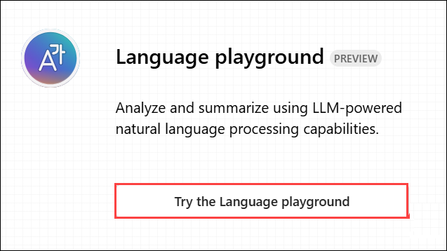
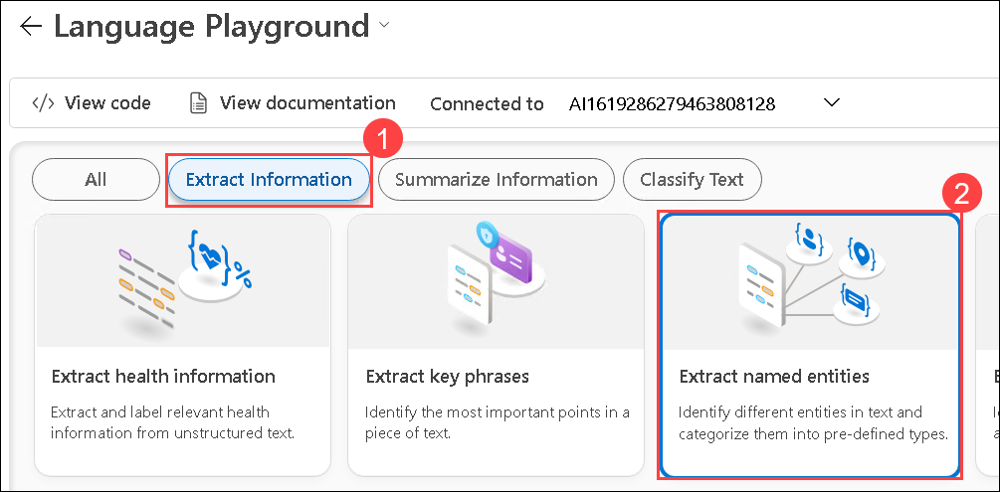
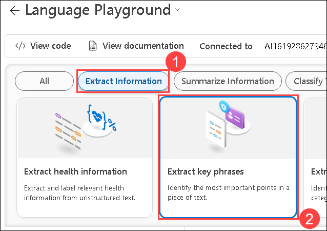

# Module 06: Analyze text in the Azure AI Foundry portal

## Lab overview

Natural Language Processing (NLP) is a branch of AI that deals with written and spoken language. You can use NLP to build solutions that extract semantic meaning from text or speech, or that formulate meaningful responses in natural language.

Azure AI Language service includes Text Analytics, with capabilities such as entity recognition, key phrase extraction, summarization, and sentiment analysis. For example, suppose the fictitious travel agent Margie's Travel encourages customers to submit reviews for hotel stays. You could use the Language service to extract named entities, identify key phrases, summarize text, and more.

In this exercise, you will use Azure AI Language in Azure AI Foundry portal, Microsoft's platform for creating intelligent applications, to analyze hotel reviews. 

## Lab objectives

In this lab, you will perform:
- Task 1: Create a project in the Azure AI Foundry portal
- Task 2: Extract named entities with Azure AI Language in the Azure AI Foundry portal
- Task 3: Extract key phrases with Azure AI Language in the Azure AI Foundry portal
- Task 4: Summarize text with Azure AI Language in the Azure AI Foundry portal

## Task 1: Create a project in the Azure AI Foundry portal

In this task, we are creating an Azure AI Foundry project and configuring the necessary resources to explore AI language capabilities in the Language Playground.

1. In a web browser, open the [Azure AI Foundry portal](https://ai.azure.com) at `https://ai.azure.com` and sign in using your Azure credentials. Close any tips or quick start panes that are opened the first time you sign in. 

1. In the browser, navigate to `https://ai.azure.com/managementCenter/allResources` and select **Create**. Then choose the option to create a *new AI hub resource*.

1. In the *Create a project* wizard, enter a valid name for your project, and if an existing hub is suggested, select the option to create a *new* one. 

1. Expand *Advanced options* to specify the following settings for your project:
    - **Subscription**: Your Azure subscription
    - **Resource group**: Create or select a resource group
    - **Region**: Select one of the following locations:
        * East US
        * France Central
        * Korea Central
        * West Europe
        * West US

    Wait for your project and hub to be created.

1. When the project is created, you will be taken to an *Overview* page of the project details.

1. On the left-hand menu on the screen, select **Playgrounds**.

1. On the *Playgrounds* page, select the **Language playground** tile to try out some Azure AI Language capabilities.

> **Congratulations** on completing the task! Now, it's time to validate it. Here are the steps:
 
- Hit the Validate button for the corresponding task. If you receive a success message, you can proceed to the next task. 
- If not, carefully read the error message and retry the step, following the instructions in the lab guide.
- If you need any assistance, please contact us at labs-support@spektrasystems.com. We are available 24/7 to help you out.

   <validation step="07c3e734-e32f-44b6-b8e8-7b5b85f4a45b" />

### Task 2: Extract named entities with Azure AI Language in the Azure AI Foundry portal

This task demonstrates how to use Azure AI Language Playground for Named Entity Recognition (NER). By analyzing a hotel review, Azure AI extracts key entities like locations, dates, and organizations, along with confidence scores. 

*Named entities* are words that describe people, places, and objects with proper names. Let's use the named entity extraction capability of Azure AI Language to identify types of information in a review.

1. Navigate to **Playgrounds** from the left pane, Under **Language playground** tile select **Try the Language playground (2)**.

    

1. In the Language playground, select **Extract information (1)**. Then select the **Extract named entities (2)** tile. 

   

1. Under **Sample**, copy and paste the following review:

    ```
    Tired hotel with poor service
    The Royal Hotel, London, United Kingdom
    5/6/2018
    This is an old hotel (has been around since 1950's) and the room furnishings are average - becoming a bit old now and require changing. The internet didn't work and had to come to one of their office rooms to check in for my flight home. The website says it's close to the British Museum, but it's too far to walk.
    ```

   
   
1. Click **Run** to process the text.

   

2. Review the output and observe the **Details** section, where the extracted entities are accompanied by additional information such as type and confidence scores. The confidence score indicates the probability that the identified type correctly belongs to the specified category.

   

## Task 3: Extract key phrases with Azure AI Language in the Azure AI Foundry portal

This task demonstrates how to use Azure AI Language Playground for key phrase extraction. By analyzing a hotel review, Azure AI identifies important phrases that summarize the text's main points. 

*Key phrases* are the most important pieces of information in the text. Let's use the key phrase extraction capability of Azure AI Language to pull important information from a review.

1. In the Language playground, select **Extract information (1)**. Then select the **Extract key phrases (2)** tile. 

   

1. Under **Sample**, copy and paste the following review:

    ```
    Good Hotel and staff
    The Royal Hotel, London, UK
    3/2/2018
    Clean rooms, good service, great location near Buckingham Palace and Westminster Abbey, and so on. We thoroughly enjoyed our stay. The courtyard is very peaceful and we went to a restaurant which is part of the same group and is Indian ( West coast so plenty of fish) with a Michelin Star. We had the taster menu which was fabulous. The rooms were very well appointed with a kitchen, lounge, bedroom and enormous bathroom. Thoroughly recommended.
    ```

   

1. Click **Run** to process the text.

   

1. Review the output and observe the different phrases extracted in the **Details** section. These phrases should represent key elements that contribute the most to the overall meaning of the text.

   

## Task 4: Summarize text with Azure AI Language in Azure AI Foundry portal

In this task, we are using Azure AI Language to generate an extractive summary by identifying key sentences from a hotel review.
 
1. Let's look at Azure AI Language's summarization capabilities. In the Language playground, select **Summarize information (1)**, then select the **Summarize text (2)** tile.

   

1. Under **Sample**, copy and paste the following review:
    
    ```
    Very noisy and rooms are tiny
    The Lombard Hotel, San Francisco, USA
    9/5/2018
    Hotel is located on Lombard street which is a very busy SIX lane street directly off the Golden Gate Bridge. Traffic from early morning until late at night especially on weekends. Noise would not be so bad if rooms were better insulated but they are not. Had to put cotton balls in my ears to be able to sleep--was too tired to enjoy the city the next day. Rooms are TINY. I picked the room because it had two queen size beds--but the room barely had space to fit them. With family of four in the room it was tight. With all that said, rooms are clean and they've made an effort to update them. The hotel is in Marina district with lots of good places to eat, within walking distance to Presidio. May be good hotel for young stay-up-late adults on a budget
    ```

   

1. Click **Run** to process the text.

   

1. Review the output and observe that the *Extractive summary* in the **Details** section provides rank scores for the most significant sentences, highlighting their relevance to the overall text.  

   

### Review
In this exercise, you have completed the following tasks:
- Created a project in the Azure AI Foundry portal
- Extracted named entities with Azure AI Language in the Azure AI Foundry portal
- Extracted key phrases with Azure AI Language in the Azure AI Foundry portal
- Summarized text with Azure AI Language in the Azure AI Foundry portal 

## Learn more

To learn more about what you can do with this service, see the [Language service page](https://learn.microsoft.com/azure/ai-services/language-service/overview).

## You have successfully completed this lab.
