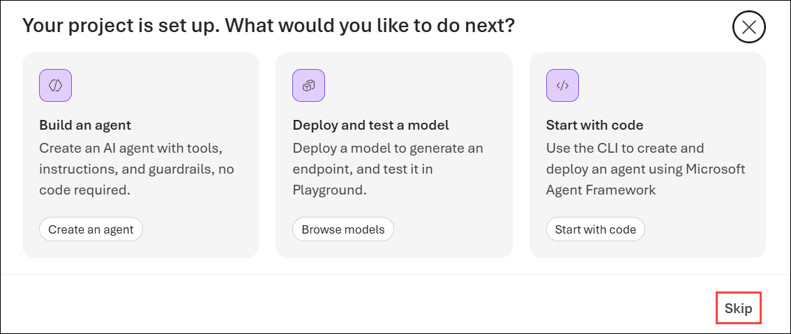
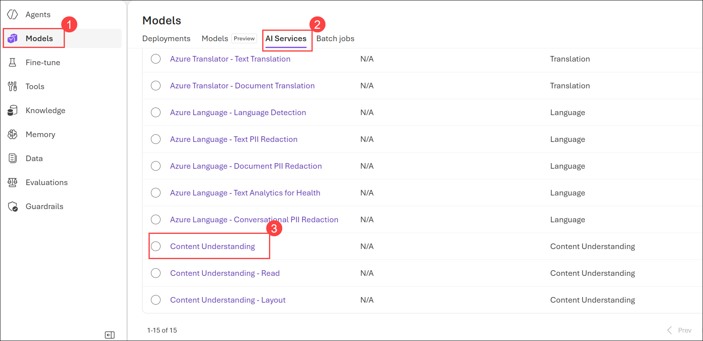

# Get started with information extraction in Microsoft Foundry

### Estimated Duration: 45 Minutes

## Lab overview

In this lab, you will explore how to use Microsoft Foundry and Azure AI Content Understanding to extract structured information from documents using AI-powered analyzers. You will begin by creating a Microsoft Foundry project and accessing the Content Understanding playground, where you'll explore different prebuilt analyzers such as OCR/Read, Layout, and Receipt.

You will learn how each analyzer extracts progressively richer information—from raw text and document layout to structured business fields. You'll analyze sample documents, review extracted fields, markdown output, tables, and JSON results, and understand how Azure AI transforms unstructured content into structured information suitable for business applications.

Finally, you'll explore the automatically generated Python SDK sample code to understand how developers can integrate Azure AI Content Understanding into custom applications for automated document analysis and intelligent document processing.

## Lab objectives

In this exercise, you will perform:

- Task 1: Create a Microsoft Foundry project
- Task 2: Use Content Understanding to extract information from documents
- Task 3: Understand how to extract content with the Python SDK

## Task 1: Create a Microsoft Foundry project

In this task, you'll create a Microsoft Foundry project, configure the required Azure resources, and obtain the project endpoint needed for application development.

1. Copy the **Microsoft Foundry** link and paste it into a new browser tab to access the portal: `https://ai.azure.com/`

1. On the **Microsoft Foundry** home page, click on **Start building** in the top right corner.

     

1. If prompted to sign in, enter your credentials:
 
   - **Email/Username:** Enter <inject key="AzureAdUserEmail"></inject> **(1)** and click on **Next (2)**.
 
        
 
   - **Password:** Enter <inject key="AzureAdUserPassword"></inject> **(1)** and click on **Sign in (2)**.
 
      .png)

1. If prompted to **Stay signed in?**, you can click **No**.

    

1. If prompted with, the **Get started with Microsoft Foundry** page, click on **Create project**.

   

1. In the **Create a project** wizard, enter project name **Myproject<inject key="DeploymentID" enableCopy="false" /> (1)**, and **Expand Advanced options (2)** to specify the following settings for your project: 

    - Foundry resource: **AI<inject key="DeploymentID" enableCopy="false" /> (3)**
    - Subscription : **Leave default subscription (4)** 
    - Region : Select **<inject key="location" enableCopy="false"/> (5)**
    - Resource group : Select **AI-901 (6)** 
    - Click on **Create** **(7)**

      

        > **Note:** If project creation gives an authorization error related to Application Insights or Log Analytics resources (for example, errors containing `Microsoft.OperationalInsights/workspaces/write` or `Microsoft.Insights/components/write`), **Toggle off** the *Set up recommended resources so I can explore everything Foundry has to offer* option before creating the project.

        .png)

        >**Note:** Model deployments are restricted by regional quotas. If you select a region in which you have insufficient available quota, you may need to select an alternative region for a new resource later. At the time of writing, Content Understanding is supported in these regions: `West US`,`Sweden Central`, and `Australia East`.

1. Wait for your project to be created. It may take a few minutes. 

1. In the **All set, Let's build your agents** window, click **Let's go**.

    

1. On the **Your project is set up. What would you like to do next?** pop-up, select **Skip**.

    

1. After creating a project in the new Foundry portal, it should open in a page similar to the following image:

      

      > **Note:** The Microsoft Foundry landing page may vary depending on the version of the portal, your account configuration, or recent UI updates. If your home page looks different, continue with the lab by locating the required menu options using the navigation menu. The appearance of the portal may differ, but the functionality and lab steps remain the same.

    .png)

> **Congratulations** on completing the task! Now, it's time to validate it. Here are the steps:
 
- Hit the Validate button for the corresponding task. You will receive a success message. 
- If not, carefully read the error message and retry the step, following the instructions in the lab guide.
- If you need any assistance, please contact us at cloudlabs-support@spektrasystems.com. We are available 24/7 to help you out.

  <validation step="d54b3abe-8f62-4f21-a451-21a3bef84bef" />

## Task 2: Use Content Understanding to extract information from documents

In this task, you will use the Azure AI Content Understanding playground to analyze documents with different prebuilt analyzers. You'll compare how OCR/Read, Layout, and Receipt analyzers extract increasing levels of information-from plain text to document structure and business-specific fields-and review the generated markdown, tables, extracted fields, and raw JSON results.

1. In the new Foundry portal, navigate to the tool bar at the top of the screen and select **Build**.

    

1. On the **Build** page, navigate to the menu on the left-side of the screen (you may need to expand it by clicking on the expand icon at the bottom of the menu). From the left-side menu, select **Models (1)**. Then, at the top of the Models page, select **AI Services (2)**. 3. Select **Content Understanding (3)** to open the **Content Understanding** tool playground.

    

4. Select **OCR/Read** from the **Content Understanding** playground page.

    

1. Ensure that **Document (1)** is selected in the **Modality** list, and **OCR/Read (2)** is selected in the list of analyzers. Select any sample **(3)** , and use the **Run analysis (4)** button to extract information from the document.

    

5. When analysis is complete, view the results. In the pane on the right, review the **Markdown**, **Paragraphs**, and **Result** tabs to see the data that has been read from the document by the analyzer.

    The `OCR/Read` analyzer extracts text from documents. However, sometimes it may be useful to extract additional information about the `layout` of the text in the document.

    

7. In the list of analyzers, click on the drop-down **(1)** and select **Layout (2)**.

    

1. Then select any of the available samples **(1)** and use the **Run analysis (2)** button to extract information from it. When analysis is complete, view the results.

    

1. In the pane on the right, review the **Markdown**, **Paragraphs**, **Tables**, and **Result** tabs to see the ways in which the layout of the data in the document has been interpreted by the analyzer.

    Extacting the text and page layout is useful when the documents need to scan have a consistent, well-defined structure. In many cases though, you need to be able to identify which text values map to which data fields; so a more specific analyzer is needed.

    

1. In the list of analyzer drop-down **(1)**, select **Procurement (2)**.

    

    > **Note:** Field extraction requires a custom model, so you may be prompted to deploy models during this process. Click **Cancel** when this happens.<br><br>Do <u>not</u> run analysis - we'll review the pre-prepared analysis results.

    

1. Now click on the drop-down **(1)** icon and select the **Receipt (2)** analyzer.

    

1. In the pane on the right, review the **Fields**, **Markdown**, **Paragraphs**, and **Result** tabs to see the data extracted from the document by the analyzer.

    The **Fields** tab displays a user-friendly version of the information from the raw JSON in the **Results** tab, which is how a client application would receive the results of analysis.

    

## Task 3: Understand how to extract content with the Python SDK

In this task, you will examine the Python SDK code generated by Microsoft Foundry for Azure AI Content Understanding. You'll learn how applications authenticate with the service, submit documents for asynchronous analysis, invoke prebuilt analyzers, and process the structured JSON response returned by the service.

1. Let's take a closer look at the Python code for document layout analysis. In the Content Understanding playground, while viewing the results of the **Receipt** analyzer, select the **Code** tab. 

    

1. The following code will be provided:

    ```python  
    import sys
    import json
    
    from azure.ai.contentunderstanding import ContentUnderstandingClient
    from azure.ai.contentunderstanding.models import AnalysisInput, AnalysisResult
    from azure.core.credentials import AzureKeyCredential
    from azure.core.exceptions import AzureError
    from azure.identity import DefaultAzureCredential
    
    def main() -> None:
        # Insert the following configurations.
        # 1) AZURE_CONTENT_UNDERSTANDING_ENDPOINT - the endpoint to your Content Understanding resource.
        endpoint = "<https://content-project-resource.services.ai.azure.com/>"
    
        # 2) CONTENT_UNDERSTANDING_KEY - your Content Understanding API key (optional if using DefaultAzureCredential).
        key = "{{CONTENT_UNDERSTANDING_KEY}}"
    
        # 3) FILE_URL - you can replace this with your own URL.
        file_url = "{{FILE_URL}}"
    
        # ANALYZER_ID - the ID of the analyzer to use.
        analyzer_id = "prebuilt-receipt"
    
        # API_VERSION - the API version to use.
        api_version = "2025-11-01"
    
        # Set up Content Understanding client.
        credential = AzureKeyCredential(key) if key and "{{CONTENT_UNDERSTANDING_KEY}}" not in key else DefaultAzureCredential()
        client = ContentUnderstandingClient(endpoint=endpoint, credential=credential, api_version=api_version)
    
        # [START analyze]
        print(f"Analyzing with {analyzer_id} analyzer...")
        print(f"  File URL: {file_url}\n")
    
        try:
            poller = client.begin_analyze(
                analyzer_id=analyzer_id,
                inputs=[AnalysisInput(url=file_url)],
            )
            result: AnalysisResult = poller.result()
        except AzureError as err:
            print(f"[Azure Error]: {err.message}")
            sys.exit(1)
        except Exception as ex:
            print(f"[Unexpected Error]: {ex}")
            sys.exit(1)
        # [END analyze]
    
        # [START output_result]
        print("=" * 50)
        print("Analysis result:")
        print("=" * 50 + "\n")
    
        max_display_lines = 50
        result_str = json.dumps(result.as_dict(), indent=2)
        ret_lines = result_str.splitlines()
    
        if len(ret_lines) > max_display_lines:
            print("\n".join(ret_lines[:max_display_lines]))
            print(f"\n {len(ret_lines) - max_display_lines} more lines to be displayed...\n")
        else:
            print(result_str)
        # [END output_result]
    
    if **name** == "**main**":
        main()
    ```

    The code connects to the Content Understanding tool in your Foundry resource, and submits a document file to the *prebuilt-receipt* analyzer. The analyzer runs asynchronously, and returns the results of the analysis in the JSON format you saw in the **Result** tab.

## Summary

In this lab, you explored how Azure AI Content Understanding within Microsoft Foundry enables intelligent document processing by transforming unstructured documents into structured, machine-readable information.

You learned how different analyzers provide progressively richer insights:

OCR/Read extracts raw text from documents and images.
Layout identifies document structure, including paragraphs, tables, and reading order.
Receipt extracts structured business information such as key-value pairs and fields from business documents.

You also explored the generated Python SDK code and learned how developers can integrate Azure AI Content Understanding into custom applications to automate document analysis and build intelligent document processing solutions.

By completing this lab, you gained practical experience using Microsoft Foundry and Azure AI Content Understanding to extract text, document structure, and business-specific information for real-world AI-powered document processing scenarios.

### Congratulations, you’ve successfully completed the hands-on lab!