# Get started with information extraction in Microsoft Foundry

### Estimated Duration: 45 Minutes

## Lab overview

In this lab, you will explore how to use Azure AI Content Understanding in Microsoft Foundry to extract meaningful information from documents and images. You'll create a Microsoft Foundry project and use the Content Understanding playground to analyze documents with prebuilt analyzers such as OCR/Read, Layout, and Receipt. You'll examine how each analyzer extracts progressively richer information, from raw text to document structure and business-specific fields, and analyze both sample documents and real-world PCB images. Finally, you'll review the generated Python SDK sample code to understand how Azure AI Content Understanding can be integrated into intelligent document processing applications.

## Lab objectives

In this lab, you will perform the following tasks:

- Task 1: Get started with Microsoft Foundry
- Task 2: Use Content Understanding to extract information from documents
- Task 3: Understand how to extract content with the Python SDK

## Task 1: Get started with Microsoft Foundry

In this task, you'll sign in to the Microsoft Foundry portal, access a pre-configured Microsoft Foundry project, and familiarize yourself with the project workspace that will be used throughout the lab.

1. Copy the **Microsoft Foundry** link and paste it into a new browser tab to access the portal: `https://ai.azure.com/`

1. On the **Microsoft Foundry** home page, click on **Start building** in the top right corner.

   

1. If prompted to sign in, enter your credentials:
   - **Email/Username:** Enter <inject key="AzureAdUserEmail"></inject> **(1)** and click on **Next (2)**.

     

   - **Password:** Enter <inject key="AzureAdUserPassword"></inject> **(1)** and click on **Sign in (2)**.

     .png>)

1. If prompted to **Stay signed in?**, you can click **No**.

   

1. After signing in to the **Microsoft Foundry** portal, you will be taken to the **All resources** page. A project named **myproject<inject key="DeploymentID"></inject>** has already been created for you. Select this pre-created project to open it. You will use this project throughout the remainder of the lab.

   

1. In the **Your project is set up. What would you like to do next ?** pop-up, click **X** button to dismiss the window.

   

1. After selecting the project in the **Foundry** portal, it should open in a page similar to the following image:

   

### Task 1.1: Create a Microsoft Foundry project (READ ONLY)

> ### **Note:** <span style="color:maroon">A Microsoft Foundry resource and project have already been created and configured for your lab environment. This section is provided for demonstration purposes only to show how a Foundry resource and project can be created in Microsoft Foundry. The following steps are **read-only** and **do not need to be performed** as part of this lab. Continue using the pre-created project for the remaining exercises.</span>

In this task, you'll learn how to create a Microsoft Foundry project by configuring the required Azure settings, including the Foundry resource, region, subscription, and resource group. This is a demonstration only and does not require any action during the lab.

1. On the **Microsoft Foundry** home page, click on **Start building** in the top right corner.

   

1. If prompted to sign in, enter your credentials:
   - **Email/Username:** Enter <inject key="AzureAdUserEmail"></inject> **(1)** and click on **Next (2)**.

     

   - **Password:** Enter <inject key="AzureAdUserPassword"></inject> **(1)** and click on **Sign in (2)**.

     .png>)

1. If prompted to **Stay signed in?**, you can click **No**.

   

1. From the **Microsoft Foundry** portal, select the **project selector (1)** located at the top of the page, and then choose **Create new project (2)**. In the **Create a project** pane, enter a unique project name like **myproject-<inject key="DeploymentID" enableCopy="false" /> (3)** Verify that the **Foundry resource (4)** is automatically populated, set the **Region** to **<inject key="Location" enableCopy="false" /> (5)**, confirm that the default **Subscription (6)** is selected, and choose the appropriate **Resource group (7)**. Ensure that the **Set up recommended resources so I can explore everything Foundry has to offer** option is **disabled (8)**, and then select **Create (9)**.

   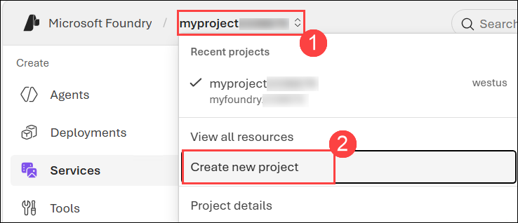

   

1. In the **Your project is set up. What would you like to do next ?** pop-up, click **X** button to dismiss the window.

   

1. After creating a project in the new **Foundry** portal, it should open in a page similar to the following image:

   

## Task 2: Use Content Understanding to extract information from documents

In this task, you'll use the Azure AI Content Understanding playground to analyze documents and images with prebuilt analyzers, compare the information extracted by OCR/Read, Layout, and Receipt analyzers, and understand how unstructured content is transformed into structured data.

### Task 2.1: Open the Content Understanding playground in Foundry portal

1. In the new Foundry portal, navigate to the tool bar at the top of the screen and select **Build**.

   

1. On the **Build** page, in the menu on the left-side of the screen, select the **Services**.

   -lab6t1p1.png>)

   > **Note:** In some cases, you may see a slightly different interface in which the list of **AI services** can be found by selecting the **Deployments** page, and viewing its **AI Services** tab.

1. Select **Content Understanding** to open the _Content Understanding_ tool playground.

   -lab6t1p2.png>)

### Task 2.2: Use OCR to read text in an image

Suppose you want to find information related to a piece of computer hardware or some other item with information printed on it. A first step might be to digitize the text so you can use it to look up details on the Internet or in an AI assistant. You can use an AI technique called optical character recognition (OCR) to "read" text in images.

1. Select **OCR/Read** from the **Content Understanding** playground page.

   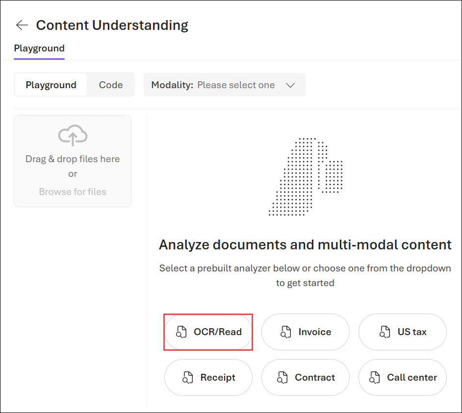

1. Ensure that **Document (1)** is selected in the **Modality** list, and **OCR/Read (2)** is selected in the list of analyzers. Select any sample **(3)** , and use the **Run analysis (4)** button to extract information from the document.

   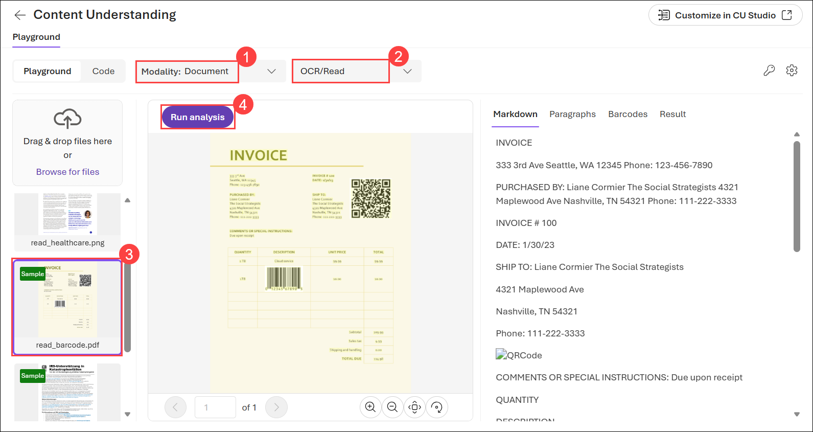

1. When analysis is complete, view the results. In the pane on the right, review the **Markdown**, **Paragraphs**, and **Result** tabs to see the data that has been read from the document by the analyzer.

   The `OCR/Read` analyzer extracts text from documents. However, sometimes it may be useful to extract additional information about the `layout` of the text in the document.

   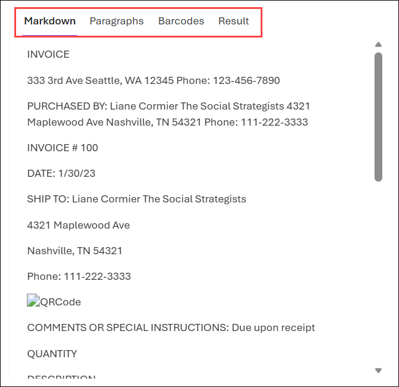

1. In a new browser tab, download **[pcbs.zip](https://aka.ms/pcb-images)** from `https://aka.ms/pcb-images`.

1. Select the **open folder** icon next to the downloaded pcbs.zip file to open its location in File Explorer.

   -lab6t1p3.png>)

1. In File Explorer, right-click the downloaded **pcbs.zip file (1)** and select **Extract All... (2)** to extract the contents of the ZIP archive.

   -lab6t1p4.png>)

1. In the **Extract Compressed (Zipped)** Folders dialog, verify the destination folder **(1)** where the files will be extracted, and then select **Extract (2)** to extract the contents.

   -lab6t1p5.png>)

1. Select **Browse for files (1)**, navigate to the extracted **pcbs** folder **(2)**, select the **pcb-1** file **(3)**, and then select **Open (4)** to upload the document to the Content Understanding Playground.

   -lab6t1p6.png>)

1. Click on **Run analysis** to run analysis on the uploaded image and review the results.

   -lab6t1p7.png>)

1. Repeat the process to analyze the other PCB images you downloaded.

   The _OCR/Read_ analyzer extracts text from images. However, sometimes it may be useful to extract additional information about the _layout_ of the text in the image.

1. In the list of analyzers, click on the drop-down **(1)** and select **Layout (2)**.

   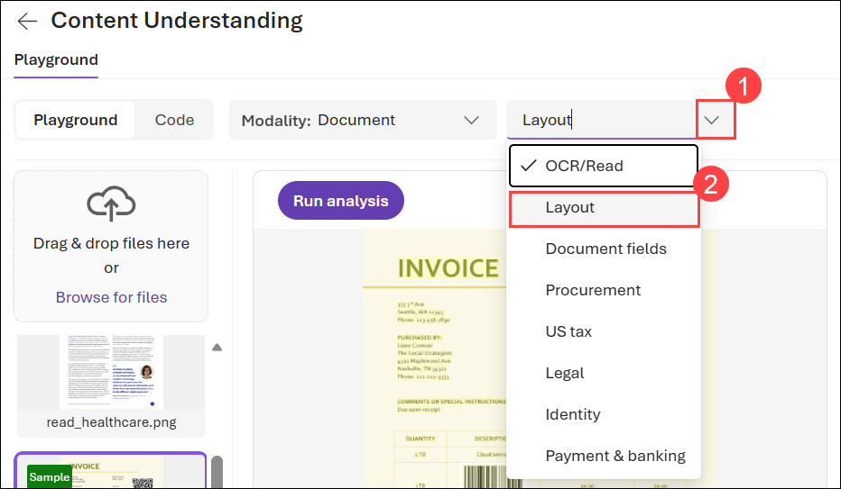

1. Then select any of the available samples **(1)** and use the **Run analysis (2)** button to extract information from it. When analysis is complete, view the results.

   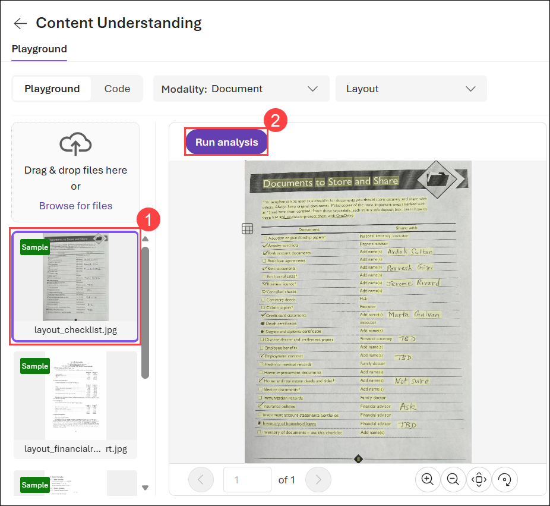

1. In the pane on the right, review the **Markdown**, **Paragraphs**, **Tables**, and **Result** tabs to see the ways in which the layout of the data in the document has been interpreted by the analyzer.

   Extacting the text and page layout is useful when the documents need to scan have a consistent, well-defined structure. In many cases though, you need to be able to identify which text values map to which data fields; so a more specific analyzer is needed.

   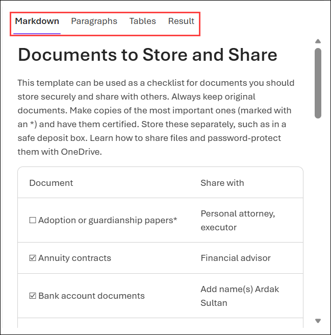

### Task 2.3: Extract fields from documents

Now suppose you need to extract data fields from scanned receipts to help automate an expense claim solution. You can use OCR to identify text and its location in images, and then use a generative AI model to associate individual text values with specific data fields - such as company names, phone numbers, dates, amounts, and so on.

1. In the list of analyzer drop-down **(1)**, select **Procurement (2)**.

   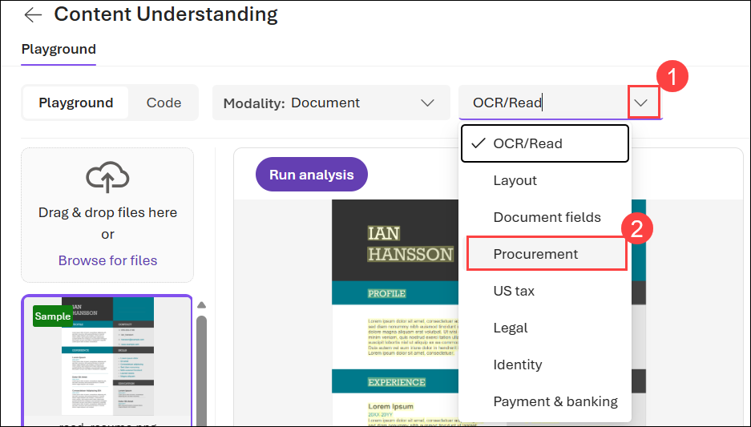

   > **Note:** Field extraction requires a custom model, so you may be prompted to deploy models during this process. Click **Cancel** when this happens.<br><br>Do <u>not</u> run analysis - we'll review the pre-prepared analysis results.
   >
   > 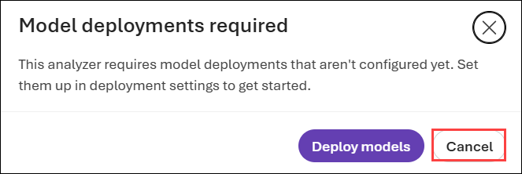

1. Now click on the drop-down **(1)** icon and select the **Receipt (2)** analyzer.

   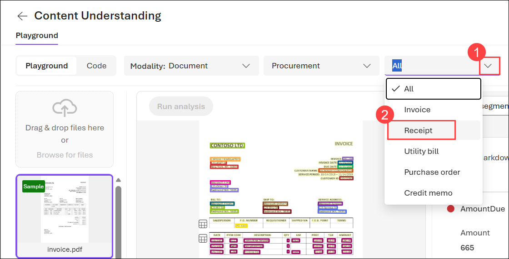

   > **Note:** Field extraction requires a custom model, so you may be prompted to deploy models during this process. Click **Cancel** when this happens.
   >
   > 

1. In the pane on the right, review the **Fields**, **Markdown**, **Paragraphs**, and **Result** tabs to see the data extracted from the document by the analyzer.

   The **Fields** tab displays a user-friendly version of the information from the raw JSON in the **Results** tab, which is how a client application would receive the results of analysis.

   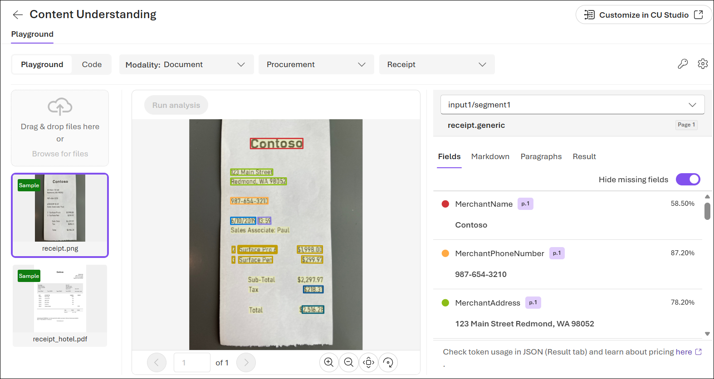

## Task 3: Understand how to extract content with the Python SDK

In this task, you'll review the Python SDK sample code generated by Microsoft Foundry to understand how applications authenticate with Azure AI Content Understanding, submit documents for analysis, and process the structured JSON results returned by the service.

1. Let's take a closer look at the Python code for document layout analysis. In the Content Understanding playground, while viewing the results of the **Receipt** analyzer, select the **Code** tab.

   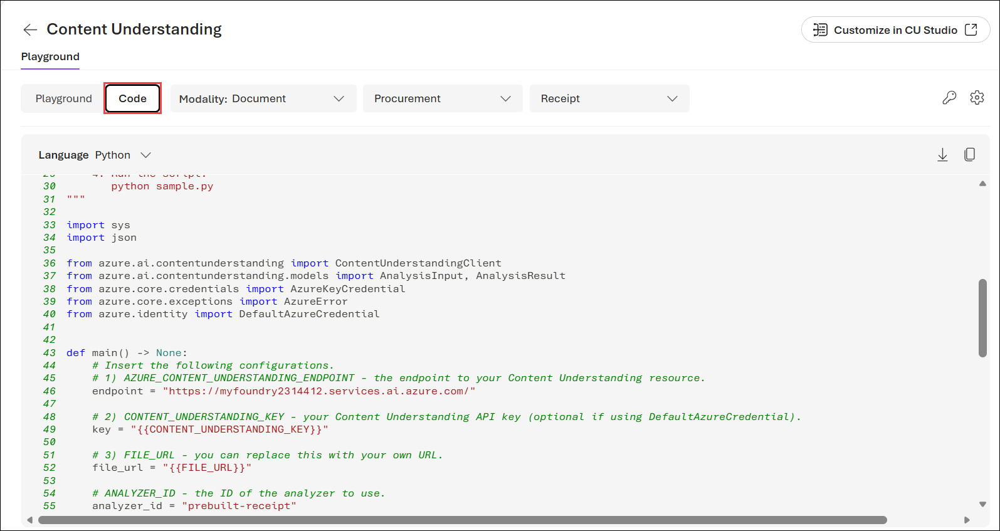

1. The following code will be provided:

   ```python
   import sys
   import json

   from azure.ai.contentunderstanding import ContentUnderstandingClient
   from azure.ai.contentunderstanding.models import AnalysisInput, AnalysisResult
   from azure.core.credentials import AzureKeyCredential
   from azure.core.exceptions import AzureError
   from azure.identity import DefaultAzureCredential

   def main() -> None:
       # Insert the following configurations.
       # 1) AZURE_CONTENT_UNDERSTANDING_ENDPOINT - the endpoint to your Content Understanding resource.
       endpoint = "<https://content-project-resource.services.ai.azure.com/>"

       # 2) CONTENT_UNDERSTANDING_KEY - your Content Understanding API key (optional if using DefaultAzureCredential).
       key = "{{CONTENT_UNDERSTANDING_KEY}}"

       # 3) FILE_URL - you can replace this with your own URL.
       file_url = "{{FILE_URL}}"

       # ANALYZER_ID - the ID of the analyzer to use.
       analyzer_id = "prebuilt-receipt"

       # API_VERSION - the API version to use.
       api_version = "2025-11-01"

       # Set up Content Understanding client.
       credential = AzureKeyCredential(key) if key and "{{CONTENT_UNDERSTANDING_KEY}}" not in key else DefaultAzureCredential()
       client = ContentUnderstandingClient(endpoint=endpoint, credential=credential, api_version=api_version)

       # [START analyze]
       print(f"Analyzing with {analyzer_id} analyzer...")
       print(f"  File URL: {file_url}\n")

       try:
           poller = client.begin_analyze(
               analyzer_id=analyzer_id,
               inputs=[AnalysisInput(url=file_url)],
           )
           result: AnalysisResult = poller.result()
       except AzureError as err:
           print(f"[Azure Error]: {err.message}")
           sys.exit(1)
       except Exception as ex:
           print(f"[Unexpected Error]: {ex}")
           sys.exit(1)
       # [END analyze]

       # [START output_result]
       print("=" * 50)
       print("Analysis result:")
       print("=" * 50 + "\n")

       max_display_lines = 50
       result_str = json.dumps(result.as_dict(), indent=2)
       ret_lines = result_str.splitlines()

       if len(ret_lines) > max_display_lines:
           print("\n".join(ret_lines[:max_display_lines]))
           print(f"\n {len(ret_lines) - max_display_lines} more lines to be displayed...\n")
       else:
           print(result_str)
       # [END output_result]

   if **name** == "**main**":
       main()
   ```

   The code connects to the Content Understanding tool in your Foundry resource, and submits a document file to the _prebuilt-receipt_ analyzer. The analyzer runs asynchronously, and returns the results of the analysis in the JSON format you saw in the **Result** tab.

## Summary

In this lab, you created a Microsoft Foundry project and explored Azure AI Content Understanding for intelligent document and image processing. You used the Content Understanding playground to analyze sample documents and PCB images with the OCR/Read, Layout, and Receipt analyzers, gaining an understanding of how each analyzer extracts increasingly rich information from unstructured content. Finally, you reviewed the generated Python SDK sample code to learn how applications can integrate Azure AI Content Understanding for automated document analysis and structured information extraction, providing a foundation for building intelligent document processing solutions.

### Congratulations, you’ve successfully completed the hands-on lab!
