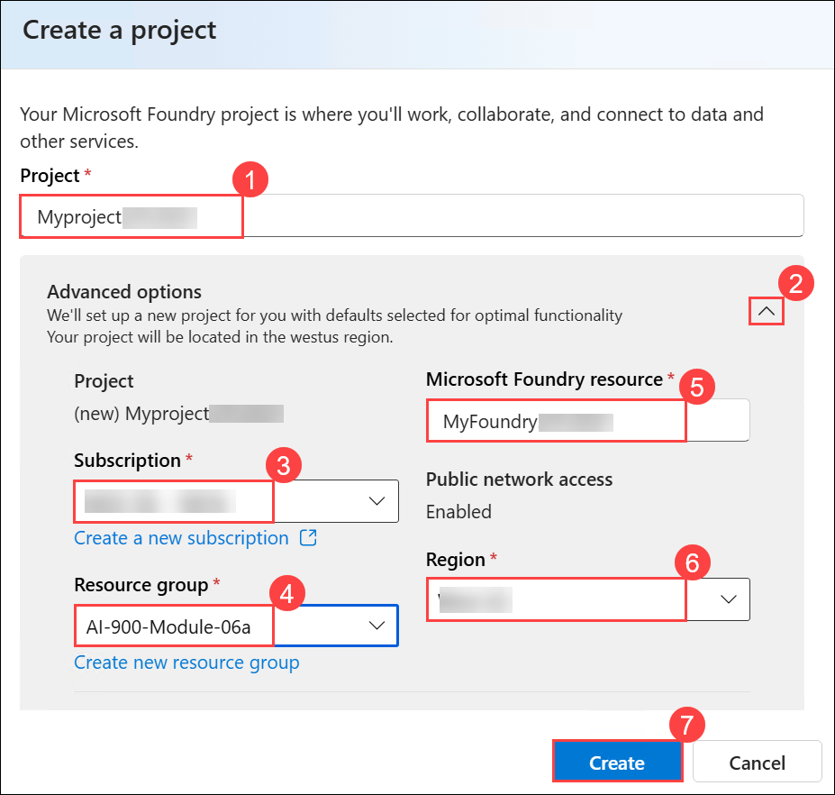

# Get started with information extraction in Microsoft Foundry

### Estimated Duration: 30 Minutes

## Lab overview

In this lab, you will explore Microsoft Foundry and Azure Content Understanding to extract structured information from documents. You will create a Foundry project and use the Content Understanding analyzer to process invoice documents in the portal. You will review the extracted fields and JSON output, and understand how document analysis can be performed programmatically using REST APIs. This lab demonstrates how AI can be used to automate information extraction from business documents.

## Lab objectives

In this exercise, you will perform:

- Task 1: Create a Microsoft Foundry project
- Task 2: Extract information from an invoice in Foundry portal (classic)

## Task 1: Create a Microsoft Foundry project

In this task, you'll create and configure a Microsoft Foundry project to organize the resources, models, and settings required for using Azure Content Understanding.

1. Copy the **Microsoft Foundry** link and paste it into a new browser tab to access the portal: `https://ai.azure.com/`

1. On the **Microsoft Foundry** home page, click on **Sign in** in the top right corner.

   

1. If prompted to sign in, enter your credentials:
 
   - **Email/Username:** Enter <inject key="AzureAdUserEmail"></inject> **(1)** and click on **Next (2)**.
 
      
 
   - **Password:** Enter <inject key="AzureAdUserPassword"></inject> **(1)** and click on **Sign in (2)**.
 
     .png)

1. If prompted to **Stay signed in?**, you can click **No**.

   

   > **Note:** Close any tips or quick start panes that are opened the first time you sign in, and if necessary, use the **Foundry** logo at the top left to navigate to the home page.

1. Scroll to the bottom of the page, and select the **Explore Azure AI Services** tile.

    

1. On the Azure AI Services page, select **Try Content Understanding**.

    

1. On the Content Understanding page, select **Create a project to start (1)**. Then in the **Create project** dialog, select the recommended **Microsoft Foundry resource (2)** and then click on **Next (3)**.

    

1. In the **Create a project** wizard, enter project name **Myproject<inject key="DeploymentID" enableCopy="false" /> (1)**, and expand **Advanced options (2)** to specify the following settings for your project: 

    - Subscription : **Leave default subscription (3)** 
    - Resource Group : Select **AI-900-Module-06a (4)** 
    - Microsoft Foundry resource: **MyFoundry<inject key="DeploymentID" enableCopy="false" /> (5)**
    - Region : Select **<inject key="location" enableCopy="false"/> (6)**
    - Click on **Create** **(7)**

      
      
      >**Note:** Model deployments are restricted by regional quotas. If you select a region in which you have insufficient available quota, you may need to select an alternative region for a new resource later. At the time of writing, Content Understanding is supported in these regions: `West US`,`Sweden Central`, and `Australia East`.

1. Wait for the set up process to complete. It may take a few minutes.

> **Congratulations** on completing the task! Now, it's time to validate it. Here are the steps:
 
- Hit the Validate button for the corresponding task. You will receive a success message. 
- If not, carefully read the error message and retry the step, following the instructions in the lab guide.
- If you need any assistance, please contact us at cloudlabs-support@spektrasystems.com. We are available 24/7 to help you out.

  <validation step="ef1ed7b3-d177-4af2-b182-064e6945644b" />

## Task 2: Extract information from an invoice in Foundry portal (classic)

In this task, you'll use the Foundry portal to analyze an invoice with the prebuilt Content Understanding analyzer and review the extracted fields and JSON results.

1. On the Content Understanding page, select the **Try it out (1)** tab, and then select the **Invoice Data Extraction (2)** tile.

    

    A sample invoice is provided.

1. Select the sample invoice and click on **Run analysis (1)** button to extract information from it. When analysis is complete, view the results **(2)**.

    

1. Open a new browser tab and paste the following link to download **contoso-invoice-1.pdf**.

    ```
    https://raw.githubusercontent.com/MicrosoftLearning/mslearn-ai-fundamentals/refs/heads/main/data/content-understanding/contoso-invoice-1.pdf
    ``` 

1. Click on the **Browse for files (1)**. In the *Open* window, click on the **Downloads (2)** under *Quick access* section and then select the file  **contoso-invoice-1.pdf (3)** that you downloaded previously, and then click on **Open (4)**.

    

1. Make sure that **contoso-invoice-1.pdf** is selected and then click on **Run analysis**.

    

    .png)

    >**Note:** The Content Understanding analyzer is able to extract information from this invoice, even though it is formatted diffferently from the sample.

1. In the right-hand pane showing the extracted fields, open the **Result** tab to view the JSON response sent to a client application, which developers can then process and use to work with the extracted data.

    

    Developers can use the REST API to build an app that submits a document for analysis using a POST operation. For example, the following cUrl command could be used to analyze an invoice:

    ```bash
   curl -i -X POST "{endpoint}/contentunderstanding/analyzers/{analyzerId}:analyze?api-version=2025-11-01" \
      -H "Ocp-Apim-Subscription-Key: {key}" \
      -H "Content-Type: application/json" \
      -d '{
            "inputs":[
              {
                "url": "https://{url_path}/invoice.png"
              }          
            ]
          }'
    ```

    The analysis is performed asynchronously, so the response includes an **id** value that can be used to poll for the results:

    ```json
   {
      "id": {resultId},
      "status": "Running",
      "result": {
        "analyzerId": {analyzerId},
        "apiVersion": "2025-11-01",
        "createdAt": "YYYY-MM-DDTHH:MM:SSZ",
        "warnings": [],
        "contents": []
      }
    }
    ```

    To retrieve the results using the ID, the client must submit a GET request:

    ```bash
   curl -i -X GET "{endpoint}/contentunderstanding/analyzerResults/{resultId}?api-version=2025-11-01" \
      -H "Ocp-Apim-Subscription-Key: {key}"
    ```


## Summary

In this exercise, you used Microsoft Foundry and Azure Content Understanding to extract structured information from invoices. You created a Foundry project, analyzed sample and custom invoice documents in the portal, and reviewed the extracted data and JSON responses. You also explored how to perform document analysis programmatically using REST APIs.

This exercise demonstrates how Azure Content Understanding can be used to automate document processing and data extraction. From this foundation, you can build intelligent applications that process and analyze business documents efficiently, enabling automation of real-world workflows.

### Congratulations, you’ve successfully completed the hands-on lab!