# Get started with information extraction in Microsoft Foundry

### Estimated Duration: 45 Minutes

## Lab overview

In this lab, you will explore how to use Microsoft Foundry and Azure Content Understanding to extract structured information from documents and images. You will begin by creating a Microsoft Foundry project and exploring different Content Understanding capabilities, including Read, Layout, and Document Fields analyzers. You will learn how each analyzer extracts different levels of information, from raw text to document structure and business-specific fields.

You will then analyze sample documents and invoices in the Foundry portal, review extracted fields and JSON results, and observe how Content Understanding transforms unstructured content into structured data. Finally, you will examine Python SDK code generated by Foundry and learn how developers can programmatically analyze documents using Azure Content Understanding.

Through these activities, you will gain hands-on experience using AI-powered document analysis services to extract text, structure, and business information from content, enabling intelligent document processing solutions.

## Lab objectives

In this exercise, you will perform:

- Task 1: Create a Microsoft Foundry project
- Task 2: Extract information from documents in the new Foundry portal
- Task 3: Understand how to extract content with the Python SDK

## Task 1: Create a Microsoft Foundry project

In this task, you'll create a Microsoft Foundry project, configure the required Azure resources, and obtain the project endpoint needed for application development.

1. Copy the **Microsoft Foundry** link and paste it into a new browser tab to access the portal: `https://ai.azure.com/`

1. On the **Microsoft Foundry** home page, click on **Start building** in the top right corner.

     

1. If prompted to sign in, enter your credentials:
 
   - **Email/Username:** Enter <inject key="AzureAdUserEmail"></inject> **(1)** and click on **Next (2)**.
 
        
 
   - **Password:** Enter <inject key="AzureAdUserPassword"></inject> **(1)** and click on **Sign in (2)**.
 
      .png)

1. If prompted to **Stay signed in?**, you can click **No**.

    

1. If prompted with, the **Get started with Microsoft Foundry** page, click on **Create project**.

   

1. In the **Create a project** wizard, enter project name **Myproject<inject key="DeploymentID" enableCopy="false" /> (1)**, and **Expand Advanced options (2)** to specify the following settings for your project: 

    - Foundry resource: **AI<inject key="DeploymentID" enableCopy="false" /> (3)**
    - Subscription : **Leave default subscription (4)** 
    - Region : Select **<inject key="location" enableCopy="false"/> (5)**
    - Resource group : Select **AI-901 (6)** 
    - Click on **Create** **(7)**

      

        > **Note:** If project creation gives an authorization error related to Application Insights or Log Analytics resources (for example, errors containing `Microsoft.OperationalInsights/workspaces/write` or `Microsoft.Insights/components/write`), **Toggle off** the *Set up recommended resources so I can explore everything Foundry has to offer* option before creating the project.

        .png)

        >**Note:** Model deployments are restricted by regional quotas. If you select a region in which you have insufficient available quota, you may need to select an alternative region for a new resource later. At the time of writing, Content Understanding is supported in these regions: `West US`,`Sweden Central`, and `Australia East`.

1. Wait for your project to be created. It may take a few minutes. 

1. In the **All set, Let's build your agents** window, click **Let's go**.

    

1. After creating a project in the new Foundry portal, it should open in a page similar to the following image:

      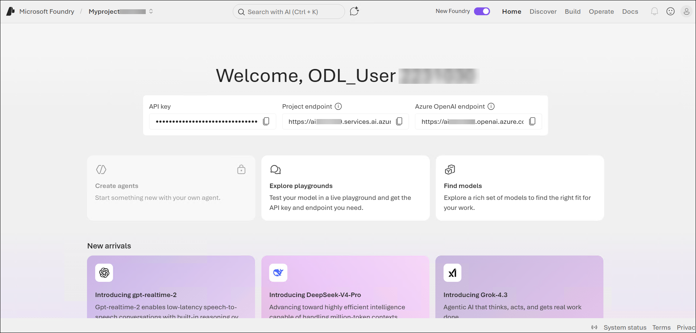

      > **Note:** The Microsoft Foundry landing page may vary depending on the version of the portal, your account configuration, or recent UI updates. If your home page looks different, continue with the lab by locating the required menu options using the navigation menu. The appearance of the portal may differ, but the functionality and lab steps remain the same.

    .png)

> **Congratulations** on completing the task! Now, it's time to validate it. Here are the steps:
 
- Hit the Validate button for the corresponding task. You will receive a success message. 
- If not, carefully read the error message and retry the step, following the instructions in the lab guide.
- If you need any assistance, please contact us at cloudlabs-support@spektrasystems.com. We are available 24/7 to help you out.

  <validation step="d54b3abe-8f62-4f21-a451-21a3bef84bef" />

## Task 2: Extract information from documents in the new Foundry portal

In this task, you'll use Azure Content Understanding analyzers in Microsoft Foundry to extract text, structure, and fields from documents.

1. In the new Foundry portal, navigate to the tool bar at the top of the screen and select **Build**.

    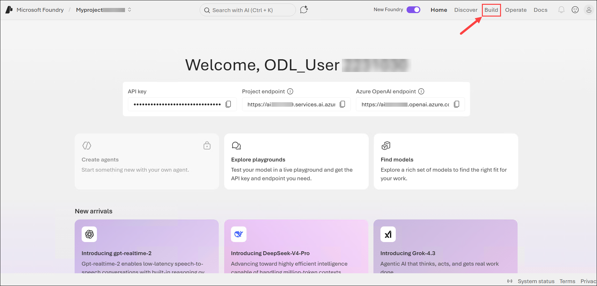

1. On the **Build** page, navigate to the menu on the left-side of the screen (you may need to expand it by clicking on the expand icon at the bottom of the menu). From the left-side menu, select **Models (1)**. Then, at the top of the Models page, select **AI Services (2)**.

    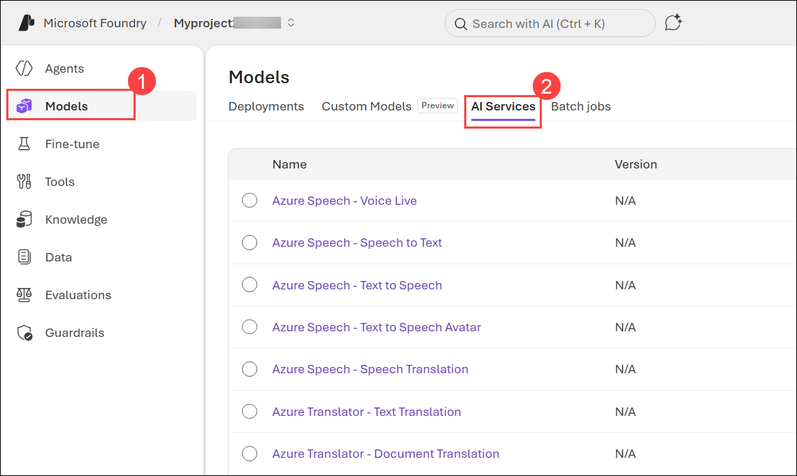

3. Identify the **Content Understanding** capabilities you can try out in a Foundry playground setting:

    - **Content Understanding - Read**: Raw text extraction only. Answers the question, "What text is here?"
    - **Content Understanding - Layout**: Adds structure, hierarchy, and positioning. Answers the question, "How is this content organized?"
    - **Content Understanding**: offers the full analyzer capability by extracting fields and structure and generating insights. Answers the question, "What does this content mean and what should I do with it?"

      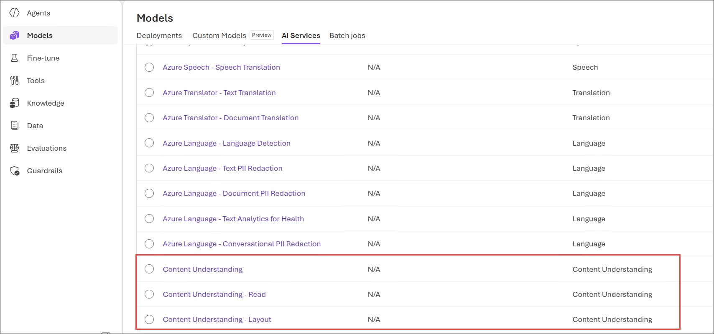

### Task 2.1: Try out Content Understanding's Read capabilities

In this task, you'll use the **Read** analyzer to extract raw text content from a sample document using Azure Content Understanding.

1. Select **Content Understanding - Read**. The **Read** capability is the first step in content understanding-it reads and extracts text, but doesn’t try to understand structure or meaning yet.

    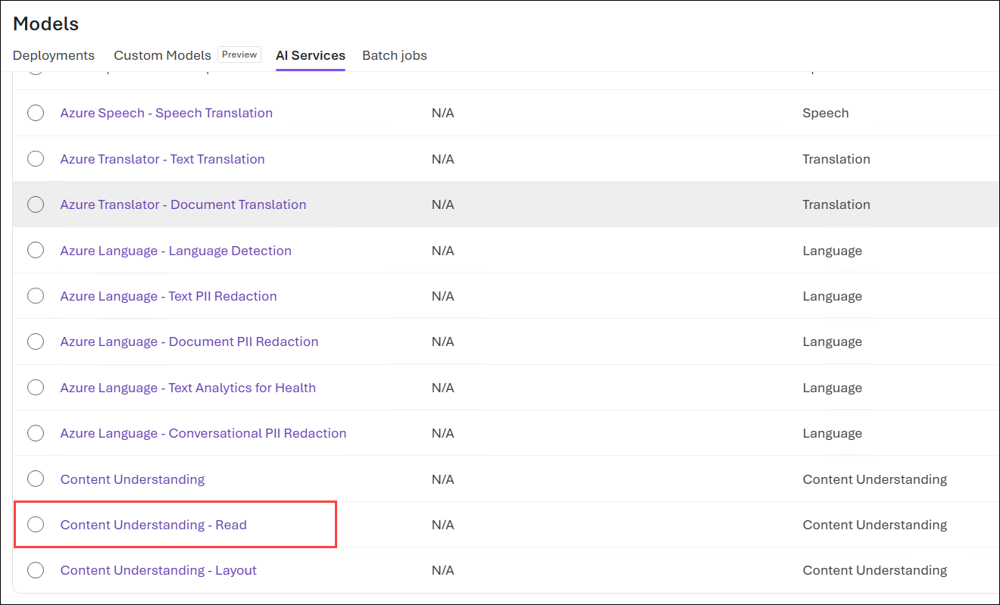

2. Select the sample **read_barcode.pdf (1)** and use the **Run analysis (2)** button to extract information from the document. 

      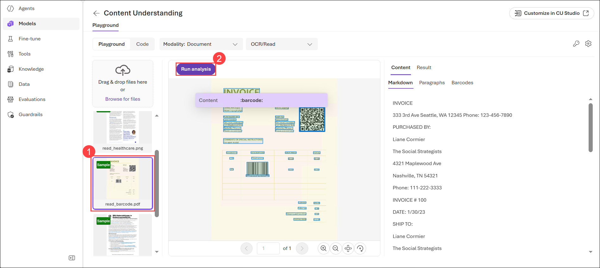

1. When analysis is complete, view the results.

    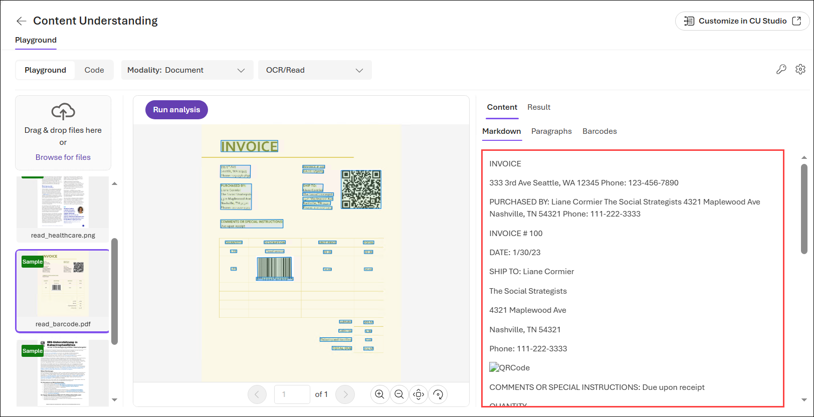

3. Select the **back** button to return to the previous page to test out other capabilities.

    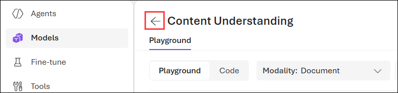

### Task 2.2: Try out Content Understanding's Layout capabilities

In this task, you'll use the **Layout** analyzer to identify document structure, tables, and content organization within a sample document.

1. From the **Build - Models** page and **AI Services** tab, select **Content Understanding - Layout**.

    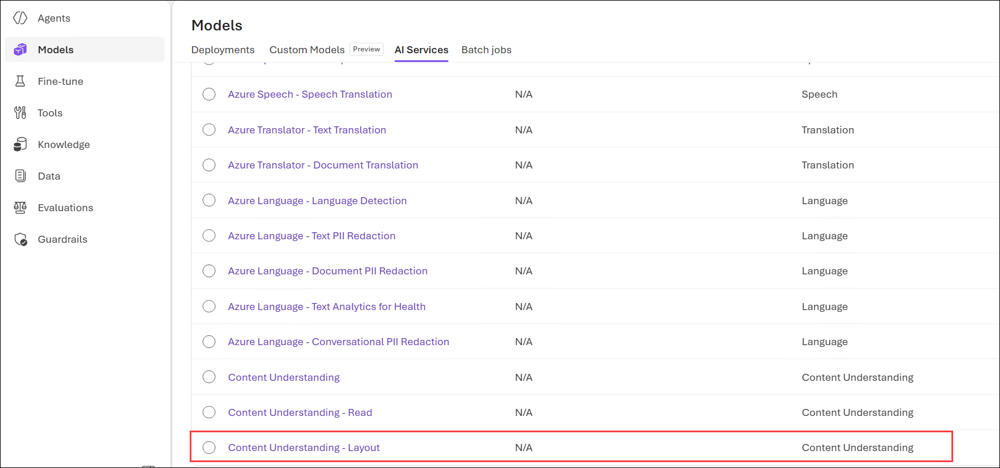

2. Select the sample **layout_checklist.jpg (1)** and use the **Run analysis (2)** button to extract information from it.

    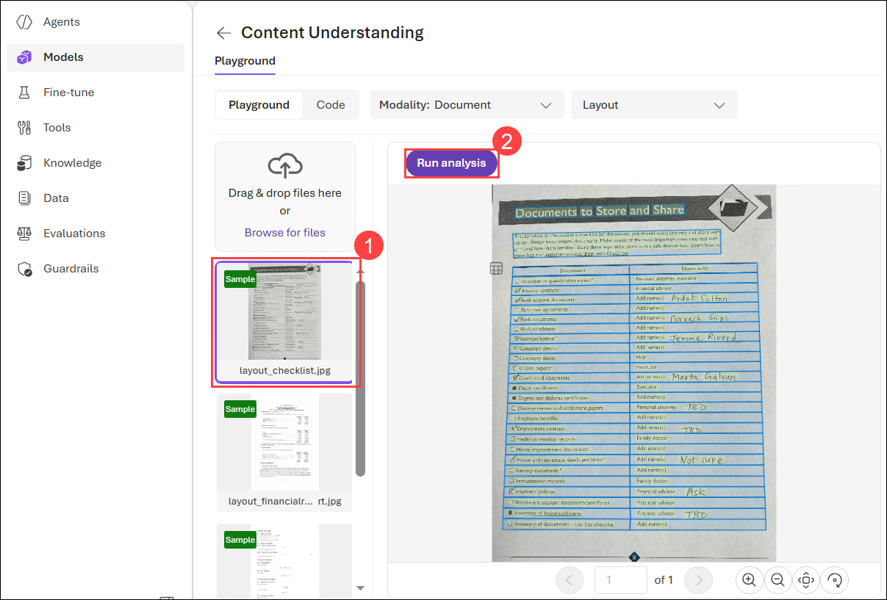

1. When analysis is complete, view the results.

    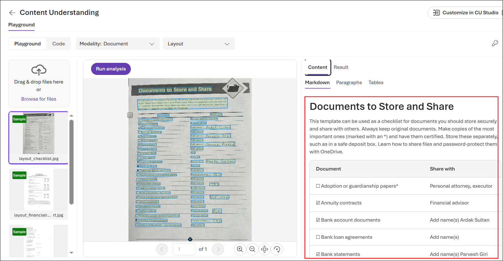

3. In the content output, select the **Tables** tab. Review how the **Layout** analyzer is able to capture both the text and structure of the content.

    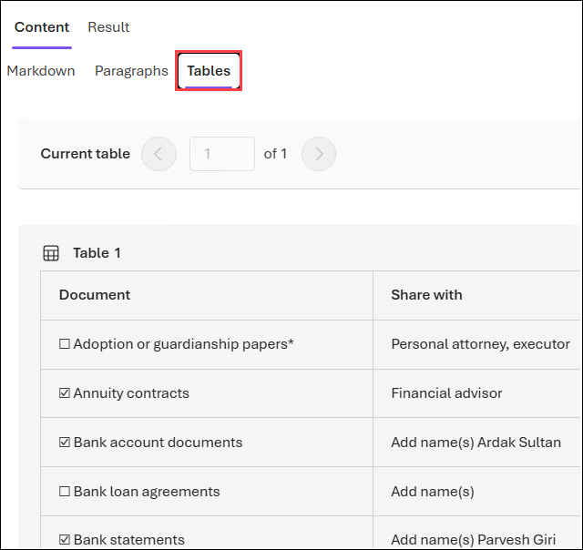

4. Select the **back** button to return to the previous page to test out other capabilities.

    

### Task 2.3: Try out Content Understanding's other analyzer capabilities

In this task, you'll use the **Document fields** analyzer to extract structured information, review JSON results, and analyze invoice documents in Microsoft Foundry.

1. From the **Build - Models** page and **AI Services** tab, select **Content Understanding** to test another one of Azure Content Understanding analyzers.

    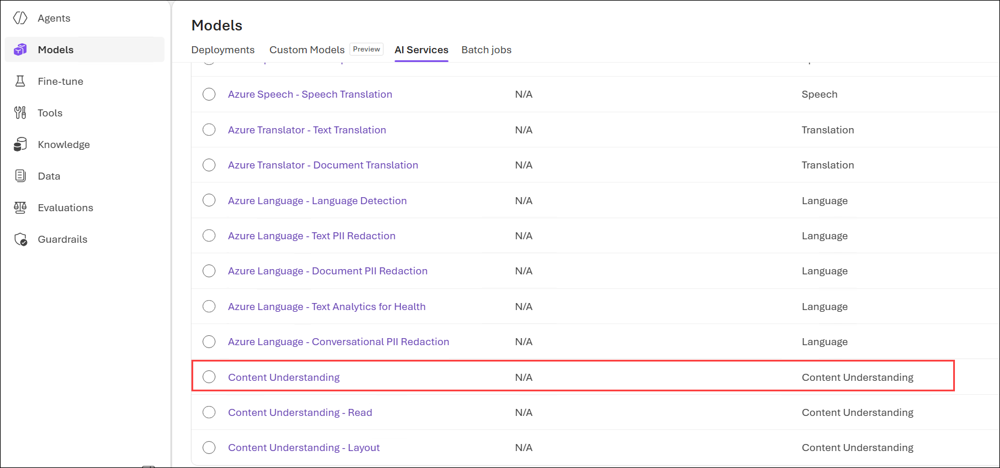

2. On the **Content Understanding** page, select the **Document** modality.

      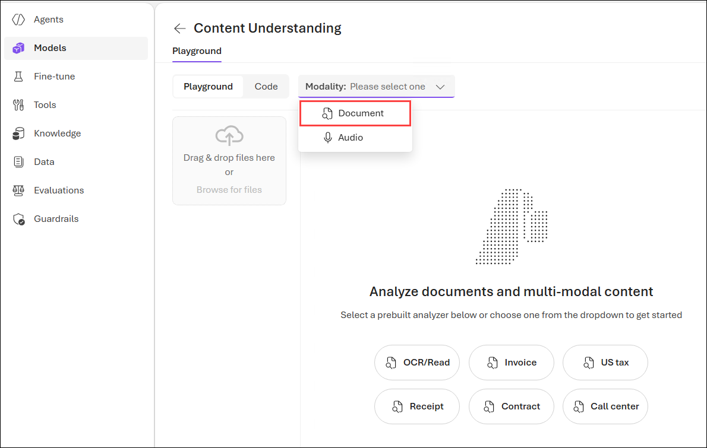

3. Next to the **Document** modality, select **Document fields (1)** from the dropdown menu. If asked to deploy models that aren't configured yet, select **Deploy models (2)**.

    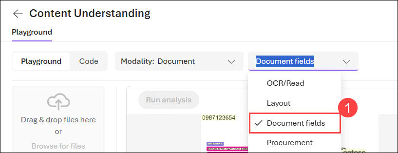

    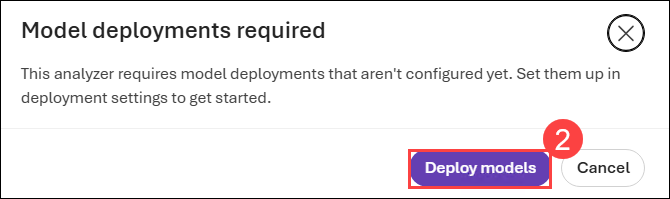

    >**Note:** *Document fields* and other advanced extraction requirements often require deploying multiple AI models, as each deployment is associated with a specific model version or capability. Using multiple models in Azure AI Foundry enables more efficient handling of diverse processing tasks by allowing you to select the most suitable model for each scenario.

4. Select the recommended **Chat completion model (1)** and **Embedding model (2)** from the drop-down menus. Then select **Apply changes (3)**. Once the changes are applied, you can close the **Configure** panel.

    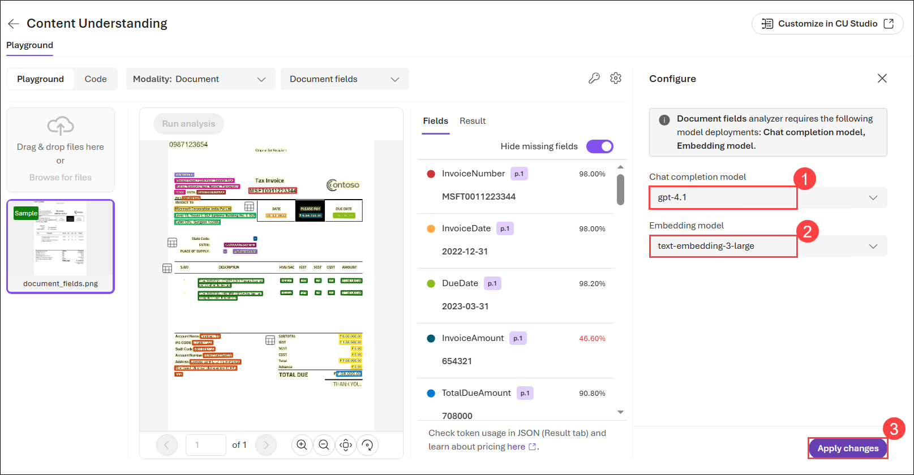

5. Let's try to use the full analyzer with our own invoice. Open a new browser window. Enter the following URL: `https://raw.githubusercontent.com/MicrosoftLearning/mslearn-ai-fundamentals/refs/heads/main/data/content-understanding/contoso-invoice-1.pdf` to download **[contoso-invoice-1.pdf](https://raw.githubusercontent.com/MicrosoftLearning/mslearn-ai-fundamentals/refs/heads/main/data/content-understanding/contoso-invoice-1.pdf)** .

    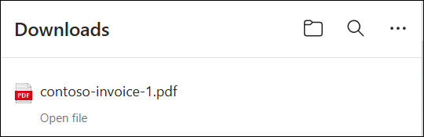

6. Select the **Browse for files** link to upload the **contoso-invoice-1.pdf** document you just downloaded. 

    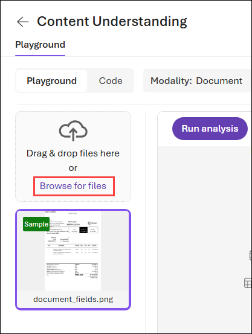

1. In the **Open** window, select **Downloads (1)** from the left pane, then select the **contoso-invoice-1.pdf** file **(2)** that you have downloaded in the previous step. Finally, select **Open (3)** to upload the file.

    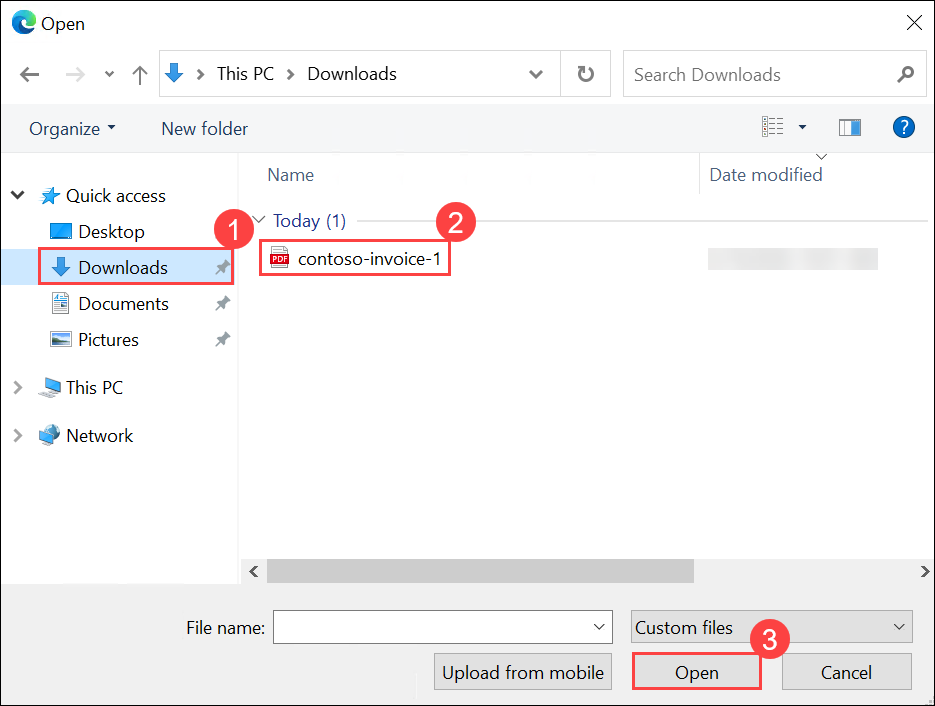

1. Select **Run analysis**.

    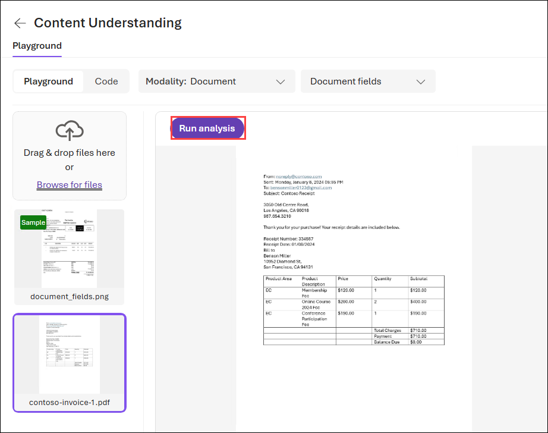

1. Review the results and notice that not only is the text rendered, but its layout is captured, and the fields are organized into cohesive categories.  

    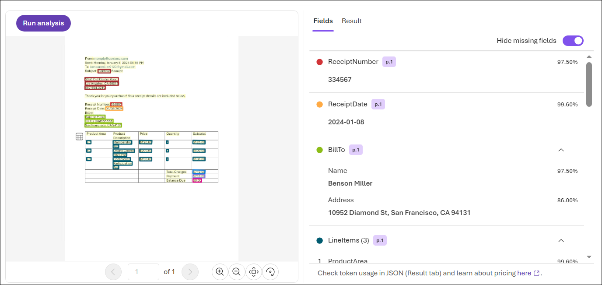

7. In the pane on the right where the extracted fields are displayed, view the **Result** tab to see the raw results in JSON. Identify the **analyzerID** field, which contains the type of analyzer used. You can find a list of prebuilt Content Understanding analyzers [here](https://learn.microsoft.com/azure/ai-services/content-understanding/concepts/prebuilt-analyzers). 

    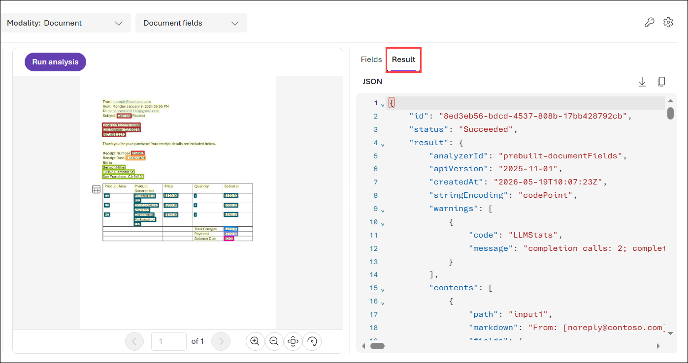

    > **Note:** Consider this: the *Fields* tab displays the information from the raw JSON in the *Results* tab in a user-friendly way.

> **Congratulations** on completing the task! Now, it's time to validate it. Here are the steps:
 
- Hit the Validate button for the corresponding task. You will receive a success message. 
- If not, carefully read the error message and retry the step, following the instructions in the lab guide.
- If you need any assistance, please contact us at cloudlabs-support@spektrasystems.com. We are available 24/7 to help you out.

  <validation step="8a0430c3-4f2b-4e6a-8973-f7b385f3062f" />

## Task 3: Understand how to extract content with the Python SDK

As a developer, you can also use code to extract meaning from content. The Foundry playground provides various code samples to get you started with information extraction with Azure Content Understanding.

1. Let's take a closer look at the Python code for document layout analysis. In the Content Understanding playground, select the **Code (1)** tab, then select **Modality: Document (2)** and the **Layout (3)** analyzer. 

    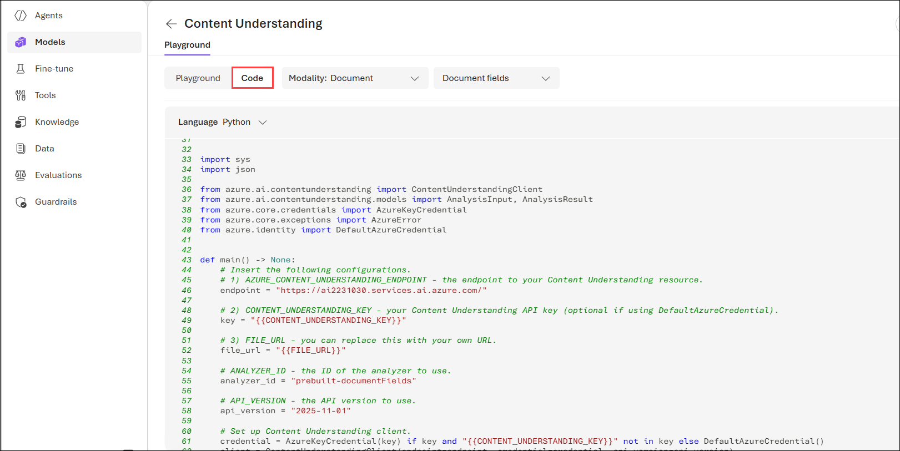

1. The following code is provided:

    ```python
    import sys
    import json
    
    from azure.ai.contentunderstanding import ContentUnderstandingClient
    from azure.ai.contentunderstanding.models import AnalysisInput, AnalysisResult
    from azure.core.credentials import AzureKeyCredential
    from azure.core.exceptions import AzureError
    from azure.identity import DefaultAzureCredential
    
    
    def main() -> None:
        # Insert the following configurations.
        # 1) AZURE_CONTENT_UNDERSTANDING_ENDPOINT - the endpoint to your Content Understanding resource.
        endpoint = "https://<your-resource>.services.ai.azure.com/"
    
        # 2) CONTENT_UNDERSTANDING_KEY - your Content Understanding API key (optional if using DefaultAzureCredential).
        key = "{{CONTENT_UNDERSTANDING_KEY}}"
    
        # 3) FILE_URL - you can replace this with your own URL.
        file_url = "https://contentunderstanding.ai.azure.com/assets/prebuilt/layout_checklist.jpg"
    
        # ANALYZER_ID - the ID of the analyzer to use.
        analyzer_id = "prebuilt-layout"
    
        # API_VERSION - the API version to use.
        api_version = "2025-11-01"
    
        # Set up Content Understanding client.
        credential = AzureKeyCredential(key) if key and "{{CONTENT_UNDERSTANDING_KEY}}" not in key else DefaultAzureCredential()
        client = ContentUnderstandingClient(endpoint=endpoint, credential=credential, api_version=api_version)
    
        # [START analyze]
        print(f"Analyzing with {analyzer_id} analyzer...")
        print(f"  File URL: {file_url}\n")
    
        try:
            poller = client.begin_analyze(
                analyzer_id=analyzer_id,
                inputs=[AnalysisInput(url=file_url)],
            )
            result: AnalysisResult = poller.result()
        except AzureError as err:
            print(f"[Azure Error]: {err.message}")
            sys.exit(1)
        except Exception as ex:
            print(f"[Unexpected Error]: {ex}")
            sys.exit(1)
        # [END analyze]
    
        # [START output_result]
        print("=" * 50)
        print("Analysis result:")
        print("=" * 50 + "\n")
    
        max_display_lines = 50
        result_str = json.dumps(result.as_dict(), indent=2)
        ret_lines = result_str.splitlines()
    
        if len(ret_lines) > max_display_lines:
            print("\n".join(ret_lines[:max_display_lines]))
            print(f"\n {len(ret_lines) - max_display_lines} more lines to be displayed...\n")
        else:
            print(result_str)
        # [END output_result]
    
    
    if __name__ == "__main__":
        main()
    ```

2. Consider what you might need to configure in the code:
   - The endpoint to your Content Understanding resource
   - Your resource key
   - A URL to the file you'd like analyzed 
  
3. Consider what's provided in the code sample that you might alter: 
   - Analyzer ID (which you can change to use [different prebuilt models](https://learn.microsoft.com/azure/ai-services/content-understanding/concepts/prebuilt-analyzers#content-extraction-analyzers))
   - API Version

4. After setting configurations, the code creates a client to talk to Azure Content Understanding. The code decides how to authenticate: if you provided a real API key, it uses that key directly. Otherwise, it falls back to `DefaultAzureCredential()`, which automatically finds credentials from your environment (like your Azure CLI login). Then it creates the client using your endpoint, the chosen credential, and an API version.
     
    ```python
    # Set up Content Understanding client.
    credential = AzureKeyCredential(key) if key and "{{CONTENT_UNDERSTANDING_KEY}}" not in key else DefaultAzureCredential()
    client = ContentUnderstandingClient(endpoint=endpoint, credential=credential, api_version=api_version)
    ```
     
5. Next, the code analyzes the content. The SDK starts the analysis as a long-running operation. The function `begin_analyze()` returns a poller that handles checking the operation status (whether the analysis is successfully complete or not). The SDK's poller handles the complete operation automatically when `poller.result()` is called.

    ```python
    # [START analyze]
    print(f"Analyzing with {analyzer_id} analyzer...")
    print(f"  File URL: {file_url}\n")
    
    try:
        poller = client.begin_analyze(
            analyzer_id=analyzer_id,
            inputs=[AnalysisInput(url=file_url)],
        )
        result: AnalysisResult = poller.result()
    except AzureError as err:
        print(f"[Azure Error]: {err.message}")
        sys.exit(1)
    except Exception as ex:
        print(f"[Unexpected Error]: {ex}")
        sys.exit(1)
    # [END analyze]
    ```

    
6. The output of the analysis is formatted and displayed as JSON using the following code:

    ```python
    # [START output_result]
    print("=" * 50)
    print("Analysis result:")
    print("=" * 50 + "\n")

    max_display_lines = 50
    result_str = json.dumps(result.as_dict(), indent=2)
    ret_lines = result_str.splitlines()

    if len(ret_lines) > max_display_lines:
        print("\n".join(ret_lines[:max_display_lines]))
        print(f"\n {len(ret_lines) - max_display_lines} more lines to be displayed...\n")
    else:
        print(result_str)
    # [END output_result]
    ```

    >**Note**: Much of the code above makes the output look more readable. Its purpose is actually very simple: to print the results of the analysis.

7. Running the entire code from step 1 returns JSON like you observed earlier in the lab. For example: 

    ```json
    {
	"id": "",
	"status": "Succeeded",
	"result": {
		"analyzerId": "prebuilt-layout",
		"apiVersion": "2025-11-01",
		"createdAt": "",
		"warnings": [],
		"contents": [
			{
				"path": "input1",
				"markdown": "",
				"kind": "document",
				"startPageNumber": 1,
				"endPageNumber": 1,
				"unit": "pixel",
				"pages": [
					{
						"pageNumber": 1,
						"angle": 0,
						"width": 2580,
						"height": 3433,
						"spans": [
							{
								"offset": 0,
								"length": 2269
							}
						],
						"words": [
							{
								"content": "Documents",
								"span": {
									"offset": 2,
									"length": 9
								},
								"confidence": 0.996,
								"source": "D(1,213,217,768,201,768,296,214,310)"
							},
							{
								"content": "to",
								"span": {
									"offset": 12,
									"length": 2
								},
								"confidence": 0.999,
								"source": "D(1,802,200,906,197,906,293,803,295)"
							},
							{
								"content": "Store",
								"span": {
									"offset": 15,
									"length": 5
								},
								"confidence": 0.998,
								"source": "D(1,947,196,1218,189,1219,285,947,292)"
							} 
    ...
    ```

## Summary

In this lab, you explored Azure Content Understanding in Foundry and learned how it transforms unstructured content into structured, usable data. You tried out three analyzers, each building on the previous one in capability:

- **Read**: Extracts raw text from documents without interpreting structure or meaning-answering, "What text is here?"
- **Layout**: Goes a step further by capturing structure, hierarchy, and positioning-including tables-answering, "How is this content organized?"
- **Document fields**: an analyzer that uses a combination of capabilities to extract fields, organize them into cohesive categories, and generate insights-answering, "What does this content mean and what should I do with it?" Content Understanding analyzers like this one sometimes require deploying additional AI models (such as chat completion and embedding models) to handle complex extraction needs.

You also learned how developers can integrate Content Understanding into applications using the **Python SDK**, which enables programmatic analysis of documents outside the Foundry playground.

### Congratulations, you’ve successfully completed the hands-on lab!