# Get started with Foundry IQ in Microsoft Foundry

### Estimated Duration: 45 Minutes

## Lab Overview

In this lab, you will build and enhance an AI agent within Microsoft Foundry that can assist employees with expense claim policies and procedures. You will start by accessing a pre-configured Microsoft Foundry project and creating an AI agent named **expenses-agent** with specific instructions. Then, you will create a Foundry IQ knowledge base to store and manage expense policy documentation. Finally, you will integrate the knowledge base with your agent to enable it to provide accurate, context-grounded responses to employee queries about expense claims. This hands-on experience demonstrates how to use Foundry IQ as a central knowledge management system that improves agent accuracy and reliability through retrieval-augmented generation (RAG).

## Lab Objectives

In this lab, you will perform the following tasks:

- Task 1: Get started with Microsoft Foundry
- Task 2: Create an AI agent
- Task 3: Add a Foundry IQ knowledge base
- Task 4: Use the knowledge store in the expenses agent

## Task 1: Get started with Microsoft Foundry

In this task, you'll sign in to the Microsoft Foundry portal, access a pre-configured Microsoft Foundry project, and familiarize yourself with the project workspace that will be used throughout the lab.

1. Copy the **Microsoft Foundry** link and paste it into a new browser tab to access the portal: `https://ai.azure.com/`

1. On the **Microsoft Foundry** home page, click on **Start building** in the top right corner.

   

1. If prompted to sign in, enter your credentials:
   - **Email/Username:** Enter <inject key="AzureAdUserEmail"></inject> **(1)** and click on **Next (2)**.

     

   - **Password:** Enter <inject key="AzureAdUserPassword"></inject> **(1)** and click on **Sign in (2)**.

     .png>)

1. If prompted to **Stay signed in?**, you can click **No**.

   

### Task 1.1: Create a Microsoft Foundry Project (READ ONLY)

> ### **Note:** <span style="color:maroon"> A Microsoft Foundry resource and project have already been created and configured for your lab environment. To optimize AI resource usage during the lab, additional Microsoft Foundry resources cannot be created. This is a **read-only** task provided for demonstration purposes and does not require any action. For the remainder of the lab, please use the pre-configured Microsoft Foundry resource and project that have been provisioned for your environment.
</span>

In this task, you'll learn how to create a Microsoft Foundry project by configuring the required Azure settings, including the Foundry resource, region, subscription, and resource group. This is a demonstration only and does not require any action during the lab.

1. On the **All resources** page, click on **Create Project**.

   

1. In the **Create a project** pane, enter a unique project name like **myproject-<inject key="DeploymentID" enableCopy="false" /> (1)** Verify that the **Foundry resource (2)** is automatically populated, set the **Region** to **<inject key="Location" enableCopy="false" /> (3)**, confirm that the default **Subscription (4)** is selected, and choose the appropriate **Resource group (5)**. Ensure that the **Set up recommended resources so I can explore everything Foundry has to offer** option is **disabled (6)**, and then select **Create (7)**.

   

1. In the **Your project is set up. What would you like to do next ?** pop-up, click **X** button to dismiss the window.

   

1. After creating a project in the new **Foundry** portal, it should open in a page similar to the following image:

   

### Task 1.2: Open the Pre-configured Microsoft Foundry Project

In this task, you'll access the pre-configured Microsoft Foundry project, dismiss the welcome prompt, and explore the project workspace that will be used for the remainder of the lab.

1. From the **All resources** page select the project named **myproject<inject key="DeploymentID"></inject>** that has been already been created for you to open it. You will use this project throughout the remainder of the lab.

   

1. In the **Your project is set up. What would you like to do next ?** pop-up, click **X** button to dismiss the window.

   

1. After selecting the project in the **Foundry** portal, it should open in a page similar to the following image:

   


## Task 2: Create an AI agent

In this task, you will create a new AI agent called **expenses-agent** and configure it with system instructions that define its role as an advisor on expense policies and procedures. You will access the Foundry agent builder, create the agent, configure its model settings, and test its initial responses to validate that it operates correctly.

1. On the **Home** page, in the **Build an agent** tile, select **Start building** (or on the **Build** page, select the **Agents** tab).

    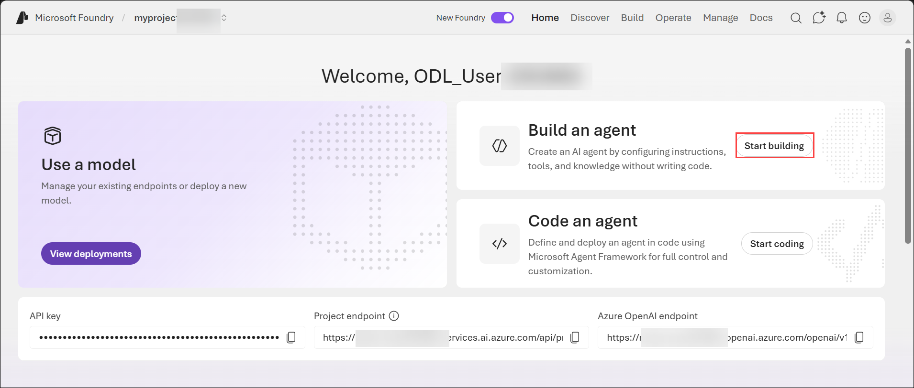

1. Create a new agent named `expenses-agent` **(1)**, then select **Create(2)**.

    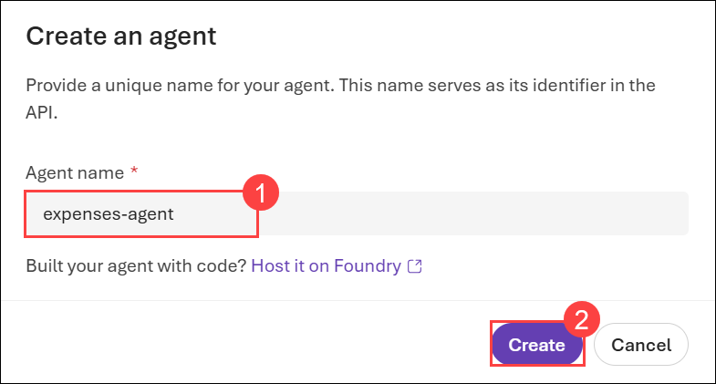

1. When ready, your agent opens in the agent playground.

1. In the model drop-down list, ensure that a model has been deployed and selected for your agent.

1. Assign your agent the following **Instructions**:

    ```
   You are an AI agent that advises employees on expenses policies and expense claim processes.
    ```

    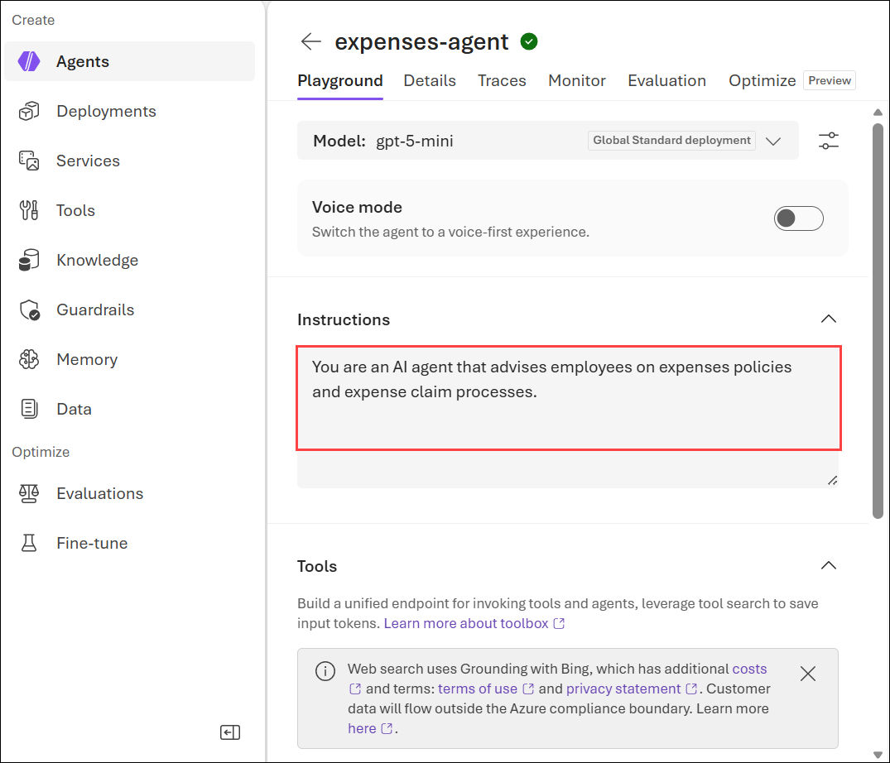

1. Use the **Save** button to save the changes.

    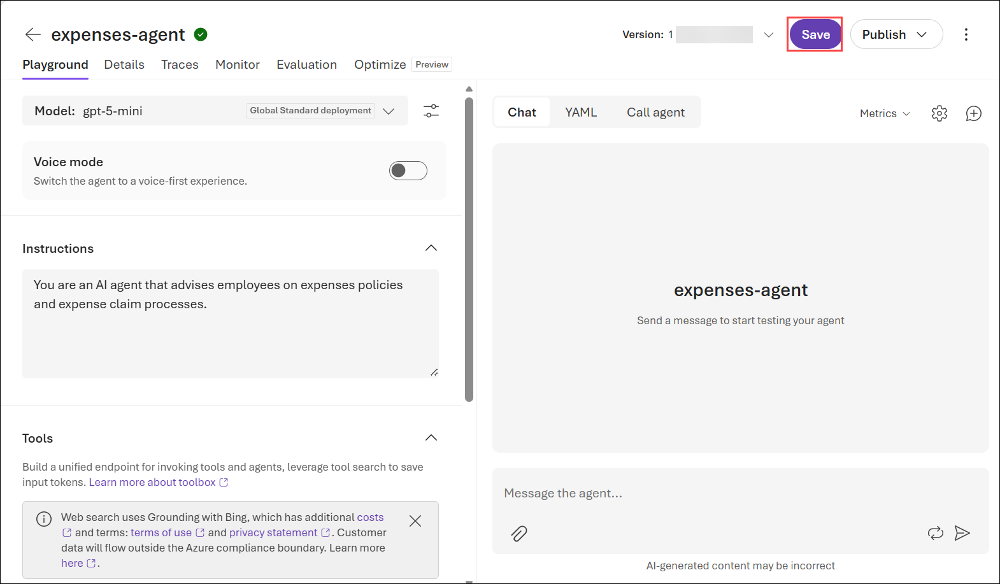

1. Test the agent by entering the following prompt in the **Chat** pane:

    ```
   What can you help me with?
    ```
    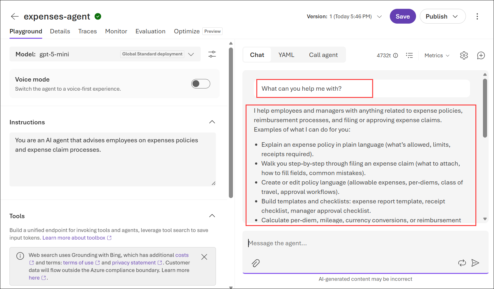

    The agent should respond with an appropriate answer based on its instructions.

1. Enter the following prompt:

    ```
   How much can I claim for a taxi?
    ```
    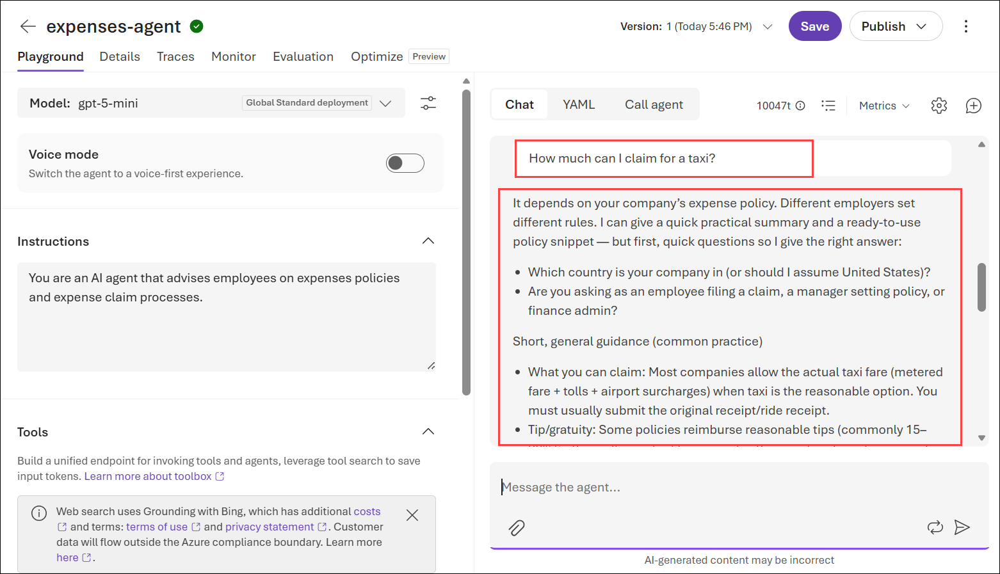

    The agent may respond with what *seems* like a correct answer. However, the agent currently has no knowledge of your company's expense policies and procedures; so the answer isn't grounded in accurate information.

    Let's fix that!

    > **Congratulations** on completing the task! Now, it's time to validate it. Here are the steps:
   > - Hit the Validate button for the corresponding task. If you receive a success message, you can proceed to the next task. 
   > - If not, carefully read the error message and retry the step, following the instructions in the lab guide.
   > - If you need any assistance, please contact us at cloudlabs-support@spektrasystems.com. We are available 24/7 to help.

   <validation step="c1f23550-2cfc-49e1-a1a3-62185bdc8693" />   

## Task 3: Add a Foundry IQ knowledge base

In this task, you will set up and configure a Foundry IQ knowledge base to store your organization's expense policy documentation. Foundry IQ is a central connection point for data sources that agents can use as knowledge bases. It enables you to create and manage a collection of knowledge that multiple agents can use, without the need to code data access and query logic in each agent. You will create a Foundry IQ resource, establish a knowledge base for expense documentation, connect it to an Azure Blob Storage data source, and configure the necessary Azure access permissions to enable secure communication between your Foundry project and the knowledge source.

### Task 3.1: Configure Foundry IQ

1. Return to the browser tab containing the Foundry portal agent playground, and in the main navigation pane on the left, select **Knowledge** to open the Foundry IQ page.

   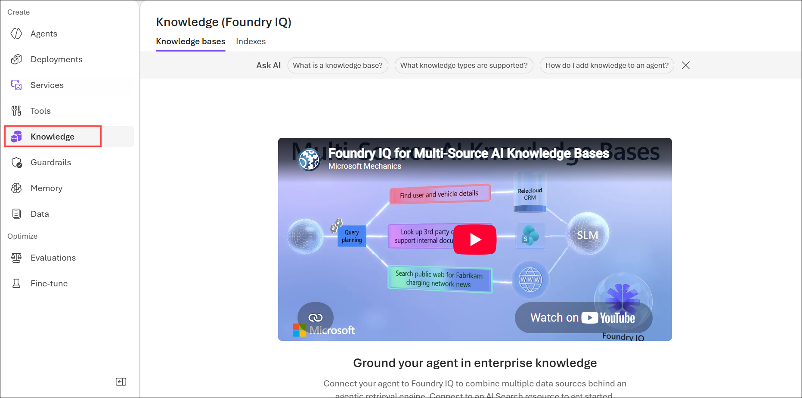

1. At the bottom of the page, select the **Create a new resource** link to create a new Foundry IQ (Azure AI Search) resource in your Azure subscription.

   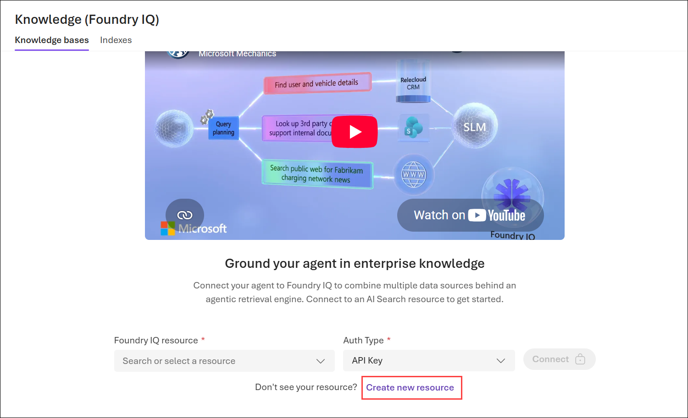

1. Enter the following values, accept the cost acknowledgement, and create your resource:
        
    - **Resource name**: **myproject-<inject key="DeploymentID" enableCopy="false" /> (1)**

    - **Subscription**: Leave the Subscription default **(2)**
    - **Resource group**: labvm-rg **(3)**
    - **Region**: West US **(4)**
    - **Pricing tier**: Basic **(5)**
    - **Create (6)**
      
     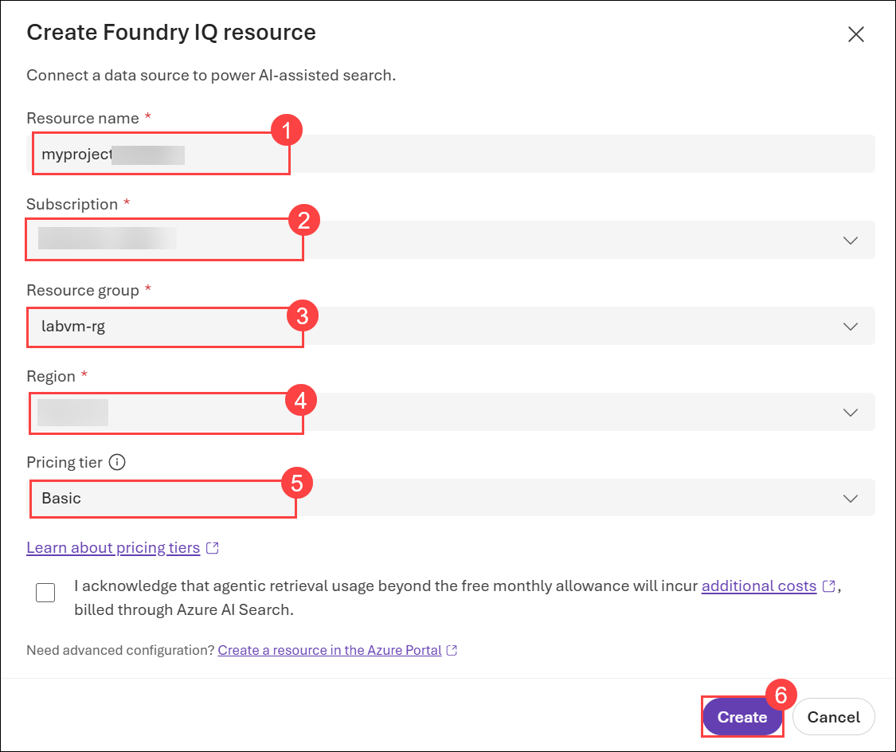

1. Wait for the Foundry IQ resource to be created and configured for secure access.

   When your Foundry IQ resource is ready, the page will list your knowledge bases (currently there are none).
    
   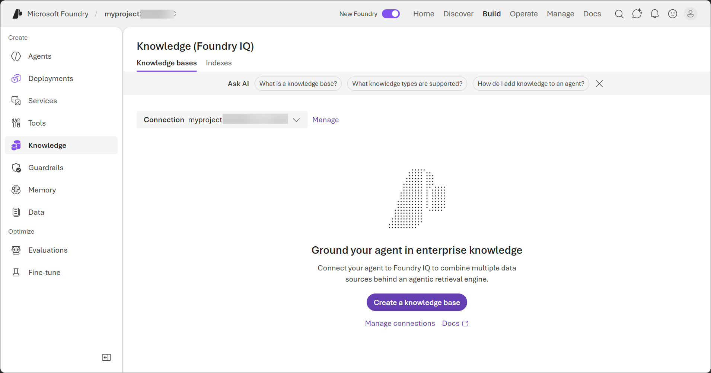
    

    > **Congratulations** on completing the task! Now, it's time to validate it. Here are the steps:
   > - Hit the Validate button for the corresponding task. If you receive a success message, you can proceed to the next task. 
   > - If not, carefully read the error message and retry the step, following the instructions in the lab guide.
   > - If you need any assistance, please contact us at cloudlabs-support@spektrasystems.com. We are available 24/7 to help.

   <validation step="98e19d99-067d-4d49-b90f-c6d0c5c2e5ff" />   

### Task 3.2: Create a knowledge base

1. On the Knowledge (Foundry IQ) page, select **Create a knowledge base**.

   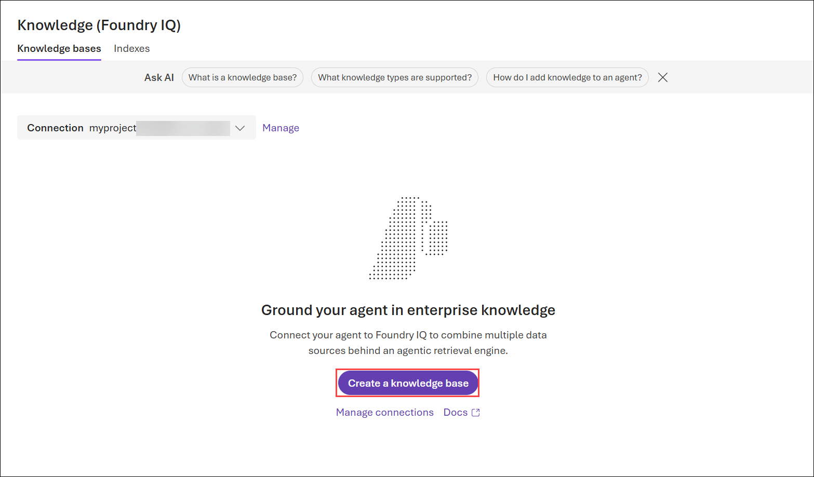

1. Complete the basic configuration of the knowledge base by assigning the following values:

    - **Name**: `expenses-documentation` **(1)**
    - **Description**: `Expense guidelines for employees` **(2)**
    - **Chat completions model**: *Select the existing model deployment* **(3)**
    - **Retrieval reasoning effort**: Low **(4)**
    - **Output mode**: Answer synthesis **(5)**
    - **Answer instructions**: `Answer concisely, based on the available context` **(6)**
    - **Retrieval instructions**: `Use the expenses-documentation source for all questions related to expense claim policies and procedures` **(7)**
    - **Add resources** **(8)**

         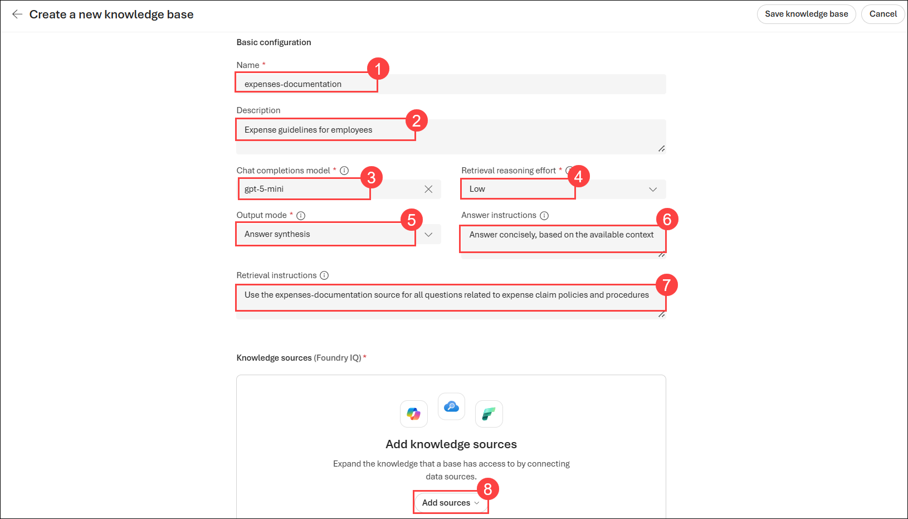

         > **Note**: The *output mode* determines how Foundry IQ returns knowledge to the agent. *exractive data* returns verbatim text from the knowledge source while *answer synthesis* uses a generative AI model to compose a suitable response. *Answer instructions* act as a system prompt to specify formatting of the response, and *retrieval instructions* are used by Foundry IQ to guide how knowledge is searched for in the available knowledge bases (in this case, there's only one knowledge base; but there could be more!)

1. In the **Knowledge sources** pane, select **Azure Blob Storage**.

   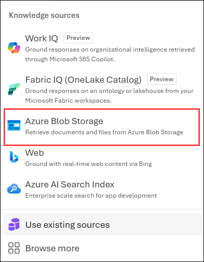

1. On the Create knowledge source pane, fill the details:

    - Name: **myknowledge-<inject key="DeploymentID" enableCopy="false" /> (1)**

    - Storage account: **mystorage<inject key="DeploymentID" enableCopy="false" /> (2)**

    - Container name: Select **Sample (3)**

    - Select **Create (4)**

      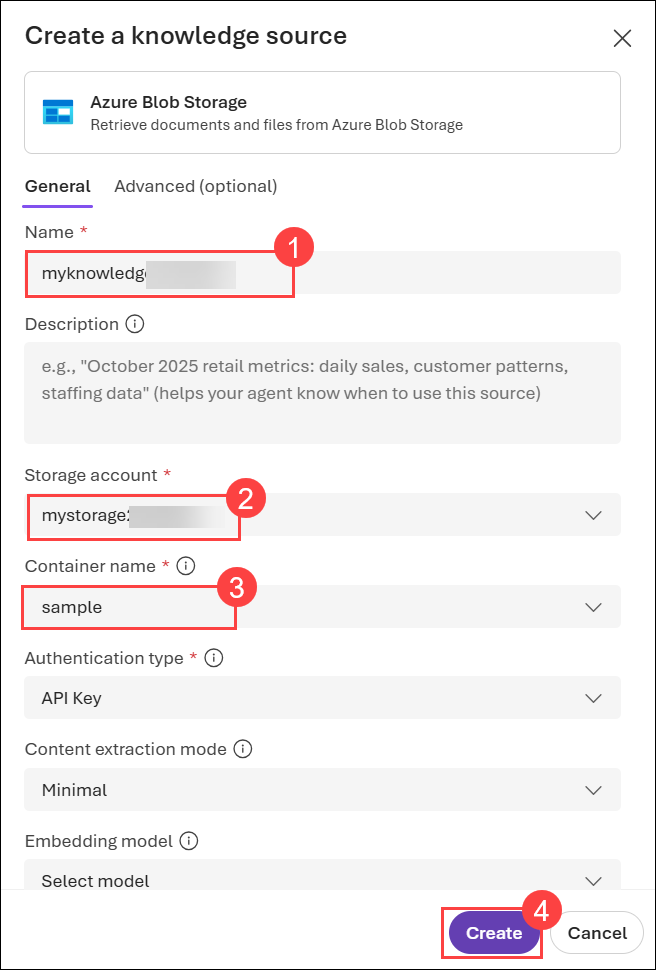

1. Wait for the file to be uploaded and processed, and then **Save knowledge base**.

   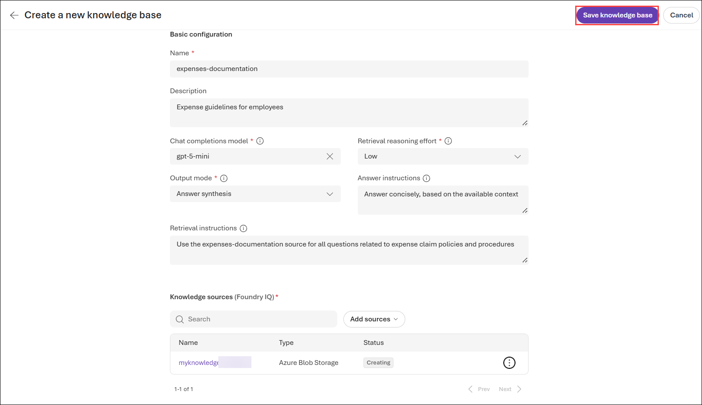

### Task 3.3: Configure access permissions

1. Open a new browser tab and navigate to the [Azure portal](https://portal.azure.com) at `https://portal.azure.com`

1. If prompted to sign in, enter your credentials:
    - **Email/Username:** **<inject key="AzureAdUserEmail"></inject>**

    - **Password:** **<inject key="AzureAdUserPassword"></inject>**

1. If prompted to **Stay signed in?**, you can click **No**.

1. On Azure Portal page, in **Search resources, services and docs (G+/)** box at the top of the portal, enter **Resource groups (1)**, and then select **Resource groups (2)** under services.

   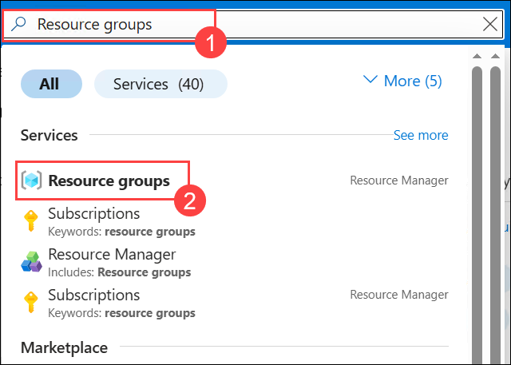

1. Select the **labvm-rg** from the listed resource groups.    

1. Select the Foundry IQ search service resource to open it.

   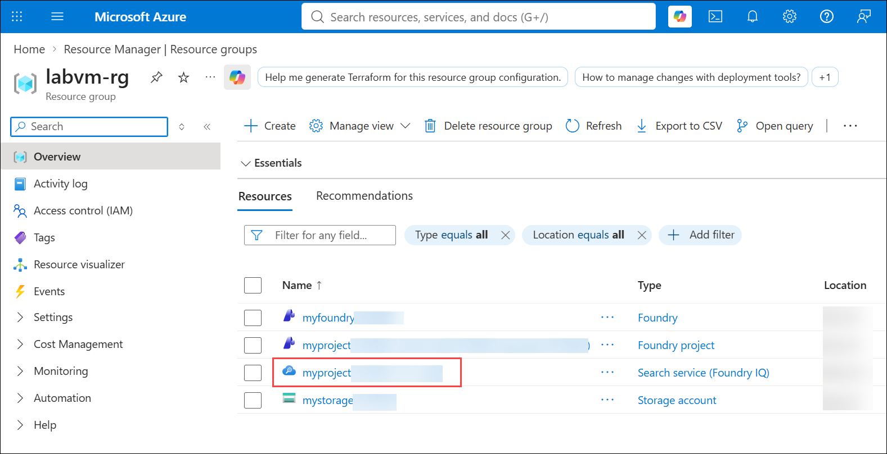

1. On Foundry IQ page, select **Access control (IAM) (1)** page. In the **+ Add (2)** drop-down list, select **Add role assignment (3)**. 

   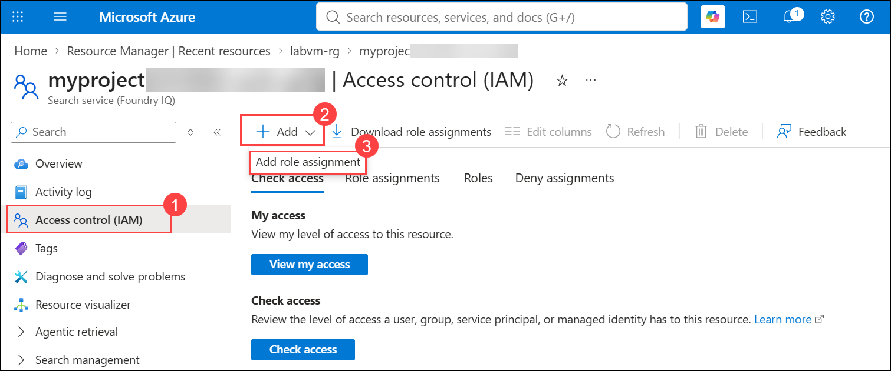

1. On the **Role** tab, search for `Search Data Index Reader` **(1)** and select the `Search Data Index Reader` **(2)** role, and then select **Next (3)**.

   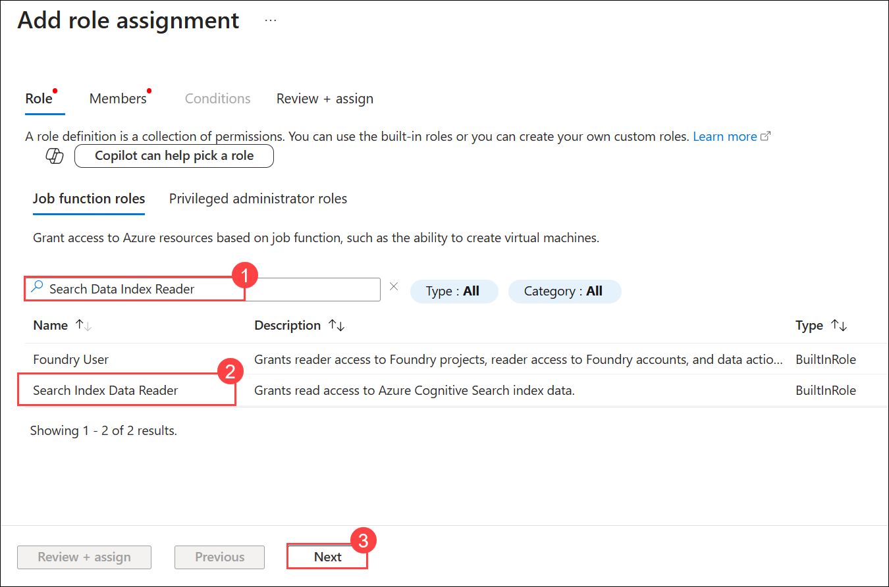

1. On the **Members** tab, select **Managed identity (1)**, and then use the **+ Select members (2)** link to search for and select your **Foundry project (3)** identity, then click on **Select (4)**. 

   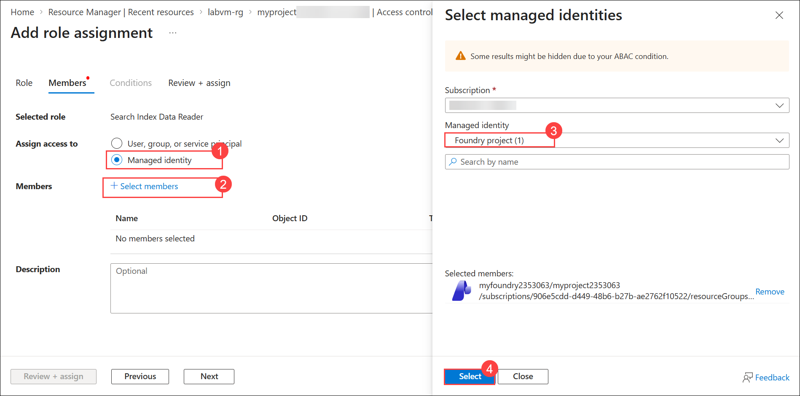

1. Complete the process to **Review and assign** twice the role membership to add you Foundry project's managed identity to the *Search Data Index Reader* role. your Foundry IQ search resource.

   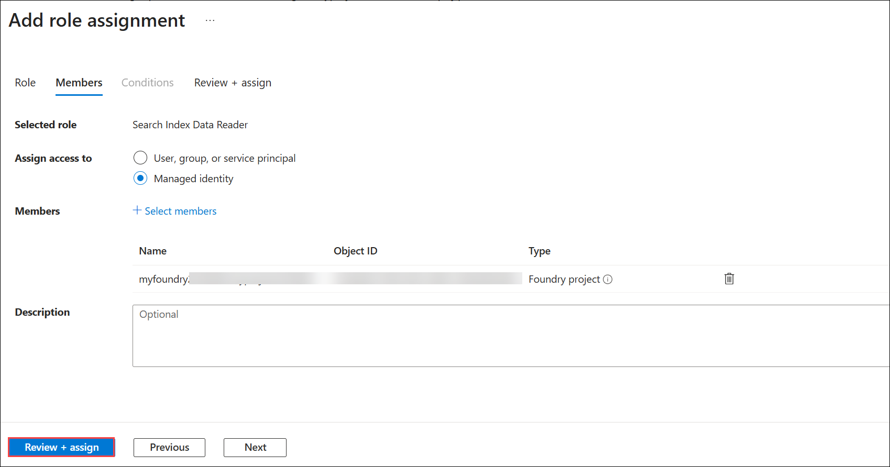

1. Close the tab containing the Azure portal and return to the Foundry portal, where your knowledge store page should still be open.

## Task 4: Use the knowledge store in the expenses agent

In this task, you will connect the Foundry IQ knowledge base to your expenses agent and test its improved capabilities. You will link the knowledge store to the agent and then send queries to verify that the agent now uses the expense documentation to provide accurate, context-grounded responses. You will observe how the agent includes citations from the knowledge base in its responses, demonstrating that it has access to reliable company-specific information for answering employee questions about expense policies.

1. In the page for your saved knowledge store, in the **Use in an agent (1)** drop-down list, select your **expenses agent (2)**.

   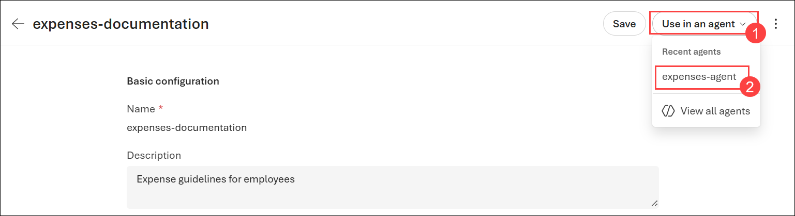

   The agent is opened in the agent playground, with the knowledge store attached.

1. In the chat pane, enter the following query:

    ```
   How much can I claim for a taxi?
    ```
   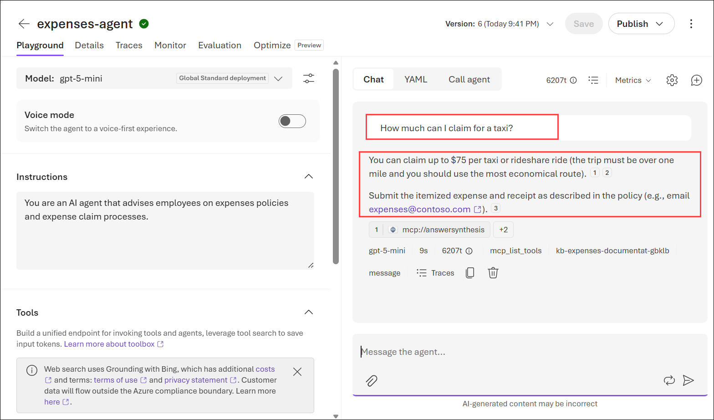

1. Review the response from the agent, and note that at the bottom of the response, a citation for the expenses documentation is listed.

    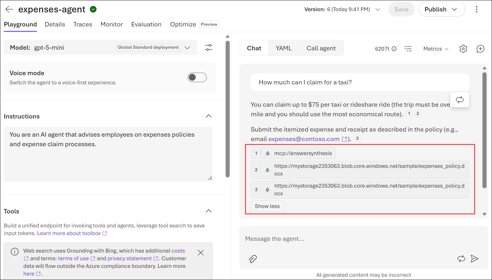

   The expenses agent is now using Foundry IQ to access the expenses documentation knowledge store when needed to answer a user's question.

## Summary

In this lab, you explored how to use Foundry IQ to connect an agent to a knowledge source. While the example in this lab is simple, it demonstrates the ability to ground agents in contextual knowledge to improve the accuracy and relevance of responses.

Using Foundry IQ offers many advantages over a custom implementation of the retrieval augmented generation (RAG) pattern that's prevalent in generative AI solutions. By centralizing access to knowledge in a single tool, you can offload the data source selection and retrieval logic to Foundry IQ, and reuse knowledge sources across multiple agents without the need to duplicate code or data access logic.

### You've successfully completed the hands-on lab!