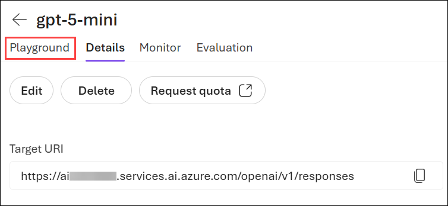

# Language Translation with Microsoft Foundry

### Estimated Duration: 45 Minutes

## Lab Overview

In this exercise, you'll use Microsoft Foundry and a deployed gpt-5-mini model to build a language translation application. You will use the Chat Playground to create and test prompts for translation and transliteration tasks. You will then build a Python application using the Foundry SDK that performs translation, transliteration, language detection, and sentiment analysis using a single deployed model.

Through these activities, you'll gain hands-on experience with text analysis capabilities in Microsoft Foundry and learn how generative AI models can be used for multilingual applications.

## Lab Objectives

In this exercise, you will perform the following tasks:

- Task 1: Verify the gpt-5-mini deployment
- Task 2: Design translation and transliteration prompts
- Task 3: Build a translation and transliteration application
- Task 4: Add sentiment analysis to the application

## Task 1: Create a Microsoft Foundry project

In this task, you will create a Microsoft Foundry project. You will sign in to the Microsoft Foundry portal, configure the project settings such as the subscription, resource group, Foundry resource, and region, and create the project that will be used to manage models, deployments, guardrails, and other AI assets.

1. Copy the **Microsoft Foundry** link and paste it into a new browser tab to access the portal: `https://ai.azure.com/`

1. On the **Microsoft Foundry** home page, click on **Start building** in the top right corner.

     

1. If prompted to sign in, enter your credentials:
 
   - **Email/Username:** Enter <inject key="AzureAdUserEmail"></inject> **(1)** and click on **Next (2)**.
 
        
 
   - **Password:** Enter <inject key="AzureAdUserPassword"></inject> **(1)** and click on **Sign in (2)**.
 
      .png)

1. If prompted to **Stay signed in?**, you can click **No**.

    

1. On the **Get started with Microsoft Foundry** page, click on **Create project**.

   

1. In the **Create a project** wizard, enter project name **Myproject<inject key="DeploymentID" enableCopy="false" /> (1)**, and **Expand Advanced options (2)** to specify the following settings for your project: 

    - Foundry resource: **AI<inject key="DeploymentID" enableCopy="false" /> (3)**
    - Subscription : **Leave default subscription (4)** 
    - Region : Select **<inject key="location" enableCopy="false"/> (5)**
    - Resource group : Select **AI-901 (6)** 
    - Click on **Create** **(7)**

      

1. Wait for your project to be created. It may take a few minutes. 

1. In the **All set, Let's build your agents** window, click **Let's go**.

    

1. After the project is created, the Microsoft Foundry portal will open to a page similar to the one shown below. Locate and copy the **Project Endpoint**, then save it in a text file or Notepad, as it will be required later when configuring the Python application in this lab.

    

> **Congratulations** on completing the task! Now, it's time to validate it. Here are the steps:
 
- Hit the Validate button for the corresponding task. You will receive a success message. 
- If not, carefully read the error message and retry the step, following the instructions in the lab guide.
- If you need any assistance, please contact us at cloudlabs-support@spektrasystems.com. We are available 24/7 to help you out.

  <validation step="" />

## Task 2: Deploy a model

In this task, you will deploy a generative AI model in Microsoft Foundry. You will browse the model catalog, locate the GPT-5 model, review its capabilities, and deploy it using the default settings so that it can be used for testing and evaluation.

1. Now you're ready to explore models. On the **Discover (1)** page, select the **Models (2)** tab to view the Microsoft Foundry model catalog.

    

1. In the **Models** page, enter **`gpt-5-mini`** in the search box **(1)** and select the **gpt-5-mini (2)** model from the search results.

    

1. Review the model card, then click **Deploy (1)** and select **Default settings (2)** to deploy the model using the recommended default configuration.

    

1. When the model has been deployed, it will open in the model playground.

    

1. Make a note of the **Deployment Name**, as it will be used later in the lab when configuring the Python application.
   
   .png)


> **Congratulations** on completing the task! Now, it's time to validate it. Here are the steps:
 
- Hit the Validate button for the corresponding task. You will receive a success message. 
- If not, carefully read the error message and retry the step, following the instructions in the lab guide.
- If you need any assistance, please contact us at cloudlabs-support@spektrasystems.com. We are available 24/7 to help you out.

  <validation step="" />

## Task 3: Design Translation & Transliteration Prompts in Chat Playground

1. Now click on **Playground** to go back to the chat playgorund.

   

1. In Chat Playground of **gpt-5-mini**, in the **Instructions** section, copy and paste the following:

   ```
   You are a professional language assistant. You can perform translation (converting text to a different language) and transliteration (converting text to a different script without changing the language). When the user specifies the task and target, respond ONLY with the result - no explanation, no preamble.
   ```

   

1. In the model playground, paste the following prompt **(1)** and click on the **blue arrow (2)** to submit.

   ```text
   Translate to French: The conference begins at 9am tomorrow.
   ```

   

1. Now review the response.

   

1. Similarly you try the following prompts as well:

   - `Translate to Japanese: Please submit your report by Friday.`
   - `Translate to Portuguese: Welcome to our AI training program.`

1. Click the **New Chat** icon in the upper-right corner of the chat pane to start a new conversation.

   

1. Now test transliteration prompts and observe that only the script changes while the language and meaning remain unchanged ":

   ```
   Transliterate to Latin script: مرحبا  
   ```

   Arabic for "Hello" - expected output: Marhaba

   

1. Similarly, test the following transliteration prompts and verify that only the script changes while the language and meaning remain unchanged:

   - `Transliterate to Latin script: Привет`

      Russian for "Hello" - expected output: Privet

   - `Transliterate to Latin script: こんにちは`

      Japanese for "Hello" - expected output: Konnichiwa

      

## Task 4: Build a Translation and Transliteration Application with Foundry SDK

In this task, you will build a Python application using the Azure AI Foundry SDK. The application will use a single deployed gpt-5-mini model to perform translation, transliteration, and language detection tasks.

1. Click the **Call model** tab next to the **Chat** tab to view the endpoint details and sample code for calling the deployed model programmatically.

   

1. Scroll down and click **Skip setup with VS Code for the Web** to launch an online VS Code environment in a new tab.

   

1. When prompted, leave the default workspace folder name unchanged and press **Enter** to create the workspace.

   

1. Please wait while the environment is being set up. This process may take a few minutes to complete.

   

1. The integrated terminal should open automatically after the environment setup is complete. If it does not appear, open it manually by selecting **Hamburger Menu (1) → View (2) → Terminal (3)**, or press **Ctrl + `** on your keyboard. The terminal will be used to run commands throughout this lab.

   

1. Run the following command in the terminal to install the Azure AI Foundry SDK and authentication libraries required to connect to your Foundry project and interact with the deployed **gpt-5-mini** model from Python:

   ```bash
   pip install --user azure-ai-projects azure-identity
   ```

1. Now in the **Explorer** pane click on **New File... (1)** icon to create a new file **(2)** named:

   ```text
   translate_foundry.py
   ```

   

1. Copy and paste the following code into **translate_foundry.py**:

   ```python
   import os
   from azure.ai.projects import AIProjectClient
   from azure.identity import DefaultAzureCredential

   # Foundry Connection
   PROJECT_ENDPOINT = "YOUR_TARGET_URI_HERE"
   DEPLOYMENT_NAME = "gpt-5-mini"

   client = AIProjectClient(
      endpoint=PROJECT_ENDPOINT,
      credential=DefaultAzureCredential()
   )

   # Helper Function
   def call_model(system, user, max_tokens=500, temperature=0.1):
      openai_client = client.get_openai_client()

      response = openai_client.chat.completions.create(
         model=DEPLOYMENT_NAME,
         messages=[
               {"role": "system", "content": system},
               {"role": "user", "content": user}
         ],
         max_completion_tokens=max_tokens
      )

      return response.choices[0].message.content.strip()

   # Translation
   def translate(text, target_lang):
      return call_model(
         system="You are a translation assistant. Respond ONLY with the translated text.",
         user=f"Translate to {target_lang}: {text}"
      )

   # Transliteration
   def transliterate(text, target_script="Latin"):
      return call_model(
         system=(
               "You are a transliteration assistant. "
               "Transliteration changes only the writing script. "
               "Do not translate the text."
         ),
         user=f"Transliterate to {target_script} script: {text}"
      )

   # Language Detection
   def detect_and_translate(text):
      return call_model(
         system="You are a language detection and translation assistant.",
         user=(
               f"Identify the language of this text and translate it to English.\n\n"
               f"Text: {text}"
         )
      )

   print("=" * 60)
   print("Lab 3C - Translation and Transliteration")
   print("=" * 60)

   # Translation Tests
   translations = [
      ("Good morning, how are you today?", "Spanish"),
      ("The meeting has been rescheduled.", "French"),
      ("Azure AI Foundry is the future of AI.", "Japanese")
   ]

   print("\n--- Translation Tests ---")

   for text, lang in translations:
      result = translate(text, lang)
      print(f"\nOriginal: {text}")
      print(f"Translated: {result}")

   # Transliteration Tests
   translit_tests = [
      ("مرحبا", "Latin"),
      ("Привет", "Latin"),
      ("こんにちは", "Latin")
   ]

   print("\n--- Transliteration Tests ---")

   for text, script in translit_tests:
      result = transliterate(text, script)
      print(f"\nOriginal: {text}")
      print(f"Transliterated: {result}")

   # Language Detection
   unknowns = [
      "Bonjour, comment allez-vous?",
      "Guten Morgen, wie geht es Ihnen?",
      "Buenos dias, me llamo Juan."
   ]

   print("\n--- Language Detection ---")

   for text in unknowns:
      result = detect_and_translate(text)
      print(f"\nInput: {text}")
      print(result)
   ```

    

1. Update the following placeholders with the values you noted earlier from Microsoft Foundry:

   - PROJECT_ENDPOINT = "YOUR_TARGET_URI_HERE"
   - DEPLOYMENT_NAME = "gpt-5-mini"

      

   >**Note:** Replace `YOUR_TARGET_URI_HERE` with your copied Project Endpoint. If your deployed model uses a different Deployment Name, replace `gpt-5-mini` with that exact deployment name. Using an incorrect endpoint or deployment name will prevent the application from connecting to the model successfully.

1. Run the application by using the following command in the terminal:

   ```bash
   python translate_foundry.py
   ```

1. Verify the translation results.

   

## Task 5: Add Sentiment Analysis to the Application

In this task, you will extend the application to perform sentiment analysis. The deployed gpt-5-mini model will classify text as Positive, Negative, or Neutral, demonstrating how a single model can perform multiple text analysis tasks.

1. Open the **translate_foundry.py** file created in the previous task.

1. Add the following function below the existing code. This function uses the deployed gpt-5-mini model to perform sentiment analysis and classify the input text as Positive, Negative, or Neutral.

   ```python
   def analyze_sentiment(text):
      """Classify sentiment as Positive, Negative, or Neutral."""
      return call_model(
         system="Respond only with: Positive, Negative, or Neutral.",
         user=text,
         max_tokens=200
      )
   ```

   

1. Add the following test code below the existing application. This code demonstrates a simple translation and sentiment analysis pipeline by translating each input sentence into Spanish and then analyzing its sentiment using the gpt-5-mini model.

   ```python
   # Translation + Sentiment Analysis Pipeline

   pipeline_tests = [
      "I love this product, it works perfectly!",
      "The service was terrible and very slow.",
      "The package arrived on Tuesday."
   ]

   print("\n--- Translation + Sentiment Pipeline ---")

   for text in pipeline_tests:
      translated = translate(text, "Spanish")
      sentiment = analyze_sentiment(text)

      print(f"\nOriginal  : {text}")
      print(f"Spanish   : {translated}")
      print(f"Sentiment : {sentiment}")
   ```

    

1. Run the application again using the following commnad:

   ```bash
   python translate_foundry.py
   ```

1. Review the output generated by the sentiment analysis function.

    

## Summary

In this lab, you verified a gpt-5-mini deployment in Microsoft Foundry and used the Chat Playground to test translation and transliteration prompts. You then built a Python application using the Azure AI Foundry SDK to perform translation, transliteration, and language detection.

Finally, you extended the application with sentiment analysis, demonstrating how a single deployed model can support multiple text analysis tasks through prompt engineering. These capabilities are commonly used in multilingual applications, customer support systems, content processing workflows, and AI-powered business solutions.

### You've successfully completed the hands-on lab!