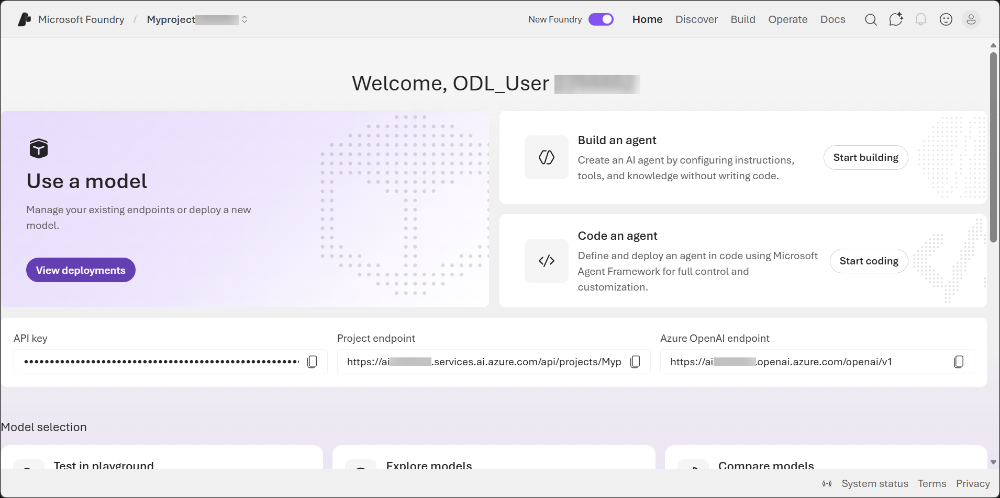

# Translation with Azure Translator in Foundry

### Estimated Duration: 55 Minutes

## Lab Overview

In this exercise, you'll use Azure Translator in Microsoft Foundry to explore translation capabilities for multilingual applications. You will connect the Translator service to a Foundry project, perform text translation using the Azure-MT Neural Machine Translation (NMT) model, detect languages automatically, and perform transliteration between scripts. You will also explore GPT-5.1-powered translation features such as tone and gender control, translate documents while preserving formatting, and build a Python client that uses the Translator REST API. Through these activities, you'll learn how Azure Translator supports Natural Language Processing (NLP) scenarios and multilingual AI solutions.

## Lab Objectives

In this exercise, you will perform the following tasks:

* Task 1: Connect Azure Translator to your Foundry project
* Task 2: Translate text using the Azure-MT model
* Task 3: Use language detection and transliteration
* Task 4: Translate with GPT-4o using tone and gender controls
* Task 5: Translate a document using the Document Translation playground
* Task 6: Build a Python translation client
* Task 7: Compare NMT and LLM translation quality

## Task 1: Create a Microsoft Foundry project

In this task, you will create a Microsoft Foundry project. You will sign in to the Microsoft Foundry portal, configure the project settings such as the subscription, resource group, Foundry resource, and region, and create the project that will be used to manage models, deployments, guardrails, and other AI assets.

1. Copy the **Microsoft Foundry** link and paste it into a new browser tab to access the portal: `https://ai.azure.com/`

1. On the **Microsoft Foundry** home page, click on **Start building** in the top right corner.

     

1. If prompted to sign in, enter your credentials:
 
   - **Email/Username:** Enter <inject key="AzureAdUserEmail"></inject> **(1)** and click on **Next (2)**.
 
        
 
   - **Password:** Enter <inject key="AzureAdUserPassword"></inject> **(1)** and click on **Sign in (2)**.
 
      .png)

1. If prompted to **Stay signed in?**, you can click **No**.

    

1. In the **Create a project** wizard, enter project name **Myproject<inject key="DeploymentID" enableCopy="false" /> (1)**, and **Expand Advanced options (2)** to specify the following settings for your project: 

    - Foundry resource: **AI<inject key="DeploymentID" enableCopy="false" /> (3)**
    - Subscription : **Leave default subscription (4)** 
    - Region : Select **<inject key="location" enableCopy="false"/> (5)**
    - Resource group : Select **AI-901 (6)** 
    - Click on **Create** **(7)**

      

1. Wait for your project to be created. It may take a few minutes. 

1. In the **All set, Let's build your agents** window, click **Let's go**.

    

1. After creating a project in the new Foundry portal, it should open in a page similar to the following image:

    


## Task 2: Translate text using the Azure-MT model

In this task, you will use the Azure-MT Neural Machine Translation (NMT) model to translate text into multiple languages.

1. In the **Azure Translator - Text Translation** playground, verify that the model is set to **Azure-MT (1)**.

   

   

2. Set:

   * **Source language:** Auto-detect **(1)**
   * **Target language:** Spanish **(2)**

3. In the input box, enter the following text **(3)** and click **Translate (4)**.

   ```
   Dear customer, thank you for contacting our support team. Your case has been assigned to a specialist who will respond within 24 hours. We appreciate your patience.
   ```

      

5. Observe the translated output and detected language.

   

6. Change the target language to:

   * French (fr)
   * Arabic (ar)
   * Japanese (ja)
   * Portuguese (pt)

   Repeat the translation for each language.

### Multiple Target Languages

1. Select **Add target language (5)**.

2. Add **German (de)** as an additional target language.

3. Click **Translate** again.

4. Observe that translations for multiple target languages are returned in a single request.

> **AI-901 Exam Tip:** Azure Translator can return translations for multiple target languages in a single API call.


## Task 3: Use language detection and transliteration

In this task, you will explore language detection and transliteration capabilities.

### Task 3.1: Language Detection

1. Set the source language to **Auto-detect**.

2. Test the following inputs one at a time:

   ```
   ¿Dónde está la biblioteca?
   ```

   ```
   Je voudrais un café, s’il vous plaît.
   ```

   ```
   こんにちは、元気ですか？
   ```

   ```
   Olha que coisa mais linda, mais cheia de graça.
   ```

   ```
   Wie heißen Sie?
   ```

   ```
   Merhaba, nasılsınız?
   ```

3. Observe the detected language and confidence score for each input.

> **Note:** Language detection returns the detected language code, confidence score, and supported translation/transliteration information.

### Transliteration

1. Select the **Transliteration** tab.

2. Configure:

   * Language: Arabic (ar)
   * From script: Arabic
   * To script: Latin

3. Enter the following Arabic text:

   ```
   مرحبا، كيف حالك؟
   ```

4. Click **Transliterate**.

5. Observe the Latin script output.

6. Repeat the exercise using Hindi text:

   ```
   नमस्ते, आप कैसे हैं?
   ```

> **Note:** Transliteration changes the script but not the language or meaning.

---

## Task 4: Translate with GPT-4o using tone and gender controls

In this task, you will use GPT-4o translation capabilities to apply tone and gender controls.

1. In the Text Translation playground, change the model to **GPT-5.1** or **GPT-4o**.

2. Verify that the following controls are available:

   * Tone
   * Gender
   * Reference translations

### Formal and Informal Tone

1. Enter the following text:

   ```
   Hey, can you send me the report when you get a chance? I need it before the meeting tomorrow morning. Thanks a lot!
   ```

2. Set:

   * Target language: French (fr)
   * Tone: Formal
   * Gender: Neutral

3. Click **Translate** and review the output.

4. Change **Tone** to **Casual**.

5. Click **Translate** again.

6. Compare the two outputs.

### Gender-Specific Translation

1. Enter the following text:

   ```
   The doctor was very professional and helpful during the consultation.
   ```

2. Translate to Spanish with:

   * Gender = Male
   * Gender = Female
   * Gender = Neutral

3. Compare the resulting translations.

### Adaptive Customization

1. Under **Reference translations**, select **Add reference pair**.

2. Enter:

   **Source Text (English):**

   ```
   Please submit your expense claim through the Tepuy Pay portal.
   ```

   **Target Text (Spanish):**

   ```
   Por favor envíe su solicitud de gastos a través del portal Tepuy Pay.
   ```

3. Translate the following sentence:

   ```
   Your expense claim has been approved and will be processed through Tepuy Pay.
   ```

4. Observe how the translation follows the terminology and style from the reference pair.

---

## Task 5: Translate a document using the Document Translation playground

In this task, you will translate a document while preserving its formatting.

1. Create a Word document using notepad containing the following content:

   ```
   Title: Company Expense Policy — Summary

   Section 1: Travel Expenses

   Employees may claim up to $150 per night for hotel accommodation when traveling on company business. All claims must be submitted within 30 days of the travel date.

   Section 2: Meal Allowances

   The standard meal allowance is $50 per day. Receipts are required for all meal claims above $25. Business entertainment meals require manager approval in advance.

   Section 3: Transportation

   Taxi and rideshare receipts must be submitted for all trips. Public transit costs are reimbursed at the actual fare paid.
   ```

2. Save the document as:

   ```
   expense_policy_EN.docx
   ```

3. In Microsoft Foundry, select:

   **Translation → Document Translation**

4. Click **Browse for a file (2)** and upload the document.

5. Configure:

   * Source language: English (en)
   * Target language: Spanish (es)

6. Click **Translate (3)**.

7. Download and open the translated document.

8. Verify:

   * Text is translated
   * Formatting is preserved
   * Dollar amounts remain unchanged
   * Proper nouns are preserved

9. Repeat the translation using **French (fr)** as the target language.

---

## Task 6: Build a Python translation client

In this task, you will create a Python application that uses the Azure Translator API.

1. In Microsoft Foundry, navigate to:

   **Settings → Connected resources**

2. Locate the Azure AI Services resource.

3. Copy:

   * Endpoint URL
   * Key 1
   * Region

4. Open:

   ```
   https://vscode.dev
   ```

5. Open a terminal and install requests if necessary:

   ```bash
   pip install requests
   ```

6. Create a file named:

   ```
   translator_client.py
   ```

7. Add the sample Python code provided in the lab.

8. Replace:

   ```python
   KEY = "your-translator-key-here"
   REGION = "eastus"
   ```

   with your actual values.

9. Run the application:

   ```bash
   python translator_client.py
   ```

10. Verify:

    * Language detection works correctly
    * Multi-language translation returns results
    * Transliteration returns Arabic text in Latin script

---

## Task 7: Compare NMT and LLM translation quality

In this task, you will compare Azure-MT and GPT-4o translations.

1. Translate the following text samples into Spanish using both models:

   ```
   It's raining cats and dogs outside!
   ```

   ```
   Please submit your TPS reports by EOD Friday.
   ```

   ```
   The quarterly earnings exceeded analyst expectations.
   ```

   ```
   omg this is literally the best day ever lol
   ```

   ```
   The patient presented with acute myocardial infarction.
   ```

2. Compare:

   * Translation quality
   * Natural language usage
   * Technical accuracy
   * Handling of idioms and slang

3. Record your observations and determine which model performs better for each scenario.

---

## Summary

In this lab, you connected Azure Translator to a Microsoft Foundry project and explored multiple translation capabilities available through Azure Translator. You used the Azure-MT Neural Machine Translation model for text translation, performed automatic language detection and transliteration, and explored GPT-4o translation features such as tone and gender control. You translated documents while preserving formatting and built a Python application that used the Translator REST API for translation, language detection, and transliteration. Finally, you compared NMT and LLM-based translation approaches and observed their strengths across different translation scenarios.

### You've successfully completed the hands-on lab!
