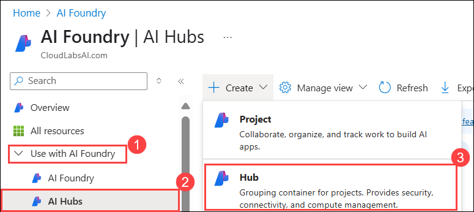
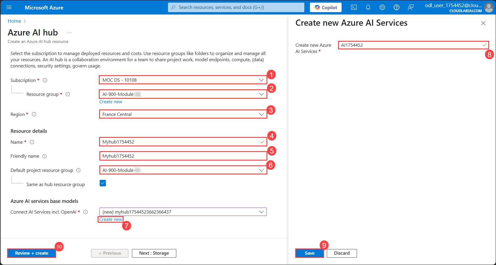
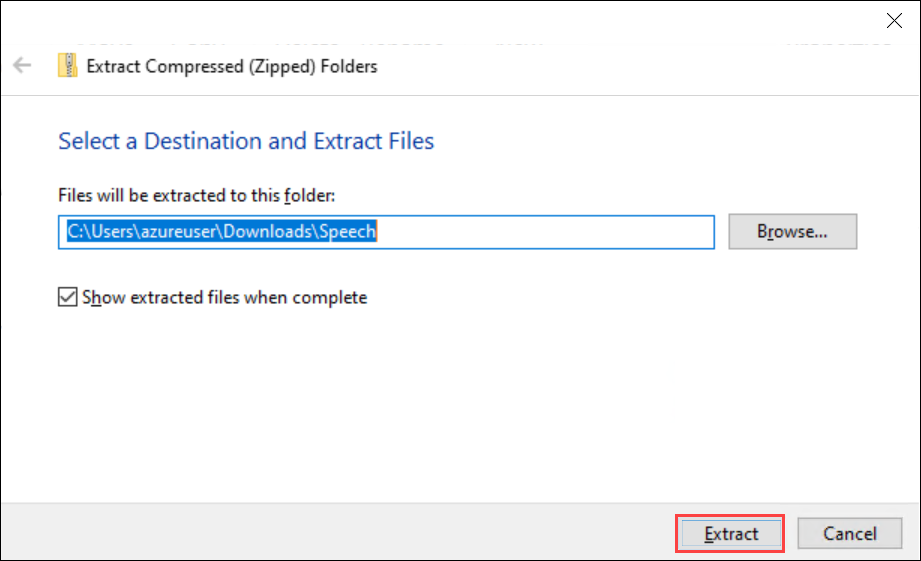

# Module 09: Explore Speech in the Azure AI Foundry portal

## Lab overview

The **Azure AI Speech** service transcribes speech into text and text into audible speech. You might use AI Speech to create an application that can transcribe meeting notes or generate text from the recording of interviews.

In this exercise, you will use Azure AI Speech in the Azure AI Foundry portal, Microsoft's platform for creating intelligent applications, to transcribe audio using the built-in try-it-out experiences. 

## Lab objectives

In this lab, you will perform:

- Task 1: Create a project in the Azure AI Foundry portal
- Task 2: Explore speech-to-text in Azure AI Foundry's Speech Playground

### Task 1: Create a project in the Azure AI Foundry portal

In this task, we are creating and configuring a project in Azure AI Foundry to explore AI services and speech capabilities.

1. On the Azure Portal page, in the Search resources, services, and docs (G+/) box at the top of the portal, enter **Azure AI Foundry (1)**, and then select **Azure AI Foundry (2)** under **Services**.

     

1. In the left navigation pane for the AI Foundry, select **AI Hubs (2)** under **Use with AI Foundry (1)**. On the AI Hubs page, click on **+ Create** and select **Hub (3)** from the drop-down.

     

1. On the **Create an AI hub resource** pane, enter the following details:

    - Subscription : **Leave default subscription** 
    - Resource Group : Select **AI-900-Module-09 (1)** 
    - Region : **<inject key="Region" enableCopy="false"></inject>** Use the same location as the resource group **(2)**
    - Name : Use the format **Myhub-<inject key="Deployment ID" enableCopy="false"></inject> (3)** 
    - Connect AI Services incl. OpenAI : Click on **Create New (7)**
    - Create new Azure AI Services: Provide a name to the AI Service,Use the format **AI<inject key="Deployment ID" enableCopy="false"></inject> (8)**  
    - Click on **Save (9)**.
    - Click on **Review + Create (10)**

        

1. Click on the **Create** button to begin the deployment process.

1. Right-click on the [Azure AI Foundry](https://ai.azure.com?azure-portal=true) **(1)** link, select **Copy link (2)** from the context menu, then paste it into a new tab to access the Azure AI Foundry portal.

   

1. On the Welcome to Azure AI Foundry page, Click on **Sign in** in the top right corner.

   

1. If prompted to sign in, enter your credentials:
 
   - **Email/Username:** <inject key="AzureAdUserEmail"></inject>
 
      
 
   - **Password:** <inject key="AzureAdUserPassword"></inject>
 
     

1. If prompted to stay signed in, you can click **No**.

   

1. If prompted with *Streamlined from the start*, click on **Got it** to proceed.

   

1. Close any tips or quick start panes that are opened the first time you sign in, and if necessary use the **Azure AI Foundry** logo at the top left to navigate to the home page, which looks similar to the following image (close the **Help** pane if it's open)

1. In the browser, navigate to `https://ai.azure.com/managementCenter/allResources` and select **Create new**.

1. Choose the option to create a **AI hub resource (1)** then select **Next (2)**.

   

1. In the **Create a new project** wizard, enter project name **Myproject<inject key="DeploymentID" enableCopy="false" /> (1)**, and select newly created **Myhub<inject key="DeploymentID" enableCopy="false" /> (2)** and select **Create (3)**.

    

1. Wait for your project created.

1. When the project is created, you will be taken to an *Overview* page of the project details.
 
1. On the left-hand menu on the screen, select **Playgrounds**.

1. On the *Playgrounds* page, select the **Speech playground** tile to try out some Azure AI Speech capabilities.
   
> **Congratulations** on completing the task! Now, it's time to validate it. Here are the steps:
 
- Hit the Validate button for the corresponding task. If you receive a success message, you can proceed to the next task. 
- If not, carefully read the error message and retry the step, following the instructions in the lab guide.
- If you need any assistance, please contact us at cloudlabs-support@spektrasystems.com. We are available 24/7 to help you out.

   <validation step="a78cde3c-b21b-4ea4-9230-2d5a5d655239" />

### Task 2: Explore speech to text in Azure AI Foundry's Speech Playground

In this task, we are using Azure AI Speech to transcribe audio into text in real time using the Speech Playground.

Let's try out *real-time speech-to-text* in Azure AI Foundry's Speech Playground. 

1. In a new browser window, open the [Azure AI services exploration page](https://ai.azure.com/explore/aiservices).

1. On the **AI Services (1)** page, select the **Speech (2)** tile to try out Azure AI Speech capabilities.

   

1. On the *Speech* page, scroll down and select **Real-time transcription** under *Try out Speech capabilities*. You will be taken to the *Speech Playground*. 

   

1. Copy the highlighted link by right-clicking the [**https://aka.ms/mslearn-speech-files**](https://aka.ms/mslearn-speech-files) and selecting "Copy" from the context menu, and paste it into a new tab to download **Speech.zip**. 

1. Click the **download icon (1)** to view your downloads, then click the **folder icon (2)** to open the file location.

   

1. **Right-click** the **ZIP file (1)**  and select **Extract All (2)** to **unzip** its contents. 

   

1. Select the destination folder, ensure Show extracted files when complete is checked, and click **Extract** to unzip the files. 

   

1. The Speech folder contains **m4a** file named **WhatAICanDo**. 

   

1. Go back to the Azure AI Foundry portal, select Connected resource **(1)**, click **Browse files (2)** to upload the **WhatAICanDo.m4a** file, navigate to **C:\Users\azureuser\Downloads\Speech (3)**, select **WhatAICanDo (4)**, and click **Open (5)** to begin transcription.

   

1. The Speech service transcribes and displays the text in real time. If you have audio on your computer, you can listen to the recording as the text is being transcribed.

1. The output successfully transcribes the audio, capturing how AI enhances various aspects of life, including healthcare, accessibility, infrastructure, entertainment, and environmental sustainability.

   

### Review

In this exercise, you have completed the following tasks:

- Explored Azure AI Speech services in the Speech Playground
- Transcribed audio to text using the Real-time speech-to-text service

## Learn more

This exercise demonstrated only some of the capabilities of the Speech service. To learn more about what you can do with this service, see the [Speech page](https://azure.microsoft.com/services/cognitive-services/speech-services).

## You have successfully completed this lab.
