# Face & Image Analysis with Microsoft Foundry

### Estimated Duration: 60 Minutes

## Lab Overview

In this lab, you will use the multimodal capabilities of GPT-5 Mini in Microsoft Foundry to analyze images and extract information from visual content. You will begin by verifying image input support in the Chat Playground and testing prompts that instruct the model to identify faces, describe expressions, estimate age ranges, and provide contextual observations.

You will then experiment with different prompting strategies to understand how prompt design affects the structure and usefulness of image analysis results. Next, you will build a Python application using the Azure AI Foundry SDK that sends image URLs to a deployed GPT-5 Mini model and returns structured face analysis data. Finally, you will explore Content Understanding in Microsoft Foundry and compare it with multimodal prompting approaches for extracting information from images.

Through these activities, you will gain hands-on experience building vision-enabled AI applications and using multimodal AI models to interpret visual content.

## Lab Objectives

In this exercise, you will perform the following tasks:

* Task 1: Create a Microsoft Foundry project
* Task 2: Deploy a multimodal model
* Task 3: Verify multimodal image analysis in Chat Playground
* Task 4: Design face analysis prompts
* Task 5: Build a face analysis application with Foundry SDK
* Task 6: Explore Content Understanding in Microsoft Foundry

## Task 1: Create a Microsoft Foundry project

In this task, you'll create a Microsoft Foundry project, configure the required Azure resources, and obtain the project endpoint needed for application development.

1. Copy the **Microsoft Foundry** link and paste it into a new browser tab to access the portal: `https://ai.azure.com/`

1. On the **Microsoft Foundry** home page, click on **Start building** in the top right corner.

     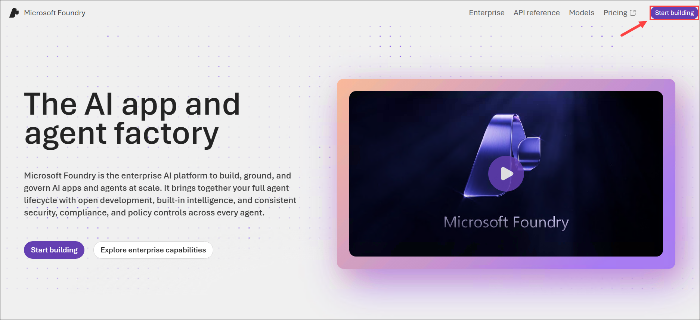

1. If prompted to sign in, enter your credentials:
 
   - **Email/Username:** Enter <inject key="AzureAdUserEmail"></inject> **(1)** and click on **Next (2)**.
 
        
 
   - **Password:** Enter <inject key="AzureAdUserPassword"></inject> **(1)** and click on **Sign in (2)**.
 
      .png)

1. If prompted to **Stay signed in?**, you can click **No**.

    

1. On the **Get started with Microsoft Foundry** page, click on **Create project**.

   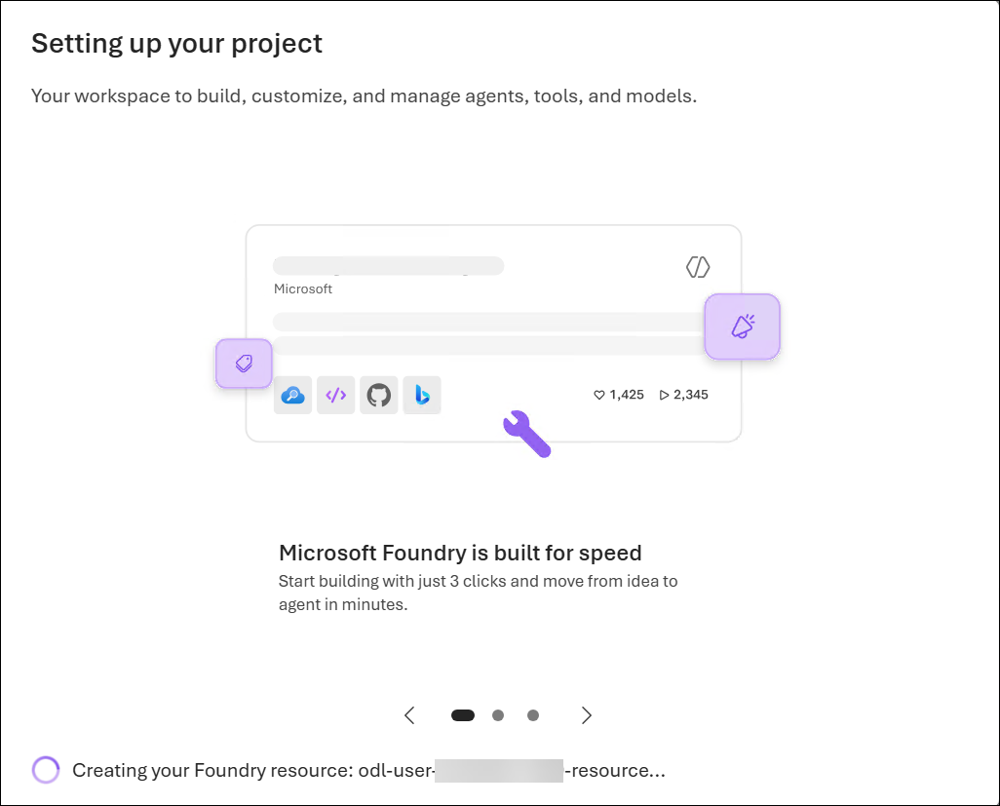

1. In the **Create a project** wizard, enter project name **Myproject<inject key="DeploymentID" enableCopy="false" /> (1)**, and **Expand Advanced options (2)** to specify the following settings for your project: 

    - Foundry resource: **AI<inject key="DeploymentID" enableCopy="false" /> (3)**
    - Subscription : **Leave default subscription (4)** 
    - Region : Select **<inject key="location" enableCopy="false"/> (5)**
    - Resource group : Select **AI-901 (6)** 
    - Click on **Create** **(7)**

      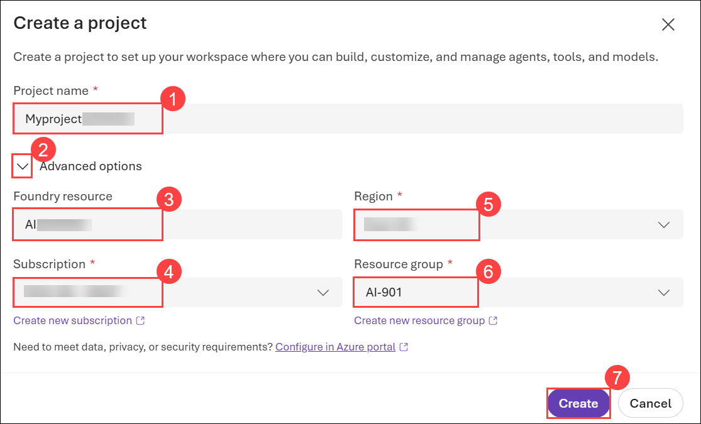

1. Wait for your project to be created. It may take a few minutes. 

1. In the **All set, Let's build your agents** window, click **Let's go**.

    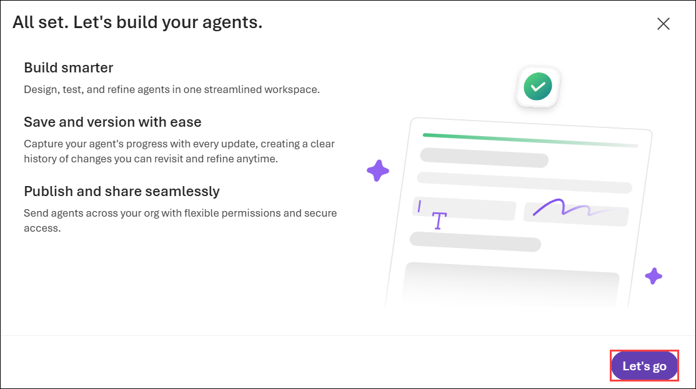

1. After the project is created, the Microsoft Foundry portal will open to a page similar to the one shown below. Locate and copy the **Project Endpoint**, then save it in a text file or Notepad, as it will be required later when configuring the Python application in this lab.

    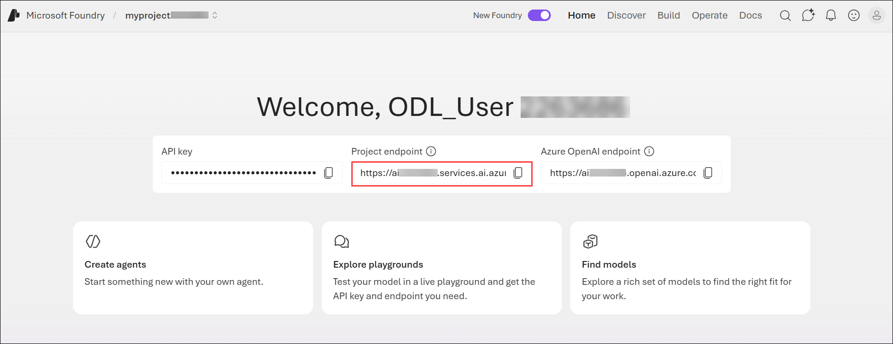

> **Congratulations** on completing the task! Now, it's time to validate it. Here are the steps:
 
- Hit the Validate button for the corresponding task. You will receive a success message. 
- If not, carefully read the error message and retry the step, following the instructions in the lab guide.
- If you need any assistance, please contact us at cloudlabs-support@spektrasystems.com. We are available 24/7 to help you out.

  <validation step="18a45d8c-6200-4fa9-bbe4-136ad8bb9a24" />

## Task 2: Deploy a model

In this task, you'll deploy the GPT-5 Mini model in Microsoft Foundry and obtain the deployment name required for testing and application integration.

1. Now you're ready to explore models. On the **Discover (1)** page, select the **Models (2)** tab to view the Microsoft Foundry model catalog.

    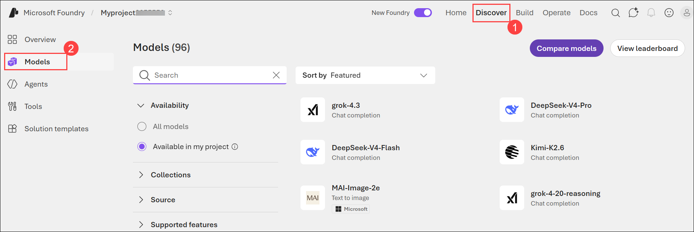

1. In the **Models** page, enter **gpt-5-mini** in the search box **(1)** and select the **gpt-5-mini (2)** model from the search results.

    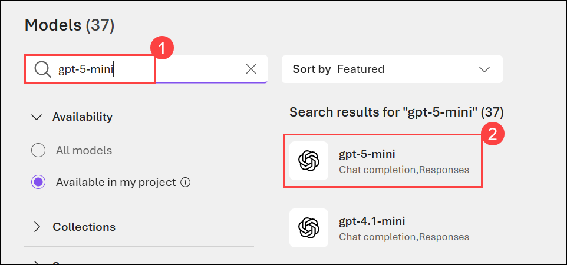

1. Review the model card, then click **Deploy (1)** and select **Default settings (2)** to deploy the model using the recommended default configuration.

    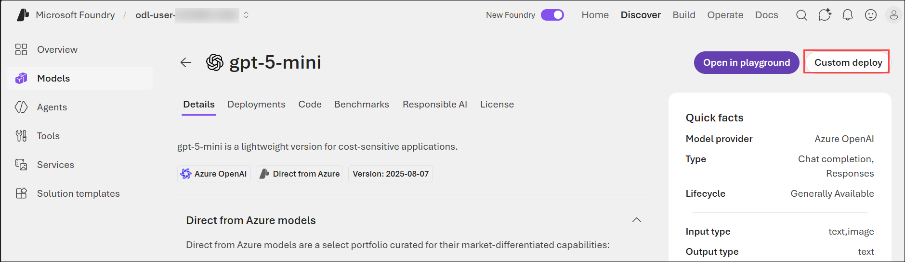

1. When the model has been deployed, it will open in the model playground.

    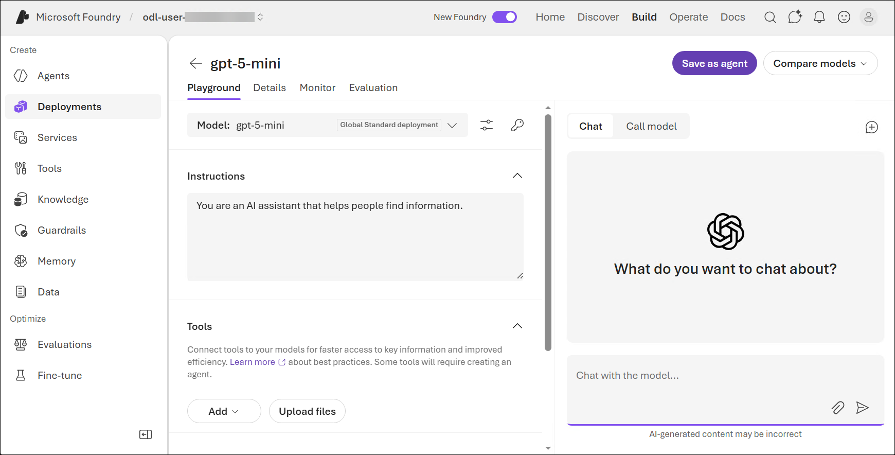

1. Make a note of the **Deployment Name**, as it will be used later in the lab when configuring the Python application.
   
     .png)

> **Congratulations** on completing the task! Now, it's time to validate it. Here are the steps:
 
- Hit the Validate button for the corresponding task. You will receive a success message. 
- If not, carefully read the error message and retry the step, following the instructions in the lab guide.
- If you need any assistance, please contact us at cloudlabs-support@spektrasystems.com. We are available 24/7 to help you out.

  <validation step="b140bb55-525d-45f3-aa02-c86f0c8fa0bf" />

## Task 3: Verify Multimodal Image Analysis in Chat Playground

In this task, you'll verify that GPT-5 Mini supports image input and perform basic face analysis using the Chat Playground.

1. Make sure you are on the **Playground** tab of gpt-5-mini.

3. In the **Instructions** section, enter the following system message:

    ```text
    You are a computer vision assistant specializing in face and image analysis. When given an image, provide a detailed, structured analysis of all visible faces including: count, estimated age range, emotional expression, head orientation, and any relevant contextual observations.
    ```

    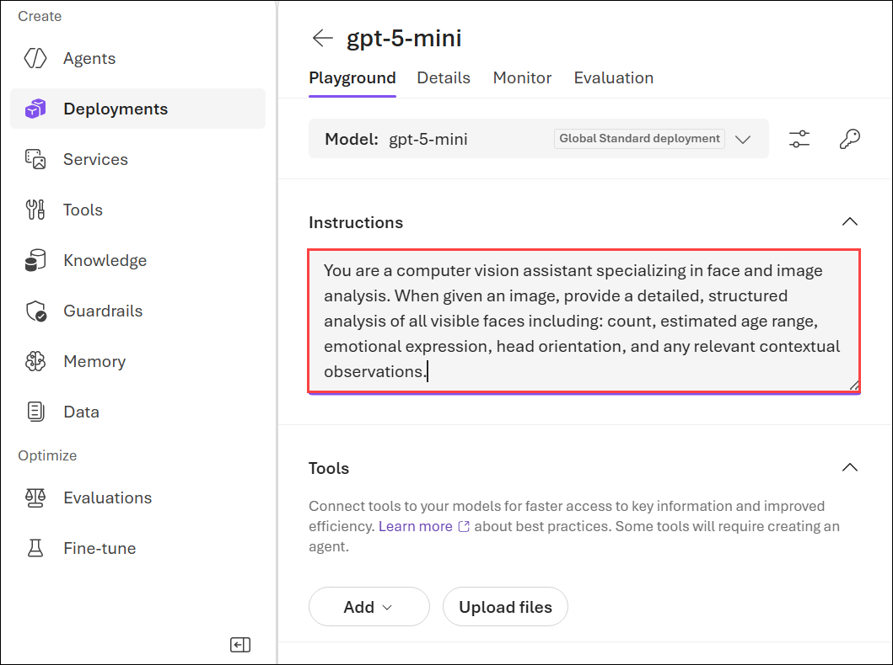

1. In the chat input area, paste the following image URL:

    ```text
    https://upload.wikimedia.org/wikipedia/commons/6/6a/Mona_Lisa.jpg
    ```

1. After attaching the image URL, enter the following prompt and press Enter to submit it. The model will analyze the image and provide details about the visible face, including its expression, estimated age range, and overall context:

    ```text
    Analyze all faces in this image. Describe expression, estimated age, and context.
    ```

    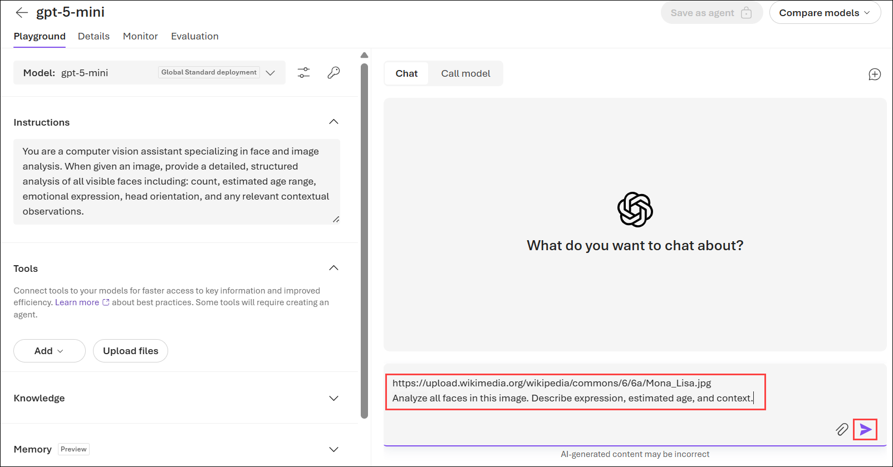

8. Review the generated response.

    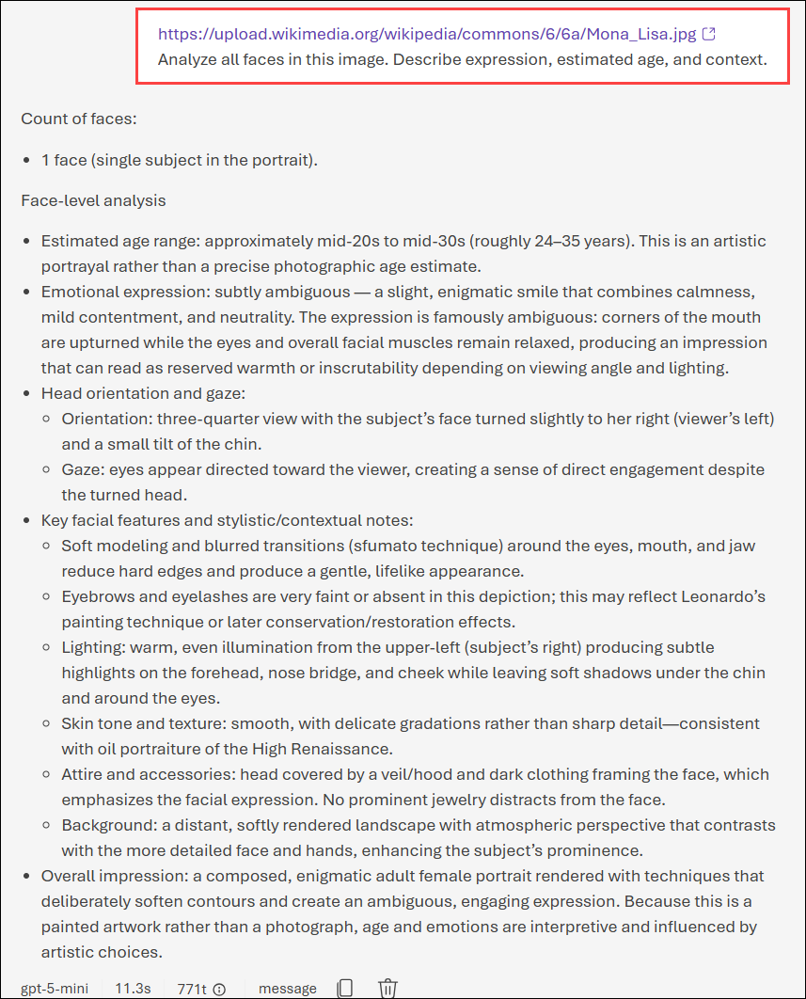

9. Now paste the given URL in a new tab and save the image on the LabVM. 

    ```text
    https://github.com/CloudLabs-MOC/mslearn-ai-fundamentals/blob/ai901-2026/Instructions/Labs/images/group-image.jpg?raw=true
    ```

1. Right click on the image and select **Save image as**.

     .png)

1. In the **Save As** window, select **Download (1)** folder from the left pane and click on **Save (2)**.

     .png)

1. Go back to the **Microsoft Foundry** tab in the browser, click on the **Attach files (1)** icon and from the **Open** window select image **(2)** you have saved earlier and click on **Open (3)**. 

     .png)

10. Paste the following prompt and press **Enter** to submit

     ```text
     How many people are visible? Describe each person's expression and approximate age.
     ```

     .png)

11. Review the results and observe how the model analyzes multiple faces in a single image.

     .png)

## Task 4: Design Face Analysis Prompts

In this task, you'll create and compare different face analysis prompts to understand how prompt structure influences the quality, detail, and usefulness of image analysis results.

1. Click **New Chat** to start a new conversation while keeping the same system message configured in the previous task.

    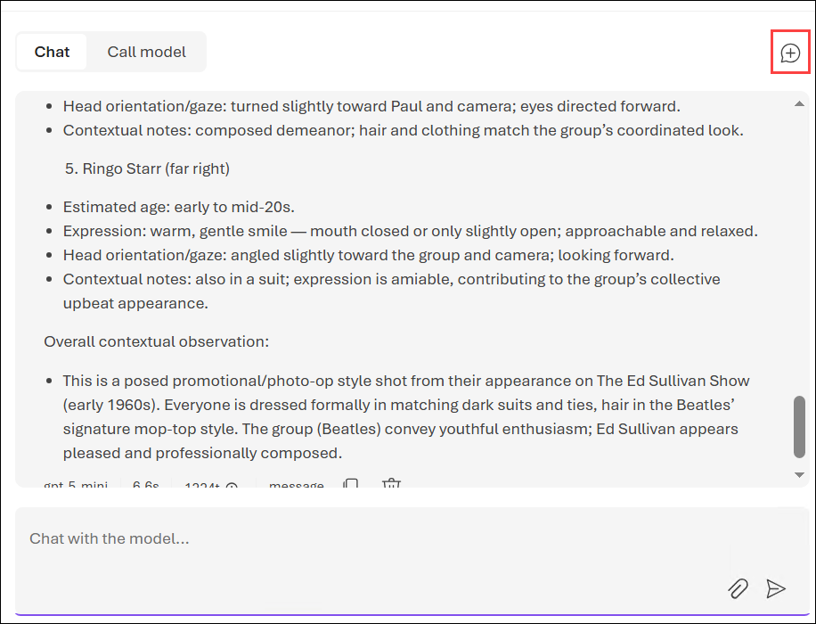

2. Use the same **Mona Lisa** image URL from the previous task and submit the following open-ended prompt:

    ```text
    What do you see in this image?
    ```

3. Review the response and observe how the model describes the image when no specific output format is requested.

    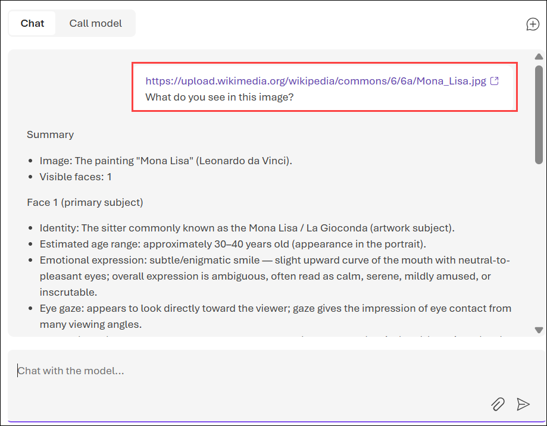

4. Start a new chat session and attach the same image URL again.

5. Submit the following structured prompt:

      ```text
      Analyze all faces. Return ONLY a JSON object with these keys:
      {
      "face_count": <number>,
      "faces": [
         {
         "expression": "",
         "age_estimate": "",
         "head_orientation": "",
         "notes": ""
         }
      ]
      }
      ```

6. Review the generated response and observe how the model returns information in a structured format suitable for application integration.

    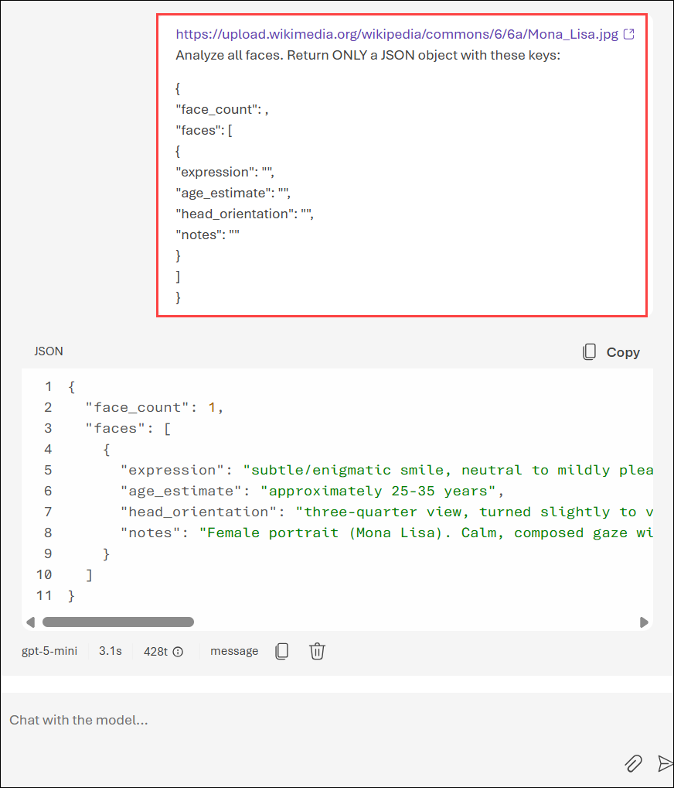

7. Start a new chat session and attach the same image URL once again.

8. Submit the following confidence-rating prompt:

    ```text
    On a scale of 1–10, rate the confidence of each facial attribute you detect: expression clarity, age estimate accuracy, head pose, and emotional tone. Explain each rating.
    ```

9. Review the response and observe how the model evaluates its confidence when describing visual attributes.

    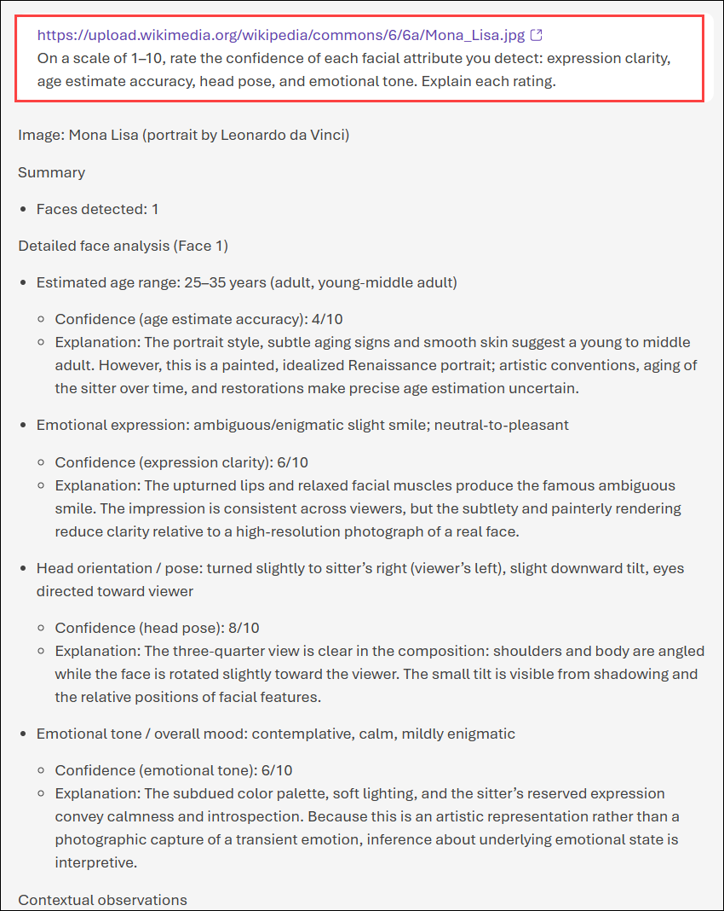

10. Compare the outputs generated by all three prompting strategies and note the differences in:

      - Level of detail
      - Response structure
      - Ease of processing programmatically
      - Overall usefulness for production applications

11. Consider how prompt engineering can influence the quality and consistency of outputs generated by multimodal AI models.

## Task 5: Build a Face Analysis Application with Foundry SDK

In this task, you'll build a Python application using the Azure AI Foundry SDK to analyze images and extract structured face analysis information using the deployed GPT-5 Mini model.

1. Click the **Call model** tab next to the **Chat** tab to view the endpoint details and sample code for calling the deployed model programmatically.

    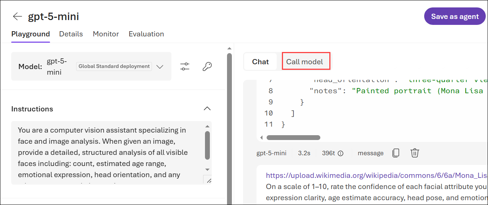

2. Scroll down and click **Skip setup with VS Code for the Web** to launch an online VS Code environment in a new tab.

    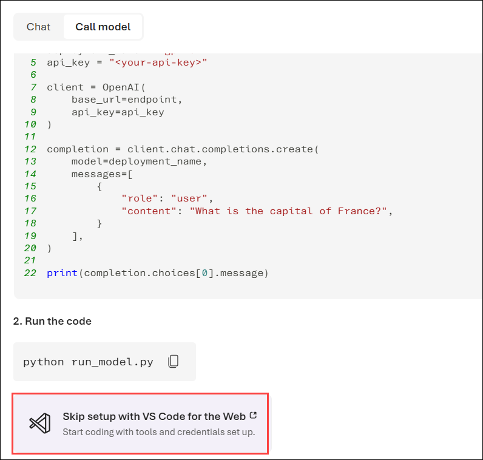

1. When prompted, leave the default workspace folder name unchanged and press **Enter** to create the workspace.

    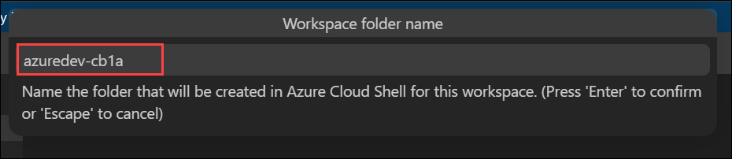

1. Please wait while the environment is being set up. This process may take a few minutes to complete.

    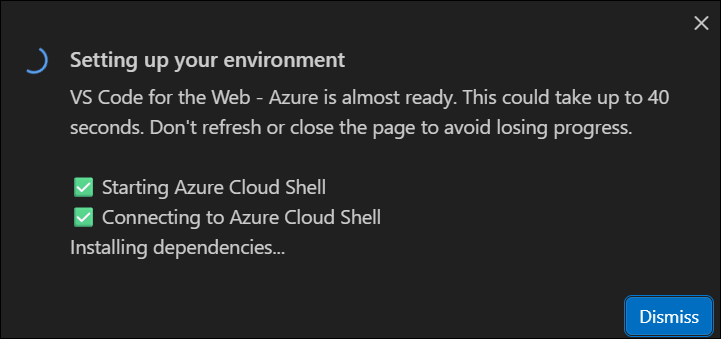

1. The integrated terminal should open automatically after the environment setup is complete. If it does not appear, open it manually by selecting **Hamburger Menu (1) → View (2) → Terminal (3)**, or press **Ctrl + `** on your keyboard. The terminal will be used to run commands throughout this lab.

    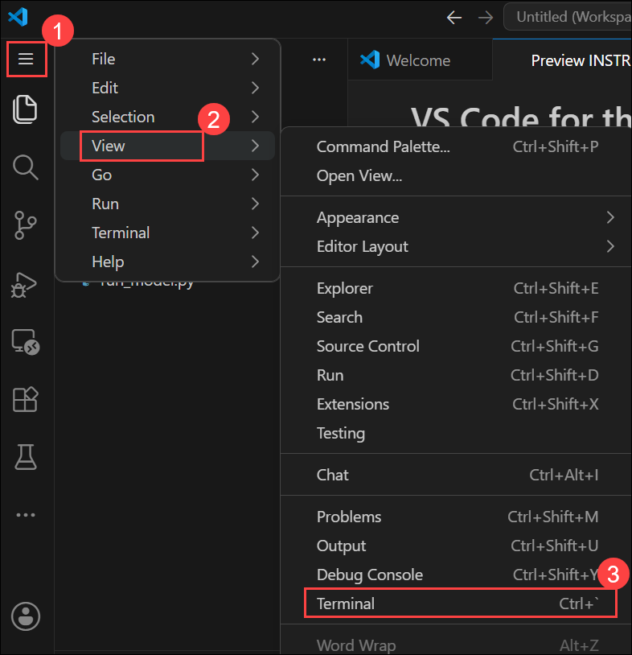

1. Run the following command in the terminal to install the Azure AI Foundry SDK and authentication libraries required to connect to your Foundry project and interact with the deployed **gpt-5-mini** model from Python:

    ```bash
    pip install --user azure-ai-projects azure-identity
    ```

    >**Note:** Note: If you receive a warning such as `ansible-core requires packaging, which is not installed`, you can safely ignore it for this lab.

1. Now in the **Explorer** pane click on **New File... (1)** icon to create a new file **(2)** named:

    ```text
    face_analysis_foundry.py
    ```

    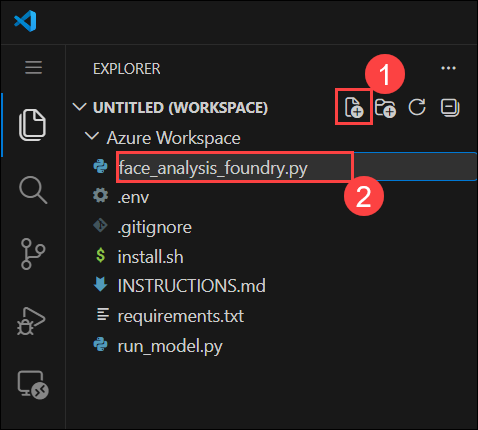

8. Copy and paste the following code into **face_analysis_foundry.py**:

      ```python
      import json
      from azure.ai.projects import AIProjectClient
      from azure.identity import DefaultAzureCredential

      # Foundry Connection 
      PROJECT_ENDPOINT = 'YOUR_TARGET_URI_HERE'  
      DEPLOYMENT_NAME = 'gpt-5-mini'

      client = AIProjectClient(
         endpoint=PROJECT_ENDPOINT,
         credential=DefaultAzureCredential()
      )

      # System Prompt 
      SYSTEM_PROMPT = (
         'You are a computer vision assistant specializing in face analysis. '
         'When given an image URL, analyze all visible faces and return ONLY '
         'a valid JSON object — no markdown, no explanation — with this structure: '
         '{ "face_count": <int>, "faces": [ { "expression": "<string>", '
         '"age_estimate": "<string>", "head_orientation": "<string>", '
         '"confidence": "<high|medium|low>", "notes": "<string>" } ] }'
      )

      def analyze_faces(image_url):
         """Send an image URL to gpt-5-mini for face analysis."""
         openai_client = client.get_openai_client()
         response = openai_client.chat.completions.create(
            model=DEPLOYMENT_NAME,
            messages=[
                  {'role': 'system', 'content': SYSTEM_PROMPT},
                  {'role': 'user', 'content': [
                     {
                        'type': 'image_url',
                        'image_url': {'url': image_url}
                     },
                     {
                        'type': 'text',
                        'text': 'Analyze all faces in this image.'
                     }
                  ]}
            ],

            max_completion_tokens=5000
         )

         raw = response.choices[0].message.content.strip()

         # Strip markdown fences if present
         if raw.startswith('```'):
            raw = raw.split('```')[1]
            if raw.startswith('json'):
                  raw = raw[4:]

         try:
            return json.loads(raw)
         except json.JSONDecodeError:
            return {'raw_response': raw}

      def print_analysis(result, label):
         """Pretty-print face analysis results."""
         print(f'\n--- {label} ---')

         if 'raw_response' in result:
            print(result['raw_response'])
            return

         print(f'Faces detected : {result.get("face_count", "?")}')

         for i, face in enumerate(result.get('faces', [])):
            print(f'\n  Face {i+1}:')
            print(f'    Expression      : {face.get("expression")}')
            print(f'    Age estimate    : {face.get("age_estimate")}')
            print(f'    Head orientation: {face.get("head_orientation")}')
            print(f'    Confidence      : {face.get("confidence")}')
            print(f'    Notes           : {face.get("notes")}')

      # Test Images 
      TEST_IMAGES = [
         (
               'Mona Lisa (single face)',
               'https://github.com/CloudLabs-MOC/mslearn-ai-fundamentals/blob/ai901-2026/Instructions/Labs/images/Mona_Lisa.jpg?raw=true'
            ),
         (
            'Group photo (multiple faces)',
            'https://github.com/CloudLabs-MOC/mslearn-ai-fundamentals/blob/ai901-2026/Instructions/Labs/images/group-photo.jpg?raw=true'
         ),
      ]

      print('=' * 65)
      print('  Lab 4B — Face Analysis via Microsoft Foundry + gpt-5-mini')
      print('=' * 65)

      for label, url in TEST_IMAGES:
         result = analyze_faces(url)
         print_analysis(result, label)

      print('\n' + '=' * 65)
      ```

      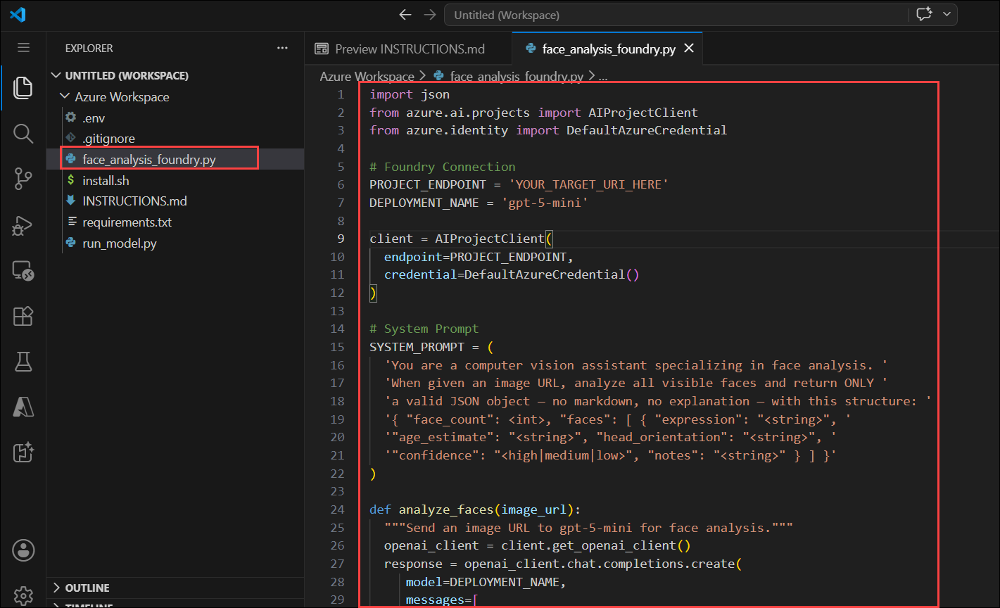

13. Update the following placeholders with the values you noted earlier from Microsoft Foundry:

      - PROJECT_ENDPOINT = `'YOUR_TARGET_URI_HERE'`
      - DEPLOYMENT_NAME = `'gpt-5-mini'`
   
         > **Note:** Replace `YOUR_TARGET_URI_HERE` with your copied **Project Endpoint**. If your deployment uses a different deployment name, replace `gpt-5-mini` with the exact deployment name.

         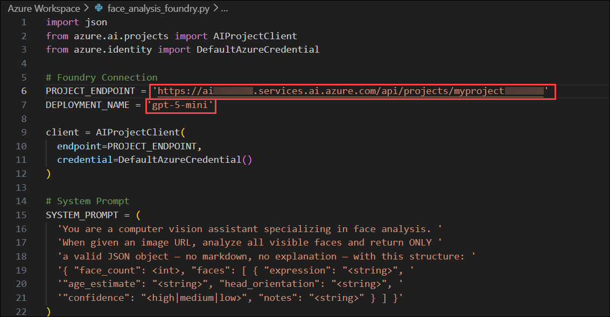

14. Run the application using the following command:

      ```bash
      python face_analysis_foundry.py
      ```

15. Review the generated results.

     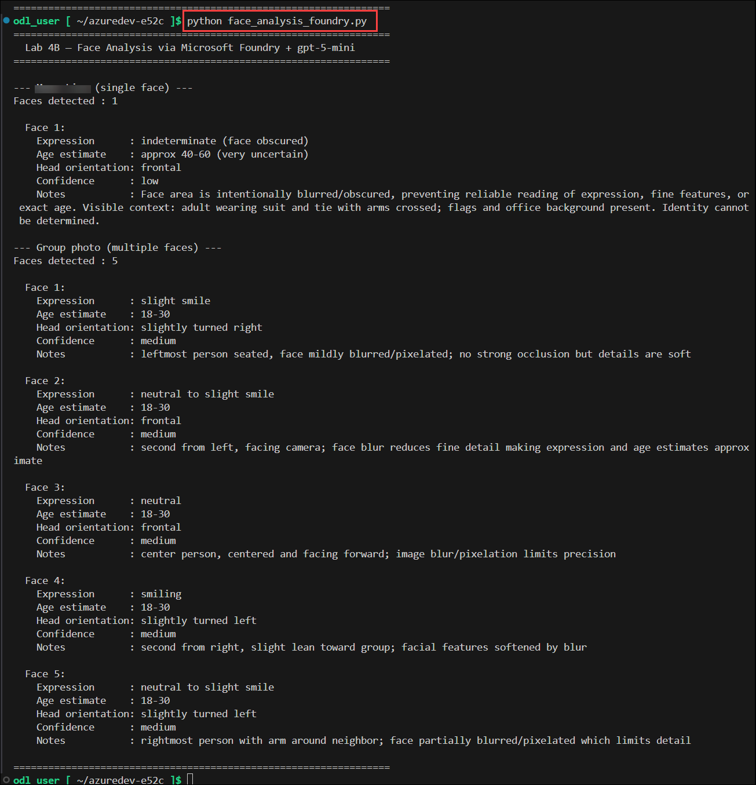

16. Verify that:

      * The Mona Lisa image returns a single detected face.
      * The output includes expression, age estimate, head orientation, and confidence values.
      * The group image returns multiple face entries with individual analysis results.

17. Observe how a single multimodal model can extract structured visual information directly from image URLs using prompt engineering and the Azure AI Foundry SDK.

      > **Expected Outcome:** The application should successfully analyze both images and return structured face analysis information generated by GPT-5 Mini.

## Task 6: Explore Content Understanding in Microsoft Foundry

In this task, you'll explore the Content Understanding capability in Microsoft Foundry and compare it with the multimodal prompting approach used in the previous tasks.

1. Go back to the **Microsoft Foundry** portal, where the **gpt-5-mini** playground is still open.

1. Now paste the given URL in a new tab and save the image on the LabVM. 

    ```text
    https://github.com/CloudLabs-MOC/mslearn-ai-fundamentals/blob/ai901-2026/Instructions/Labs/images/group-photo.jpg?raw=true
    ```

1. Right click on the image and select **Save image as**.

     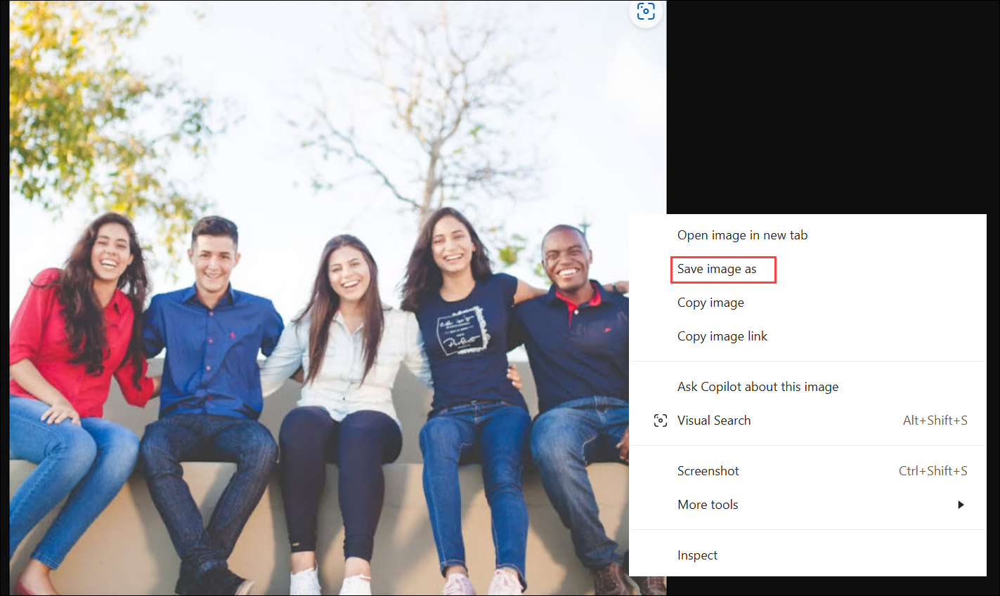

1. In the **Save As** window, select **Download (1)** folder from the left pane and click on **Save (2)**.

     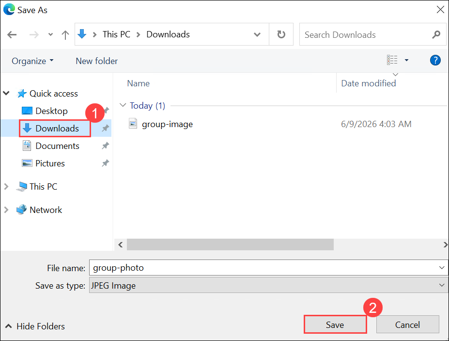

1. Go back to the **Microsoft Foundry** tab in the browser, click on the **Attach files (1)** icon and from the **Open** window select image **(2)** you have saved earlier and click on **Open (3)**. 

     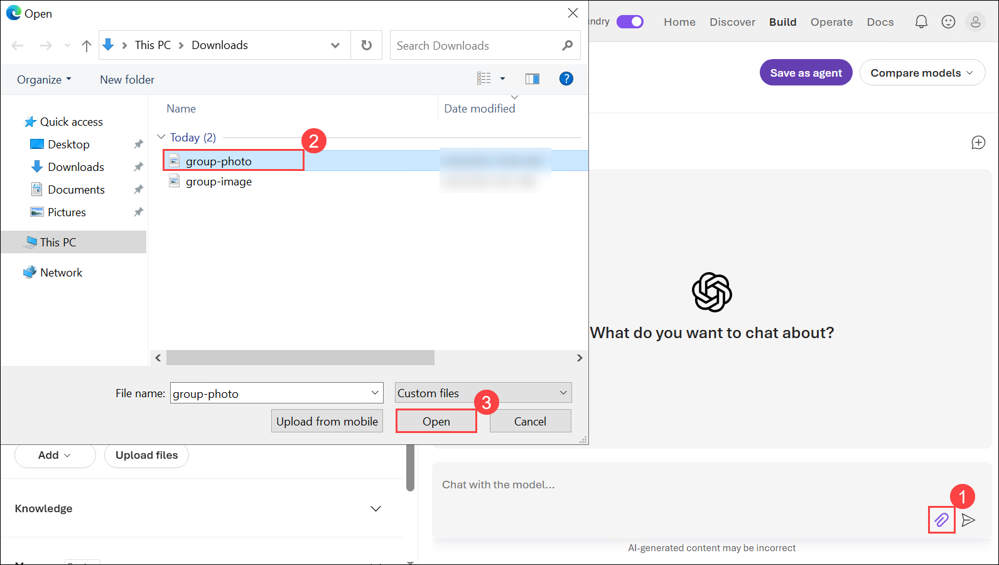

1. Paste the following prompt along with the image:

      ```text
      Extract the following fields from this image:

      - Number of people visible
      - Dominant emotion for each person
      - Estimated age range for each person
      - Setting or environment description

      Return the results as a structured table.
      ```

      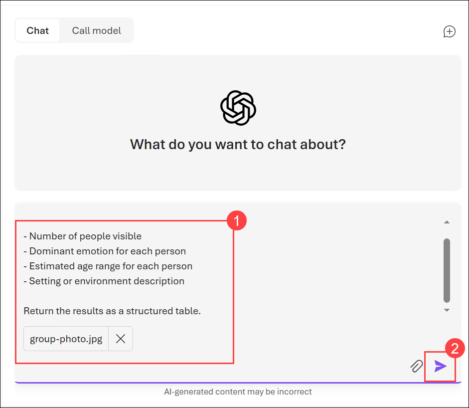

9. Review the generated output and compare it with the results returned by the face analysis application created in the previous task.

   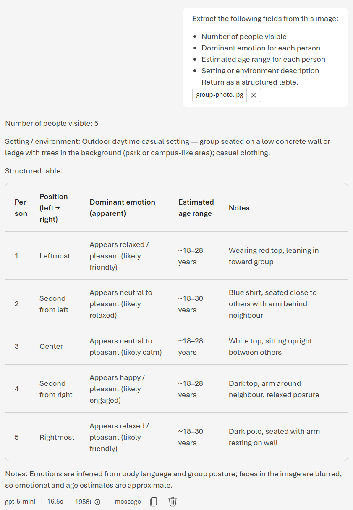

## Summary

In this lab, you created a Microsoft Foundry project and deployed a GPT-5 Mini multimodal model capable of processing both text and image inputs. You verified image analysis capabilities in the Chat Playground and experimented with prompts that enabled the model to identify faces, describe expressions, estimate age ranges, and provide contextual observations.

You then explored different prompt engineering strategies and observed how prompt structure affects the quality and format of generated outputs. Next, you built a Python application using the Azure AI Foundry SDK that analyzed images through publicly accessible URLs and returned structured face analysis results. Finally, you explored Content Understanding in Microsoft Foundry and compared its structured extraction capabilities with the flexibility of multimodal prompting.

Through these activities, you gained hands-on experience using multimodal AI models for computer vision scenarios and learned how Microsoft Foundry can be used to build vision-enabled AI applications.

### You've successfully completed the hands-on lab!
