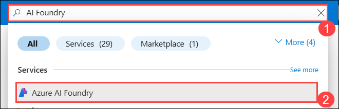
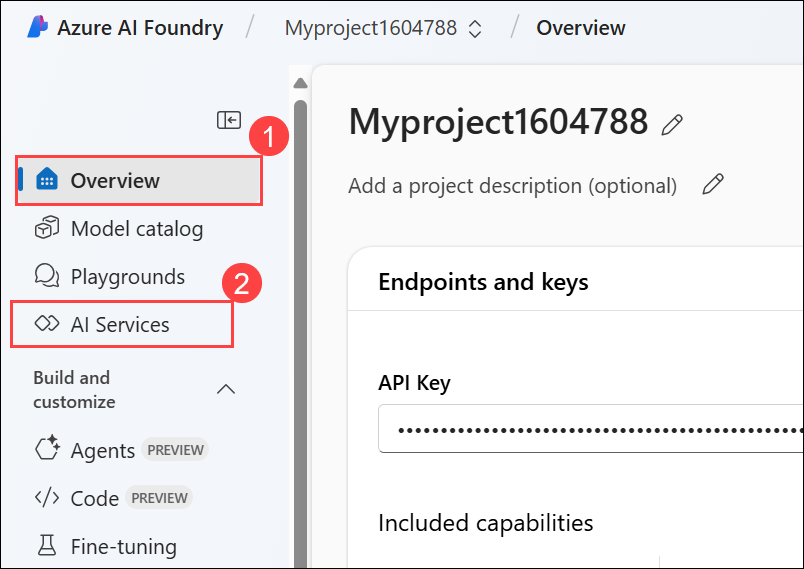
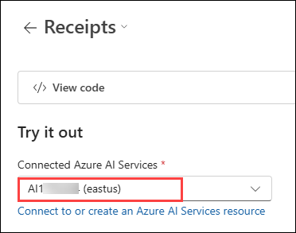

# Module 3b: Extract data from documents in the Azure AI Foundry portal

## Lab overview

**Azure AI Document Intelligence** service enables you to analyze and extract information from forms and documents, and then identify field names and data. 

How does Document Intelligence build upon optical character recognition (OCR)? While OCR can read printed or handwritten documents, OCR extracts text in an unstructured format which is difficult to store in a database or analyze. Document intelligence makes sense of the unstructured data by capturing the structure of the text, such as data fields and information in tables. 

In this exercise, you will use Azure AI Document Intelligence's prebuilt models in the Azure AI Foundry portal, Microsoft's platform for creating intelligent applications, to recognize data from a receipt. 

## Lab Objectives

In this lab, you will perform:
- Task 1: Create a project in the Azure AI Foundry portal
- Task 2: Analyze a receipt with Azure AI Document Intelligence in Azure AI Foundry

## Task 1: Create a project in the Azure AI Foundry portal

In this task, we are creating an Azure AI Foundry project and setting up AI resources to explore Vision and Document capabilities.

1. On the Azure Portal page, in the Search resources, services, and docs (G+/) box at the top of the portal, enter **Azure AI Foundry (1)**, and then select **Azure AI Foundry (2)** under **Services**.

     

1. In the left navigation pane for the AI Foundry, select **AI Hubs (2)** under **Use with AI Foundry (1)**. On the AI Hubs page, click on **+ Create** and select **Hub (3)** from the drop-down.

     

1. On the **Create an AI hub resource** pane, enter the following details:

    - Subscription: **Leave default subscription (1)** 
    - Resource Group : Select **AI-900-Module-10 (2)** 
    - Region : **<inject key="location" enableCopy="false"></inject>**  **(3)**
    - Name : Use the format **Myhub-<inject key="Deployment ID" enableCopy="false"></inject> (4)** 
    - Connect AI Services incl. OpenAI : Click on **Create New (5)**
    - Create new Azure AI Services: Provide a name to the AI Service, Use the format **AI<inject key="Deployment ID" enableCopy="false"></inject> (6)**  
    - Click on **Save (7)**.
    - Click on **Review + Create (8)**

       .png) 

1. Click on the **Create** button to begin the deployment process.

1. Right-click on the [Azure AI Foundry](https://ai.azure.com?azure-portal=true) **(1)** link, select **Copy link (2)** from the context menu, then paste it into a new tab to access the Azure AI Foundry portal.

   

1. On the Welcome to Azure AI Foundry page, click on **Sign in** in the top right corner.

   

1. If prompted to sign in, enter your credentials:
 
   - **Email/Username:** <inject key="AzureAdUserEmail"></inject> **(1)** and click on **Next (2)**.
 
      .png)
 
   - **Password:** <inject key="AzureAdUserPassword"></inject> **(1)** and click on **Next (2)**.
 
     .png)

1. If prompted to stay signed in, you can click **No**.

   .png)

1. If prompted with *Streamlined from the start*, click on **Got it** to proceed.

   

1. Close any tips or quick start panes that are opened the first time you sign in, and if necessary use the **Azure AI Foundry** logo at the top left to navigate to the home page, which looks similar to the following image (close the **Help** pane if it's open)

1. In the browser, navigate to `https://ai.azure.com/managementCenter/allResources` and select **Create new**.

1. Choose the option to create a **AI hub resource (1)** then select **Next (2)**.

    

1. In the **Create a new project** wizard, enter project name **Myproject<inject key="DeploymentID" enableCopy="false" /> (1)**, and select newly created **Myhub-<inject key="DeploymentID" enableCopy="false" /> (2)** and select **Create (3)**.

    .png)

1. Wait for your project to be created.

1. When the project is created, you will be taken to an *Overview* page of the project details. Select **AI services** on the left-hand menu. 

## Task 2: Analyze a receipt with Azure AI Document Intelligence in Azure AI Foundry 

In this task, we are using Azure AI Foundry to analyze a receipt image with prebuilt AI models, extracting key details like merchant information, transaction date, and total amount.

You are now ready to analyze a fictitious Northwind Traders retail company receipt.

1. In the **Overview (1)** page of your project, on the left-hand menu on the screen, select **AI Services (2)**.
 
      

    >**Note**: If a pop-up appears, please click **Close**.

1. On the **AI Services** page, select the **Vision + Document** tile to try out Azure AI Vision and Document capabilities.

    .png)

1. On the *Vision + Document* page, scroll down and select **Document (1)**. Under *Prebuilt models for specific documents*, select the **Receipts (2)** tile.

    .png)

1. On the **Receipts** page, select on **AI<inject key="DeploymentID" enableCopy="false" />** for **Connected Azure AI Services** subheading.

    

1. Open a new tab and go to [**https://aka.ms/mslearn-receipt**](https://aka.ms/mslearn-receipt) to view a sample image of a receipt.

1. Right-click on the image and choose **"Save image as"** to save it in your Downloads folder or to your Desktop.

   

1. Click on **Save**.

   
 
1. Go back to the Azure AI Foundry portal and upload the **receipt.jpg** image by clicking **Browse files (1)**. Then, navigate to the **C:\Users\azureuser\Downloads (2)** folder, select **receipt (3)**, and click **Open (4)**.

   

1. Click **Run analysis** to process the document.

   

1. When the analysis has run, the results are returned. Notice that the service has recognized specific data fields such as the merchant’s name, address, phone number, and transaction date and time, as well as the line items, subtotal, tax, and total amounts. Next to each field is a percentage probability that the field is correct.

    

> **Congratulations** on completing the task! Now, it's time to validate it. Here are the steps:
 
- Hit the Validate button for the corresponding task. If you receive a success message, you can proceed to the next task. 
- If not, carefully read the error message and retry the step, following the instructions in the lab guide.
- If you need any assistance, please contact us at cloudlabs-support@spektrasystems.com. We are available 24/7 to help you out.

   <validation step="348e3976-3f47-4302-b53a-c2bd7195d99b" />

### Review

In this Module, you have used Azure AI Document Intelligence's prebuilt receipts model in the Azure AI Foundry portal. From the results that were returned, you saw how Document Intelligence was able to identify specific fields, enabling data from everyday documents to be more easily processed. Before you close the demo, why not try some of the sample receipts, including those in different languages?

In this Module, you have completed the following tasks:
- Created a project in the Azure AI Foundry portal
- Analyzed a receipt with Azure AI Document Intelligence in Azure AI Foundry 

## Learn more

This lab demonstrated only some of the capabilities of the AI Document Intelligence service. To learn more about what you can do with this service, see the [Document Intelligence](https://learn.microsoft.com/azure/ai-services/document-intelligence/overview?view=doc-intel-3.1.0) page.

## You have successfully completed this lab.
