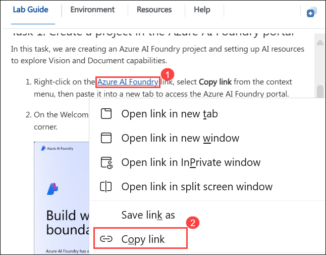

# Module 2a: Explore generative AI in the Azure AI Foundry portal

Generative AI describes a category of capabilities within AI that create content. People typically interact with generative AI that has been built into chat applications. In this exercise, you try out generative AI in the Azure AI Foundry portal, Microsoft's platform for creating intelligent applications.

## Lab objectives

In this lab, you will perform:
- Task 1: Create a project in the Azure AI Foundry portal
- Task 2: Create a GPT-4o deployment model
- Task 3: Explore generative AI in Azure AI Foundry's chat playground

## Task 1: Create a project in the Azure AI Foundry portal

In this task, we are creating an Azure AI Foundry project and setting up AI resources to explore Vision and Document capabilities.

1. On the Azure Portal page, in the Search resources, services, and docs (G+/) box at the top of the portal, enter **Azure AI Foundry (1)**, and then select **Azure AI Foundry (2)** under **Services**.

     

1. In the left navigation pane for the AI Foundry, select **AI Hubs (2)** under **Use with AI Foundry (1)**. On the AI Hubs page, click on **+ Create (3)** and select **Hub (4)** from the drop-down.

     

1. On the **Create an AI hub resource** pane, enter the following details:

    - Subscription : **Leave default subscription** 
    - Resource Group : Select **AI-900-Module-12 (1)** 
    - Region : **<inject key="Location" enableCopy="false"/>** Use the same location as the resource group **(2)**
    - Name : Use the format **Myhub-<inject key="Deployment ID" enableCopy="false"></inject> (3)** 
    - Connect AI Services incl. OpenAI : Click on **Create New (7)**
    - Create new Azure AI Services: Provide a name to the AI Service,Use the format **AI<inject key="Deployment ID" enableCopy="false"></inject> (8)**  
    - Click on **Save (9)**.
    - Click on **Review + Create (10)**

        

1. Click on the **Create** button to begin the deployment process.

1. Right-click on the [Azure AI Foundry](https://ai.azure.com?azure-portal=true) **(1)** link, select **Copy link (2)** from the context menu, then paste it into a new tab to access the Azure AI Foundry portal.

   

1. On the Welcome to Azure AI Foundry page, Click on **Sign in** in the top right corner.

   

1. If prompted to sign in, enter your credentials:
 
   - **Email/Username:** <inject key="AzureAdUserEmail"></inject>
 
      
 
   - **Password:** <inject key="AzureAdUserPassword"></inject>
 
     

1. If prompted to stay signed in, you can click **No**.

   

1. If prompted with *Streamlined from the start*, click on **Got it** to proceed.

   

1. Close any tips or quick start panes that are opened the first time you sign in, and if necessary use the **Azure AI Foundry** logo at the top left to navigate to the home page, which looks similar to the following image (close the **Help** pane if it's open)

1. In the browser, navigate to `https://ai.azure.com/managementCenter/allResources` and select **Create new**. 

      
   
1. Choose the option to create a **Azure AI Foundry resource (1)** then select **Next (2)**.

    

1. In the **Create a new project** wizard, enter details as mentioned below,

   | Setting | Value | 
   | --- | --- |
   | Project name | **Myproject<inject key="DeploymentID" enableCopy="false" /> (1)** |
   | Subscription | **Select the default subscription(2)** |
   | Resource group | **AI-900-Module-12 (3)** |
   |Region | **East US (4)** select the region same as the resource group |

    

1. Wait for your project created.

   >**Note**: If Explore and experiment prompted click on **Close**.

   
   
1. When the project is created, you will be taken to an *Overview* page of the project details.

1. On the left-hand menu on the screen, select **Playgrounds**.

> **Congratulations** on completing the task! Now, it's time to validate it. Here are the steps:
 
- Hit the Validate button for the corresponding task. If you receive a success message, you can proceed to the next task. 
- If not, carefully read the error message and retry the step, following the instructions in the lab guide.
- If you need any assistance, please contact us at cloudlabs-support@spektrasystems.com. We are available 24/7 to help you out.

   <validation step="41170453-b806-4a87-8243-fd736e4bfab5" />

## Task 2: Create a GPT-4o deployment model

1. From the left pane, go to **Models + Endpoints (1)** under My assests, and click on **Deploy model (2)** and select **Deploy base model (3)**

   

1. Search **`gpt-4o`(1)** and select the **gpt-4o (chat completion) (2)** model and click on **Confirm (3)**

   

1. Select the default values and click on **Deploy**

   

## Task 3: Explore generative AI in Azure AI Foundry's chat playground

In this task, you will learn how to interact with the Chat playground in Azure AI Foundry, deploy a generative AI model, and optimize responses using effective prompting techniques.

1. In Azure AI Foundry's Portal page, click **Playgrounds**

1. Consider the following ways you can improve responses from a generative AI assistant:
    - Start with a specific goal for what you want the assistant to do
    - Iterate based on previous prompts and responses to refine the result
    - Provide a source to ground the response in a specific scope of information
    - Add context to maximize response appropriateness and relevance
    - Set clear expectations for the response

1. Let's try generating a response using a prompt with a specific goal. In the chat box, enter the following prompt **(1)** and click on the **Send (2)** button.

    ```prompt
    I'm planning a trip to Paris in September. Can you help me?
    ```

    

1. Review the response. **Note**: Keep in mind that the specific response you receive may vary due to the nature of generative AI.

   
 
1. Let's try another prompt. Enter the following:

    ```prompt
    Where's a good location in Paris to stay? 
    ```

   

1. Review the response, which should provide some places to stay in Paris.

    

1. Let's iterate based on previous prompts and responses to refine the result. Enter the following prompt:
    
    ```prompt
    Can you give me more information about dining options near the first location?
    ``` 

     

1. Review the response, which should provide dining options near the location mentioned in the previous response. 

   

1. Now, let's provide a source to ground the response in a specific scope of information. Enter the following: 
    
    ```prompt
    Based on the information at https://en.wikipedia.org/wiki/History_of_Paris, what were the key events in the city's history?
    ```
    

1. Review the response, which should provide information based on the provided website. 

      

1. When you are done, you can close the browser window.

### Review

In this Module, you have completed the following tasks:
- Created a project in the Azure AI Foundry portal
- Explored generative AI in Azure AI Foundry's chat playground

## Learn more

This lab demonstrated only some of the capabilities of the Generative AI service. To learn more about what you can do with this service, see the [Generative AI](https://learn.microsoft.com/en-us/azure/ai-studio/how-to/evaluate-generative-ai-app) page.

## You have successfully completed this lab.
