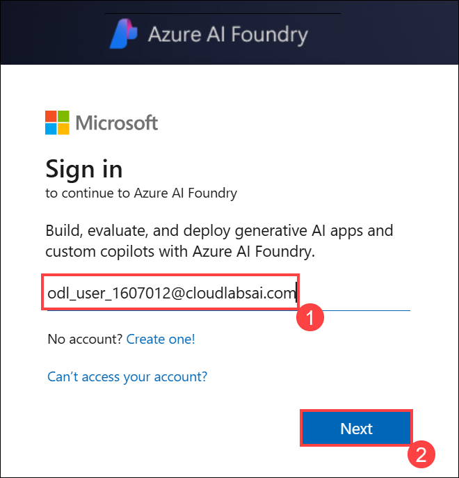
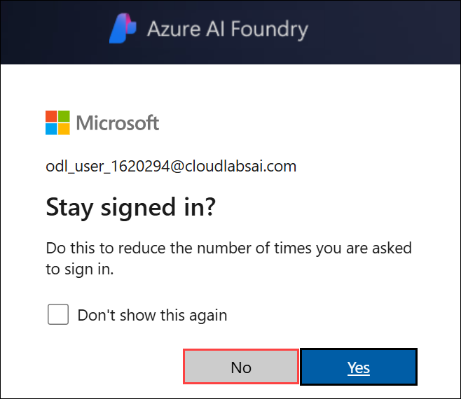
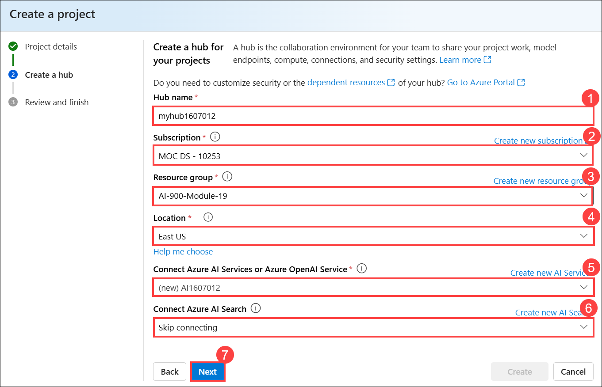

# Module 12: Explore generative AI in Azure AI Foundry portal

Generative AI describes a category of capabilities within AI that create content. People typically interact with generative AI that has been built into chat applications. In this exercise, you try out generative AI in Azure AI Foundry portal, Microsoft's platform for creating intelligent applications.

## Lab objectives

In this lab, you will perform:
- Task 1: Create a project in Azure AI Foundry portal
- Task 2: Explore generative AI in Azure AI Foundry's chat playground

## Estimated timing: 30 minutes

## Architecture Diagram

 

## Task 1: Create a project in the Azure AI Foundry portal

In this task, we are creating an Azure AI Foundry project and setting up AI resources to explore Vision and Document capabilities.

1. Right-click on the [Azure AI Foundry](https://ai.azure.com?azure-portal=true) **(1)** link, select **Copy link (2)** from the context menu, then paste it into a new tab to access the Azure AI Foundry portal.

   

1. On the Welcome to Azure AI Foundry page, Click on **Sign in** in the top right corner.

   

1. If prompted to sign in, enter your credentials:
 
   - **Email/Username:** <inject key="AzureAdUserEmail"></inject>
 
      
 
   - **Password:** <inject key="AzureAdUserPassword"></inject>
 
     
     
1. If prompted to stay signed in, you can click **No**.

   

1. On the Azure AI Foundry portal home page, select **Create a project**. In Azure AI Foundry, projects are containers that help organize your work.  

    

1. On the **Create a project** pane, enter project name **Myproject<inject key="DeploymentID" enableCopy="false" /> (1)** and then select **Customize (2)**.

    

1. On the **Create a project** pane, Configure it with the following settings:

    - **Hub name**: Enter **myhub<inject key="DeploymentID" enableCopy="false" /> (1)**
    - **Subscription**: **Use existing Azure subscription (2)**
    - **Resource group**: Select **AI-900-Module-19 (3)**
    - **Location**: Select **<inject key="location" enableCopy="false"/> (4)**
    - **Connect Azure AI Services or Azure OpenAI Service**:
    Click on **Create new AI Services (5)** and provide name **AI<inject key="DeploymentID" enableCopy="false" /> (6)** and click on **Next**
    - **Connect Azure AI Search**: Leave as default **(7)**
    - Click on **Next (8)**

        

    > **Important**: You will need an Azure AI services resource provisioned in a specific location to complete the rest of the lab.

1. On the **Review and Finish** page, click on **Create**.

    

1. Keep track of the following created resources: 
    
    - **Azure AI Project**
    - **Azure AI Hub**  
    - **Azure AI Services**    
    - **Storage Account**  
    - **Key Vault**

      


      >**Note:** Once the deployment will succeed, close the *Project help* pane that will appear on right side.

1. If prompted with *Explore and experiment*, click on **Close** to dismiss it.

    

> **Congratulations** on completing the task! Now, it's time to validate it. Here are the steps:
 
- Hit the Validate button for the corresponding task. If you receive a success message, you can proceed to the next task. 
- If not, carefully read the error message and retry the step, following the instructions in the lab guide.
- If you need any assistance, please contact us at labs-support@spektrasystems.com. We are available 24/7 to help you out.

   <validation step="744eff52-65e3-479e-bed8-d70a14701aac" />

## Task 2: Explore generative AI in Azure AI Foundry's chat playground

1. In Azure AI Foundry's Playgrounds page, select **Try the Chat playground**. The Chat playground is a user interface that enables you to try out building a chat application with different generative AI mdoels.  

1. In order to use Chat playground, you need to associate it with a deployed model. In the Chat playground, select **Create a deployment**. Search for and select **gpt-4**. 

1. In the *Deploy model* window, keep the default naming and selection and select **Deploy**. It may take a moment for the model to deploy. You can check on the status of your deployment by selecting *Models and endpoints* in left-hand menu under *My assets*.
1. In the chat playground, you can use your deployed model when it appears in the *Deployment* selection menu. Make sure the model you deployed is selected. Importantly, you need to select **Apply changes** after you make any changes to the *Setup*. 

1. Consider the following ways you can improve responses from a generative AI assistant:
    - Start with a specific goal for what you want the assistant to do
    - Iterate based on previous prompts and responses to refine the result
    - Provide a source to ground the response in a specific scope of information
    - Add context to maximize response appropriateness and relevance
    - Set clear expectations for the response

1. Let's try generating a resonse using a prompt with a specific goal. In the chat box, enter the following prompt:

    ```prompt
    I'm planning a trip to Paris in September. Can you help me?
    ```

1. Review the response. **Note**: Keep in mind that the specific response you receive may vary due to the nature of generative AI.
 
1. Let's try another prompt. Enter the following:

    ```prompt
    Where's a good location in Paris to stay? 
    ```

1. Review the response, which should provide some places to stay in Paris.

1. Let's iterate based on previous prompts and responses to refine the result. Enter the following prompt:
    
    ```prompt
    Can you give me more information about dining options near the first location?
    ``` 

1. Review the response, which should provide dining options near a location from the previous response. 

1. Now, let's provide a source to ground the response in a specific scope of information. Enter the following: 
    
    ```prompt
    Based on the information at https://en.wikipedia.org/wiki/History_of_Paris, what were the key events in the city's history?
    ```

1. Review the response, which should provide information based on the provided website. 

1. Let's try to add context to maximize the relevance of the response. Enter the following prompt: 

    ```prompt
    What three places do you recommend I stay in Paris to be within walking distance to historical attractions? Explain your reasoning.
    ```

1. Review the response and reasoning for the response.  

1. Now try setting clear expectations for the response. Enter the following prompt:
    
    ```prompt
    What are the top 10 sights to see in Paris? Answer with a numbered list in order of popularity.
    ```

1. Review the response, which should provide a numbered list of sights to see in Paris.

1. When you are done, you can close the browser window.


### Review

In this Module, you have completed the following tasks:
- Created a project in the Azure AI Foundry portal
- Explored generative AI in Azure AI Foundry's chat playground

## Learn more

This lab demonstrated only some of the capabilities of the AI Generative AI service. To learn more about what you can do with this service, see the [Generative AI](https://learn.microsoft.com/en-us/azure/ai-studio/how-to/evaluate-generative-ai-app) page.

## You have successfully completed this lab.
