# Module 13: Azure AI Studio

## Lab overview

In this exercise, you will explore the Azure AI Foundry portal and learn how to create, manage, and deploy generative AI models within the Azure ecosystem. You will gain hands-on experience working with Azure AI hubs, and projects, and deploying AI models like GPT-04-Turbo.

## Lab objectives

In this exercise, you will perform:

- Task 1: Open Azure AI Foundry portal
- Task 2: Create an Azure AI hub and project
- Task 3: Add a connected resource
- Task 4: Explore AI Services
- Task 5: Deploy and test a generative AI model

## Estimated timing: 60 minutes

## Architecture Diagram

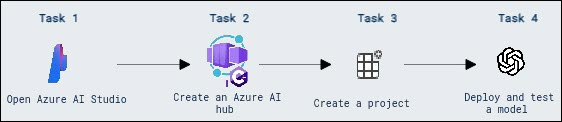

## Exercise 1: Explore the components and tools of the Azure AI Studio

### Task 1: Open Azure AI Foundry portal

In this task, you will sign in to Azure AI Foundry portal and explore its interface, learning how to navigate the platform and access its various features for managing AI resources.

1. In a edge browser, open https://ai.azure.com and **Sign in** using your Azure credentials. The home page of Azure AI Studio looks similar to the following image:

   - **Email/Username:** <inject key="AzureAdUserEmail"></inject>
   - **Password:** <inject key="AzureAdUserPassword"></inject>

    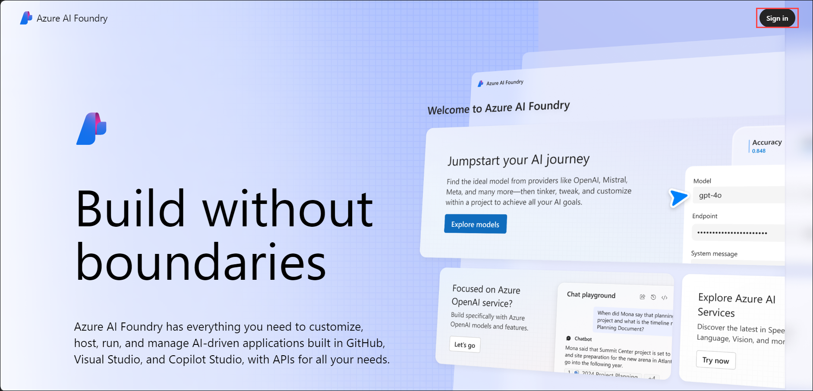

2. Review the information on the home page and view each of the tabs, noting the options to explore models and capabilities, create projects, and manage resources.

    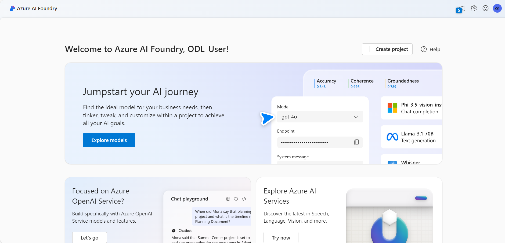

### Task 2: Create an Azure AI hub and project

In this task, you will create an Azure AI hub, gaining hands-on experience in setting up a collaborative workspace for AI projects and configuring essential resources and connections.

1. On the Azure AI Foundry portal home page, select **Create a project**. In Azure AI Foundry, projects are containers that help organize your work.  

    

1. On the **Create a project** pane, enter project name **Myproject<inject key="DeploymentID" enableCopy="false" /> (1)** and then select **Customize (2)**.

    

1. On the **Create a project** pane, Configure it with the following settings:

    | Setting | Action |
    | -- | -- |
    | **Hub name** | **azureai-<inject key="DeploymentID" enableCopy="false"/> (1)** |
    | **Subscription** | *Default Azure subscription* **(2)** |
    | **Resource Group** | Select **AI-900-Module-13-<inject key="DeploymentID" enableCopy="false" /> (3)** |
    | **Location** | **<inject key="location" enableCopy="false"/>  (4)** |
    | **Connect Azure AI Services or Azure OpenAI** | *create a new AI Services **ai-azureai-<inject key="DeploymentID" enableCopy="false" /> (5)*** |
    | **Connect Azure AI Search** | *Skip connecting* **(6)** |

    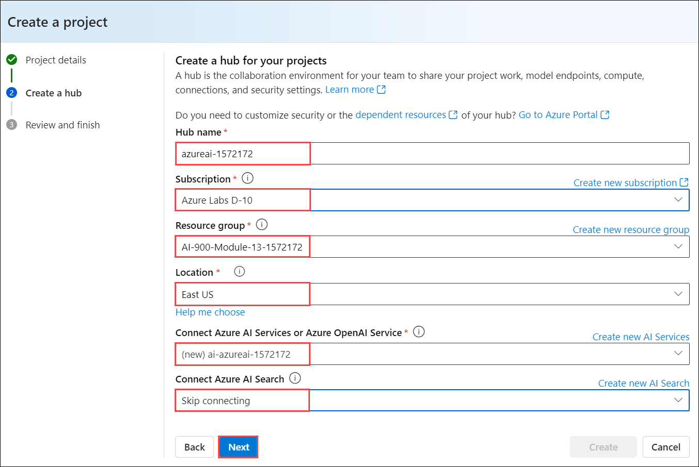

2. Review your details and click on **Create**.

    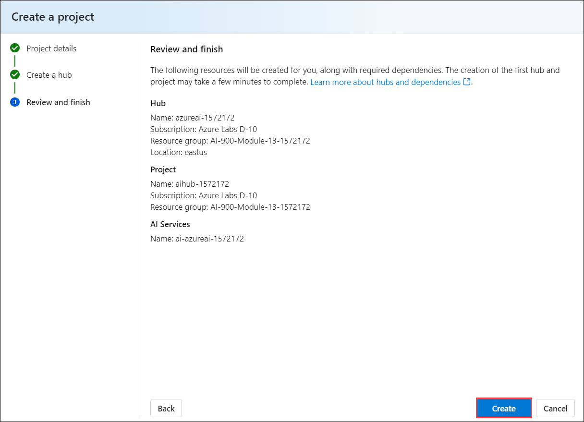

3. When your project is created, close any tips that are displayed and review the project page in Azure AI Foundry portal, which should look similar to the following image:

   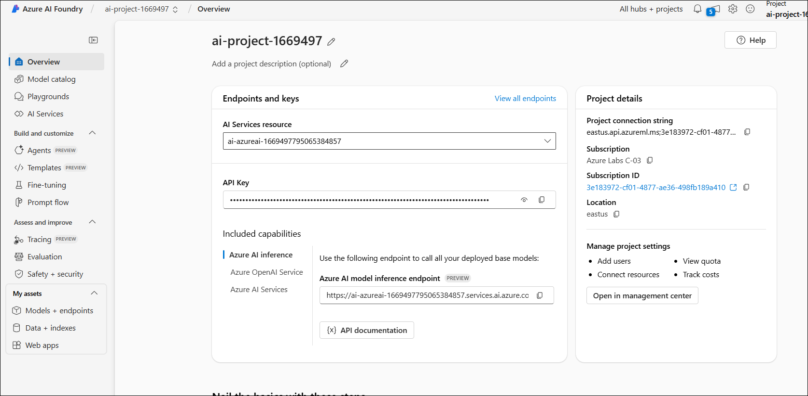

1. At the bottom of the navigation pane on the left, select **Management center**. 

    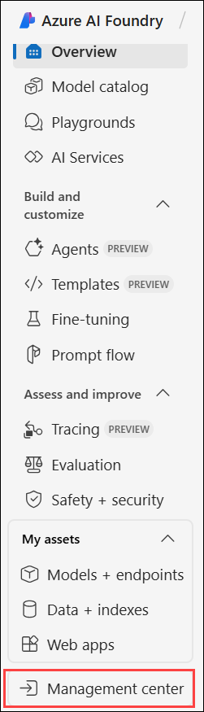

1. The management center is where you can configure settings at both the hub and project levels; which are both shown in the navigation pane.

   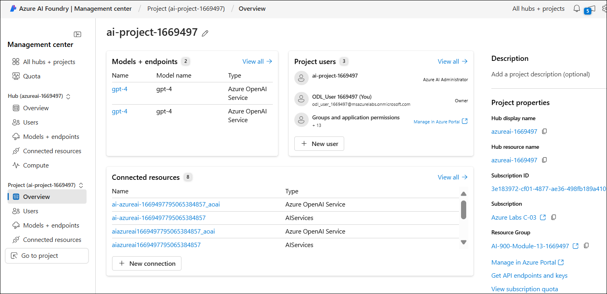

4. While keeping the Azure foundry tab open in the Edge browser, open another tab within the same Edge browser and navigate to the Azure portal.

5. Browse to the resource group **AI-900-Module-13-<inject key="DeploymentID" enableCopy="false" />** , and view the Azure resources that have been created.

    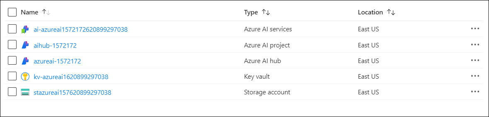

    >Note: the resources have been created in the region you selected when creating the hub.

6. Return to the Azure AI Foundry browser tab.

7. View each of the pages in the pane on the left side of the page for your Azure AI hub, and note the artifacts you can create and manage. On the **Management center** page, you can select **Connected resources**, either under your hub or your project, and observe that connections to Azure OpenAI and AI services have already been created.

    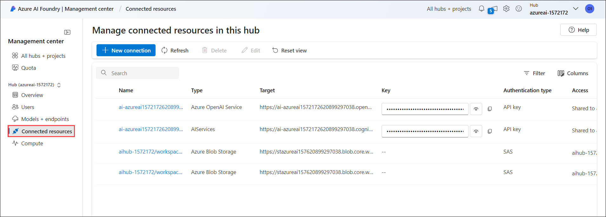

> **Congratulations** on completing the task! Now, it's time to validate it. Here are the steps:
> - Hit the Validate button for the corresponding task. If you receive a success message, you can proceed to the next task.
> - If not, carefully read the error message and retry the step, following the instructions in the lab guide. 
> - If you need any assistance, please contact us at cloudlabs-support@spektrasystems.com. We are available 24/7 to help you out.
 
   <validation step="7a610c9e-f8af-43f8-92f1-357e933d8a8d" />

### Task 3: Add a connected resource

Suppose your project needs access to a second **Azure AI Services** resource in a different region.

1. In the Azure portal, in the page for your resource group, select **+ Create** and search for **Azure AI Services (1)**. In the results, select the **Azure AI Services multi-service (2)** resource as shown in the following image:

   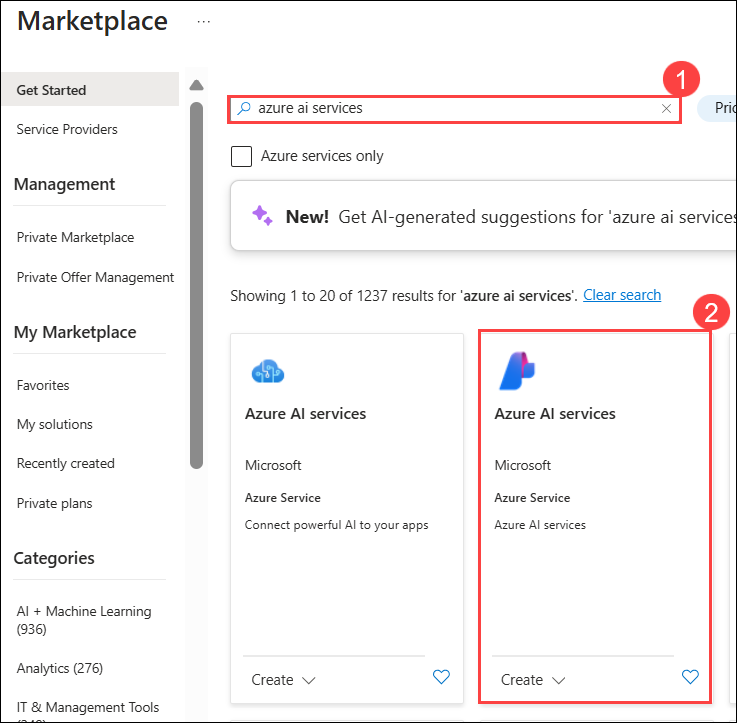

1. Create a new **Azure AI Services** resource with the following settings:

   - **Subscription:** Your Azure subscription **(1)**
   - **Resource group:** Select **AI-900-Module-13-<inject key="DeploymentID" enableCopy="false" /> (2)**
   - **Region:** Select **<inject key="location" enableCopy="false"/> (3)**
   - **Name:** Enter **Aiservice-<inject key="DeploymentID" enableCopy="false" /> (4)**
   - **Pricing tier:** Select **Standard S0 (5)**
   - Click on **Review + Create (6)**

     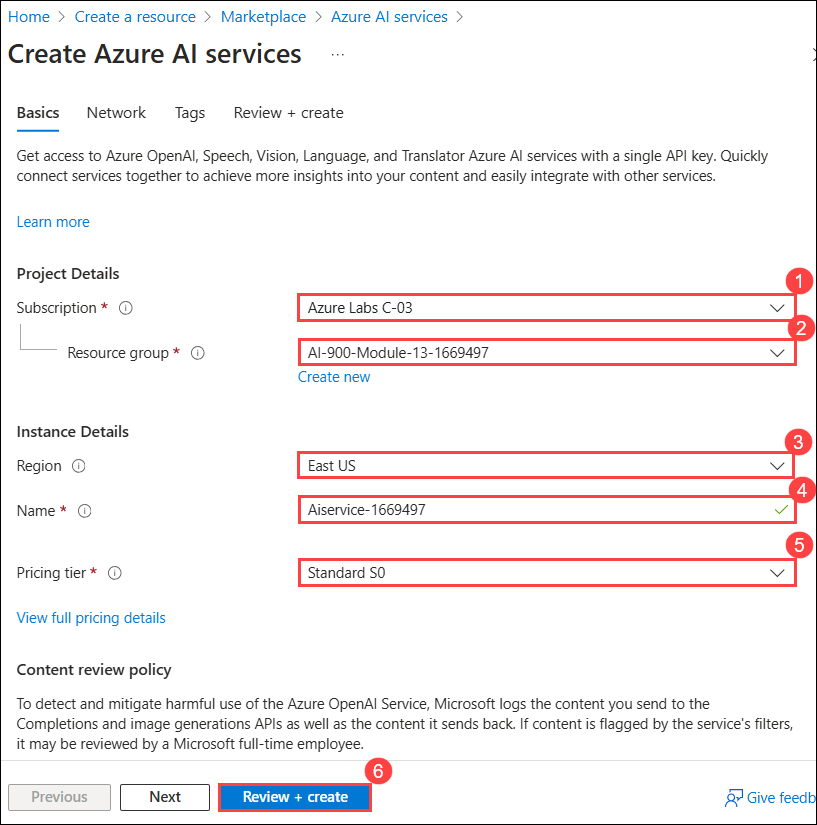

1. On the **Review + Create** tab, click on **Create** and Wait for the AI Services resource to be created.
    
    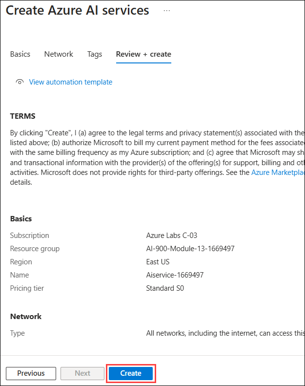

1. Go back to the **Azure AI Foundry portal** browser tab. In the **Management center** view, navigate to the **Connected resources** page under your project in the **navigation pane**. Here, you'll see the existing **connected resources (1)** listed. Then, click **+ New connection (2)** to add a new resource.

   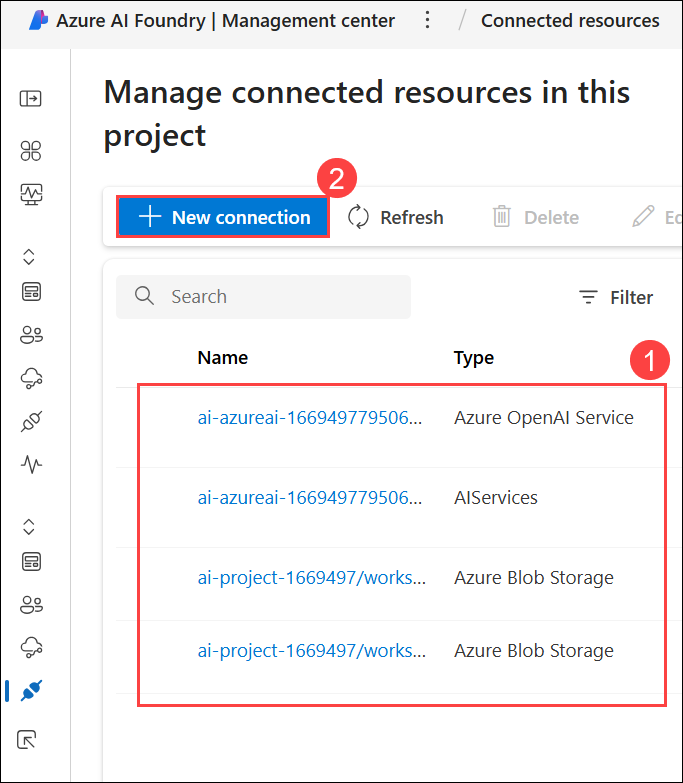

1. Select the **Azure AI Services** resource type from the list.

   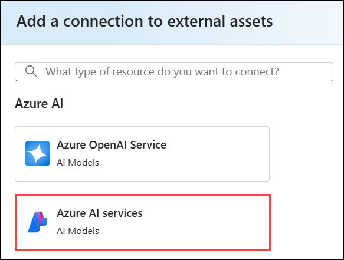

1. Then browse the available resources to find the AI Services resource you created in the Azure portal and use its **Add Connection** button to add it to your project.

1. When the new resource is **connected**, close the Connect an Azure AI services resources dialog box.
 
  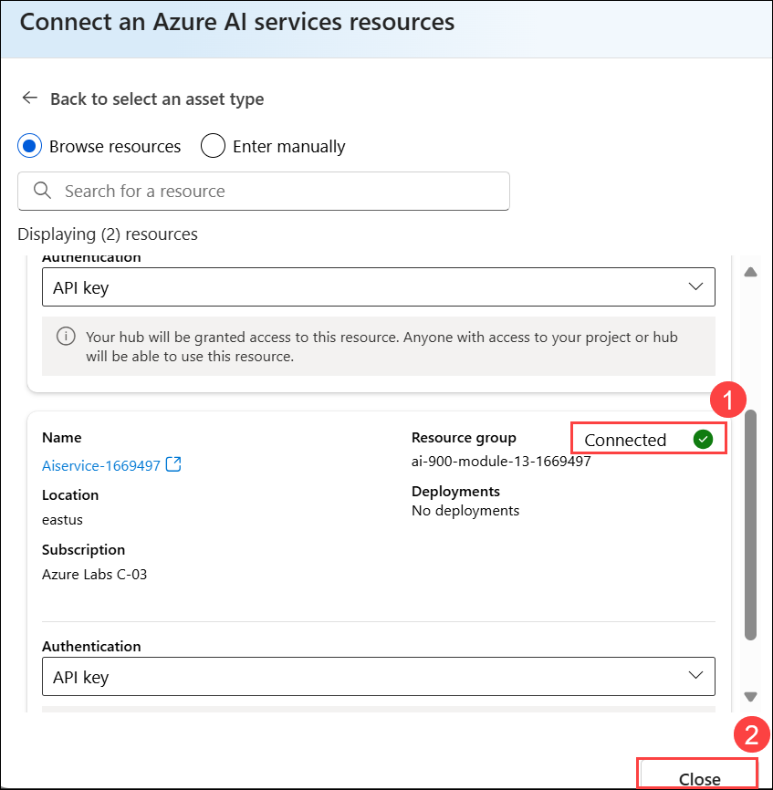

### Task 4: Explore AI Services

Your Azure AI Foundry project has access to Azure AI Services. Let’s try that out in the portal.

1. In the Management center page, in the navigation pane, under your project, select **Go to project**.

   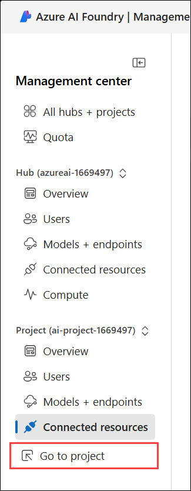

1. In the navigation pane for your project, select **AI Services (1)** and select the **Language and Translator tile (2)**.

   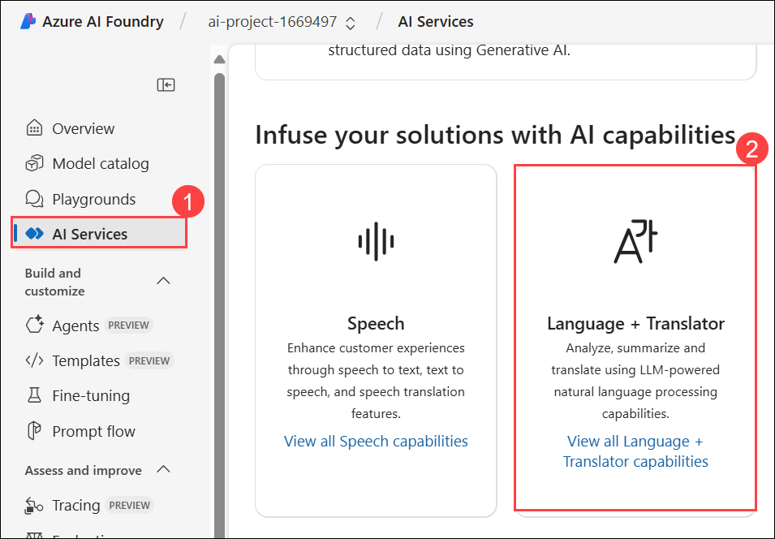

1. In the **Explore Language capabilities section**, view the **Translation (1)** tab and select **Text translation (2)**.

   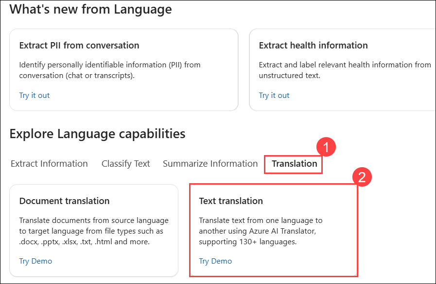

1. On the **Text Translation** page, navigate to the **Try it out** section and open the **Try with your own** tab. Choose one of your Azure AI Services resources, enter text (e.g., **Hello world**) to translate from one language to another, and click **Translate** to see the results.

   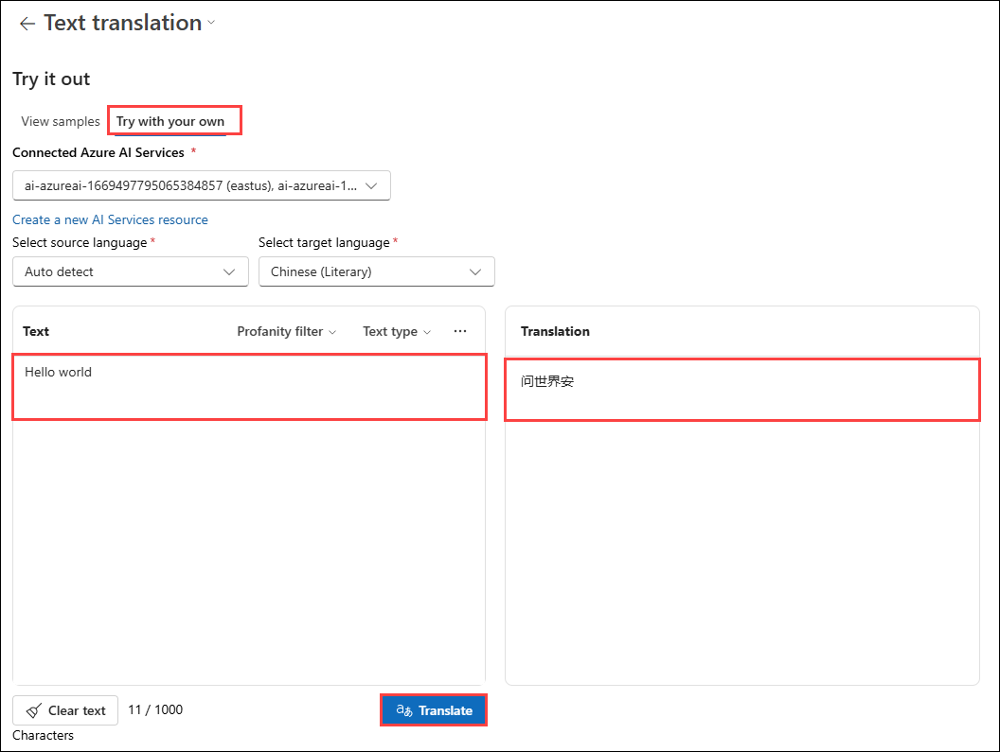

## Task 5: Deploy and test a generative AI model

Your project also contains connected resources for Azure OpenAI, which enables you to use Azure OpenAI language models to implement generative AI solutions.

1. In the pane on the left for your project, in the **My assets** section, select the **Models + endpoints** page.

1. In the **Models + endpoints** page, in the Model deployments tab, select **+ Deploy model**, and then select **Deploy base model**.

    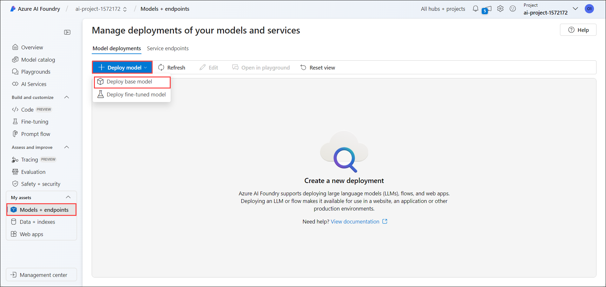

3. Search for the **gpt-4-model** model from the list, select, and confirm.

    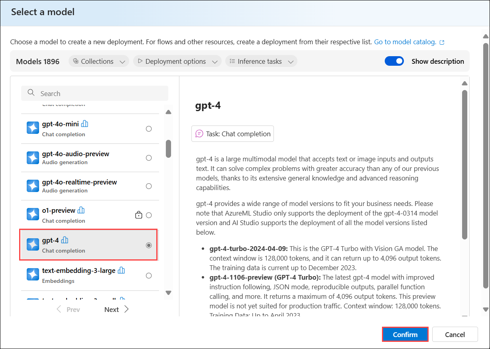

4. Enter **gpt-4-model** as your **Deployment name**, then click on **Customize** to adjust the other values accordingly.

5. Deploy the model with the following settings:

    | Setting | Action |
    | -- | -- |
    | **Deployment name** | *gpt-04-turbo* **(1)** |
    | **Deployment type** | **Standard** **(2)** |
    | **Model version** | *default* **(3)** |
    | **AI resource** | *Select the resource created previously* **(4)** |
    | **Tokens per Minute Rate Limit (thousands)** | **5K** **(5)** |
    | **Content filter** | **DefaultV2** **(6)** |
    | **Enable dynamic quota** | **Disable** **(7)** |

    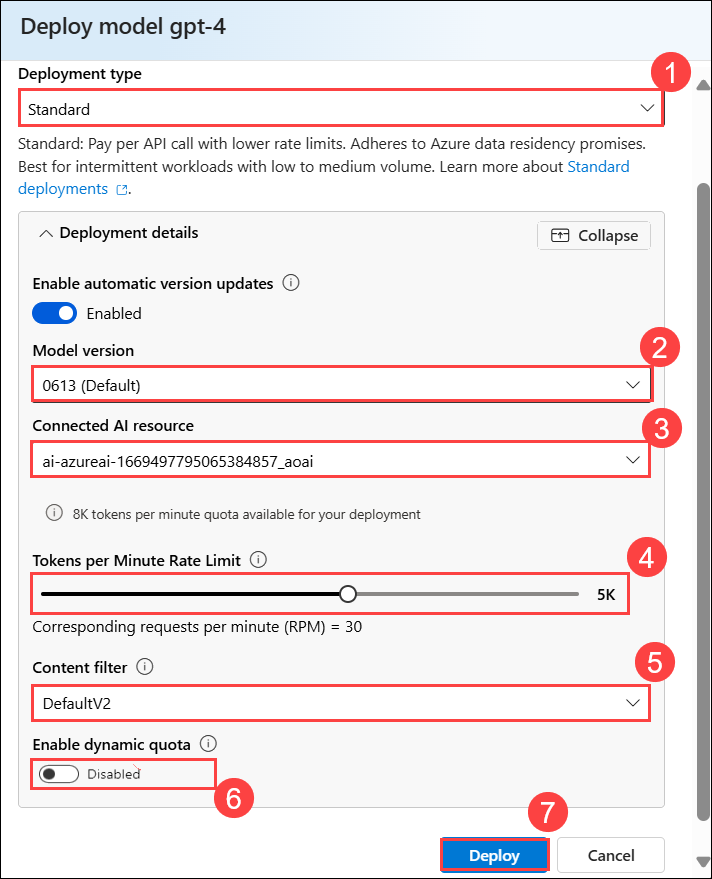

    > **Note**: Limiting the TPM helps prevent exceeding the quota available in your subscription. A TPM of 5,000 is adequate for the data used in this exercise.

6. After the model has been deployed, in the deployment overview page, select **Open in playground**.

    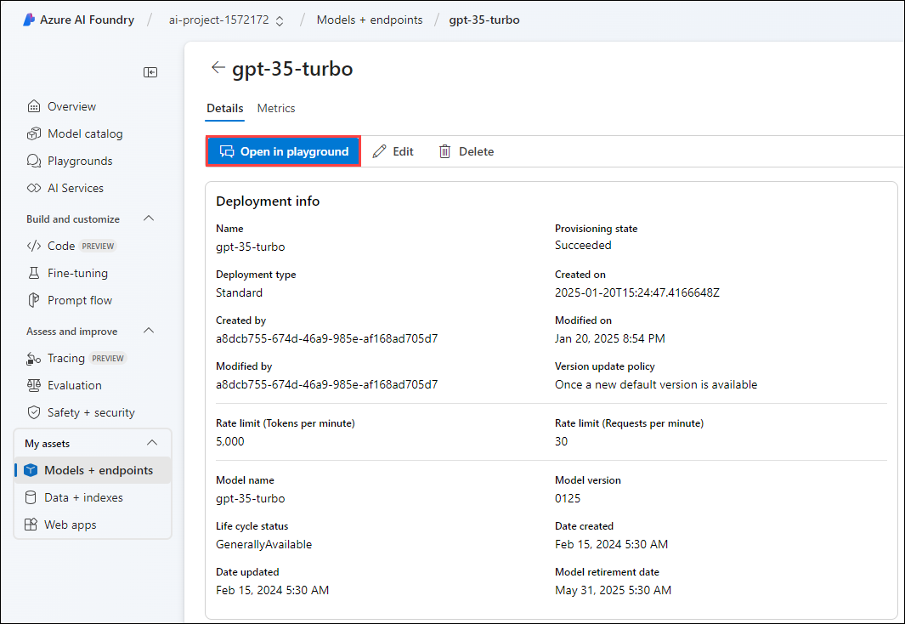

7. In the **Chat playground** page, ensure that your model deployment is selected in the **Deployment** section.

8. In the chat window, enter a query such as **How can I use Azure AI Services in a software development project?** and view the response:

    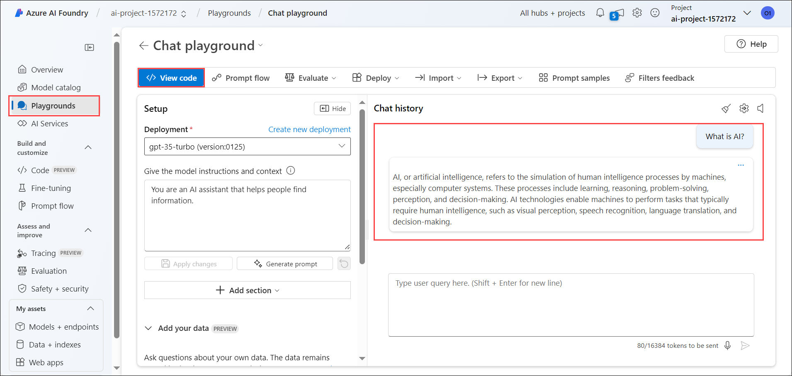

> **Congratulations** on completing the task! Now, it's time to validate it. Here are the steps:
> - Hit the Validate button for the corresponding task. you will receive a success message.
> - If not, carefully read the error message and retry the step, following the instructions in the lab guide. 
> - If you need any assistance, please contact us at cloudlabs-support@spektrasystems.com. We are available 24/7 to help you out.

  <validation step="6b5cc888-bc2a-47c8-b31c-e65157a50f66" />

### Summary

In this exercise, you’ve explored Azure AI Foundry, and seen how to create and manage hubs and projects, add connected resources, and explore Azure AI Services and Azure OpenAI models in the Azure AI Foundry portal.

### Review

In this exercise, you have completed the following tasks:
- Opened *Azure AI Studio*  
- Created an *Azure AI Hub*  
- Added a connected resource
- Explored AI Services
- Deployed and tested a generative AI model

##   You have successfully completed this lab.
