# Module 13: Azure AI Studio

## Lab overview

In this exercise, you will explore the Azure AI Foundry portal and learn how to create, manage, and deploy generative AI models within the Azure ecosystem. You will gain hands-on experience working with Azure AI hubs, and projects, and deploying AI models like GPT-04-Turbo.

## Lab objectives

In this exercise, you will perform:

- Task 1: Open Azure AI Foundry portal
- Task 2: Create a Azure AI project
- Task 3: Deploy and test a generative AI model

## Exercise 1: Explore the components and tools of the Azure AI Studio

### Task 1: Open Azure AI Foundry portal

In this task, you will sign in to Azure AI Foundry portal and explore its interface, learning how to navigate the platform and access its various features for managing AI resources.

1. In a edge browser, open https://ai.azure.com and **Sign in** using your Azure credentials. The home page of Azure AI Studio looks similar to the following image:

   - **Email/Username:** <inject key="AzureAdUserEmail"></inject>
   - **Password:** <inject key="AzureAdUserPassword"></inject>

    

### Task 2: Create an Azure AI Foundry Resources

In this task, you will gain hands-on experience in setting up a collaborative workspace for AI projects and configuring essential resources.

1. On the Azure AI Foundry portal home page, in the **Help** window, select **Create a project**. In Azure AI Foundry, projects are containers that help organize your work.  

    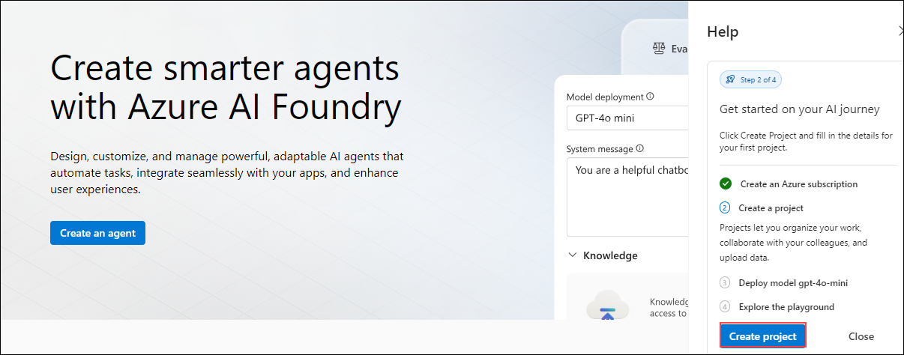

1. On the **Create a project** pane, enter the following:

   - Project name **Myproject<inject key="DeploymentID" enableCopy="false" /> (1)**
   - Click on the dropdown for **Advanced Options (2)**.
   - Select **AI-900-Module-13-<inject key="DeploymentID" enableCopy="false" />** resource group (3)
   - Click **Create** (4)	

     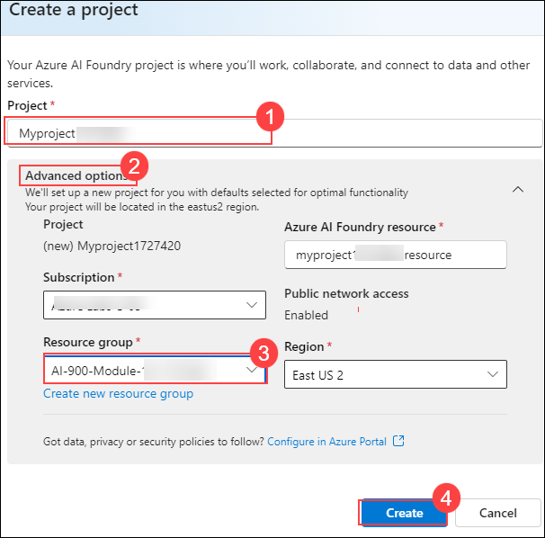

1. When your project is created, close any tips that are displayed and review the project page in Azure AI Foundry portal, which should look similar to the following image. Review the Endpoints and keys section.

   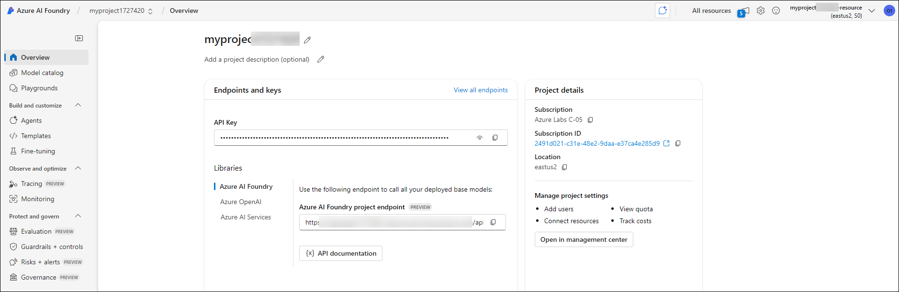

1. At the bottom of the navigation pane on the left, select **Management center**. The management center is where you can configure settings at both the resource and project levels; which are both shown in the navigation pane.

    

1. The management center is where you can configure settings at both the hub and project levels; which are both shown in the navigation pane.

   

1. In the Management Center, from the left navigation pane, select **Models + endpoints** (1).In the window that appears,click on the dropdown (2) under **Deploy a model** and select **Deploy a base model**(3)  

   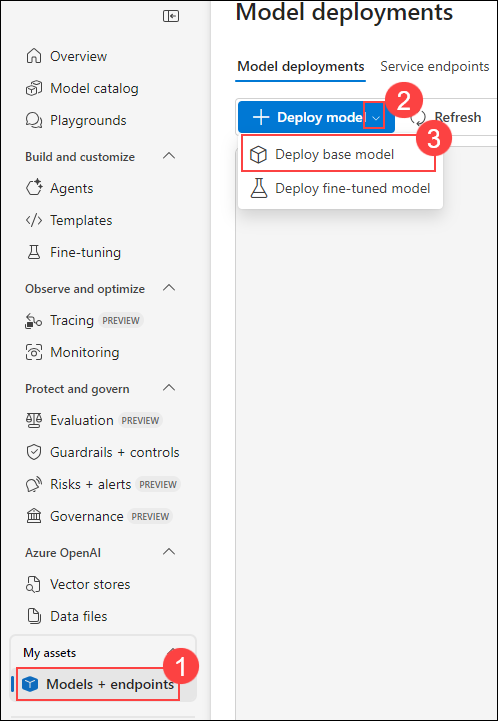

1. Search (1) for and select gpt-4o model (2) and click on **Confirm** (3).

   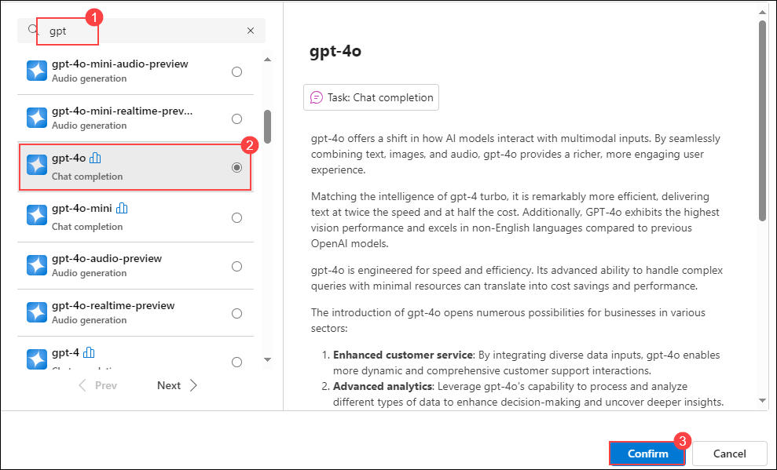

1. Click on **Customize**

   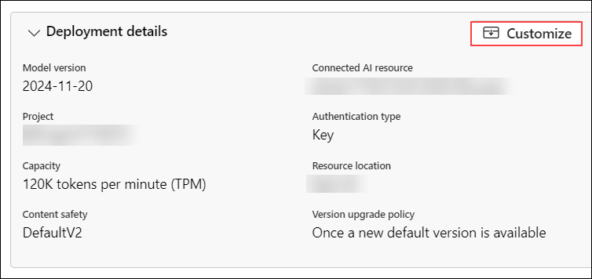

1. In the window that appears, reduce the token to **50 K** (1) and click on **Deploy** (2).
   
   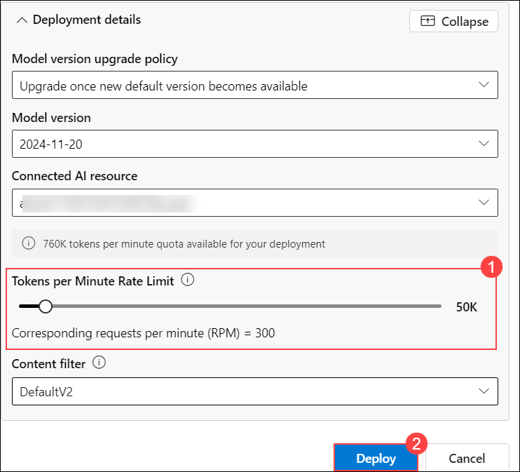

1. While keeping the Azure foundry tab open in the Edge browser, open another tab within the same Edge browser and navigate to the Azure portal.

5. Browse to the resource group **AI-900-Module-13-<inject key="DeploymentID" enableCopy="false" />** , and view the Azure resources that have been created.

    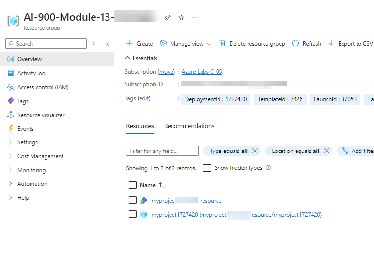

6. Return to the Azure AI Foundry browser tab.

## Task 3: Test a generative AI model

1. In the navigation pane on the left for your project, select Playgrounds and click on  **Try the Chat Playground**.

   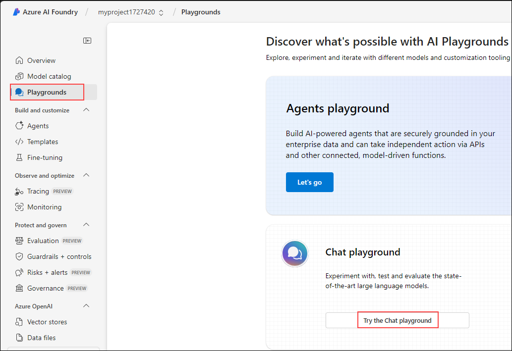

1. In the window that appears, ensure that your gpt-4o model deployment is selected.

1. In the Setup pane, in the Give the model instructions and context box, enter the instruction as **You are a history teacher who can answer questions about past events all around the world** (1) and click on **Apply Changes** (2)

   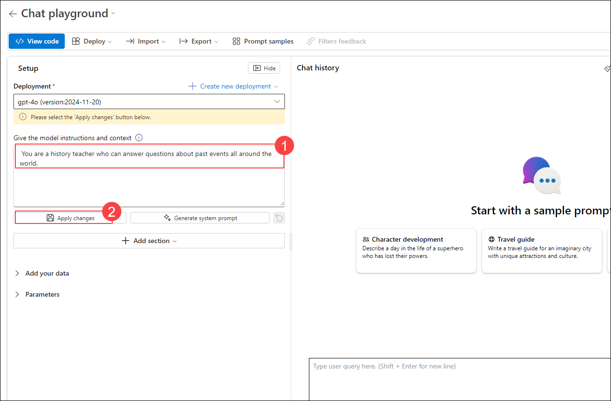

1. In the prompt that appears, click on **Continue**

1. In the chat window, enter a query such as **What are the key events in the history of Scotland?** and view the response

   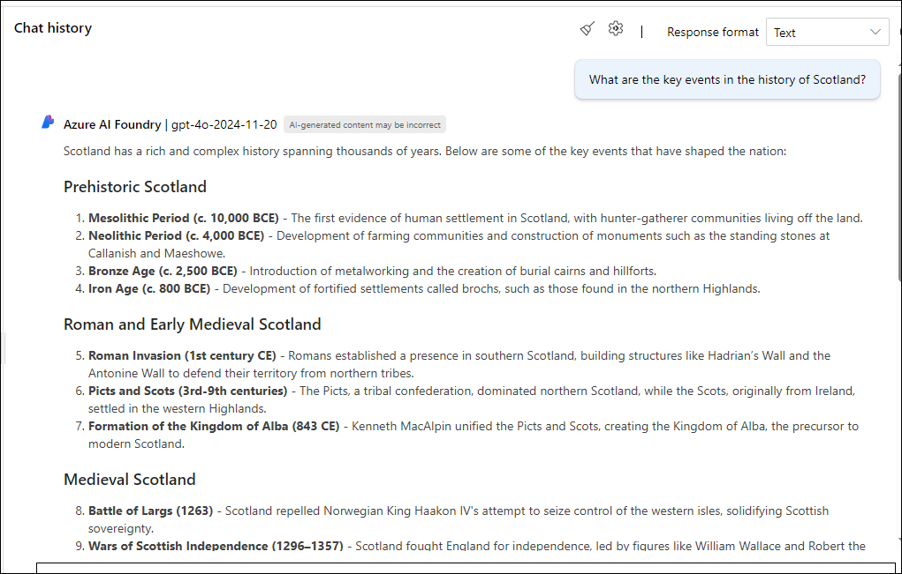

> **Congratulations** on completing the task! Now, it's time to validate it. Here are the steps:
> - Hit the Validate button for the corresponding task. you will receive a success message.
> - If not, carefully read the error message and retry the step, following the instructions in the lab guide. 
> - If you need any assistance, please contact us at cloudlabs-support@spektrasystems.com. We are available 24/7 to help you out.

  <validation step="6b5cc888-bc2a-47c8-b31c-e65157a50f66" />

### Summary

In this exercise, you’ve explored Azure AI Foundry, and seen how to create  projects, and explore Azure AI Services and Azure OpenAI models in the Azure AI Foundry portal.

### Review

In this exercise, you have completed the following tasks:
- Opened *Azure AI Studio*  
- Created an *Azure AI Project*  
- Deployed and tested a generative AI model

##   You have successfully completed this lab.
