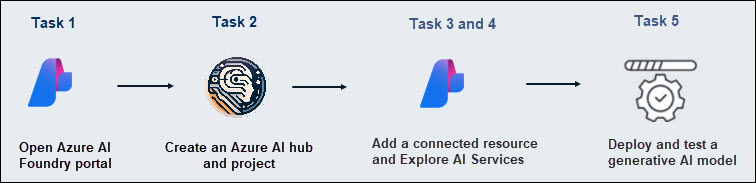
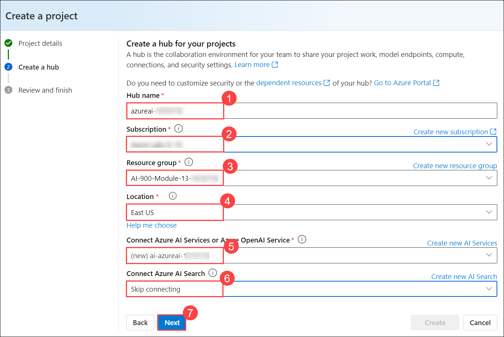
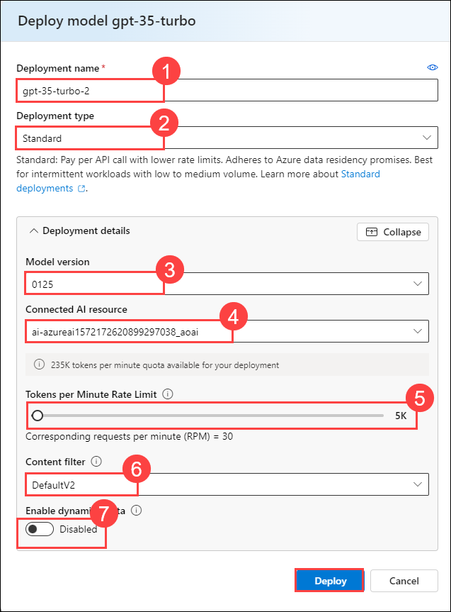

# Module 13: Azure AI Studio

## Lab overview

In this exercise, you will explore the Azure AI Foundry portal and learn how to create, manage, and deploy generative AI models within the Azure ecosystem. You will gain hands-on experience working with Azure AI hubs, and projects, and deploying AI models like GPT-35-Turbo.

## Lab objectives

In this exercise, you will perform:

- Task 1: Open Azure AI Foundry portal
- Task 2: Create an Azure AI hub and project
- Task 3: Deploy and test a model

## Estimated timing: 60 minutes

## Architecture Diagram

## Exercise 1: Explore the components and tools of the Azure AI Studio

### Task 1: Open Azure AI Foundry portal

In this task, you will sign in to Azure AI Foundry portal and explore its interface, learning how to navigate the platform and access its various features for managing AI resources.

1. In a edge browser, open https://ai.azure.com and **Sign in** using your Azure credentials. The home page of Azure AI Studio looks similar to the following image:

   - **Email/Username:** <inject key="AzureAdUserEmail"></inject>
   - **Password:** <inject key="AzureAdUserPassword"></inject>

    

2. Review the information on the home page and view each of the tabs, noting the options to explore models and capabilities, create projects, and manage resources.

    

### Task 2: Create an Azure AI hub and project

In this task, you will create an Azure AI hub, gaining hands-on experience in setting up a collaborative workspace for AI projects and configuring essential resources and connections.

1. In the home page, select **+ Create project**. In the **Create a project** with **ai-project-<inject key="DeploymentID" enableCopy="false"/>** name wizard you can see all the Azure resources that will be automatically created with your project, or you can customize the following settings by selecting **Customize** before selecting Create:

1. In the **Management** section, navigate to **All resources (1)** and click on **+ New hub (2)**. Set the following configuration settings for the new hub, and then click **Next (7)** to proceed.

    

    | Setting | Action |
    | -- | -- |
    | **Hub name** | **azureai-<inject key="DeploymentID" enableCopy="false"/> (1)** |
    | **Subscription** | *Default Azure subscription* **(2)** |
    | **Resource Group** | **AI-900-Module-13-<inject key="DeploymentID" enableCopy="false" /> (3)** |
    | **Location** | **East US (4)** |
    | **Connect Azure AI Services or Azure OpenAI** | *create a new AI Services **ai-azureai-<inject key="DeploymentID" enableCopy="false" /> (5)*** |
    | **Connect Azure AI Search** | *Skip connecting* **(6)** |

    

2. Review your details and click on **Create**.

    

3. After the Azure AI hub has been created, Navigate to **All hubs + projects (1)** in the portal, Select your hub named **azureai-<inject key="DeploymentID" enableCopy="false"/>** **(2)**.

    

1. It should look similar to the following image:

    

4. While keeping the Azure AI Studio tab open in the Edge browser, open another tab within the same Edge browser and navigate to the Azure portal.

5. Browse to the resource group **AI-900-Module-13-<inject key="DeploymentID" enableCopy="false" />** , and view the Azure resources that have been created.

    

6. Return to the Azure AI Studio browser tab.

7. View each of the pages in the pane on the left side of the page for your Azure AI hub, and note the artifacts you can create and manage. On the **Management center** page, you can select **Connected resources**, either under your hub or your project, and observe that connections to Azure OpenAI and AI services have already been created.

    

### Validation

> **Congratulations** on completing the task! Now, it's time to validate it. Here are the steps:
> - Hit the Validate button for the corresponding task. If you receive a success message, you can proceed to the next task.
> - If not, carefully read the error message and retry the step, following the instructions in the lab guide. 
> - If you need any assistance, please contact us at labs-support@spektrasystems.com. We are available 24/7 to help you out.
 
   <validation step="7a610c9e-f8af-43f8-92f1-357e933d8a8d" />

### Task 3: Deploy and test a model

In this task, you will deploy and test the [GPT-35-Turbo](https://learn.microsoft.com/en-us/azure/ai-services/openai/how-to/chatgpt?tabs=python-new) model, understanding how to configure deployment settings and validate the model's functionality through interactive testing.

1. In the pane on the left for your project, in the **My assets** section, select the **Models + endpoints** page.

1. In the **Models + endpoints** page, in the Model deployments tab, select **+ Deploy model**, and then select **Deploy base model**.

    

3. Search for the **gpt-35-turbo** model from the list, select, and confirm.

    

4. Enter **gpt-35-turbo** as your **Deployment name**, then click on **Customize** to adjust the other values accordingly.

    

5. Deploy the model with the following settings:

    | Setting | Action |
    | -- | -- |
    | **Deployment name** | *gpt-35-turbo* **(1)** |
    | **Deployment type** | **Standard** **(2)** |
    | **Model version** | *0125* **(3)** |
    | **AI resource** | *Select the resource created previously* **(4)** |
    | **Tokens per Minute Rate Limit (thousands)** | **5K** **(5)** |
    | **Content filter** | **DefaultV2** **(6)** |
    | **Enable dynamic quota** | **Disable** **(7)** |

    

    > **Note**: Limiting the TPM helps prevent exceeding the quota available in your subscription. A TPM of 5,000 is adequate for the data used in this exercise.

6. After the model has been deployed, in the deployment overview page, select **Open in playground**.

    

7. In the **Chat playground** page, ensure that your model deployment is selected in the **Deployment** section.

8. In the chat window, enter a query such as *What is AI?* and view the response:

    

### Validation

> **Congratulations** on completing the task! Now, it's time to validate it. Here are the steps:
> - Hit the Validate button for the corresponding task. you will receive a success message.
> - If not, carefully read the error message and retry the step, following the instructions in the lab guide. 
> - If you need any assistance, please contact us at labs-support@spektrasystems.com. We are available 24/7 to help you out.

  <validation step="6b5cc888-bc2a-47c8-b31c-e65157a50f66" />

### Summary

After performing this lab, you learned how to navigate Azure AI Studio, create and manage Azure AI hubs and projects, and deploy and test generative AI models. You gained practical experience in setting up and configuring AI resources, as well as using Azure AI Studio tools to develop and validate AI solutions effectively.

### Review

In this exercise, you have completed the following tasks:
- Opened *Azure AI Studio*  
- Created an *Azure AI Hub*  
- Deployed and tested a model

##   You have successfully completed this lab.
