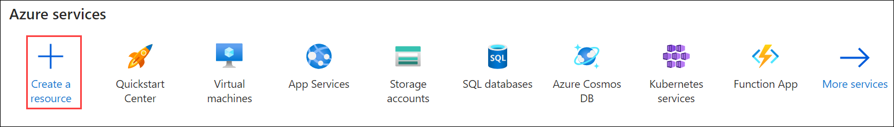
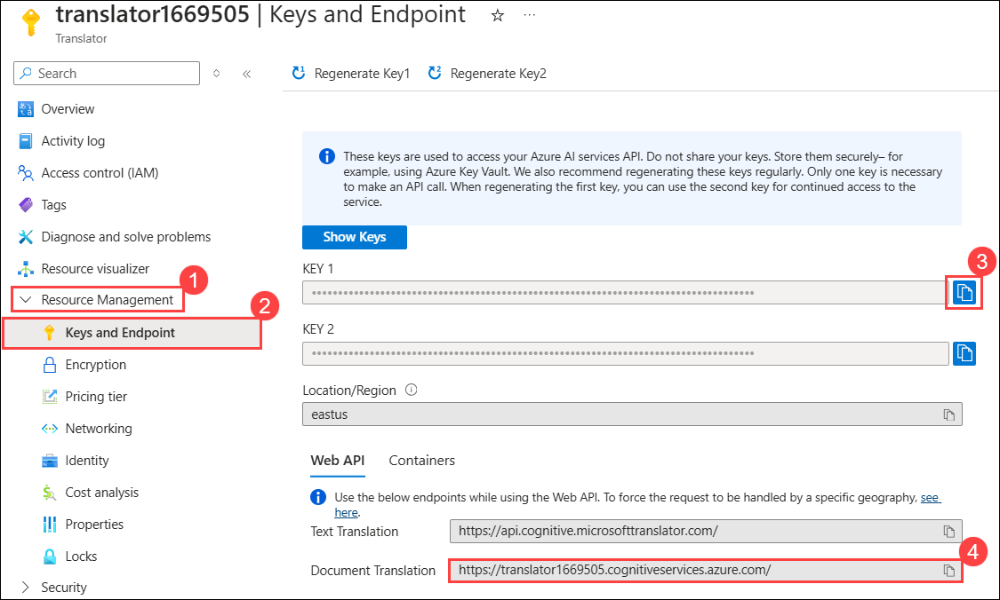

# Module 15: Explore Azure AI Translator

Artificial Intelligence (AI) can help simplify translation between languages, helping to remove barriers to communication across countries and cultures.

To test the capabilities of the Azure AI Translator service, we'll take a look at it in action in the Azure Portal. The same principles and functionality apply to real-world solutions, such as websites or phone apps.

## Lab objectives

In this lab, you will perform:
- Task 1: Creating a Translator resource
- Task 2: Exploring the Translator service 

## Task 1: Create a Translator resource

In this task, you will learn how to create a **Translator** resource in Azure to enable real-time language translation capabilities for your applications.

You can use the Translator service by creating either a **Translator** resource or an **Azure AI services** resource.

1. In the Azure portal, select **+ Create a resource**.

    

1. In the Marketplace page search for **Translator (1)** and Select **Translator (2)**.
 
   

1. On **Translator** Page, Click on **Create**.

   
  
1. You will be taken to a page to create a Translator resource. Configure it with the following settings:

    - **Subscription**: **Use existing Azure subscription (1)**.
    - **Resource group**: Select **AI-900-Module-15-<inject key="DeploymentID" enableCopy="false" /> (2)**

      

    - **Region**: **<inject key="location" enableCopy="false"/>(1)**
    - **Name**: Enter **translator<inject key="DeploymentID" enableCopy="false" />(2)**
    - **Pricing tier**: Free F0 **(3)**
    - Click on **Review and create (4)**.

      

1. Wait for the **deployment** to complete, then navigate to the **deployed resource**.

   

## Task 2: Explore Translator service 

In this task, you will learn how to explore the **Translator** service in Azure to understand its features, such as text translation, language detection, and language support for building multilingual applications.

We can explore the capabilities of the Translator service in the Azure Portal. 

1. In the Azure portal, in the deployed resource, review the **Overview** page.

1. In the **Try it** section of the Overview page, under the **From: Auto detect** section, type the text `Welcome to Azure AI Fundamentals`. Notice the JSON that appears in correspondence in the **View request** section. 

1. In the **View response** section, view the JSON. Behind the scenes, a *request* has been sent to the Translator service. The **response** includes the detected source language with a confidence score, a translation using the alphabet of the output language, and an output language code. 

   

1. The demo in the **Try it** section illustrates how a simple translation application with a **user interface** would function. In this demo, as soon as you enter text, a **request** is sent to the **Translator service**. How can you make this request? Explore the **Sample Code** tab, where you'll find **code examples** in various **programming languages** that demonstrate how to send the request.

   

1. Identify the lines in the code samples where you need to include your Translator service's **Key** and **Endpoint**. Once you have your key and endpoint, you can use them to send a request to the Translator service and receive a response, as demonstrated in the demo.

1. Navigate to the left-hand menu. Under **Resource Management**, select **Keys and Endpoint**. If you were to build an application, you would find your key and endpoint here. 

   

> **Congratulations** on completing the task! Now, it's time to validate it. Here are the steps:
 
- Hit the Validate button for the corresponding task. If you receive a success message, you can proceed to the next task. 
- If not, carefully read the error message and retry the step, following the instructions in the lab guide.
- If you need any assistance, please contact us at labs-support@spektrasystems.com. We are available 24/7 to help you out.

   <validation step="026548d7-4a64-4ebe-b70d-f68db2713d43" />

### Review

In this exercise, you have completed the following tasks:
- Created a Translator resource
- Explored the Translator service 

## Learn more

To learn more about what you can do with this service, see the [Translator page](https://learn.microsoft.com/en-us/azure/ai-services/translator/translator-overview).

## You have successfully completed this lab.

