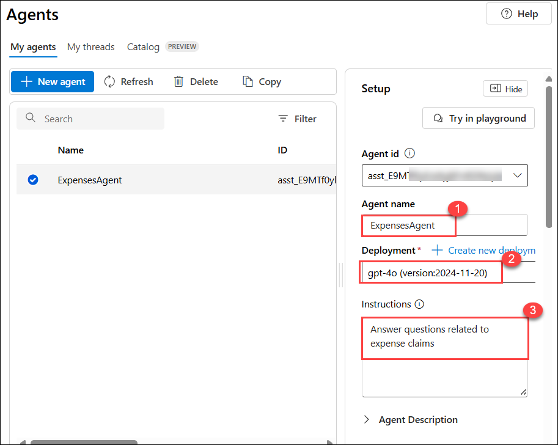

# Module 16: Explore AI Agent development

In this Module, you use the Azure AI Agent service tools in the Azure AI Foundry portal to create a simple AI agent that answers questions about expense claims.

## Lab objectives

In this lab, you will perform:
- Task 1: Create an Azure AI Foundry project using gpt-4o model.
- Task 2: Create an AI agent
- Task 3: Test your agent

> **Note**: Some of the technologies used in this exercise are in preview or in active development. You may experience some unexpected behavior, warnings, or errors.

### Task 1: Create an Azure AI Foundry project

In this task, we are creating an Azure AI Foundry project and setting up AI resources to explore content filters in Azure AI Foundry.

1. Right-click on the [Azure AI Foundry](https://ai.azure.com?azure-portal=true) **(1)** link, select **Copy link (2)** from the context menu, then paste it into a new tab to access the Azure AI Foundry portal.

   

1. On the Welcome to Azure AI Foundry page, Click on **Sign in** in the top right corner.

   

1. If prompted to sign in, enter your credentials:
 
   - **Email/Username:** <inject key="AzureAdUserEmail"></inject>
 
      
 
   - **Password:** <inject key="AzureAdUserPassword"></inject>
 
     
     
1. If prompted to stay signed in, you can click **No**.

   

1. Close any tips or quick start panes that are opened the first time you sign in, and if necessary use the **Azure AI Foundry** logo at the top left to navigate to the home page, which looks similar to the following image (close the **Help** pane if it’s open):

   

1. We will start by choosing a model that we want to work with and creating a project to use it in. 

1. In the home page, in the **Explore models and capabilities** section, search for the `gpt-4o` (1) model which we’ll use in our project and click (2) on it to select.

    

1. Click on **Use this model**. 

    

1. On the **Create a project to work with gpt-4o** pane, Configure it with the following settings:

    - **Project**: **MyProject-<inject key="DeploymentID" enableCopy="false" /> (1)**
    - **Subscription**: **Use existing Azure subscription (2)**
    - **Azure AI Foundry resource**: Keep it default (3)
    - **Resource group**: Select **AI-900-Module-16-<inject key="DeploymentID" enableCopy="false" /> (4)**
    - **Location**: Select **<inject key="location" enableCopy="false"/> (5)**
    - Click on **Create (6)**

        

1. When your project is created, the chat playground will be opened automatically so you can test your model:

    

1. In the navigation pane on the left, select **Overview** to see the main page for your project; which looks like this:

    

    > **Note**: If an Insufficient permissions error is displayed, use the Fix me button to resolve it.

1. At the bottom of the navigation pane on the left, select **Management center**. The management center is where you can configure settings at both the resource and project levels; which are both shown in the navigation pane.

    

1. In the pane on the left for your project, in the **My assets** section, select the **Models + endpoints** page. Verify the gpt-4o model is created as we have used the same to create the project and click on it to open. 

    

1.  Click on Edit option to change to Tokens per Minute Rate Limit of the model. 

    

1. Set the Tokens per Limit Rate limit to **50K**.

    

### Task 2: Create an AI agent

Now that you have a model deployed, you're ready to build an AI agent. In this exercise, you'll build a simple agent that answers questions based on a corporate expenses policy. You'll download the expenses policy document, and use it as *grounding* data for the agent.

1. Open another browser tab, and download [Expenses_policy.docx](https://raw.githubusercontent.com/MicrosoftLearning/mslearn-ai-agents/main/Labfiles/01-agent-fundamentals/Expenses_Policy.docx) from `https://raw.githubusercontent.com/MicrosoftLearning/mslearn-ai-agents/main/Labfiles/01-agent-fundamentals/Expenses_Policy.docx` and save it locally. This document contains details of the expenses policy for the fictional Contoso corporation.

1. Return to the browser tab containing the Azure AI Foundry portal, and in the navigation pane on the left, in the **Build and customize** section, select the **Agents (1)** page and go to **My Agents (2)** tab.

   

1. A new agent with a name like *Agent123* should be created automatically (if not, use the **+ New agent** button to create one). 

1. Select your new agent. Then, in the **Setup** pane for your new agent, set the **Agent name** to `ExpensesAgent` **(1)**, ensure that the **gpt-4o (2)** model deployment you created previously is selected, and set the **Instructions** to `Answer questions related to expense claims` **(3)**.

    

1. Further down in the **Setup** pane, next to the **Knowledge** header, select **+ Add**.

    

1. In the **Add knowledge** dialog box, select **Files**.

    

1. In the **Adding files** dialog box, create a new vector store named `Expenses_Vector_Store` **(1)**,  select **Upload local (2)**, click **Select local files**, navigate to the **Downloads** folder, choose **Expenses_Policy**, and click **Open**.
  
   

1. Click **Upload and Save** to complete the file upload process.

1. In the **Setup** pane, in the **Knowledge** section, verify that **Expenses_Vector_Store** is listed and shown as containing 1 file.

    > **Note**: You can also add **Actions** to an agent to automate tasks. In this simple information retrieval agent example, no actions are required.

### Task 3: Test your agent

Now that you've created an agent, you can test it in the Azure AI Foundry portal playground.

1. At the top of the **Setup** pane for your agent, select **Try in playground**.

   

1. In the playground, enter the prompt `What's the maximum I can claim for meals?` and review the agent's response - which should be based on information in the expenses policy document you added as knowledge to the agent setup.

    

    > **Note**: If the agent fails to respond because the rate limit is exceeded. Wait a few seconds and try again. If there is insufficient quota available in your subscription, the model may not be able to respond.

1. Try a follow-up question, like `What about accommodation?` and review the response.

    

### Review

In this exercise, you have completed the following tasks:
- Created an Azure AI Foundry project using a gpt-4o model.
- Created an AI agent
- Tested your agent

## Learn more

To learn more about what you can do with this service, see the [Generative AI](https://learn.microsoft.com/en-us/training/paths/develop-ai-agents-on-azure/).

## You have successfully completed this lab.
