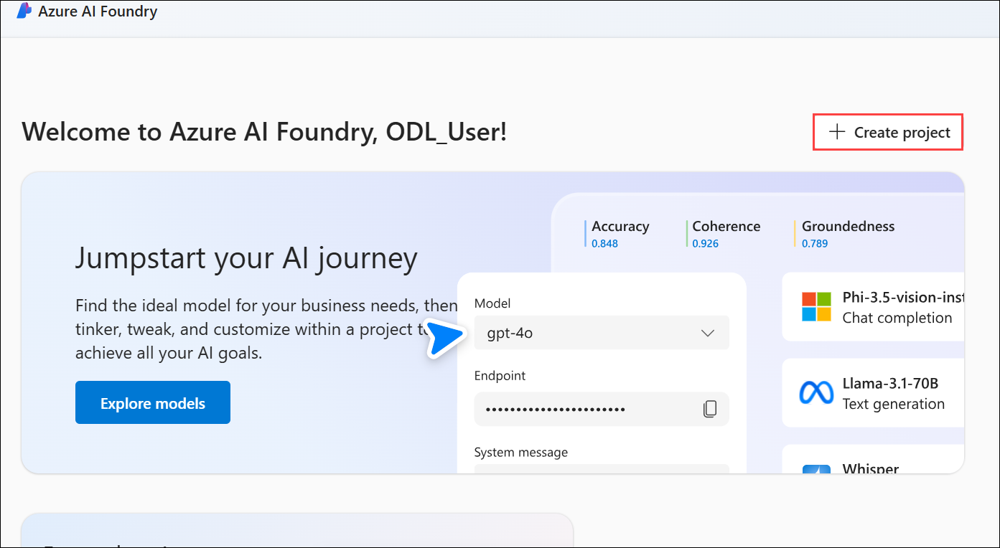
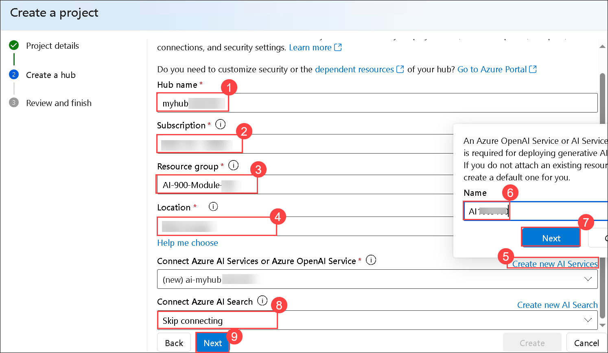
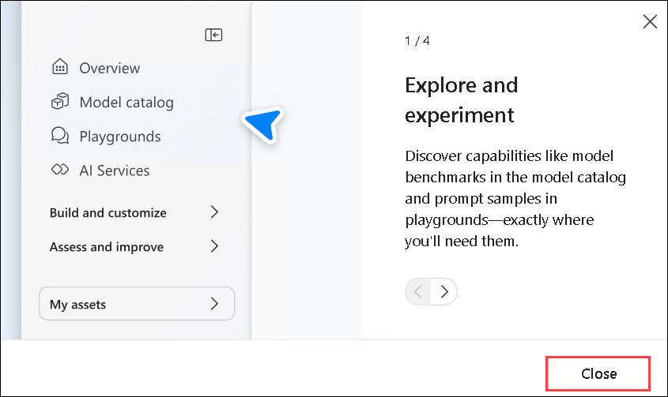

# Module 16: Explore AI Agent development

In this Module, you use the Azure AI Agent service tools in the Azure AI Foundry portal to create a simple AI agent that answers questions about expense claims.

## Lab objectives

In this lab, you will perform:
- Task 1: Create an Azure AI Foundry project
- Task 2: Deploy a generative AI model
- Task 3: Create an AI agent
- Task 4: Test your agent

> **Note**: Some of the technologies used in this exercise are in preview or in active development. You may experience some unexpected behavior, warnings, or errors.

### Task 1: Create an Azure AI Foundry project

In this task, we are creating an Azure AI Foundry project and setting up AI resources to explore content filters in Azure AI Foundry.

1. Right-click on the [Azure AI Foundry](https://ai.azure.com?azure-portal=true) **(1)** link, select **Copy link (2)** from the context menu, then paste it into a new tab to access the Azure AI Foundry portal.

   

1. On the Welcome to Azure AI Foundry page, Click on **Sign in** in the top right corner.

   

1. If prompted to sign in, enter your credentials:
 
   - **Email/Username:** <inject key="AzureAdUserEmail"></inject>
 
      
 
   - **Password:** <inject key="AzureAdUserPassword"></inject>
 
     
     
1. If prompted to stay signed in, you can click **No**.

   

1. If prompted with *Streamlined from the start*, click on **Got it** to proceed.

   

1. On the Azure AI Foundry portal home page, select **Create a project**. In Azure AI Foundry, projects are containers that help organize your work.  

    

1. On the **Create a project** pane, enter project name **Myproject<inject key="DeploymentID" enableCopy="false" /> (1)** and then select **Customize (2)**.

    

1. On the **Create a project** pane, Configure it with the following settings:

    - **Hub name**: Enter **myhub<inject key="DeploymentID" enableCopy="false" /> (1)**
    - **Subscription**: **Use existing Azure subscription (2)**
    - **Resource group**: Select **AI-900-Module-16 (3)**
    - **Location**: Select **<inject key="location" enableCopy="false"/> (4)**
    - **Connect Azure AI Services or Azure OpenAI Service**:
    Click on **Create new AI Services (5)** and provide name **AI<inject key="DeploymentID" enableCopy="false" /> (6)** and click on **Next (7)**
    - **Connect Azure AI Search**: Leave as default **(8)**
    - Click on **Next (9)**

        

        > **Important**: You will need an Azure AI services resource provisioned in a specific location to complete the rest of the lab.

1. On the **Review and Finish** page, click on **Create**.

    

1. Keep track of the following created resources: 
    
    - **Azure AI Project**
    - **Azure AI Hub**  
    - **Azure AI Services**    
    - **Storage Account**  
    - **Key Vault**

      

      >**Note:** Once the deployment will succeed, close the *Project help* pane that will appear on right side.

1. If prompted with *Explore and experiment*, click on **Close** to dismiss it.

    

> **Congratulations** on completing the task! Now, it's time to validate it. Here are the steps:
 
- Hit the Validate button for the corresponding task. If you receive a success message, you can proceed to the next task. 
- If not, carefully read the error message and retry the step, following the instructions in the lab guide.
- If you need any assistance, please contact us at cloudlabs-support@spektrasystems.com. We are available 24/7 to help you out.

   

### Task 2: Deploy a generative AI model

Now you're ready to deploy a generative AI language model to support your agent.

1. In the pane on the left for your project, in the **My assets** section, select the **Models + endpoints** page.

1. In the **Models + endpoints (1)** page, in the **Model deployments** tab, in the **+ Deploy model (2)** menu, select **Deploy base model (3)**.

   

1. Search for the **gpt-4o (1)** model in the list, and then select **gpt-4o (2)** and **confirm (3)** it.

    

1. Deploy the model with the following settings by selecting **Customize** in the deployment details:
    - **Deployment name**: **gpt-4o (1)**
    - **Deployment type**: Global Standard **(2)**
    - **Connected AI resource**: *Select your Azure OpenAI resource connection* **(3)**
    - **Tokens per Minute Rate Limit (thousands)**: 50K **(4)**
    - **Content filter**: DefaultV2 **(5)**
    - Click on **Deploy (6)**

      

    > **Note**: Reducing the TPM helps avoid over-using the quota available in the subscription you are using. 50,000 TPM should be sufficient for the data used in this exercise. If your available quota is lower than this, you will be able to complete the exercise but you may need to wait and resubmit prompts if the rate limit is exceeded.

1. Wait for the deployment to complete.

### Task 3: Create an AI agent

Now that you have a model deployed, you're ready to build an AI agent. In this exercise, you'll build a simple agent that answers questions based on a corporate expenses policy. You'll download the expenses policy document, and use it as *grounding* data for the agent.

1. Open another browser tab, and download [Expenses_policy.docx](https://raw.githubusercontent.com/MicrosoftLearning/mslearn-ai-agents/main/Labfiles/01-agent-fundamentals/Expenses_Policy.docx) from `https://raw.githubusercontent.com/MicrosoftLearning/mslearn-ai-agents/main/Labfiles/01-agent-fundamentals/Expenses_Policy.docx` and save it locally. This document contains details of the expenses policy for the fictional Contoso corporation.

   

1. Return to the browser tab containing the Azure AI Foundry portal, and in the navigation pane on the left, in the **Build and customize** section, select the **Agents** page.

   

1. If prompted, select your Azure **OpenAI service (1)** resource and click on **let's go (2)**.

   

    >**Note:** A new agent with a name like *Agent123* should be created automatically (if not, use the **+ New agent** button to create one).

1. Select your new agent. Then, in the **Setup** pane for your new agent, set the **Agent name** to `ExpensesAgent` **(1)**, ensure that the **gpt-4o (2)** model deployment you created previously is selected, and set the **Instructions** to `Answer questions related to expense claims` **(3)**.

    

1. Further down in the **Setup** pane, next to the **Knowledge** header, select **+ Add**.

    

1. In the **Add knowledge** dialog box, select **Files**.

    

1. In the **Adding files** dialog box, create a new vector store named `Expenses_Vector_Store` **(1)**,  select **Upload local (2)**, click **Select local files**, navigate to the **Downloads (3)** folder, choose **Expenses_Policy(4)**, and click **Open (5)**.
  
   

1. On the Manage page, click **Upload and Save** to complete the file upload process.

   

1. In the **Setup** pane, in the **Knowledge** section, verify that **Expenses_Vector_Store** is listed and shown as containing 1 file.

    > **Note**: You can also add **Actions** to an agent to automate tasks. In this simple information retrieval agent example, no actions are required.

### Task 4: Test your agent

Now that you've created an agent, you can test it in the Azure AI Foundry portal playground.

1. At the top of the **Setup** pane for your agent, select **Try in playground**.

   

1. In the playground, enter the prompt `What's the maximum I can claim for meals?` and review the agent's response - which should be based on information in the expenses policy document you added as knowledge to the agent setup.

    

    > **Note**: If the agent fails to respond because the rate limit is exceeded. Wait a few seconds and try again. If there is insufficient quota available in your subscription, the model may not be able to respond.

1. Try a follow-up question, like `What about accommodation?` and review the response.

    

### Review

In this exercise, you have completed the following tasks:
- Created an Azure AI Foundry project
- Deployed a generative AI model
- Created an AI agent
- Tested your agent

## Learn more

To learn more about what you can do with this service, see the [Generative AI](https://learn.microsoft.com/en-us/training/paths/develop-ai-agents-on-azure/).

## You have successfully completed this lab.