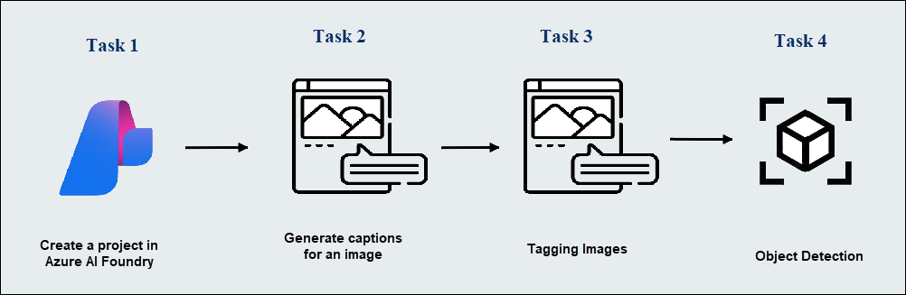
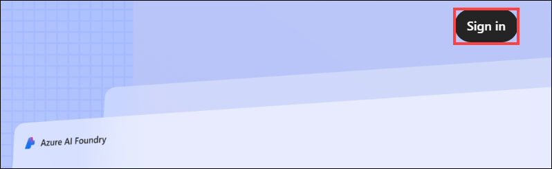
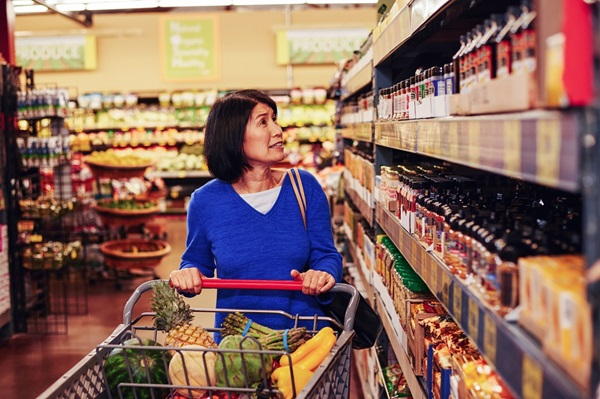

# Module 17: Analyze images in the Azure AI Foundry portal

**Azure AI Vision** includes numerous capabilities for understanding image content and context and extracting information from images. In this exercise, you will use Azure AI Vision in Azure AI Foundry portal, Microsoft's platform for creating intelligent applications, to analyze images using the built-in try-it-out experiences. 

Suppose the fictitious retailer *Northwind Traders* has decided to implement a "smart store", in which AI services monitor the store to identify customers requiring assistance, and direct employees to help them. By using Azure AI Vision, images taken by cameras throughout the store can be analyzed to provide meaningful descriptions of what they depict.

## Lab objectives

In this lab, you will perform:
- Task 1: Create a project in Azure AI Foundry portal
- Task 2: Generate captions for an image
- Task 3: Tagging images 
- Task 4: Object detection

## Estimated timing: 30 minutes

## Architecture Diagram

 

## Task 1: Create a project in the Azure AI Foundry portal

In this task, we are setting up a project in Azure AI Foundry by creating and configuring an AI services environment for further experimentation.

1. Open a new tab, and navigate to [Azure AI Foundry](https://ai.azure.com?azure-portal=true).

1. On the Welcome to Azure AI Foundry page, Click on **Sign in** in the top right corner.

   

1.  Enter your credentials:
 
   - **Email/Username:** <inject key="AzureAdUserEmail"></inject>
 
       
 
1. Next, provide your password:
 
   - **Password:** <inject key="AzureAdUserPassword"></inject>
 
     
 
1. If prompted to stay signed in, you can click **No**. 

1. On the Azure AI Foundry portal home page, select **Create a project**. In Azure AI Foundry, projects are containers that help organize your work.  

    

1. On the **Create a project** pane, enter project name **Myproject<inject key="DeploymentID" enableCopy="false" /> (1)** and then select **Customize (2)**.

    

1. On the **Create a project** pane, Configure it with the following settings:

    - **Hub name**: Enter **myhub<inject key="DeploymentID" enableCopy="false" /> (1)**
    - **Subscription**: **Use existing Azure subscription (2)**
    - **Resource group**: Select **AI-900-Module-17 (3)**
    - **Location**: Select **<inject key="location" enableCopy="false"/> (4)**
    - **Connect Azure AI Services or Azure OpenAI Service**:
    Click on **Create new AI Services (5)** and provide name **AI<inject key="DeploymentID" enableCopy="false" /> (6)** and click on **Next**
    - **Connect Azure AI Search**: Leave as default **(7)**
    - Click on **Next (8)**

        

    > **Important**: You will need an Azure AI services resource provisioned in a specific location to complete the rest of the lab.

1. On the **Review and Finish** page, click on **Create**.

    

1. Keep track of the following created resources: 
    
    - **Azure AI Project**
    - **Azure AI Hub**  
    - **Azure AI Services**    
    - **Storage Account**  
    - **Key Vault**

      
 
1. After the resources are created, you will be brought to your project's **Overview (1)** page. On the left-hand menu on the screen, select **AI Services (2)**.
 
      

    >**Note**: If a pop-up appears, please click **Close**.

1. On the **AI Services** page, select the **Vision + Document** tile to try out Azure AI Vision and Document capabilities.

    

> **Congratulations** on completing the task! Now, it's time to validate it. Here are the steps:
 
- Hit the Validate button for the corresponding task. If you receive a success message, you can proceed to the next task. 
- If not, carefully read the error message and retry the step, following the instructions in the lab guide.
- If you need any assistance, please contact us at labs-support@spektrasystems.com. We are available 24/7 to help you out.

   <validation step="10cf8d2c-7678-441a-8ad5-7752773b3f33" />

## Task 2: Generate captions for an image

In this task, we are exploring Azure AI Vision's image captioning and dense captioning capabilities by uploading an image and observing how AI generates descriptive text for the entire image and specific objects within it.

Let's use the image captioning functionality of Azure AI Vision to analyze images taken by a camera in the *Northwind Traders* store. Image captions are available through the **Caption** and **Dense Captions** features.

1. On the **Vision + Document** page, scroll down and select **Image (1)** under View all other vision capabilities. Then select the **Image captioning (2)** tile.

    

1. On the **Add captions to images** page, review the resource you are connected to which is listed under the **Try It Out** subheading. You should not have to make changes. 

   >**Note**: If you didn't select a valid resource location during resource creation, you may be prompted to create a new Azure AI services resource in a valid region. To continue with the lab, you must create the new resource in one of the supported regions: **East US, France Central, Korea Central, West Europe, or West US**.

1. Copy this link and paste it into the browser [**https://aka.ms/mslearn-images-for-analysis**](https://aka.ms/mslearn-images-for-analysis) to download **image-analysis.zip**. Open the folder on your computer, extract the zip file, and locate the file named **store-camera-1.jpg**; which contains the following image:

    

1. Upload the **store-camera-1.jpg** image by dragging it to the **Drag and drop files here** box, or by browsing it on your file system.

1. Observe the generated caption text, visible in the **Detected attributes** panel to the right of the image.

    

    >**Note:** The **Caption** feature generates a **single** human-readable English sentence that describes the image's content.

1. Next, use the same image to perform **Dense captioning**. Return to the **Vision + Document** page by selecting the **back** arrow at the top of the page. On the **Vision + Document** page, select the **Image** tab, then select the **Dense captioning** tile.

   

1. Upload the **store-camera-1.jpg** image by dragging it to the **Drag and drop files here** box, or by browsing it on your file system.

1.  The **Dense Captions** feature differs from the **Caption** capability in that it provides multiple human-readable captions for an image, one describing the image's content and others, each covering the essential objects detected in the picture. Each detected object includes a bounding box, which defines the pixel coordinates within the image associated with the object.

1. Hover over one of the captions in the **Detected** attributes list and observe what happens within the image.

    

1. Move your mouse cursor over the other captions in the list, and notice how the bounding box shifts in the image to highlight the portion of the image used to generate the caption.

## Task 3: Tagging images 

In this task, we are using Azure AI Vision's common tag extraction feature to analyze an image and generate a list of descriptive tags, including objects and actions, along with confidence scores.

The next feature you will try is the *Extract Tags* functionality. Extract tags are based on thousands of recognizable objects, including living beings, scenery, and actions.

1. Return to the **Vision + Document** page of Azure AI Foundry, then select the **Image** tab, and select the **Common tag extraction** tile.

2. In the **Choose the model you want to try out**, leave **Prebuilt product vs. gap model** selected. 

   

3. Open the folder containing the images you downloaded and locate the file named **store-camera-2.jpg**, which looks like this:

    

4. Upload the **store-camera-2.jpg** file.

5. Review the list of tags extracted from the image and the confidence score for each in the detected attributes panel. Here the confidence score is the likelihood that the text for the detected attribute describes what is actually in the image. Notice in the list of tags that it includes not only objects, but actions, such as *shopping*, *selling*, and *standing*.

    

## Task 4: Object detection

In this task, you use the **Object detection** feature of Image Analysis. Object detection detects and extracts bounding boxes based on thousands of recognizable objects and living beings.

1. Return to the *Vision + Document* page of Azure AI Foundry, then select the **Image** tab, and select the **Common object detection** tile.

   

1. In the **Choose the model you want to try out**, leave **Prebuilt product vs. gap model** selected.

1. Open the folder containing the images you downloaded and locate the file named **store-camera-3.jpg**, which looks like this:

    

1. Upload the **store-camera-3.jpg** file.

1. In the **Detected attributes** box, observe the list of detected objects and their confidence scores.

   

1. Hover your mouse cursor over the objects in the **Detected attributes** list to highlight the object's bounding box in the image.

   

1. Move the **Threshold value** slider until a value of 70 is displayed to the right of the slider. Observe what happens to the objects in the list. The threshold slider specifies that only objects identified with a confidence score or probability greater than the threshold should be displayed.

   

### Review
In this exercise, you have completed the following tasks:
- Created a project in the Azure AI Foundry portal
- Generated captions for an image
- Tagged images 
- Detected Object 

## Learn more

To learn more about what you can do with this service, see the [Azure AI Vision page](https://learn.microsoft.com/azure/ai-services/computer-vision/overview).

## You have successfully completed this lab.
