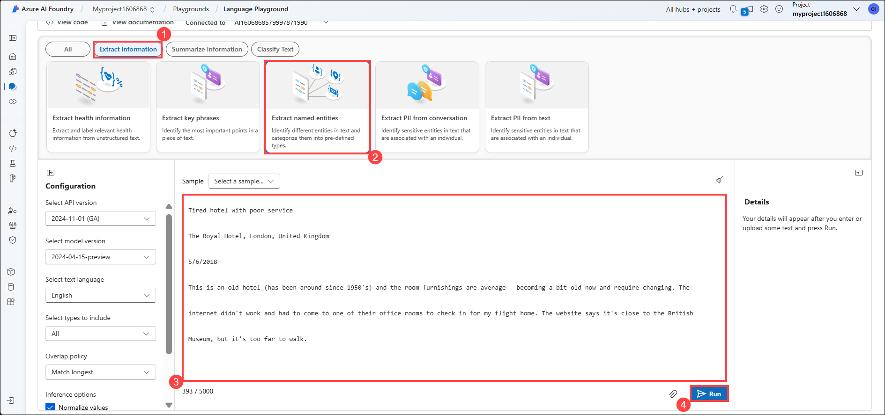
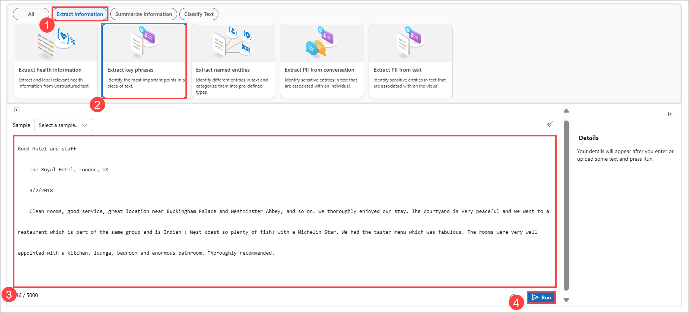
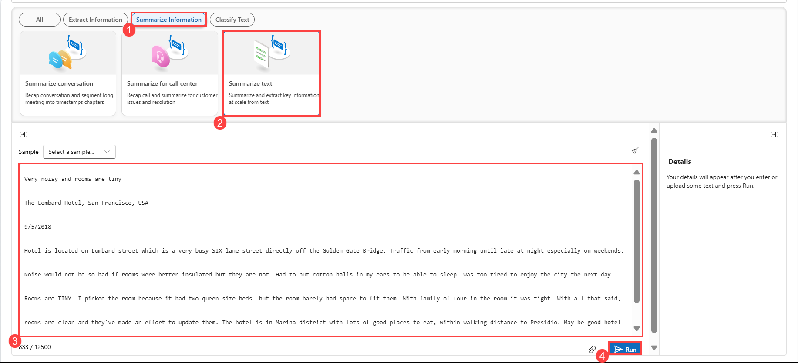

# Module 18: Analyze text in Azure AI Foundry portal

Natural Language Processing (NLP) is a branch of AI that deals with written and spoken language. You can use NLP to build solutions that extract semantic meaning from text or speech, or that formulate meaningful responses in natural language.

Azure AI Language service includes Text Analytics, with capabilities such as entity recognition, key phrase extraction, summarization, and sentiment analysis. For example, suppose the fictitious travel agent Margie's Travel encourages customers to submit reviews for hotel stays. You could use the Language service to extract named entities, identify key phrases, summarize text, and more.

In this exercise, you will use Azure AI Language in Azure AI Foundry portal, Microsoft's platform for creating intelligent applications, to analyze hotel reviews. 

## Lab objectives

In this lab, you will perform:
- Task 1: Create a project in Azure AI Foundry portal
- Task 2: Extract named entities with Azure AI Language in Azure AI Foundry portal
- Task 3: Extract key phrases with Azure AI Language in Azure AI Foundry portal
- Task 4: Summarize text with Azure AI Language in Azure AI Foundry portal

## Task 1: Create a project in the Azure AI Foundry portal

1. Open a new tab, navigate to [Azure AI Foundry](https://ai.azure.com?azure-portal=true).

1. On the Welcome to Azure AI Foundry page, Click on **Sign in** in the top right corner.

   

1.  Enter your credentials:
 
   - **Email/Username:** <inject key="AzureAdUserEmail"></inject>
 
       
 
1. Next, provide your password:
 
   - **Password:** <inject key="AzureAdUserPassword"></inject>
 
     
 
1. If prompted to stay signed in, you can click **No**.

1. On the Azure AI Foundry portal home page, select **Create a project**. In Azure AI Foundry, projects are containers that help organize your work.  

    

1. On the **Create a project** pane, enter project name **Myproject<inject key="DeploymentID" enableCopy="false" /> (1)** and then select **Customize (2)**.

    

1. On the **Create a project** pane, Configure it with the following settings:

    - **Hub name**: Enter **myhub<inject key="DeploymentID" enableCopy="false" /> (1)**
    - **Subscription**: **Use existing Azure subscription (2)**
    - **Resource group**: Select **AI-900-Module-18 (3)**
    - **Location**: Select **<inject key="location" enableCopy="false"/> (4)**
    - **Connect Azure AI Services or Azure OpenAI Service**:
    Click on **Create new AI Services** and provide name **AI<inject key="DeploymentID" enableCopy="false" /> (5)** and click on **Next**
    - **Connect Azure AI Search**: Leave as default **(6)**
    - Click on **Next (7)**

        

    > **Important**: You will need an Azure AI services resource provisioned in a specific location to complete the rest of the lab.

1. On the **Review and Finish** page, click on **Create**.

    

1. Keep track of the following created resources: 
    
    - **Azure AI Project**
    - **Azure AI Hub**  
    - **Azure AI Services**    
    - **Storage Account**  
    - **Key Vault**

      
 
1. On the **Playgrounds (1)** page, select the **Language playground (2)** tile to try out some Azure AI Language capabilities.

    

## Task 2: Extract named entities with Azure AI Language in Azure AI Foundry portal

*Named entities* are words that describe people, places, and objects with proper names. Let's use the named entity extraction capability of Azure AI Language to identify types of information in a review.

1. In the Language playground, select **Extract information (1)**. Then select the **Extract named entities (2)** tile. 

1. Under **Sample (3)**, copy and paste the following review:

    ```
    Tired hotel with poor service
    The Royal Hotel, London, United Kingdom
    5/6/2018
    This is an old hotel (has been around since 1950's) and the room furnishings are average - becoming a bit old now and require changing. The internet didn't work and had to come to one of their office rooms to check in for my flight home. The website says it's close to the British Museum, but it's too far to walk.
    ```

1. Select **Run (4)**. Review the output.

   

2. Notice in the **Details** section how the extracted entities come with additional information such as type and confidence scores. The confidence score represents the likelihood that the type identified actually belongs to that category.

   

## Task 3: Extract key phrases with Azure AI Language in Azure AI Foundry portal

*Key phrases* are the most important pieces of information in text. Let's use the key phrase extraction capability of Azure AI Language to pull important information from a review.

1. In the Language playground, select **Extract information (1)**. Then select the **Extract key phrases (2)** tile. 

1. Under **Sample (3)**, copy and paste the following review:

    ```
    Good Hotel and staff
    The Royal Hotel, London, UK
    3/2/2018
    Clean rooms, good service, great location near Buckingham Palace and Westminster Abbey, and so on. We thoroughly enjoyed our stay. The courtyard is very peaceful and we went to a restaurant which is part of the same group and is Indian ( West coast so plenty of fish) with a Michelin Star. We had the taster menu which was fabulous. The rooms were very well appointed with a kitchen, lounge, bedroom and enormous bathroom. Thoroughly recommended.
    ```
1. Select **Run (4)**. Review the output.

    

1. Notice the different phrases extracted in the **Details** section. These phrases should contribute most to the text's meaning.

   

## Task 4: Summarize text with Azure AI Language in Azure AI Foundry portal
 
1. Let's look at Azure AI Language's summarization capabilities. In the Language playground, select **Summarize information (1)**, then select the **Summarize text (2)** tile.

1. Under **Sample (3)**, copy and paste the following review:
    
    ```
    Very noisy and rooms are tiny
    The Lombard Hotel, San Francisco, USA
    9/5/2018
    Hotel is located on Lombard street which is a very busy SIX lane street directly off the Golden Gate Bridge. Traffic from early morning until late at night especially on weekends. Noise would not be so bad if rooms were better insulated but they are not. Had to put cotton balls in my ears to be able to sleep--was too tired to enjoy the city the next day. Rooms are TINY. I picked the room because it had two queen size beds--but the room barely had space to fit them. With family of four in the room it was tight. With all that said, rooms are clean and they've made an effort to update them. The hotel is in Marina district with lots of good places to eat, within walking distance to Presidio. May be good hotel for young stay-up-late adults on a budget
    ```
1. Select **Run (4)**. Review the output.

   

1. Notice the *Extractive summary* in **Details** provides rank scores for the most salient sentences.  

   

### Review
In this exercise, you have completed the following tasks:
- Created a project in Azure AI Foundry portal
- Extracted named entities with Azure AI Language in Azure AI Foundry portal
- Extracted key phrases with Azure AI Language in Azure AI Foundry portal
- Summarized text with Azure AI Language in Azure AI Foundry portal 

## Learn more

To learn more about what you can do with this service, see the [Language service page](https://learn.microsoft.com/azure/ai-services/language-service/overview).

## You have successfully completed this lab.
