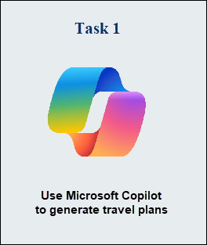

# Module 20: Explore generative AI with Microsoft Copilot

Generative AI describes a category of capabilities within AI that create content. People typically interact with generative AI that has been built into chat applications. One popular example of such an application is Microsoft Copilot, an AI-powered productivity tool designed to enhance your work experience by providing real-time intelligence and assistance. 

In this exercise, you will use Microsoft Copilot to generate travel plans.

## Lab objectives

In this lab, you will perform:
- Task 1: Use Microsoft Copilot to generate travel plans

## Estimated timing: 30 minutes

## Architecture Diagram

 

## Task 1: Use Microsoft Copilot to generate travel plans

1. In a new tab, open [Microsoft Copilot](https://copilot.microsoft.com) at `https://copilot.microsoft.com`.

1. Click on the **Sign in** button on the right hand side of the screen and sign-in with the Microsoft account.

1. Consider the following ways you can improve responses from a generative AI assistant:
    - Start with a specific goal for what you want the assistant to do
    - Iterate based on previous prompts and responses to refine the result
    - Provide a source to ground the response in a specific scope of information
    - Add context to maximize response appropriateness and relevance
    - Set clear expectations for the response

1. Let's try generating a response from Microsoft Copilot using a prompt with a specific goal. In the chat box at the bottom of the Copilot pane, enter the following prompt:

    ```prompt
    I'm planning a trip to Paris in September. Can you help me?
    ```

1. Review the response from Copilot. 

   

    >**Note**: Keep in mind that the specific response you receive may vary due to the nature of generative AI.
 
1. Let's try another prompt. Enter the following:

    ```prompt
    Where's a good location in Paris to stay? 
    ```

1. Review the response, which should provide some places to stay in Paris.

   

1. Let's iterate based on previous prompts and responses to refine the result. Enter the following prompt:
    
    ```prompt
    Can you give me more information about dining options near the first location?
    ``` 

1. Review the response, which should provide dining options near a location from the previous response. 

    

1. Now, let's provide a source to ground the response in a specific scope of information. Enter the following: 
    
    ```prompt
    Based on the information at https://en.wikipedia.org/wiki/History_of_Paris, what were the key events in the city's history?
    ```

1. Review the response, which should provide information based on the provided website. 

    

1. Let's try to add context to maximize the relevance of the response. Enter the following prompt: 

    ```prompt
    What three places do you recommend I stay in Paris to be within walking distance to historical attractions? Explain your reasoning.
    ```

1. Review the response and reasoning for the response.  

   

1. Now try setting clear expectations for the response. Enter the following prompt:
    
    ```prompt
    What are the top 10 sights to see in Paris? Answer with a numbered list in order of popularity.
    ```

1. Review the response, which should provide a numbered list of sights to see in Paris.

   

1. Before you go, notice that you can scroll back up to see your chat history. You can also use the plus sign **+** next to the chat window to start a *new* chat or upload images to add grounding sources to your prompts.    

   

1. When you are done, close the browser window. 

> **Congratulations** on completing the task! Now, it's time to validate it. Here are the steps:
 
- Hit the Validate button for the corresponding task. If you receive a success message, you can proceed to the next task. 
- If not, carefully read the error message and retry the step, following the instructions in the lab guide.
- If you need any assistance, please contact us at labs-support@spektrasystems.com. We are available 24/7 to help you out.

   <validation step="a78cde3c-b21b-4ea4-9230-2d5a5d655239" />

### Review
In this exercise, you have completed the following tasks:
- Used Microsoft Copilot to generate travel plans

## You have successfully completed this lab.
