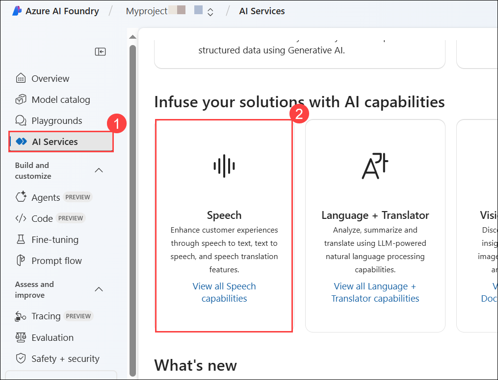
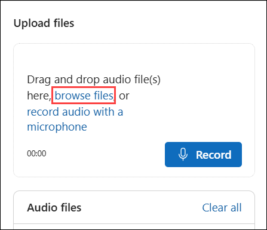

# Module 21 : Explore Speech in Azure AI Foundry portal

The **Azure AI Speech** service transcribes speech into text, and text into audible speech. You might use AI Speech to create an application that can transcribe meeting notes or generate text from the recording of interviews.

In this exercise, you will use Azure AI Speech in Azure AI Foundry portal, Microsoft's platform for creating intelligent applications, to transcribe audio using the built-in try-it-out experiences. 

## Lab objectives

In this lab, you will perform:

- Task 1: Create a project in the Azure AI Foundry portal
- Task 2: Explore speech to text in Azure AI Foundry's Speech Playground

## Task 1: Create a project in the Azure AI Foundry portal

1. Open a new tab, navigate to [Azure AI Foundry](https://ai.azure.com?azure-portal=true).

1. On the Welcome to Azure AI Foundry page, Click on **Sign in** in the top right corner.

   

1. Enter your credentials:
 
   - **Email/Username:** <inject key="AzureAdUserEmail"></inject>
 
       
 
1. Next, provide your password:
 
   - **Password:** <inject key="AzureAdUserPassword"></inject>
 
     
 
1. If prompted to stay signed in, you can click **No**.

1. On the Azure AI Foundry portal home page, select **Create a project**. In Azure AI Foundry, projects are containers that help organize your work.  

    

1. On the **Create a project** pane, enter project name **Myproject<inject key="DeploymentID" enableCopy="false" /> (1)** and then select **Customize (2)**.

    

1. On the **Create a project** pane, Configure it with the following settings:

    - **Hub name**: Enter **myhub<inject key="DeploymentID" enableCopy="false" /> (1)**.
    - **Subcription**: **Use existing Azure subscription (2)**.
    - **Resource group**: Select **AI-900-Module-21 (3)**
    - **Location**: Select **<inject key="location" enableCopy="false"/> (4)**
    - **Connect Azure AI Services or Azure OpenAI Service**:
    Click on **Create new AI Services** and provide name **AI<inject key="DeploymentID" enableCopy="false" /> (5)** and click on **Next**
    - **Connect Azure AI Search**: Leave as default **(6)**
    - Click on **Next (7)**

        

    > **Important**: You will need an Azure AI services resource provisioned in a specific location to complete the rest of the lab.

1. On the **Review and Finish** page, click on **Create**.

    

1. Keep track of the following created resources: 
    
    - **Azure AI Project**
    - **Azure AI Hub**  
    - **Azure AI Services**    
    - **Storage Account**  
    - **Key Vault**

      

1. On the **AI Services (1)** page, select the **Speech (2)** tile to try out Azure AI Speech capabilities.

   

## Task 2: Explore speech to text in Azure AI Foundry's Speech Playground

Let's try out *real time speech to text* in Azure AI Foundry's Speech Playground. 

1. On the *Speech* page, scroll down and select **Real-time speech to text** under *Try out Speech capabilities*. You will be taken to the *Speech Playground*. 

1. Select [**https://aka.ms/mslearn-speech-files**](https://aka.ms/mslearn-speech-files) to download **speech.zip**. Open the folder. 

1. Under *Upload files*, select **Browse files** and navigate to the folder where you saved the file. Select **WhatAICanDo.m4a** and then **Open**.

    

1. The Speech service transcribes and displays the text in real time. If you have audio on your computer, you can listen to the recording as the text is being transcribed.

1. Review the output, which should have successfully recognized and transcribed the audio into text.

   

### Review

In this exercise, you have completed the following tasks:

- Explored Azure AI Speech services in the Speech Playground
- Transcribed audio to text using the Real-time speech-to-text service

## Learn more

This exercise demonstrated only some of the capabilities of the Speech service. To learn more about what you can do with this service, see the [Speech page](https://azure.microsoft.com/services/cognitive-services/speech-services).

## You have successfully completed this lab.
