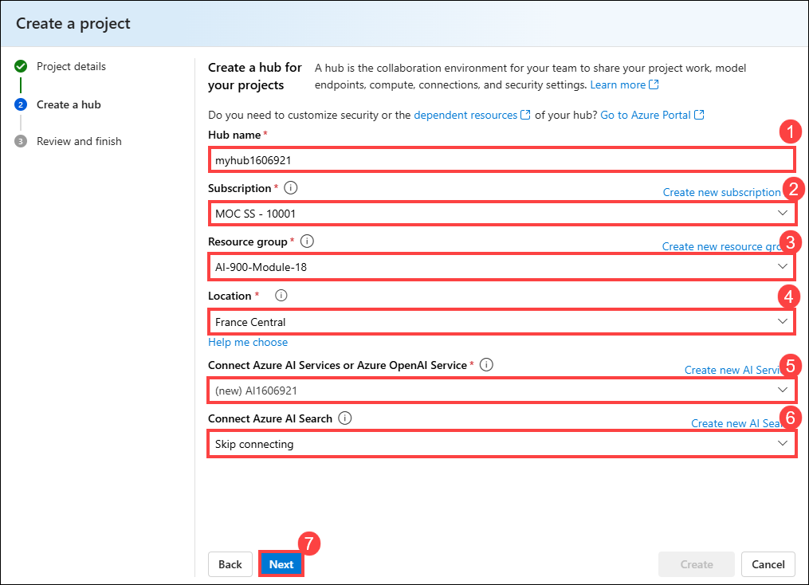
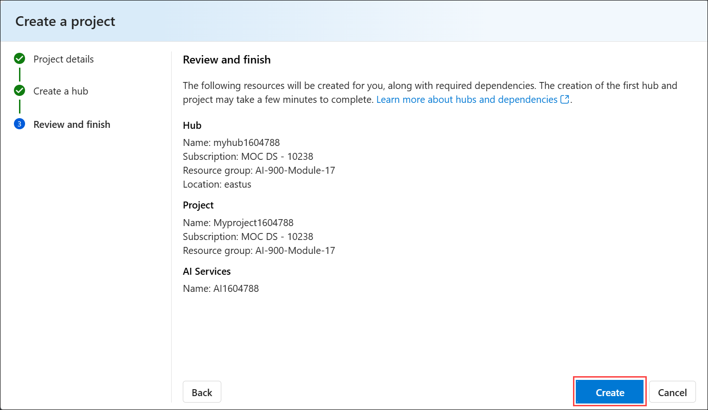
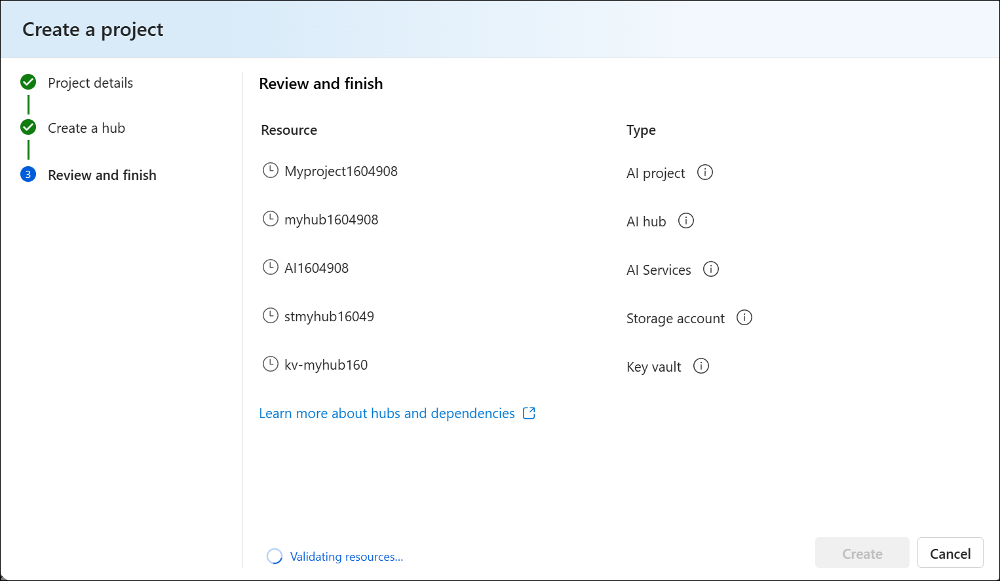

---
lab:
    title: 'Explore Content Safety in Azure AI Foundry'
---

# Explore Content Safety in Azure AI Foundry

Azure AI services help users create AI applications with out-of-the-box and pre-built and customizable APIs and models. In this exercise you will take a look at one of the services, Azure AI Content Safety, which enables you to moderate text and image content. In Azure AI Foundry portal, Microsoft's platform for creating intelligent applications, you will use Azure AI Content Safety to categorize text and assign it severity score. 

> **Note**
> The goal of this exercise is to get a general sense of how Azure AI services are provisioned and used. Content Safety is used as an example, but you are not expected to gain a comprehensive knowledge of content safety in this exercise!

## Task 1: Create a project in the Azure AI Foundry portal

1. Open a new tab, navigate to [Azure AI Foundry](https://ai.azure.com?azure-portal=true).

1. On the Welcome to Azure AI Foundry page, Click on **Sign in** in the top right corner.

   

1.  Enter your credentials:
 
   - **Email/Username:** <inject key="AzureAdUserEmail"></inject>
 
       
 
1. Next, provide your password:
 
   - **Password:** <inject key="AzureAdUserPassword"></inject>
 
     
 
1. If prompted to stay signed in, you can click **No**.

1. On the Azure AI Foundry portal home page, select **Create a project**. In Azure AI Foundry, projects are containers that help organize your work.  

    

1. On the **Create a project** pane, enter project name **Myproject<inject key="DeploymentID" enableCopy="false" /> (1)** and then select **Customize (2)**.

    

1. On the **Create a project** pane, Configure it with the following settings:

    - **Hub name**: Enter **myhub<inject key="DeploymentID" enableCopy="false" /> (1)**.
    - **Subcription**: **Use existing Azure subscription (2)**.
    - **Resource group**: Select **AI-900-Module-18 (3)**
    - **Location**: Select **<inject key="location" enableCopy="false"/> (4)**
    - **Connect Azure AI Services or Azure OpenAI Service**:
    Click on **Create new AI Services** and provide name **AI<inject key="DeploymentID" enableCopy="false" /> (5)** and click on **Next**.
    - **Connect Azure AI Search**: Leave as default **(6)**
    - Click on **Next (7)**.

        

    > **Important**: You will need an Azure AI services resource provisioned in a specific location to complete the rest of the lab.

1. On the **Review and Finish** page, click on **Create**.

    

1. Keep track of the following created resources: 
    
    - **Azure AI Project**
    - **Azure AI Hub**  
    - **Azure AI Services**    
    - **Storage Account**  
    - **Key Vault**

      

6. After the resources are created, you will be brought to your project's *Overview* page. 

7. In order to use Content Safety, you need to make a permissions update to your *Azure AI hub* resource. To do this, open the [Azure portal](https://portal.azure.com?portal-azure=true) and log in with the same subscription you used to create your AI Foundry resources.  

8. In the Azure portal, use the search bar at the top of the page to look for and select **Azure AI Foundry**. In the  resource page, select the resource you just created that is *type* **Azure AI hub**.  

9. In the Azure portal, on the left-hand pane, select **Access Control (IAM)**. Then on the open pane, select **Add** next to the plus sign, and select **Add role assignment**. 

   

10. Search for **Azure AI Safety Evaluator** in the list of roles, and select it. Then select **Next**. 

11. Use the following settings to assign yourself to the role: 
    - **Assign access to**: select *user, group, or service principal*
    - **Members**: click on *select members*
        - On the open *Select members* pane, find your name. Click on the plus icon next to your name. Then click **Select**.
    - **Description**: *leave blank*

12. Select **Review and Assign**, then select **Review and Assign** again to add the role assignment.    

13. In your browser, return to the [Azure AI Foundry portal](https://ai.azure.com?azure-portal=true). Select your project. 

14. On the left-hand menu on the screen, select **AI Services**.
 
      

15. On the *AI Services* page, select the *Vision + Document* tile to try out Azure AI Vision and Document capabilities.
    
    

## Task 2: Try out text moderation with Content Safety in Azure AI Foundry portal 

1. On the *Content Safety* page, under *Filter text content*, select **Moderate text content**.

2. On the *Moderate text content* page, under the *Try it out* heading, select the Azure AI services resource you just created from the drop down menu.   

3. Under *Run a simple test*, select the **Safe Content** tile. Notice that text is displayed in the box below. 

4. Click **Run test**. Running a test calls the Content Safety Service's deep learning model. The deep learning model has already been trained to recognize un-safe content.

5. In the *Results* panel, inspect the results. There are four severity levels from safe to high, and four types of harmful content. Does the Content Safety AI service consider this sample to be acceptable or not? What's important to note is that the results are within a confidence interval. A well-trained model, like one of Azure AI's out-of-the-box models, can return results that have a high probability of matching what a human would label the result. Each time you run a test, you call the model again. 

6. Now try another sample. Select the text under Violent content with misspelling. Check that the content is displayed in the box below.

7. Click **Run test** and inspect the results in the Results panel again. 

You can run tests on all the samples provided, then inspect the results.

## Learn more

This exercise demonstrated only some of the capabilities of the Content Safety service. To learn more about what you can do with this service, see the [Content Safety page](https://learn.microsoft.com/azure/ai-services/content-safety/overview).
