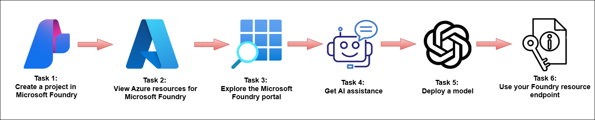
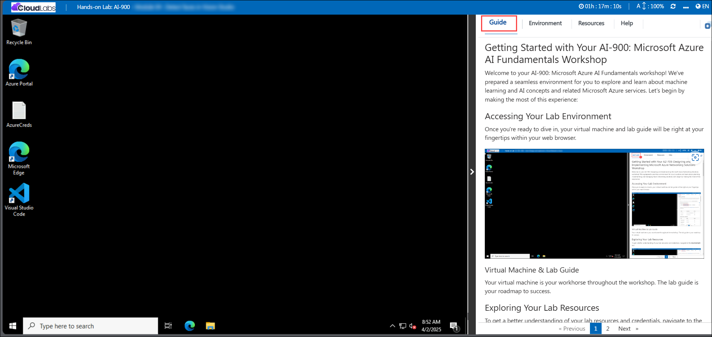
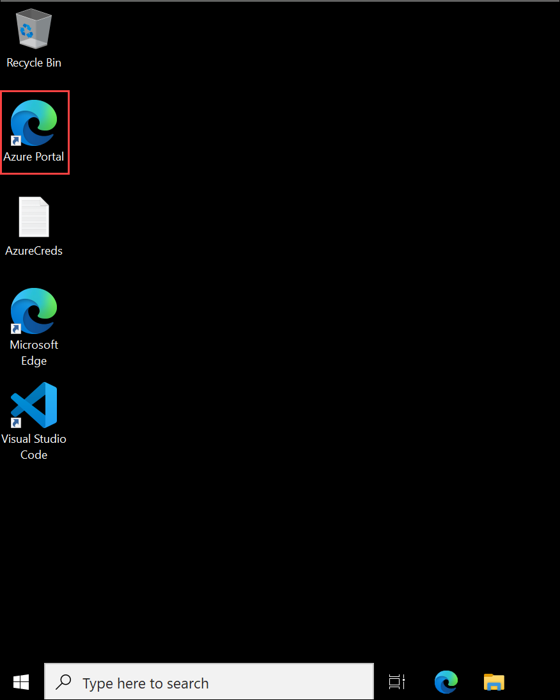
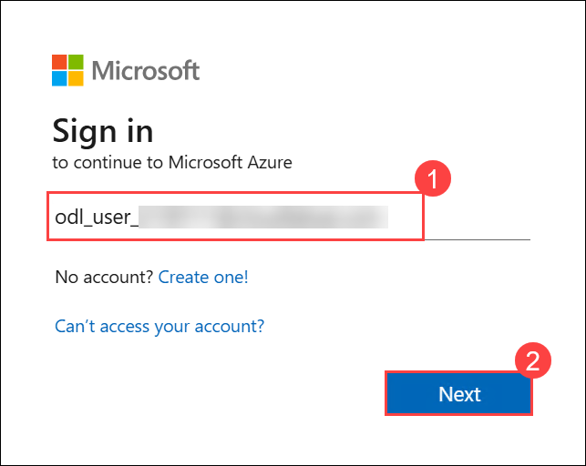
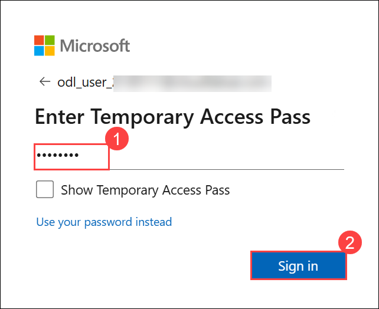
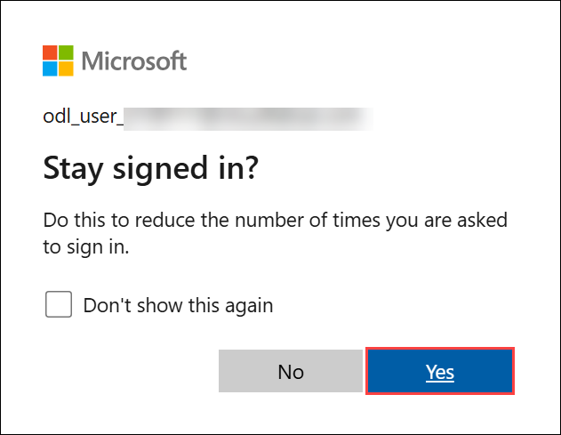

# AI-900: Microsoft Azure AI Fundamentals Workshop

Welcome to your AI-900: Microsoft Azure AI Fundamentals workshop! We've prepared a seamless environment for you to explore and learn Azure Services. Let's begin by making the most of this experience.

# Get started with Microsoft Foundry

### Overall Estimated timing: 30 Minutes

## Overview

In this hands-on lab, you'll gain practical experience using **Microsoft Foundry** to create and manage AI development resources. You will learn how to create a Microsoft Foundry project, explore the Foundry portal interface, and understand how the project is connected to underlying Azure resources. You will also interact with the built-in **Ask AI** assistant to learn about platform capabilities, deploy a generative AI model from the Foundry model catalog, and test the model in the playground. Finally, you will configure a sample client application using your project’s endpoint, API key, and model deployment to interact with the deployed model. By the end of this lab, you will understand how Microsoft Foundry enables developers to build and integrate AI-powered applications.

## Objectives

By the end of this lab, you will be able to create and explore a project in **Microsoft Foundry**, deploy a generative AI model, and connect an application to the deployed model using project credentials.

1. **Create a Microsoft Foundry project**: You will learn how to access the Microsoft Foundry portal, configure project settings such as subscription, resource group, and region, and create a project to organize AI models and resources.

2. **Explore the Microsoft Foundry portal and Azure resources**: You will navigate the Foundry portal to understand its key sections and view the Azure resources that support your Foundry project.

3. **Deploy and test a generative AI model**: You will deploy a model from the Foundry model catalog, interact with it in the playground, and test its responses using prompts.

4. **Connect an application to the Foundry resource**: You will configure a sample client application using the project endpoint, API key, and model deployment name to interact with the deployed model.

## Pre-requisites

Basic familiarity with Azure services and AI concepts is recommended. Experience with navigating the Azure portal and understanding concepts such as AI models, APIs, and cloud resources will be helpful when working with Microsoft Foundry.

## Architecture

In this hands-on lab, the architecture demonstrates a simple workflow for developing and using generative AI solutions with Microsoft Foundry.

1. **Microsoft Foundry Project and Azure Resources**: A Microsoft Foundry project is created and linked to an underlying Foundry resource in Azure. This resource provides the infrastructure required to manage models, endpoints, and AI services used in the project.

2. **Model Deployment from the Foundry Model Catalog**: A generative AI model is selected from the Foundry model catalog and deployed to the project. The deployment creates a model endpoint that allows applications and tools to interact with the model.

3. **Client Application Integration**: A sample client application is configured using the project endpoint, API key, and model deployment name. The application sends prompts to the deployed model and receives AI-generated responses, demonstrating how Foundry models can be integrated into real-world applications.

## Architecture Diagram

 

## Explanation of Components

1. **Microsoft Foundry Project**: A workspace used to organize and manage AI assets such as models, agents, tools, and data connections. Projects help structure the development of AI applications and provide a centralized place to configure and access resources required for building AI solutions.

2. **Microsoft Foundry Resource**: The underlying Azure resource that provides the infrastructure and services required for AI development. It hosts capabilities such as model deployments, APIs, and integrations that allow applications and agents to interact with AI models.

3. **Model Catalog**: A collection of AI models provided by Microsoft, OpenAI, and other providers that can be used in AI applications. The catalog allows developers to browse, evaluate, and deploy models based on their requirements.

4. **Model Deployment**: The process of deploying a selected model to a Foundry resource so it can be accessed through an endpoint. Once deployed, the model can be used by applications, agents, and tools to generate responses or perform AI-powered tasks.

5. **Project Endpoint and API Key**: Secure access credentials used by applications to interact with models and services in a Microsoft Foundry project. The endpoint specifies where requests are sent, while the API key authenticates and authorizes access to the deployed resources.

6. **Ask AI Assistant**: A built-in AI-powered assistant in the Microsoft Foundry portal that helps users understand platform features, find guidance, and explore capabilities by interacting through natural language prompts.

# Getting Started with lab
 
Welcome to your AI-900: Microsoft Azure AI Fundamentals workshop! We've prepared a seamless environment for you to explore and learn about machine learning and AI concepts and related Microsoft Azure services. Let's begin by making the most of this experience:
 
## Accessing Your Lab Environment
 
Once you're ready to dive in, your virtual machine and **Guide** will be right at your fingertips within your web browser.
 

## Virtual Machine & Lab Guide
 
Your virtual machine is your workhorse throughout the workshop. The lab guide is your roadmap to success.

## Exploring Your Lab Resources
 
To get a better understanding of your lab resources and credentials, navigate to the **Environment** tab.
 

## Lab Guide Zoom In/Zoom Out
 
To adjust the zoom level for the environment page, click the **A↕: 100%** icon located next to the timer in the lab environment.

## Utilizing the Split Window Feature
 
For convenience, you can open the lab guide in a separate window by selecting the **Split Window** button from the Top right corner.
 

## Managing Your Virtual Machine
 
Feel free to **Start, Stop, or Restart (2)** your virtual machine as needed from the **Resources (1)** tab. Your experience is in your hands!
 

## Track Your Progress

Click on the **Progress** tab to track your progress in the lab. The percentage increases as you complete each validation and reaches 100% when all validations are successfully completed.  

On the **Progress (1)** tab, you can view your overall points and validation status, **Validations 0/1 (2)**.    

## Lab Duration Extension

1. To extend the duration of the lab, kindly click the **Hourglass** icon in the top right corner of the lab environment. 

   

   >**Note:** You will get the **Hourglass** icon when 10 minutes are remaining in the lab.

2. Click **OK** to extend your lab duration.
 
   

3. If you have not extended the duration prior to when the lab is about to end, a pop-up will appear, giving you the option to extend. Click **OK** to proceed.

## Let's Get Started with Azure Portal
 
1. On your virtual machine, click on the **Azure Portal** icon as shown below:
 
   

2. You'll see the **Sign into Microsoft Azure** tab. Here, enter your **credentials (1)** and click on **Next (2)**:
 
   - **Email/Username:** <inject key="AzureAdUserEmail"></inject>
 
      
 
3. Next, provide your **password (1)** and click on **Next (2)**:
 
   - **Password:** <inject key="AzureAdUserPassword"></inject>
 
      
 
4. If you see the pop-up **Stay-Signed in?**, click **Yes**.

   
 
5. If a **Welcome to Microsoft Azure** pop-up window appears, simply click **Cancel**.

    

## Support Contact
 
The CloudLabs support team is available 24/7, 365 days a year, via email and live chat to ensure seamless assistance at any time. We offer dedicated support channels explicitly tailored for both learners and instructors, ensuring that all your needs are promptly and efficiently addressed.
 
Learner Support Contacts:
 
- Email Support: cloudlabs-support@spektrasystems.com
- Live Chat Support: https://cloudlabs.ai/labs-support

Click on **Next** from the lower right corner to move on to the next page.

   .png)

## Happy Learning !!

