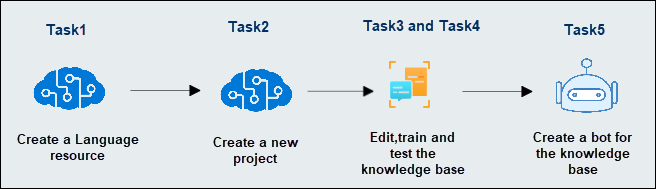
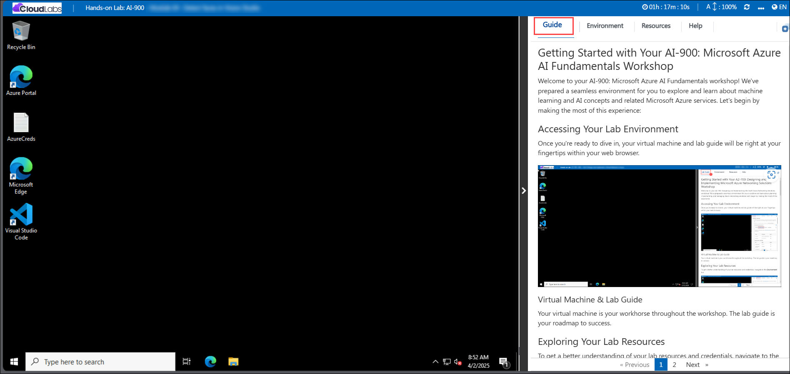
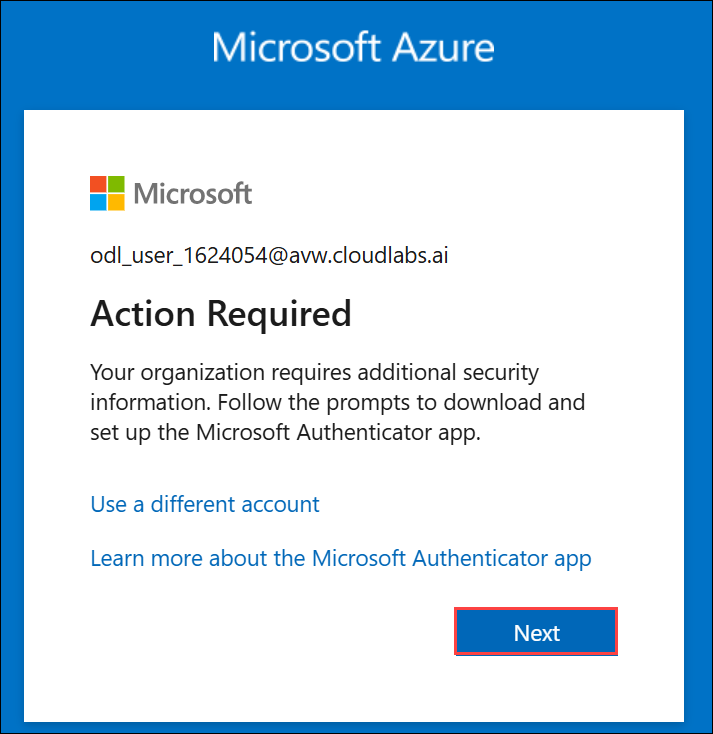
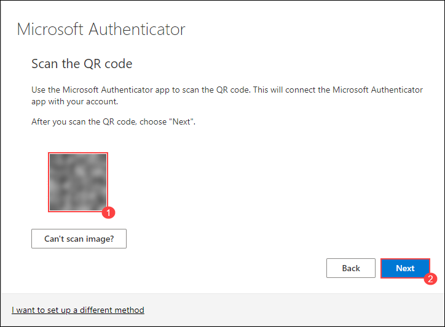

# AI-900: Microsoft Azure AI Fundamentals Workshop

Welcome to your AI-900: Microsoft Azure AI Fundamentals workshop! We've prepared a seamless environment for you to explore and learn Azure Services. Let's begin by making the most of this experience.

# Module 07: Use Question Answering with the Language Studio

### Overall Estimated timing: 45 minutes

## Overview:

In this lab, you will use Azure Language Studio to create and train a knowledge base for question answering. You will build the knowledge base using FAQ content from the website of a fictitious travel agency called Margie’s Travel. The lab demonstrates how to use Azure’s Question Answering capabilities to create a knowledge base, train it, and deploy it for answering customer queries using the natural language processing features of Azure AI.

## Objectives

By the end of this lab, you will be able to:

1. Create a Language resource to enable text analysis and natural language processing.

2. Create a new project in Language Studio to start building a knowledge base.

3. Edit and refine the knowledge base by adding custom question and answer pairs.

4. Train and test the knowledge base to evaluate its accuracy in answering questions.

5. Deploy the knowledge base as a bot or service for real-world applications.

## Pre-requisites

Basic knowledge of natural language processing and text analysis and familiarity with the Azure portal and Language Studio.

## Architecture

This lab leverages the following components:

1. **Language Resource**: A service in Azure that enables various AI-powered text processing and natural language understanding tasks.

2. **Language Studio**: The interface where users interact with the Language resource to create, manage, and deploy custom question-answering models.

3. **Knowledge Base**: A structured repository of question-answer pairs, either created manually or extracted from documents or web pages.

4. **Azure Cognitive Search**: A service that indexes and retrieves information from documents or web pages to power the knowledge base.

5. **Question Answering Model**: A machine learning model that interprets questions and retrieves the most relevant answers from the knowledge base.

## Architecture Diagram

## Explanation of Components:

1. **Language Resource**: A managed Azure service that provides a variety of AI capabilities, including natural language understanding, text analysis, and the ability to create question-answering models. This resource is essential for enabling your knowledge base to interpret user queries and return meaningful responses.

2. **Language Studio**: Language Studio is the web-based interface where you can create and manage Language resources. In this lab, you will use Language Studio to build and refine a custom knowledge base based on FAQ content, test it, and deploy it for answering customer queries.

3. **Knowledge Base**: A collection of question-answer pairs that are used to train a question-answering model. In this lab, the knowledge base is built from the FAQ document provided by Margie’s Travel, but it can be expanded or modified with additional information as needed.

4. **Azure Cognitive Search**: A search and indexing service that is used to power the knowledge base, allowing it to efficiently index large sets of information and retrieve relevant answers to user queries. The search service is integrated into the Language service to ensure quick and accurate responses.

5. **Question Answering Model**: A model powered by natural language processing (NLP) that processes user queries and searches the knowledge base for the most relevant answer. The model also supports features like providing short answers or including detailed passages from documents for further context.

# Getting Started with lab
 
Welcome to your AI-900: Microsoft Azure AI Fundamentals workshop! We've prepared a seamless environment for you to explore and learn about machine learning and AI concepts and related Microsoft Azure services. Let's begin by making the most of this experience:
 
## Accessing Your Lab Environment
 
Once you're ready to dive in, your virtual machine and **lab guide** will be right at your fingertips within your web browser.
 

### Virtual Machine & Lab Guide
 
Your virtual machine is your workhorse throughout the workshop. The lab guide is your roadmap to success.

## Exploring Your Lab Resources
 
To get a better understanding of your lab resources and credentials, navigate to the **Environment** tab.
 

## Lab Guide Zoom In/Zoom Out
 
To adjust the zoom level for the environment page, click the **A↕: 100%** icon located next to the timer in the lab environment.

## Utilizing the Split Window Feature
 
For convenience, you can open the lab guide in a separate window by selecting the **Split Window** button from the Top right corner.
 

## Managing Your Virtual Machine
 
Feel free to **start, stop, or restart (2)** your virtual machine as needed from the **Resources (1)** tab. Your experience is in your hands!
 

## Lab Duration Extension

1. To extend the duration of the lab, kindly click the **Hourglass** icon in the top right corner of the lab environment. 

    

    >**Note:** You will get the **Hourglass** icon when 10 minutes are remaining in the lab.

2. Click **OK** to extend your lab duration.
 
   

3. If you have not extended the duration prior to when the lab is about to end, a pop-up will appear, giving you the option to extend. Click **OK** to proceed.

## Let's Get Started with Azure Portal
 
1. On your virtual machine, click on the Azure Portal icon as shown below:
 
   .png)

2. You'll see the **Sign into Microsoft Azure** tab. Here, enter your credentials:
 
   - **Email/Username:** <inject key="AzureAdUserEmail"></inject>
 
       
 
3. Next, provide your password:
 
   - **Password:** <inject key="AzureAdUserPassword"></inject>
 
     
 
4. If prompted to stay signed in, you can click **No**.

5. If **Action required** pop-up window appears, click on **Ask later**.
   
    
 
6. If prompted to stay signed in, you can click "No."

    
 
7. If a **Welcome to Microsoft Azure** pop-up window appears, simply click **Cancel**.

## Steps to Proceed with MFA Setup if the "Ask Later" Option is Not Visible

1. If you see the pop-up **Stay Signed in?**, click **No**.

1. If **Action required** pop-up window appears, click on **Next**.

   
   

1. On **Start by getting the app** page, click on **Next**.
1. Click on **Next** twice.
1. In **android**, go to the play store and Search for **Microsoft Authenticator** and Tap on **Install**.

   

   > Note: For Ios, Open the app store and repeat the steps.

   > Note: Skip if already installed.

1. Open the app and tap on **Scan a QR code**.

1. Scan the QR code visible on the screen and click on **Next**.

   

1. Enter the digit displayed on the Screen in the Authenticator app on mobile and tap on **Yes**.

1. Once the notification is approved, click on **Next**.

   

1. Click on **Done**.

1. If prompted to stay signed in, you can click **"No"**.

1. Tap on **Finish** in the Mobile Device.

   > NOTE: While logging in again, enter the digits displayed on the screen in the **Authenticator app** and click on Yes.

1. If a **Welcome to Microsoft Azure** pop-up window appears, simply click **"Cancel"** to skip the tour.

1. If you see the pop-up **You have free Azure Advisor recommendations!**, close the window to continue the lab.

## Support Contact
 
The CloudLabs support team is available 24/7, 365 days a year, via email and live chat to ensure seamless assistance at any time. We offer dedicated support channels explicitly tailored for both learners and instructors, ensuring that all your needs are promptly and efficiently addressed.
 
Learner Support Contacts:
 
- Email Support: cloudlabs-support@spektrasystems.com
- Live Chat Support: https://cloudlabs.ai/labs-support

Click on **Next** from the lower right corner to move on to the next page.

   .png)

## Happy Learning !!

