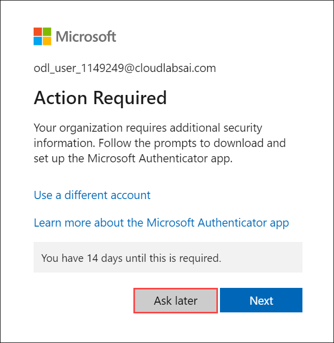

# AI-900: Microsoft Azure AI Fundamentals Workshop

Welcome to your AI-900: Microsoft Azure AI Fundamentals workshop! We've prepared a seamless environment for you to explore and learn Azure Services. Let's begin by making the most of this experience.

# Module 08: Use Conversational Language Understanding with Language Studio

### Overall Estimated timing: 45 minutes

## Overview

In this hands-on lab, you will learn how to use the Conversational Language Understanding (CLU) feature in Azure Language Studio to create intelligent systems that can understand natural language input and execute actions based on user commands. Specifically, you will create an application that interprets commands related to controlling home automation devices, such as turning lights and fans on or off, using conversational language. By leveraging Azure's CLU capabilities, you will build and train a model that can process various intents, utterances, and entities from users.

## Objective

By the end of this lab, you will be able to create a project in Azure AI Foundry and analyze a receipt using Azure AI Document Intelligence to extract key information efficiently

1. Create a Language Resource in Azure to use Conversational Language Understanding (CLU).

2. Create a Conversational Language Understanding (CLU) App to build conversational agents.

3. Define Intents, Utterances, and Entities for natural language processing tasks.

4. Train the Conversational Language Understanding Model to recognize user inputs.

5. Deploy and Test the Model to ensure its performance and accuracy.

## Pre-requisites

Basic Understanding of Natural Language Processing (NLP) and familiarity with Language Studio

## Architecture

In this hands-on lab, the architecture flow includes several essential components.

1. **Language Resource**: The foundation resource required to enable natural language processing capabilities, which includes the CLU feature.

2. **Conversational Language Understanding (CLU) App**: The primary application where you define your intents, utterances, and entities. This app processes incoming natural language input and matches it to the correct intent.

3. **Intents**: These represent the action the user wants to perform (e.g., "switch_on", "switch_off").

4. **Utterances**: These are the user-provided phrases that the CLU model will use to infer the intent (e.g., "turn on the light", "put the fan off").

6. **Entities**: These represent the objects that are involved in the intent (e.g., "light", "fan").

7. **Training Model**: Once the intents, utterances, and entities are defined, the CLU model is trained to recognize and process these inputs.

8. **Deployment**: The trained model is deployed to create an endpoint that can be queried by client applications.

## Architecture Diagram

## Explanation of Components

1. **Language Resource**: This is the base resource created in Azure, which enables the use of all Language Studio features, including Conversational Language Understanding. This resource is responsible for providing access to language processing capabilities, including understanding, interpreting, and responding to natural language commands.

2. **Conversational Language Understanding (CLU) App**: This app is the core of the conversational agent. It provides a platform for you to define various intents (actions), utterances (user inputs), and entities (objects or concepts). The CLU app leverages machine learning to learn how to interpret user inputs and predict the most likely intent and entities.

3. **Intents**: An intent represents a user’s goal or the action they want to perform. In this lab, the intents were defined as actions related to controlling devices, such as "switch_on" and "switch_off". The app will recognize when a user is asking to perform one of these actions.

4. **Utterances**: These are example phrases that represent how a user might express their desire to trigger an intent. For instance, for the "switch_on" intent, utterances like “turn on the light” and “switch on the fan” are used. These utterances help train the model to recognize the different ways users may ask for the same action.

5. **Entities**: An entity is a specific object or concept that the intent refers to. In this lab, the entities are devices such as "light" and "fan". Entities help to further specify the action, so that the system knows which device is being referred to in a command.

6. **Training Model**: Once the intents, utterances, and entities are defined, the CLU model is trained to understand how these elements work together to produce accurate responses to user commands. Training involves teaching the model to recognize patterns in user input and map them to the correct intent and entities.

7. **Deployment**: After the model is trained, it is deployed as an endpoint that can be used by client applications to send natural language inputs and receive predictions. The deployment allows the trained model to be accessed via an API endpoint, enabling integration with real-world applications.

# Getting Started with lab
 
Welcome to your AI-900: Microsoft Azure AI Fundamentals workshop! We've prepared a seamless environment for you to explore and learn about machine learning and AI concepts and related Microsoft Azure services. Let's begin by making the most of this experience:
 
## Accessing Your Lab Environment
 
Once you're ready to dive in, your virtual machine and **lab guide** will be right at your fingertips within your web browser.
 

### Virtual Machine & Lab Guide
 
Your virtual machine is your workhorse throughout the workshop. The lab guide is your roadmap to success.

## Exploring Your Lab Resources
 
To get a better understanding of your lab resources and credentials, navigate to the **Environment** tab.
 

## Lab Guide Zoom In/Zoom Out
 
To adjust the zoom level for the environment page, click the **A↕: 100%** icon located next to the timer in the lab environment.

## Utilizing the Split Window Feature
 
For convenience, you can open the lab guide in a separate window by selecting the **Split Window** button from the Top right corner.
 

## Managing Your Virtual Machine
 
Feel free to **start, stop, or restart (2)** your virtual machine as needed from the **Resources (1)** tab. Your experience is in your hands!
 

## Lab Duration Extension

1. To extend the duration of the lab, kindly click the **Hourglass** icon in the top right corner of the lab environment. 

    

    >**Note:** You will get the **Hourglass** icon when 10 minutes are remaining in the lab.

2. Click **OK** to extend your lab duration.
 
   

3. If you have not extended the duration prior to when the lab is about to end, a pop-up will appear, giving you the option to extend. Click **OK** to proceed.

## Let's Get Started with Azure Portal
 
1. On your virtual machine, click on the Azure Portal icon as shown below:
 
   .png)

2. You'll see the **Sign into Microsoft Azure** tab. Here, enter your credentials:
 
   - **Email/Username:** <inject key="AzureAdUserEmail"></inject>
 
       
 
3. Next, provide your password:
 
   - **Password:** <inject key="AzureAdUserPassword"></inject>
 
     
 
4. If prompted to stay signed in, you can click **No**.

5. If **Action required** pop-up window appears, click on **Ask later**.
   
    
 
6. If prompted to stay signed in, you can click "No."

    
 
7. If a **Welcome to Microsoft Azure** pop-up window appears, simply click **Cancel**.

## Steps to Proceed with MFA Setup if the "Ask Later" Option is Not Visible

1. If you see the pop-up **Stay Signed in?**, click **No**.

1. If **Action required** pop-up window appears, click on **Next**.

   
   

1. On **Start by getting the app** page, click on **Next**.
1. Click on **Next** twice.
1. In **android**, go to the play store and Search for **Microsoft Authenticator** and Tap on **Install**.

   

   > Note: For Ios, Open the app store and repeat the steps.

   > Note: Skip if already installed.

1. Open the app and tap on **Scan a QR code**.

1. Scan the QR code visible on the screen and click on **Next**.

   

1. Enter the digit displayed on the Screen in the Authenticator app on mobile and tap on **Yes**.

1. Once the notification is approved, click on **Next**.

   

1. Click on **Done**.

1. If prompted to stay signed in, you can click **"No"**.

1. Tap on **Finish** in the Mobile Device.

   > NOTE: While logging in again, enter the digits displayed on the screen in the **Authenticator app** and click on Yes.

1. If a **Welcome to Microsoft Azure** pop-up window appears, simply click **"Cancel"** to skip the tour.

1. If you see the pop-up **You have free Azure Advisor recommendations!**, close the window to continue the lab.

## Support Contact
 
The CloudLabs support team is available 24/7, 365 days a year, via email and live chat to ensure seamless assistance at any time. We offer dedicated support channels explicitly tailored for both learners and instructors, ensuring that all your needs are promptly and efficiently addressed.
 
Learner Support Contacts:
 
- Email Support: cloudlabs-support@spektrasystems.com
- Live Chat Support: https://cloudlabs.ai/labs-support

Click on **Next** from the lower right corner to move on to the next page.

   .png)

## Happy Learning !!

