# AI-900: Microsoft Azure AI Fundamentals Workshop

Welcome to your AI-900: Microsoft Azure AI Fundamentals workshop! We've prepared a seamless environment for you to explore and learn Azure Services. Let's begin by making the most of this experience.

# Module 01: Explore Automated Machine Learning in Azure Machine Learning

### Overall Estimated timing: 60 minutes

## Overview

In this hands-on lab, you'll gain practical experience in using Azure Machine Learning to automate the process of training, evaluating, and deploying machine learning models. You will learn how to create an Azure Machine Learning workspace, utilize automated machine learning to train a model, and deploy the trained model as a web service. By following step-by-step tasks, you'll explore how to configure your workspace, train a predictive model using historical data, and deploy it for real-time predictions. By the end of this lab, you'll be proficient in using Azure Machine Learning's automated capabilities, empowering you with the skills to apply machine learning in real-world scenarios without extensive coding.

## Objectives

By the end of this lab, you will be able to create a workspace in Azure Machine Learning, use automated machine learning to train a predictive model, and deploy the model as a web service.

1. **Create an Azure Machine Learning workspace**: You will learn how to set up and configure an Azure Machine Learning workspace, which is the foundation for managing your machine learning resources and experiments.

2. **Train a model using automated machine learning**: You will explore how to use Azure’s automated machine learning feature to train a model that predicts bike rentals, using a dataset with historical rental data, and evaluating different models for optimal performance.

3. **Deploy the model as a web service**: You will learn how to deploy the trained model as a web service for real-time predictions, enabling you to integrate the model into applications for practical use.

## Pre-requisites

Basic knowledge of Azure Machine Learning and machine learning concepts. Familiarity with working in the Azure Portal and understanding of datasets and model training would be beneficial.

## Architecture

In this hands-on lab, the architecture flow includes several essential components.

1. **Azure Machine Learning Workspace and AutoML**: Set up a workspace and use AutoML to train a model on bike rental data, automatically evaluating multiple algorithms for the best performance.

2. **Model Deployment as a Web Service**: Deploy the trained model as a web service using Azure Container Instances, providing a REST API endpoint for real-time predictions.

## Architecture Diagram

 

## Explanation of Components

1. **Azure Machine Learning Workspace**: A centralized platform for managing machine learning resources, experiments, and models. It allows users to set up, train, and evaluate models efficiently while managing datasets and compute resources.

2. **Automated Machine Learning (AutoML)**: A feature in Azure Machine Learning that automates the process of model selection, training, and evaluation. It allows users to quickly build and optimize models without extensive coding by trying multiple algorithms and configurations.

# Getting Started with lab
 
Welcome to your AI-900: Microsoft Azure AI Fundamentals workshop! We've prepared a seamless environment for you to explore and learn about machine learning and AI concepts and related Microsoft Azure services. Let's begin by making the most of this experience:
 
## Accessing Your Lab Environment
 
Once you're ready to dive in, your virtual machine and **lab guide** will be right at your fingertips within your web browser.
 
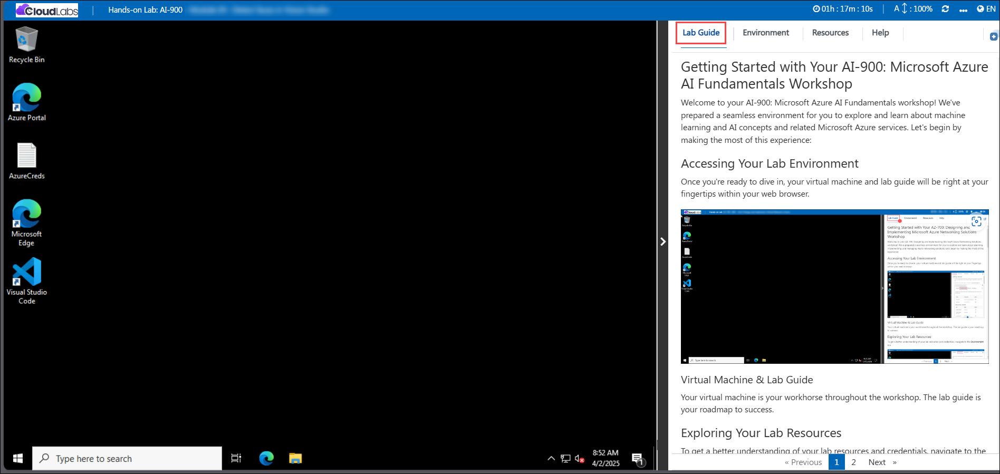

### Virtual Machine & Lab Guide
 
Your virtual machine is your workhorse throughout the workshop. The lab guide is your roadmap to success.

## Exploring Your Lab Resources
 
To get a better understanding of your lab resources and credentials, navigate to the **Environment** tab.
 
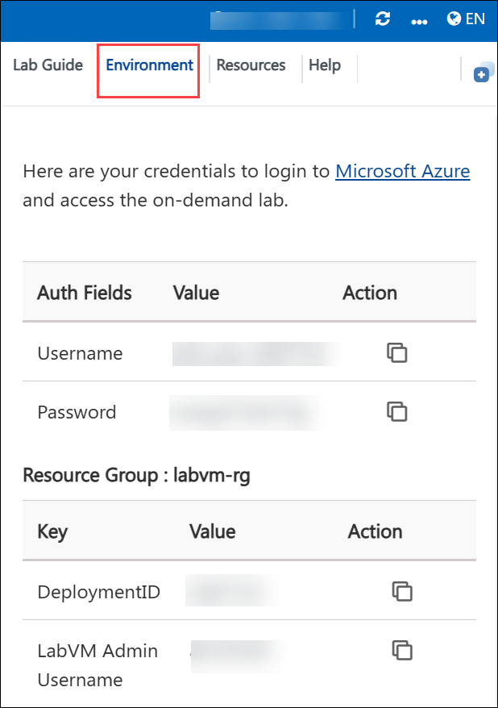

## Lab Guide Zoom In/Zoom Out
 
To adjust the zoom level for the environment page, click the **A↕: 100%** icon located next to the timer in the lab environment.

## Utilizing the Split Window Feature
 
For convenience, you can open the lab guide in a separate window by selecting the **Split Window** button from the Top right corner.
 
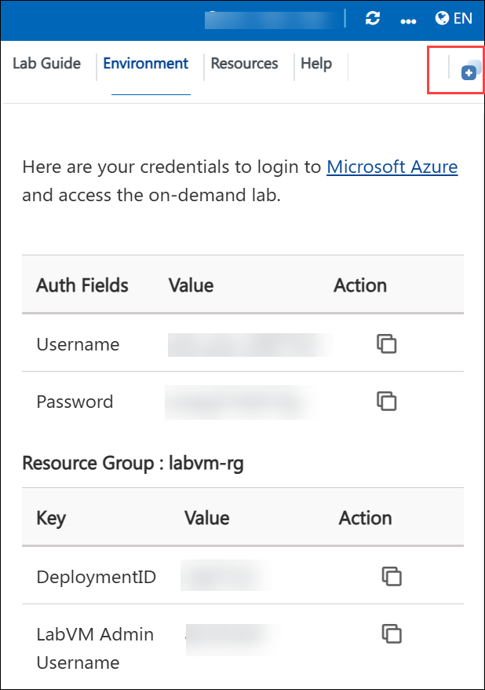

## Managing Your Virtual Machine
 
Feel free to **start, stop, or restart (2)** your virtual machine as needed from the **Resources (1)** tab. Your experience is in your hands!
 
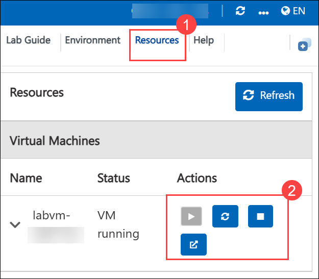

## Lab Duration Extension

1. To extend the duration of the lab, kindly click the **Hourglass** icon in the top right corner of the lab environment. 

    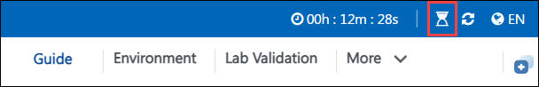

    >**Note:** You will get the **Hourglass** icon when 10 minutes are remaining in the lab.

2. Click **OK** to extend your lab duration.
 
   

3. If you have not extended the duration prior to when the lab is about to end, a pop-up will appear, giving you the option to extend. Click **OK** to proceed.

## Let's Get Started with Azure Portal
 
1. On your virtual machine, click on the Azure Portal icon as shown below:
 
   .png)

2. You'll see the **Sign into Microsoft Azure** tab. Here, enter your credentials:
 
   - **Email/Username:** <inject key="AzureAdUserEmail"></inject>
 
       
 
3. Next, provide your password:
 
   - **Password:** <inject key="AzureAdUserPassword"></inject>
 
     
 
4. If prompted to stay signed in, you can click **No**.

5. If **Action required** pop-up window appears, click on **Ask later**.
   
    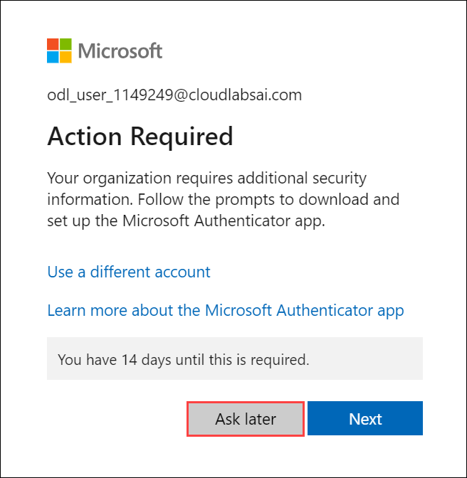
 
6. If prompted to stay signed in, you can click "No."

    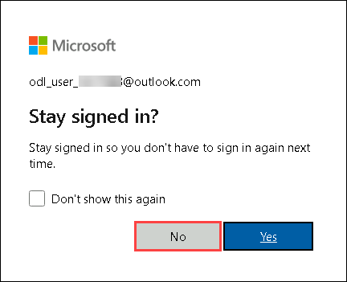
 
7. If a **Welcome to Microsoft Azure** pop-up window appears, simply click **Cancel**.

## Steps to Proceed with MFA Setup if the "Ask Later" Option is Not Visible

1. If you see the pop-up **Stay Signed in?**, click **No**.

1. If **Action required** pop-up window appears, click on **Next**.

   
   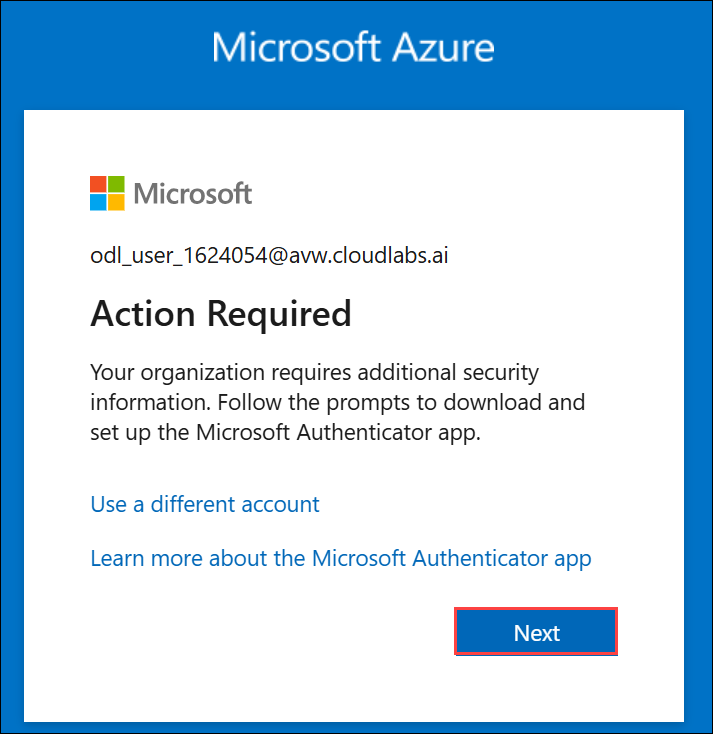

1. On **Start by getting the app** page, click on **Next**.
1. Click on **Next** twice.
1. In **android**, go to the play store and Search for **Microsoft Authenticator** and Tap on **Install**.

   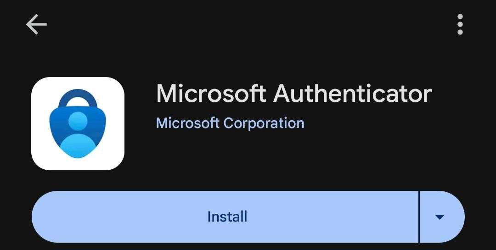

   > Note: For Ios, Open the app store and repeat the steps.

   > Note: Skip if already installed.

1. Open the app and tap on **Scan a QR code**.

1. Scan the QR code visible on the screen and click on **Next**.

   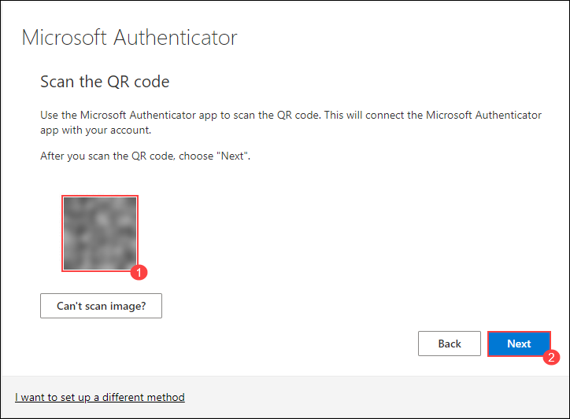

1. Enter the digit displayed on the Screen in the Authenticator app on mobile and tap on **Yes**.

1. Once the notification is approved, click on **Next**.

   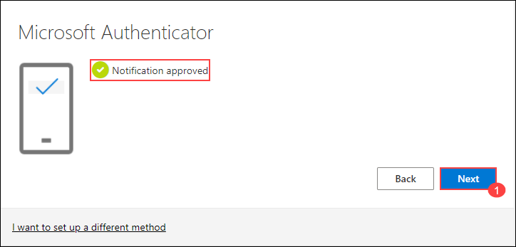

1. Click on **Done**.

1. If prompted to stay signed in, you can click **"No"**.

1. Tap on **Finish** in the Mobile Device.

   > NOTE: While logging in again, enter the digits displayed on the screen in the **Authenticator app** and click on Yes.

1. If a **Welcome to Microsoft Azure** pop-up window appears, simply click **"Cancel"** to skip the tour.

1. If you see the pop-up **You have free Azure Advisor recommendations!**, close the window to continue the lab.

## Support Contact
 
The CloudLabs support team is available 24/7, 365 days a year, via email and live chat to ensure seamless assistance at any time. We offer dedicated support channels explicitly tailored for both learners and instructors, ensuring that all your needs are promptly and efficiently addressed.
 
Learner Support Contacts:
 
- Email Support: cloudlabs-support@spektrasystems.com
- Live Chat Support: https://cloudlabs.ai/labs-support

Click on **Next** from the lower right corner to move on to the next page.

   .png)

## Happy Learning !!
