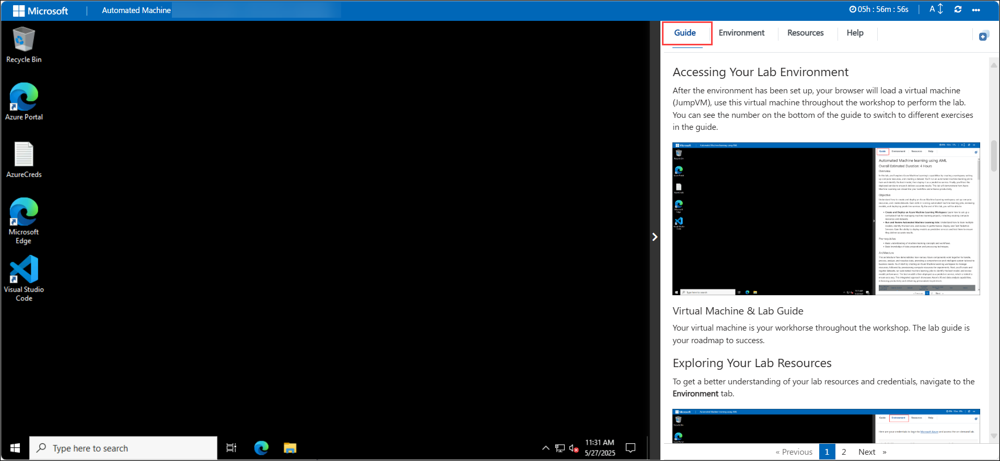
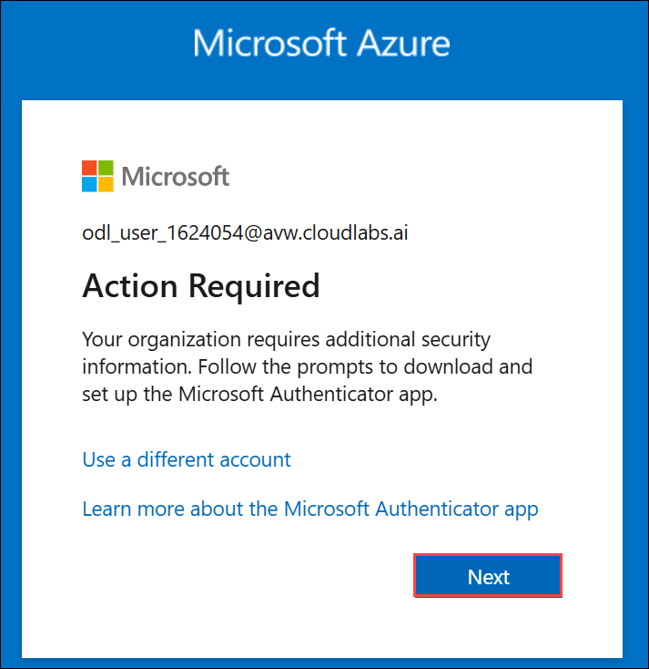

# Automated Machine learning using AML

### Overall Estimated timing: 4 hours

## Overview

In this lab, you'll explore Azure Machine Learning's capabilities by creating a workspace, setting up compute resources, and creating a dataset. You'll run an automated machine learning job to train and identify the best model, then deploy it as a predictive service. Finally, you'll test the deployed service to ensure it delivers accurate results. This lab will demonstrate how Azure Machine Learning can streamline your workflow and enhance productivity.

## Objectives

By the end of this lab, you will be able to create a workspace in Azure Machine Learning, use automated machine learning to train a predictive model, and deploy the model as a web service.

1. **Create an Azure Machine Learning workspace**: You will learn how to set up and configure an Azure Machine Learning workspace, which is the foundation for managing your machine learning resources and experiments.

2. **Run and Review Automated Machine Learning Jobs:** Understand how to train multiple models, identify the best one, and review its performance. Deploy and Test Predictive Services: Gain the ability to deploy models as predictive services and test them to ensure they deliver accurate results.

## Pre-requisites

Participants should have:

- Basic understanding of machine learning concepts and workflows.
- Basic knowledge of data preparation and processing techniques.

## Architecture

This architecture flow demonstrates how various Azure components work together to handle, process, analyze, and visualize data, providing a comprehensive and intelligent system tailored to business needs. You’ll start by creating an Azure Machine Learning workspace to manage resources, followed by provisioning compute resources for experiments. Next, you’ll create and register datasets, run automated machine learning jobs to identify the best model, and review model performance. The best model is then deployed as a predictive service, which is tested to ensure accuracy. This integrated approach showcases Azure’s AI and data analysis capabilities, enhancing productivity and delivering personalized experiences.

## Architecture Diagram

 

## Explanation of Components

The architecture for this lab involves the following key components:

- **Azure OpenAI**: This component provides access to advanced AI models from OpenAI, enabling natural language processing and other AI capabilities in applications.
- **Azure Machine Learning Workspace**: Central hub for managing machine learning resources like datasets, experiments, and models. It supports collaboration and tracks the entire ML lifecycle.
- **Compute Cluster**: A group of interconnected computers that distribute and speed up machine learning tasks. It scales dynamically based on workload.
- **Machine Learning Model**: The output of the ML process, representing learned patterns from data. It is used to make predictions or decisions based on new data.

# Getting Started with lab
 
Welcome to your Automated Machine learning using AML workshop! We've prepared a seamless environment for you to explore and learn about machine learning and AI concepts and related Microsoft Azure services. Let's begin by making the most of this experience:
 
## Accessing Your Lab Environment
 
After the environment has been set up, your browser will load a virtual machine (JumpVM), use this virtual machine throughout the workshop to perform the lab. You can see the number on the bottom of the guide to switch to different exercises in the guide.
 

### Virtual Machine & Lab Guide
 
Your virtual machine is your workhorse throughout the workshop. The lab guide is your roadmap to success.

## Exploring Your Lab Resources
 
To get a better understanding of your lab resources and credentials, navigate to the **Environment** tab.
 

## Lab Guide Zoom In/Zoom Out
 
To adjust the zoom level for the environment page, click the **A↕** icon located next to the timer in the lab environment.

## Utilizing the Split Window Feature
 
For convenience, you can open the lab guide in a separate window by selecting the **Split Window** button from the Top right corner.
 

## Managing Your Virtual Machine
 
Feel free to **start, stop, or restart (2)** your virtual machine as needed from the **Resources (1)** tab. Your experience is in your hands!
 

## Let's Get Started with Azure Portal
 
1. On your virtual machine, click on the Azure Portal icon as shown below:
 
   .png)

2. You'll see the **Sign into Microsoft Azure** tab. Here, enter your credentials:
 
   - **Email/Username:** <inject key="AzureAdUserEmail"></inject>
 
       
 
3. Next, provide your password:
 
   - **Password:** <inject key="AzureAdUserPassword"></inject>
 
     
 
4. If prompted to stay signed in, you can click **No**.

5. If **Action required** pop-up window appears, click on **Ask later**.
   
    
 
6. If prompted to stay signed in, you can click "No."

    
 
7. If a **Welcome to Microsoft Azure** pop-up window appears, simply click **Cancel**.

## Steps to Proceed with MFA Setup if the "Ask Later" Option is Not Visible

1. If you see the pop-up **Stay Signed in?**, click **No**.

1. If **Action required** pop-up window appears, click on **Next**.

   
   

1. On **Start by getting the app** page, click on **Next**.
1. Click on **Next** twice.
1. In **android**, go to the play store and Search for **Microsoft Authenticator** and Tap on **Install**.

   

   > Note: For Ios, Open the app store and repeat the steps.

   > Note: Skip if already installed.

1. Open the app and tap on **Scan a QR code**.

1. Scan the QR code visible on the screen and click on **Next**.

   

1. Enter the digit displayed on the Screen in the Authenticator app on mobile and tap on **Yes**.

1. Once the notification is approved, click on **Next**.

   

1. Click on **Done**.

1. If prompted to stay signed in, you can click **"No"**.

1. Tap on **Finish** in the Mobile Device.

   > NOTE: While logging in again, enter the digits displayed on the screen in the **Authenticator app** and click on Yes.

1. If a **Welcome to Microsoft Azure** pop-up window appears, simply click **"Cancel"** to skip the tour.

1. If you see the pop-up **You have free Azure Advisor recommendations!**, close the window to continue the lab.

## Support Contact
 
The CloudLabs support team is available 24/7, 365 days a year, via email and live chat to ensure seamless assistance at any time. We offer dedicated support channels explicitly tailored for both learners and instructors, ensuring that all your needs are promptly and efficiently addressed.
 
Learner Support Contacts:
 
- Email Support: cloudlabs-support@spektrasystems.com
- Live Chat Support: https://cloudlabs.ai/labs-support

Click on **Next** from the lower right corner to move on to the next page.

   .png)

## Happy Learning !!
