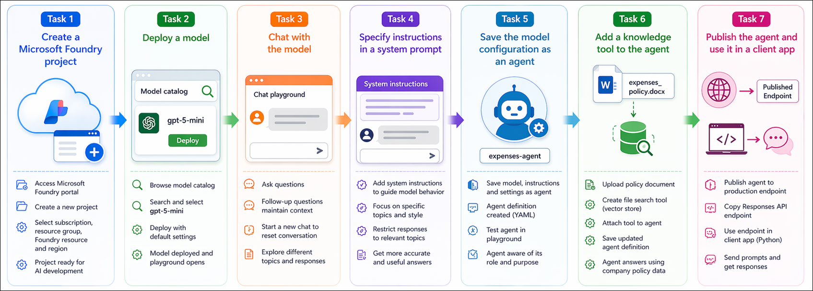

# AI-900: Microsoft Azure AI Fundamentals Workshop

Welcome to your AI-900: Microsoft Azure AI Fundamentals workshop! We're excited to guide you through hands-on learning with Azure AI services. Let’s continue by diving deeper into content moderation.

# Module 2a: Get started with generative AI and agents in Microsoft Foundry

### Overall Estimated Timing: 45 Minutes

## Overview

In this lab, you will explore Microsoft Foundry to deploy and interact with a generative AI model. You will use the chat playground to test prompts and experiment with system instructions to guide model behavior. You will then convert the model into an agent, enhance it with knowledge tools, and publish it for use in applications. This lab demonstrates how to manage AI resources, configure model behavior, and build an agentic AI solution that can be integrated into real-world applications.

## Objectives

By the end of this lab, you will be able to:

1. **Create a Microsoft Foundry project:** Set up a workspace in Microsoft Foundry to manage AI resources, access models, and build generative AI solutions.

2. **Deploy and interact with a generative AI model:** Deploy a model from the Foundry catalog and use the chat playground to test prompts and understand conversational behavior.

3. **Experiment with system prompts and instructions:** Apply and modify system prompts to control the model’s role, tone, and response scope for specific use cases.

4. **Create and configure an agent:** Convert a model into an agent by encapsulating its instructions and settings to build a task-specific AI assistant.

5. **Enhance and use the agent in applications:** Add knowledge tools to improve response accuracy, publish the agent, and integrate it into applications using APIs or SDKs.

## Pre-requisites

* Basic knowledge of Azure Portal.
* Familiarity with generative AI concepts and chat-based AI interactions.  

## Architecture

This lab demonstrates how Microsoft Foundry enables end-to-end development of generative AI solutions, from model deployment to agent creation and integration. The architecture highlights how models, agents, and knowledge tools work together to deliver an AI-powered assistant experience.

1. **Microsoft Foundry Project:** A centralized workspace used to manage AI resources, including model deployments, agents, and tools, as well as to access the model catalog and playgrounds for testing.

2. **Generative AI Model:** A model (such as GPT-5-mini) deployed from the Foundry model catalog and used for interactive chat, prompt testing, and response generation.

3. **System Prompt Configuration:** Instructions applied to the model to define its role, behavior, and response constraints, enabling it to perform specific tasks effectively.

4. **Agent Configuration:** Encapsulates the model, system instructions, and settings into a reusable agent that behaves as a task-specific AI assistant.

5. **Knowledge Tools:** External data sources, such as uploaded documents (for example, `expenses_policy.docx`), that the agent can query to provide accurate and context-aware responses.

6. **Published Agent Endpoint:** A dedicated endpoint created when the agent is published, allowing it to be accessed independently of the Foundry project for production scenarios.

7. **Client Integration:** Applications connect to the published agent using APIs or SDKs (such as Python and the OpenAI Responses API) to enable real-time AI interactions within applications or enterprise solutions.

## Architecture Diagram

## Explanation of Components

1. **Microsoft Foundry Project:** The project serves as the central workspace for managing AI resources in Microsoft Foundry. It enables you to organize model deployments, create agents, access the model catalog, and use playgrounds for testing and development.

2. **Generative AI Model:** This is the deployed model (for example, GPT-5-mini) used to power chat interactions in the playground. It generates responses based on user prompts and can be guided using system instructions and parameters.

3. **System Prompt (Instructions):** System prompts define the behavior and role of the model by providing clear instructions. They help control the tone, scope, and relevance of responses, ensuring the model aligns with specific use cases such as assisting with expense-related queries.

4. **Agent Configuration:** An agent encapsulates the model, its instructions, and configuration settings into a reusable AI entity. For example, an `expenses-agent` can consistently assist users with expense-related questions based on defined behavior.

5. **Knowledge Tools:** Knowledge tools provide additional context to the agent by connecting it to external data sources. For instance, uploading `expenses_policy.docx` enables the agent to retrieve and use company policy information to generate accurate and context-aware responses.

6. **Agent Publishing Endpoint:** When an agent is published, it is exposed through a dedicated endpoint that allows it to be accessed independently of the Foundry project, making it suitable for production use.

7. **Client Integration:** Applications interact with the published agent using APIs or SDKs (such as Python with the OpenAI Responses API). This enables integration into applications, bots, or enterprise solutions for real-time AI-driven assistance.

# Getting Started with lab
 
Welcome to your AI-900: Microsoft Azure AI Fundamentals workshop! We've prepared a seamless environment for you to explore and learn about machine learning and AI concepts and related Microsoft Azure services. Let's begin by making the most of this experience:
 
## Accessing Your Lab Environment
 
Once you're ready to dive in, your virtual machine and **Guide** will be right at your fingertips within your web browser.
 

### Virtual Machine & Lab Guide
 
Your virtual machine is your workhorse throughout the workshop. The lab guide is your roadmap to success.

## Exploring Your Lab Resources
 
To get a better understanding of your lab resources and credentials, navigate to the **Environment** tab.
 

## Lab Guide Zoom In/Zoom Out
 
To adjust the zoom level for the environment page, click the **A↕: 100%** icon located next to the timer in the lab environment.

## Utilizing the Split Window Feature
 
For convenience, you can open the lab guide in a separate window by selecting the **Split Window** button from the Top right corner.
 

## Managing Your Virtual Machine
 
Feel free to **Start, Stop, or Restart (2)** your virtual machine as needed from the **Resources (1)** tab. Your experience is in your hands!
 

## Track Your Progress

Click on the **Progress** tab to track your progress in the lab. The percentage increases as you complete each validation and reaches 100% when all validations are successfully completed.  

On the **Progress (1)** tab, you can view your overall points and validation status, **Validations 0/1 (2)**.    

## Lab Duration Extension

1. To extend the duration of the lab, kindly click the **Hourglass** icon in the top right corner of the lab environment. 

    

    >**Note:** You will get the **Hourglass** icon when 10 minutes are remaining in the lab.

2. Click **OK** to extend your lab duration.
 
   

3. If you have not extended the duration prior to when the lab is about to end, a pop-up will appear, giving you the option to extend. Click **OK** to proceed.

## Let's Get Started with Azure Portal
 
1. On your virtual machine, click on the Azure Portal icon as shown below:
 
   .png)

2. You'll see the **Sign into Microsoft Azure** tab. Here, enter your credentials:
 
   - **Email/Username:** <inject key="AzureAdUserEmail"></inject>
 
       
 
3. Next, provide your password:
 
   - **Temporary Access Pass:** <inject key="AzureAdUserPassword"></inject>
 
     
 
4. If prompted to stay signed in, you can click **No**.

    
 
7. If a **Welcome to Microsoft Azure** pop-up window appears, simply click **Maybe later**.

    

## Support Contact
 
The CloudLabs support team is available 24/7, 365 days a year, via email and live chat to ensure seamless assistance at any time. We offer dedicated support channels explicitly tailored for both learners and instructors, ensuring that all your needs are promptly and efficiently addressed.
 
Learner Support Contacts:
 
- Email Support: cloudlabs-support@spektrasystems.com
- Live Chat Support: https://cloudlabs.ai/labs-support

Click on **Next** from the lower right corner to move on to the next page.

   .png)

## Happy Learning !!
