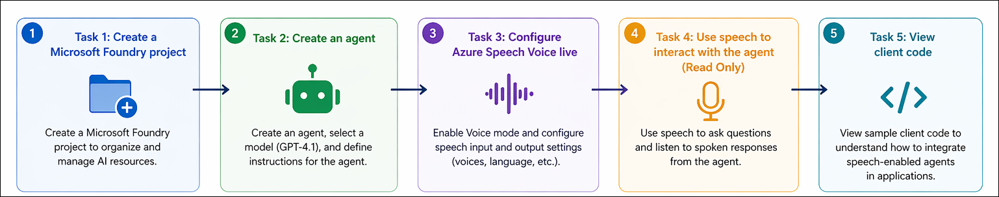
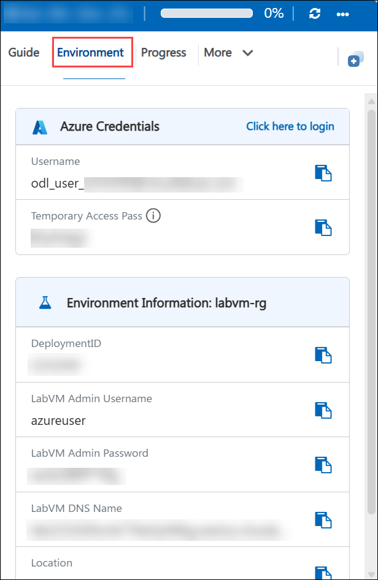
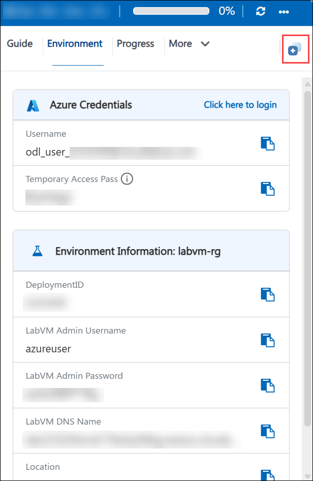

# AI-900: Microsoft Azure AI Fundamentals Workshop

Welcome to your AI-900: Microsoft Azure AI Fundamentals workshop! We're excited to guide you through hands-on learning with Azure AI services. Let’s continue by diving deeper into content moderation.

# Module 4a: Get started with speech in Microsoft Foundry

### Overall Estimated Duration: 30 Minutes

## Overview

In this lab, you will explore Microsoft Foundry to create and interact with a speech-enabled AI agent. You will configure Azure Speech – Voice Live to enable real-time speech-to-text and text-to-speech capabilities, experiment with voice settings and system instructions, and observe how voice interactions are handled in the agent playground. You will also review client code to understand how speech-enabled AI agents can be integrated into applications for real-time conversational experiences.

## Objectives

By the end of this lab, you will be able to:

1. **Create a Microsoft Foundry project:** Set up a workspace in Microsoft Foundry to manage AI resources for building a speech-enabled solution.
2. **Create and configure an agent:** Create an agent, select a generative AI model, and define its behavior using system instructions.
3. **Enable Azure Speech – Voice Live:** Configure voice capabilities for the agent by enabling speech input and output settings.
4. **Explore speech-based interaction:** Understand how speech-to-text and text-to-speech enable real-time voice interaction with the agent.
5. **Review client code for voice-enabled agents:** Examine sample code to understand how speech services and agents are integrated into applications.

## Pre-requisites

* Basic knowledge of the Azure portal.
* Familiarity with generative AI concepts and chat-based AI interactions.
* Basic understanding of speech-based AI concepts such as speech-to-text and text-to-speech.  

## Architecture

This lab demonstrates how Microsoft Foundry integrates generative AI models with Azure Speech - Voice Live to enable real-time, voice-based interactions through an agent. The architecture highlights how the agent, speech services, and client applications work together to create a conversational voice-enabled AI experience.

1. **Microsoft Foundry Project:** A centralized workspace used to manage AI resources, including agents, models, and configurations required for building speech-enabled AI solutions.

2. **Generative AI Model (GPT-4.1):** The model selected within the agent to generate conversational responses based on user input and system instructions.

3. **Agent Configuration:** Encapsulates the model, system instructions, and voice settings into a unified AI entity that defines the assistant’s behavior and capabilities.

4. **Azure Speech – Voice Live Service:** Provides real-time speech-to-text and text-to-speech functionality, enabling seamless voice interaction with the agent.

5. **Agent Playground (Voice Mode):** A browser-based interface where voice mode is enabled, allowing users to interact with the agent using speech and receive audio responses.

6. **Client Code and APIs:** Sample code and SDKs that demonstrate how to connect to the agent, handle audio streaming, and integrate voice-enabled AI interactions into applications.
 
## Architecture Diagram

## Explanation of Components

1. **Microsoft Foundry Project:**
   The project serves as the central workspace for managing AI resources and accessing Foundry tools. It provides a unified environment to organize settings, create agents, select models, and use the playground for experimentation.

2. **Generative AI Model (GPT-4.1):**
   This is the language model used by the agent to generate responses. It processes input (including speech converted to text) and can be configured with system instructions to control behavior and output.

3. **Agent Configuration:**
   The agent encapsulates the model, system instructions, and voice settings into a single AI entity. It defines how the assistant behaves and ensures consistent, task-specific responses.

4. **Azure Speech - Voice Live Service:**
   This service enables real-time speech capabilities by providing speech-to-text and text-to-speech functionality. It converts spoken input into text for the model and transforms model responses into natural-sounding speech.

5. **Agent Playground (Voice Mode):**
   A browser-based interface where voice mode is enabled, allowing users to interact with the agent using speech and view responses in both audio and text formats.

6. **Client Code and APIs:**
   Sample code and SDKs demonstrate how to integrate the speech-enabled agent into applications, handling authentication, real-time audio streaming, and interaction with the agent.

# Getting Started with lab
 
Welcome to your AI-900: Microsoft Azure AI Fundamentals workshop! We've prepared a seamless environment for you to explore and learn about machine learning and AI concepts and related Microsoft Azure services. Let's begin by making the most of this experience:
 
## Accessing Your Lab Environment
 
Once you're ready to dive in, your virtual machine and **Guide** will be right at your fingertips within your web browser.
 

### Virtual Machine & Lab Guide
 
Your virtual machine is your workhorse throughout the workshop. The lab guide is your roadmap to success.

## Exploring Your Lab Resources
 
To get a better understanding of your lab resources and credentials, navigate to the **Environment** tab.
 

## Lab Guide Zoom In/Zoom Out
 
To adjust the zoom level for the environment page, click the **A↕: 100%** icon located next to the timer in the lab environment.

## Utilizing the Split Window Feature
 
For convenience, you can open the lab guide in a separate window by selecting the **Split Window** button from the Top right corner.
 

## Managing Your Virtual Machine
 
Feel free to **Start, Stop, or Restart (2)** your virtual machine as needed from the **Resources (1)** tab. Your experience is in your hands!
 

## Track Your Progress

Click on the **Progress** tab to track your progress in the lab. The percentage increases as you complete each validation and reaches 100% when all validations are successfully completed.  

On the **Progress (1)** tab, you can view your overall points and validation status, **Validations 0/1 (2)**.    

## Lab Duration Extension

1. To extend the duration of the lab, kindly click the **Hourglass** icon in the top right corner of the lab environment. 

    

    >**Note:** You will get the **Hourglass** icon when 10 minutes are remaining in the lab.

2. Click **OK** to extend your lab duration.
 
   

3. If you have not extended the duration prior to when the lab is about to end, a pop-up will appear, giving you the option to extend. Click **OK** to proceed.

## Let's Get Started with Azure Portal
 
1. On your virtual machine, click on the Azure Portal icon as shown below:
 
   .png)

2. You'll see the **Sign into Microsoft Azure** tab. Here, enter your credentials:
 
   - **Email/Username:** <inject key="AzureAdUserEmail"></inject>
 
       
 
3. Next, provide your password:
 
   - **Temporary Access Pass:** <inject key="AzureAdUserPassword"></inject>
 
     
 
4. If prompted to stay signed in, you can click **No**.

    
 
7. If a **Welcome to Microsoft Azure** pop-up window appears, simply click **Maybe later**.

    

## Support Contact
 
The CloudLabs support team is available 24/7, 365 days a year, via email and live chat to ensure seamless assistance at any time. We offer dedicated support channels explicitly tailored for both learners and instructors, ensuring that all your needs are promptly and efficiently addressed.
 
Learner Support Contacts:
 
- Email Support: cloudlabs-support@spektrasystems.com
- Live Chat Support: https://cloudlabs.ai/labs-support

Click on **Next** from the lower right corner to move on to the next page.

   .png)

## Happy Learning !!
