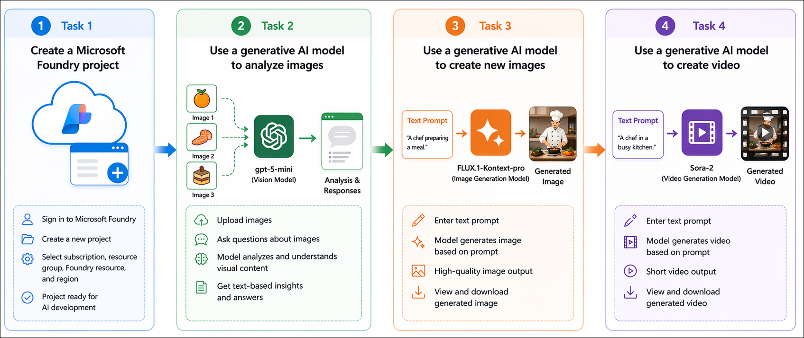

# AI-900: Microsoft Azure AI Fundamentals Workshop

Welcome to your AI-900: Microsoft Azure AI Fundamentals workshop! We're excited to guide you through hands-on learning with Azure AI services. Let’s continue by diving deeper into content moderation.

# Module 5a: Get started with computer vision in Microsoft Foundry

### Overall Estimated Timing: 60 Minutes

## Overview

In this lab, you will explore Microsoft Foundry to deploy and interact with vision-enabled generative AI models. You will analyze images, generate new images from text prompts, and create videos using generative AI. The lab demonstrates how to manage AI resources, work with visual data, and build applications that understand and generate visual content.

## Objectives

By the end of this lab, you will be able to:

1. **Create a Microsoft Foundry project:** Set up a workspace in Microsoft Foundry to organize AI resources, models, and services used in generative AI and computer vision scenarios.

2. **Analyze images with a vision-enabled generative AI model:** Deploy and use a model in the playground to interpret uploaded images and generate text-based responses.

3. **Generate images from text prompts:** Deploy an image-generation model and create new images based on descriptive prompts.

4. **Generate videos from text prompts:** Deploy a video-generation model and generate short videos from natural language descriptions.

5. **Review sample code for multimodal AI scenarios:** Explore example code to understand how image analysis, image generation, and video generation can be integrated into applications.

## Pre-requisites

* Basic knowledge of Azure Portal.
* Familiarity with generative AI concepts and chat-based AI interactions.  

## Architecture

This lab demonstrates how Microsoft Foundry supports deploying and using vision-enabled generative AI models for image understanding, image generation, and video generation. The architecture shows how project resources, deployed models, and playground experiences interact to enable computer vision scenarios.

1. **Microsoft Foundry Project:** A workspace used to organize AI resources, manage model deployments, and support computer vision workloads throughout the lab.

2. **Image Analysis with Generative AI:** A vision-enabled model such as **gpt-5-mini** is deployed and used in the chat playground to analyze uploaded images and return text-based responses from visual content.

3. **Image Generation Models:** An image generation model such as **FLUX.1-Kontext-pro** is deployed to generate new images from natural language prompts using the image playground.

4. **Video Generation Models:** A video generation model such as **Sora-2** is deployed to generate short videos from prompts using the video playground.

5. **Prompting and Client Integration:** Prompts, model settings, and sample API code demonstrate how these capabilities can be tested in the playground and integrated into custom applications using OpenAI APIs.

## Architecture Diagram

## Explanation of Components

1. **Microsoft Foundry Project:**
   The project serves as the central workspace for managing AI resources, model deployments, and services used throughout the lab. It provides access to the model catalog, playgrounds, and supporting resources for multimodal experimentation.

2. **Image Analysis Model:**
   A vision-enabled generative AI model such as **gpt-5-mini** is deployed to analyze uploaded images and generate text-based responses, enabling image understanding through natural language interaction.

3. **Image Generation Model:**
   An image generation model such as **FLUX.1-Kontext-pro** uses text prompts to create new images, allowing users to generate visual content from descriptive input.

4. **Video Generation Model:**
   A video generation model such as **Sora-2** generates short videos from natural language prompts, extending generative AI capabilities beyond static images.

5. **Playgrounds, Prompts, and Client Integration:**
   Foundry playgrounds provide no-code environments to test prompts and model behavior, while sample APIs and SDKs demonstrate how image analysis, image generation, and video generation can be integrated into custom applications.

# Getting Started with lab
 
Welcome to your AI-900: Microsoft Azure AI Fundamentals workshop! We've prepared a seamless environment for you to explore and learn about machine learning and AI concepts and related Microsoft Azure services. Let's begin by making the most of this experience:
 
## Accessing Your Lab Environment
 
Once you're ready to dive in, your virtual machine and **Guide** will be right at your fingertips within your web browser.
 

### Virtual Machine & Lab Guide
 
Your virtual machine is your workhorse throughout the workshop. The lab guide is your roadmap to success.

## Exploring Your Lab Resources
 
To get a better understanding of your lab resources and credentials, navigate to the **Environment** tab.
 

## Lab Guide Zoom In/Zoom Out
 
To adjust the zoom level for the environment page, click the **A↕: 100%** icon located next to the timer in the lab environment.

## Utilizing the Split Window Feature
 
For convenience, you can open the lab guide in a separate window by selecting the **Split Window** button from the Top right corner.
 

## Managing Your Virtual Machine
 
Feel free to **Start, Stop, or Restart (2)** your virtual machine as needed from the **Resources (1)** tab. Your experience is in your hands!
 

## Track Your Progress

Click on the **Progress** tab to track your progress in the lab. The percentage increases as you complete each validation and reaches 100% when all validations are successfully completed.  

On the **Progress (1)** tab, you can view your overall points and validation status, **Validations 0/1 (2)**.    

## Lab Duration Extension

1. To extend the duration of the lab, kindly click the **Hourglass** icon in the top right corner of the lab environment. 

    

    >**Note:** You will get the **Hourglass** icon when 10 minutes are remaining in the lab.

2. Click **OK** to extend your lab duration.
 
   

3. If you have not extended the duration prior to when the lab is about to end, a pop-up will appear, giving you the option to extend. Click **OK** to proceed.

## Let's Get Started with Azure Portal
 
1. On your virtual machine, click on the Azure Portal icon as shown below:
 
   .png)

2. You'll see the **Sign into Microsoft Azure** tab. Here, enter your credentials:
 
   - **Email/Username:** <inject key="AzureAdUserEmail"></inject>
 
       
 
3. Next, provide your password:
 
   - **Temporary Access Pass:** <inject key="AzureAdUserPassword"></inject>
 
     
 
4. If prompted to stay signed in, you can click **No**.

    
 
7. If a **Welcome to Microsoft Azure** pop-up window appears, simply click **Maybe later**.

    

## Support Contact
 
The CloudLabs support team is available 24/7, 365 days a year, via email and live chat to ensure seamless assistance at any time. We offer dedicated support channels explicitly tailored for both learners and instructors, ensuring that all your needs are promptly and efficiently addressed.
 
Learner Support Contacts:
 
- Email Support: cloudlabs-support@spektrasystems.com
- Live Chat Support: https://cloudlabs.ai/labs-support

Click on **Next** from the lower right corner to move on to the next page.

   .png)

## Happy Learning !!
