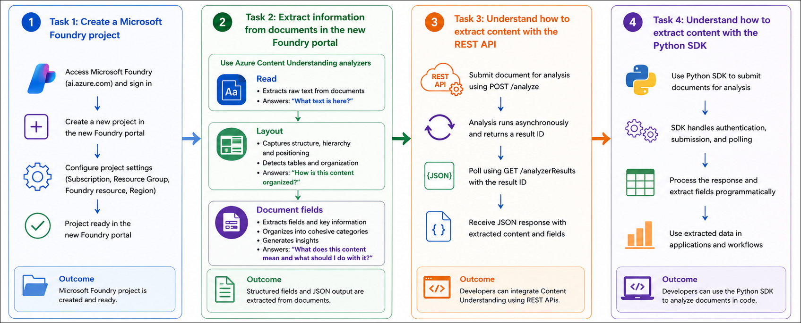
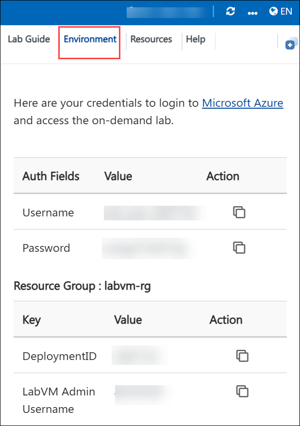
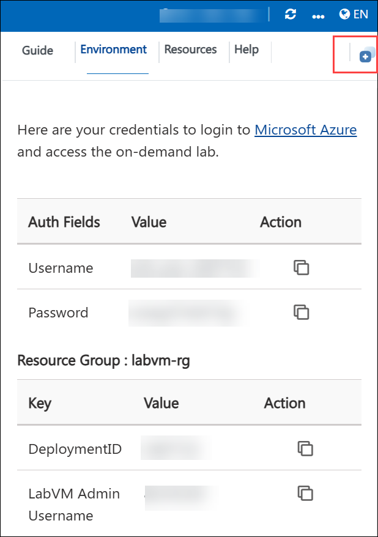
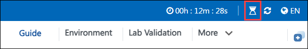

# AI-900: Microsoft Azure AI Fundamentals Workshop

Welcome to your AI-900: Microsoft Azure AI Fundamentals workshop! We're excited to guide you through hands-on learning with Azure AI services. Let’s continue by diving deeper into content moderation.

# Module 6a: Get started with information extraction in Microsoft Foundry

### Overall Estimated Timing: 30 Minutes

## Overview

In this lab, you will explore how to use Microsoft Foundry and Azure Content Understanding to extract structured information from documents. You will create a Foundry project and use different Content Understanding analyzers, including **Read**, **Layout**, and **Document fields**, to process and analyze invoice and sample documents in the Foundry portal.

You will review extracted fields and JSON output, and understand how document analysis can be performed programmatically using REST APIs and the Python SDK. This lab demonstrates how AI-powered document analysis can automate information extraction from unstructured business documents.

## Objectives

By the end of this lab, you will be able to:

1. **Create a Microsoft Foundry project:** Set up and configure a Foundry project to manage resources and enable Azure Content Understanding capabilities.

2. **Use Azure Content Understanding analyzers in the Foundry portal:** Explore and test the Read, Layout, and Document fields analyzers in the new Microsoft Foundry portal.

3. **Extract structured information from documents:** Analyze invoice and sample documents to extract raw text, layout information, tables, and structured fields.

4. **Review extracted fields and JSON output:** Examine the structured results generated by the analyzers and understand how extracted data is represented in JSON format.

5. **Understand REST API-based document analysis:** Learn how documents can be submitted and processed programmatically using asynchronous REST API calls.

6. **Understand Python SDK integration:** Review how developers can use the Python SDK to analyze documents and process extracted content programmatically.

## Pre-requisites

- Basic knowledge of the Azure portal and navigating cloud resources.
- Familiarity with REST APIs and basic command-line usage.
- General understanding of generative AI and document processing concepts.

## Architecture

This lab demonstrates how Microsoft Foundry and Azure Content Understanding work together to extract structured information from documents using analyzers, REST APIs, and the Python SDK. The architecture highlights how documents are processed through different analyzer capabilities to generate structured outputs and developer integrations.

1. **Microsoft Foundry Project:** A centralized workspace used to manage AI resources, deployed models, configurations, and Content Understanding services required for document analysis workflows.

2. **Azure Content Understanding Analyzers:** AI-powered analyzers that process documents to extract text, structure, fields, and insights from unstructured content.

3. **Read Analyzer:** Extracts raw text content from documents and answers the question, _“What text is here?”_ without interpreting structure or meaning.

4. **Layout Analyzer:** Identifies document structure, hierarchy, positioning, and tables to answer the question, _“How is this content organized?”_

5. **Document Fields Analyzer:** Extracts structured fields, organizes related information into categories, and generates insights to answer the question, _“What does this content mean and what should I do with it?”_

6. **Model Deployments:** Additional AI models, such as chat completion and embedding models, that support advanced extraction and analysis capabilities required by certain analyzers.

7. **Foundry Portal Experience:** A browser-based interface used to upload documents, run analyzers, review extracted fields, and inspect raw JSON responses generated during analysis.

8. **REST API Integration:** API endpoints used to submit documents for asynchronous analysis, poll operation status, and retrieve structured JSON results programmatically.

9. **Python SDK Integration:** SDK-based developer workflow that enables applications to analyze documents, process extracted fields, and integrate structured outputs into automated business solutions.

10. **Structured Output and Insights:** Final outputs including extracted fields, document structure, JSON results, and actionable insights that can be integrated into downstream workflows and applications.

## Architecture Diagram

## Explanation of Components

1. **Microsoft Foundry Project:**
   The project acts as the central workspace for organizing AI resources, configurations, deployed models, and services used for document analysis and Content Understanding workflows.

2. **Azure Content Understanding Service:**
   This service analyzes documents and extracts structured information from unstructured content using AI-powered analyzers such as Read, Layout, and Document fields.

3. **Read Analyzer:**
   Extracts raw text content from documents without interpreting structure or meaning, helping identify the text present in the document.

4. **Layout Analyzer:**
   Identifies document structure, hierarchy, positioning, and tables to understand how the content is organized within the document.

5. **Document Fields Analyzer:**
   Extracts key fields and structured information from documents, organizes related content into categories, and generates insights from the analyzed data.

6. **Model Deployments:**
   Additional AI models, such as chat completion and embedding models, may be deployed to support advanced extraction and analysis capabilities required by Content Understanding analyzers.

7. **Foundry Portal Experience:**
   A browser-based interface used to upload documents, run analyzers, review extracted fields, and inspect the structured JSON output generated during analysis.

8. **Extracted Results (JSON Output):**
   Structured responses generated by the analyzers that contain extracted fields, layout details, tables, and metadata, which can be consumed by applications for downstream processing.

9. **REST API Layer:**
   Provides endpoints for submitting documents for asynchronous analysis and retrieving analysis results programmatically using HTTP requests.

10. **Python SDK Integration:**
    Enables developers to analyze documents, process extracted content, and integrate Content Understanding capabilities into applications using Python-based workflows.

# Getting Started with lab

Welcome to your AI-900: Microsoft Azure AI Fundamentals workshop! We've prepared a seamless environment for you to explore and learn about machine learning and AI concepts and related Microsoft Azure services. Let's begin by making the most of this experience:

## Accessing Your Lab Environment

Once you're ready to dive in, your virtual machine and **Guide** will be right at your fingertips within your web browser.

### Virtual Machine & Lab Guide

Your virtual machine is your workhorse throughout the workshop. The lab guide is your roadmap to success.

## Exploring Your Lab Resources

To get a better understanding of your lab resources and credentials, navigate to the **Environment** tab.

## Lab Guide Zoom In/Zoom Out

To adjust the zoom level for the environment page, click the **A↕: 100%** icon located next to the timer in the lab environment.

## Utilizing the Split Window Feature

For convenience, you can open the lab guide in a separate window by selecting the **Split Window** button from the Top right corner.

## Managing Your Virtual Machine

Feel free to **Start, Stop, or Restart (2)** your virtual machine as needed from the **Resources (1)** tab. Your experience is in your hands!

## Track Your Progress

Click on the **Progress** tab to track your progress in the lab. The percentage increases as you complete each validation and reaches 100% when all validations are successfully completed.

On the **Progress (1)** tab, you can view your overall points and validation status, **Validations 0/1 (2)**.

## Lab Duration Extension

1. To extend the duration of the lab, kindly click the **Hourglass** icon in the top right corner of the lab environment.

   

   > **Note:** You will get the **Hourglass** icon when 10 minutes are remaining in the lab.

2. Click **OK** to extend your lab duration.

   

3. If you have not extended the duration prior to when the lab is about to end, a pop-up will appear, giving you the option to extend. Click **OK** to proceed.

## Let's Get Started with Azure Portal

1. On your virtual machine, click on the Azure Portal icon as shown below:

   .png>)

2. You'll see the **Sign into Microsoft Azure** tab. Here, enter your credentials:
   - **Email/Username:** <inject key="AzureAdUserEmail"></inject>

     

3. Next, provide your password:
   - **Temporary Access Pass:** <inject key="AzureAdUserPassword"></inject>

     

4. If prompted to stay signed in, you can click **No**.

   

5. If a **Welcome to Microsoft Azure** pop-up window appears, simply click **Maybe later**.

   

## Support Contact

The CloudLabs support team is available 24/7, 365 days a year, via email and live chat to ensure seamless assistance at any time. We offer dedicated support channels explicitly tailored for both learners and instructors, ensuring that all your needs are promptly and efficiently addressed.

Learner Support Contacts:

- Email Support: cloudlabs-support@spektrasystems.com
- Live Chat Support: https://cloudlabs.ai/labs-support

Click on **Next** from the lower right corner to move on to the next page.

.png>)

## Happy Learning !!
