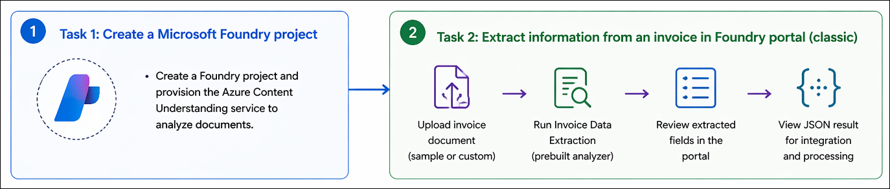

# AI-900: Microsoft Azure AI Fundamentals Workshop

Welcome to your AI-900: Microsoft Azure AI Fundamentals workshop! We're excited to guide you through hands-on learning with Azure AI services. Let’s continue by diving deeper into content moderation.

# Module 6a: Get started with information extraction in Microsoft Foundry

### Overall Estimated Timing: 30 Minutes

## Overview

In this lab, you will explore Microsoft Foundry and Azure Content Understanding to extract structured information from documents. You will create a Foundry project and use the prebuilt invoice analyzer in the portal to process and analyze invoice data. You will review the extracted fields and JSON output, and understand how document analysis can be performed programmatically using REST APIs. This lab demonstrates how to automate information extraction from business documents using AI.

## Objectives

By the end of this lab, you will be able to:

1. **Create a Microsoft Foundry project:** Set up and configure a Foundry project to organize resources and access Azure Content Understanding.
2. **Use Azure Content Understanding in the portal:** Navigate the Foundry portal (classic) to access the Content Understanding experience.
3. **Extract invoice data using a prebuilt analyzer:** Use the prebuilt invoice analyzer to process documents and extract structured information.
4. **Review extracted results and JSON output:** Analyze the extracted fields and understand the structured JSON response generated by the service.
5. **Perform document analysis using REST APIs:** Submit documents for analysis and retrieve results programmatically using REST API calls.

## Pre-requisites

* Basic knowledge of the Azure portal and navigating cloud resources.
* Familiarity with REST APIs and basic command-line usage.
* General understanding of generative AI and document processing concepts.

## Architecture

This lab demonstrates how Microsoft Foundry and Azure Content Understanding work together to extract structured information from documents using both the portal experience and REST APIs. The architecture highlights how projects, analyzers, and client applications interact to enable document understanding scenarios.

1. **Microsoft Foundry Project:** A centralized workspace to manage AI resources, configurations, and services required for Content Understanding workflows.

2. **Azure Content Understanding Service:** A service that analyzes documents and extracts structured data using prebuilt analyzers, such as the invoice analyzer.

3. **Prebuilt Invoice Analyzer:** A ready-to-use analyzer that processes invoice documents and identifies key fields such as vendor details, dates, totals, and line items.

4. **Foundry Portal (Classic):** A browser-based interface used to upload documents, run analysis, and review extracted fields along with structured JSON results.

5. **REST API Layer:** Endpoints used to submit documents for analysis and retrieve results asynchronously, enabling programmatic integration.

6. **Client Applications / Tools:** Scripts, command-line tools, or applications that call the REST APIs to automate document processing and integrate extracted data into business workflows.

## Architecture Diagram

## Explanation of Components

1. **Microsoft Foundry Project:**
   The project serves as the central workspace for organizing AI resources, configurations, and services used in the lab. It provides access to Azure Content Understanding and enables management of project-level settings.

2. **Azure Content Understanding Service:**
   This service analyzes documents and extracts structured information using prebuilt analyzers, such as the invoice analyzer, to identify key fields and data from unstructured content.

3. **Prebuilt Invoice Analyzer:**
   A ready-to-use analyzer within Content Understanding that processes invoice documents and extracts relevant details such as vendor information, dates, totals, and line items.

4. **Foundry Portal (Classic):**
   A browser-based interface used to upload documents, run the Content Understanding analyzer, and review extracted fields along with the structured JSON output.

5. **Extracted Results (JSON Output):**
   The structured response generated by the analyzer, containing extracted fields and values, which can be consumed by applications for further processing.

6. **REST API Layer:**
   Provides endpoints to submit documents for analysis and retrieve results asynchronously, enabling developers to integrate Content Understanding capabilities into applications programmatically.

# Getting Started with lab
 
Welcome to your AI-900: Microsoft Azure AI Fundamentals workshop! We've prepared a seamless environment for you to explore and learn about machine learning and AI concepts and related Microsoft Azure services. Let's begin by making the most of this experience:
 
## Accessing Your Lab Environment
 
Once you're ready to dive in, your virtual machine and **Guide** will be right at your fingertips within your web browser.
 

### Virtual Machine & Lab Guide
 
Your virtual machine is your workhorse throughout the workshop. The lab guide is your roadmap to success.

## Exploring Your Lab Resources
 
To get a better understanding of your lab resources and credentials, navigate to the **Environment** tab.
 

## Lab Guide Zoom In/Zoom Out
 
To adjust the zoom level for the environment page, click the **A↕: 100%** icon located next to the timer in the lab environment.

## Utilizing the Split Window Feature
 
For convenience, you can open the lab guide in a separate window by selecting the **Split Window** button from the Top right corner.
 

## Managing Your Virtual Machine
 
Feel free to **Start, Stop, or Restart (2)** your virtual machine as needed from the **Resources (1)** tab. Your experience is in your hands!
 

## Track Your Progress

Click on the **Progress** tab to track your progress in the lab. The percentage increases as you complete each validation and reaches 100% when all validations are successfully completed.  

On the **Progress (1)** tab, you can view your overall points and validation status, **Validations 0/1 (2)**.    

## Lab Duration Extension

1. To extend the duration of the lab, kindly click the **Hourglass** icon in the top right corner of the lab environment. 

    

    >**Note:** You will get the **Hourglass** icon when 10 minutes are remaining in the lab.

2. Click **OK** to extend your lab duration.
 
   

3. If you have not extended the duration prior to when the lab is about to end, a pop-up will appear, giving you the option to extend. Click **OK** to proceed.

## Let's Get Started with Azure Portal
 
1. On your virtual machine, click on the Azure Portal icon as shown below:
 
   .png)

2. You'll see the **Sign into Microsoft Azure** tab. Here, enter your credentials:
 
   - **Email/Username:** <inject key="AzureAdUserEmail"></inject>
 
       
 
3. Next, provide your password:
 
   - **Temporary Access Pass:** <inject key="AzureAdUserPassword"></inject>
 
     
 
4. If prompted to stay signed in, you can click **No**.

    
 
7. If a **Welcome to Microsoft Azure** pop-up window appears, simply click **Maybe later**.

    

## Support Contact
 
The CloudLabs support team is available 24/7, 365 days a year, via email and live chat to ensure seamless assistance at any time. We offer dedicated support channels explicitly tailored for both learners and instructors, ensuring that all your needs are promptly and efficiently addressed.
 
Learner Support Contacts:
 
- Email Support: cloudlabs-support@spektrasystems.com
- Live Chat Support: https://cloudlabs.ai/labs-support

Click on **Next** from the lower right corner to move on to the next page.

   .png)

## Happy Learning !!
