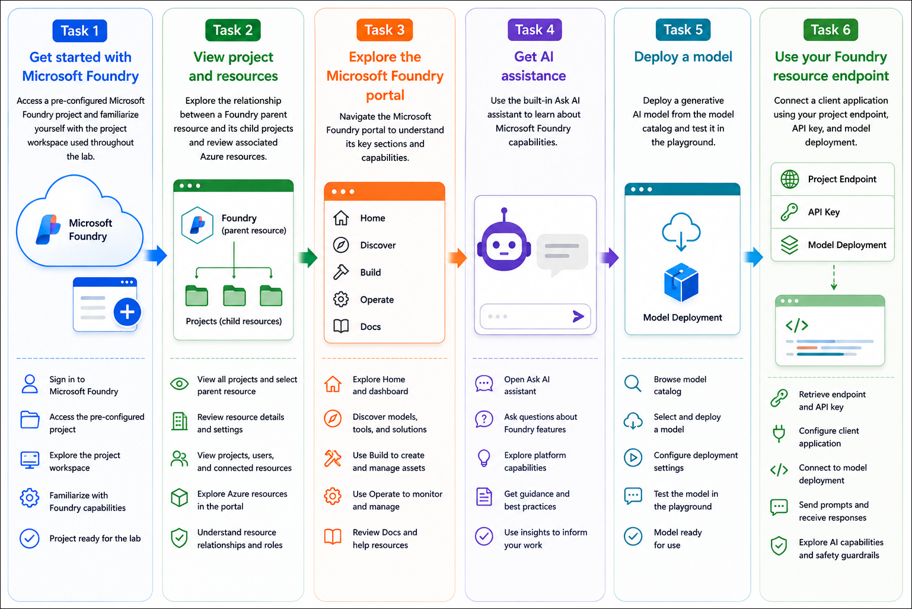

# AI-901: Microsoft Azure AI Fundamentals Workshop

Welcome to your AI-901: Microsoft Azure AI Fundamentals workshop! We've prepared a seamless environment for you to explore and learn Azure Services. Let's begin by making the most of this experience.

# Get started with Microsoft Foundry

### Overall Estimated timing: 45 Minutes

## Overview

In this hands-on lab, you will explore the Microsoft Foundry development experience by using a pre-configured Microsoft Foundry resource and project. You will learn how Microsoft Foundry projects are organized within a parent resource, navigate the Foundry portal, and examine the Azure resources associated with your project.

You will use the built-in Ask AI assistant to explore Microsoft Foundry capabilities, deploy a generative AI model from the model catalog, and test the deployed model in the playground. You will then configure a sample client application using your project endpoint, API key, and model deployment to connect to your deployed model.

Finally, you will interact with the application to explore a variety of AI capabilities, including conversational AI, text summarization, entity extraction, speech, computer vision, information extraction, and built-in responsible AI safety guardrails. By the end of this lab, you will understand how Microsoft Foundry provides a unified platform for deploying, managing, and integrating AI models into intelligent applications.

## Objectives

By the end of this lab, you will be able to explore and use a pre-configured **Microsoft Foundry** project, deploy a generative AI model, and connect an application to the deployed model using project credentials.

1. **Explore a Microsoft Foundry project**: Access a pre-configured Microsoft Foundry project and understand how projects are organized within a parent Foundry resource.

2. **Explore the Microsoft Foundry portal**: Navigate the Discover, Build, Operate, and Docs sections to understand the tools and capabilities available for AI development and management.

3. **Deploy and test a generative AI model**: Deploy a model from the Microsoft Foundry model catalog and interact with it in the playground using natural language prompts.

4. **Connect an application to the Foundry project**: Configure a sample client application using the project endpoint, API key, and model deployment name to communicate with the deployed model.

5. **Explore AI capabilities**: Use the client application to experience conversational AI, text analysis, speech services, computer vision, information extraction, and responsible AI safety guardrails. 

## Pre-requisites

Basic familiarity with Azure services and AI concepts is recommended. Experience with navigating the Azure portal and understanding concepts such as AI models, APIs, and cloud resources will be helpful when working with Microsoft Foundry.

## Architecture

In this hands-on lab, the architecture demonstrates how a client application interacts with a pre-configured Microsoft Foundry project to access deployed AI models and built-in AI capabilities.

1. **Pre-configured Microsoft Foundry Project**: A Microsoft Foundry project is already provisioned and connected to a parent Foundry resource in Azure. The project provides a workspace for managing AI assets, model deployments, and project configurations.

2. **Model Deployment**: A generative AI model is deployed from the Microsoft Foundry model catalog. The deployment exposes an endpoint that enables applications and playground experiences to interact with the model.

3. **Client Application Integration**: A sample client application is configured using the project endpoint, API key, and model deployment name. The application securely communicates with the deployed model to process prompts and return AI-generated responses.

4. **AI Capabilities**: Through the deployed model and Microsoft Foundry services, the application demonstrates conversational AI, text analysis, speech processing, computer vision, information extraction, and built-in responsible AI guardrails. 

## Architecture Diagram

## Explanation of Components

1. **Microsoft Foundry Parent Resource**: The Azure resource that provides the underlying infrastructure for Microsoft Foundry. It centrally manages projects, users, connected resources, model deployments, and administrative settings shared across multiple projects.

2. **Microsoft Foundry Project**: A project workspace within the parent resource used to organize AI assets, model deployments, agents, tools, workflows, and project-specific configurations required for developing AI applications.

3. **Model Catalog**: A curated collection of AI models from Microsoft, OpenAI, and other providers. Developers can browse available models, review their capabilities, and deploy them to their Foundry projects.

4. **Model Deployment**: A deployed instance of a selected AI model that creates an inference endpoint. Applications and playgrounds use this deployment to send prompts and receive AI-generated responses.

5. **Project Endpoint and API Key**: Secure connection details used by client applications to access deployed models. The endpoint identifies the project resource, while the API key authenticates requests.

6. **Client Application**: A sample application configured with the project endpoint, API key, and model deployment. It demonstrates how external applications can integrate with Microsoft Foundry to consume AI services.

7. **Ask AI Assistant**: A built-in AI assistant within the Microsoft Foundry portal that helps users understand platform features, discover capabilities, and receive guidance through natural language conversations.

8. **AI Capabilities**: The deployed model enables multiple AI experiences, including conversational AI, text summarization, entity extraction, speech processing, computer vision, information extraction, and responsible AI safety guardrails that help ensure safe and compliant AI interactions. 

# Getting Started with lab
 
Welcome to your AI-901: Microsoft Azure AI Fundamentals workshop! We've prepared a seamless environment for you to explore and learn about machine learning and AI concepts and related Microsoft Azure services. Let's begin by making the most of this experience:
 
## Accessing Your Lab Environment
 
Once you're ready to dive in, your virtual machine and **Guide** will be right at your fingertips within your web browser.
 

## Virtual Machine & Lab Guide
 
Your virtual machine is your workhorse throughout the workshop. The lab guide is your roadmap to success.

## Exploring Your Lab Resources
 
To get a better understanding of your lab resources and credentials, navigate to the **Environment** tab.
 

## Lab Guide Zoom In/Zoom Out
 
To adjust the zoom level for the environment page, click the **A↕: 100%** icon located next to the timer in the lab environment.

## Utilizing the Split Window Feature
 
For convenience, you can open the lab guide in a separate window by selecting the **Split Window** button from the Top right corner.
 

## Managing Your Virtual Machine
 
Feel free to **Start, Stop, or Restart (2)** your virtual machine as needed from the **Resources (1)** tab. Your experience is in your hands!
 

## Track Your Progress

Click on the **Progress** tab to track your progress in the lab. The percentage increases as you complete each validation and reaches 100% when all validations are successfully completed.  

On the **Progress (1)** tab, you can view your overall points and validation status, **Validations 0/1 (2)**.    

## Lab Duration Extension

1. To extend the duration of the lab, kindly click the **Hourglass** icon in the top right corner of the lab environment. 

    

    >**Note:** You will get the **Hourglass** icon when 10 minutes are remaining in the lab.

2. Click **OK** to extend your lab duration.
 
    

3. If you have not extended the duration prior to when the lab is about to end, a pop-up will appear, giving you the option to extend. Click **OK** to proceed.

## Let's Get Started with Azure Portal
 
1. On your virtual machine, click on the **Azure Portal** icon as shown below:
 
    

2. You'll see the **Sign into Microsoft Azure** tab. Here, enter your **credentials (1)** and click on **Next (2)**:
 
    - **Email/Username:** <inject key="AzureAdUserEmail"></inject>
 
      
 
3. Next, provide your **password (1)** and click on **Next (2)**:
 
    - **Password:** <inject key="AzureAdUserPassword"></inject>
 
      
 
4. If you see the pop-up **Stay-Signed in?**, click **Yes**.

    
 
5. If a **Welcome to Microsoft Azure** pop-up window appears, simply click **Maybe later**.

    

## Support Contact
 
The CloudLabs support team is available 24/7, 365 days a year, via email and live chat to ensure seamless assistance at any time. We offer dedicated support channels explicitly tailored for both learners and instructors, ensuring that all your needs are promptly and efficiently addressed.
 
Learner Support Contacts:
 
- Email Support: cloudlabs-support@spektrasystems.com
- Live Chat Support: https://cloudlabs.ai/labs-support

Click on **Next** from the lower right corner to move on to the next page.

   .png)

## Happy Learning !!
